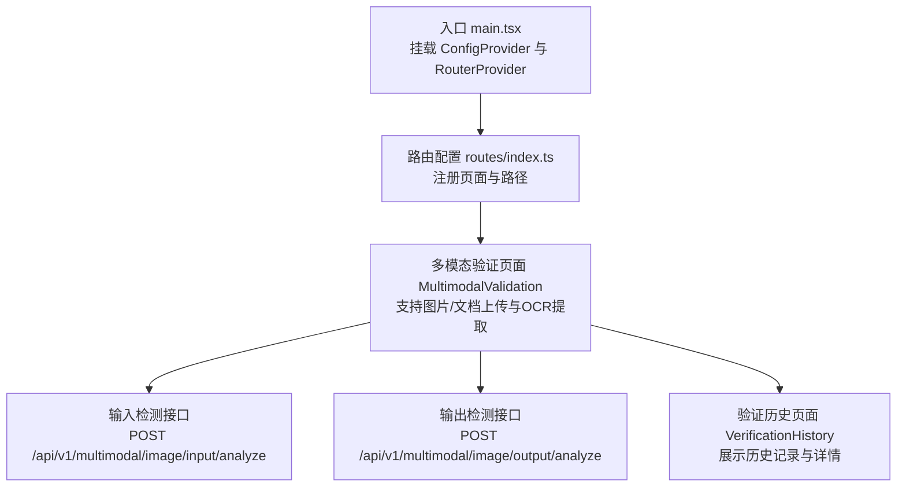
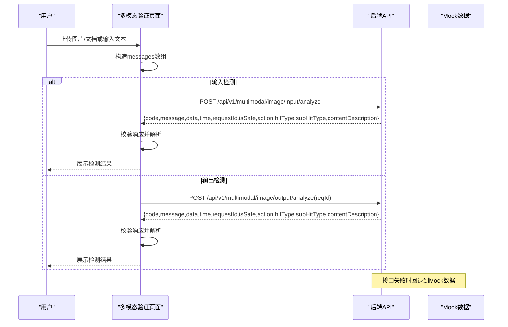
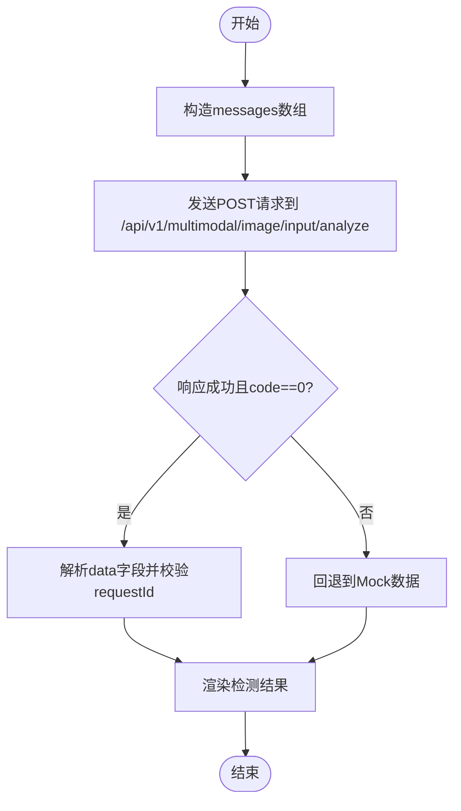
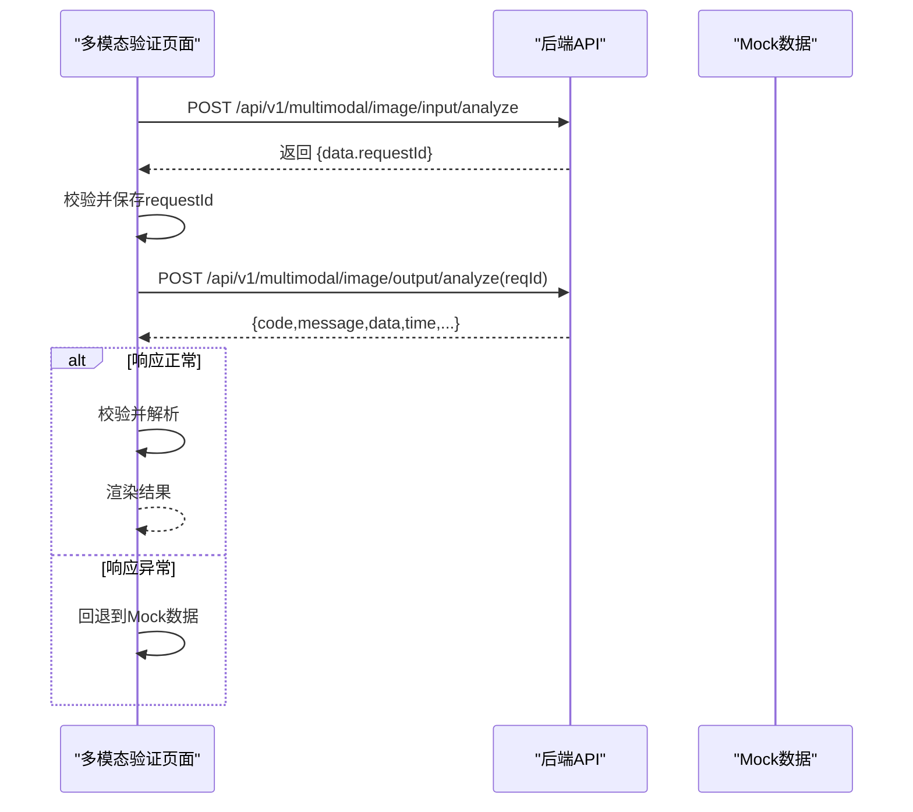
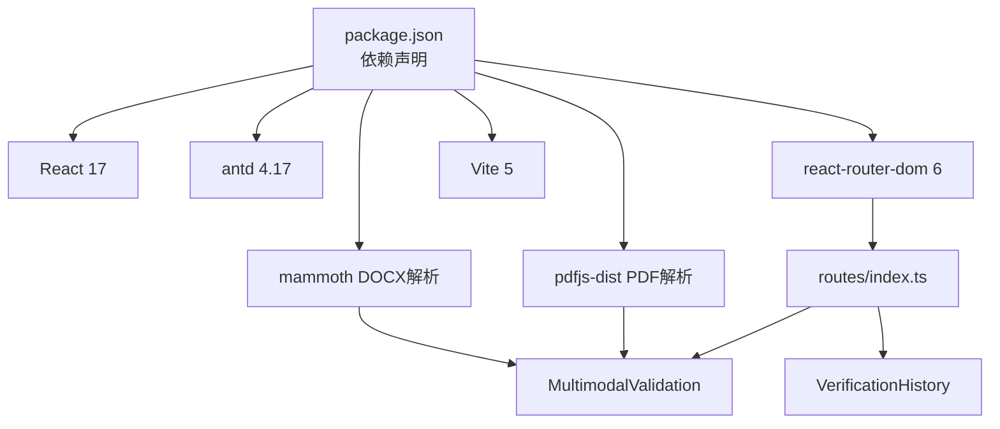

# API接口文档

<cite>
**本文档引用的文件**
- [src/views/MultimodalValidation/index.tsx](file://src/views/MultimodalValidation/index.tsx)
- [src/config/routes/index.ts](file://src/config/routes/index.ts)
- [src/main.tsx](file://src/main.tsx)
- [vite.config.ts](file://vite.config.ts)
- [package.json](file://package.json)
- [docs/context/architecture.md](file://docs/context/architecture.md)
- [project_description.md](file://project_description.md)
- [src/views/VerificationHistory/index.tsx](file://src/views/VerificationHistory/index.tsx)
</cite>

## 目录
1. [简介](#简介)
2. [项目结构](#项目结构)
3. [核心组件](#核心组件)
4. [架构总览](#架构总览)
5. [详细组件分析](#详细组件分析)
6. [依赖关系分析](#依赖关系分析)
7. [性能考量](#性能考量)
8. [故障排查指南](#故障排查指南)
9. [结论](#结论)
10. [附录](#附录)

## 简介
本项目为内网隔离环境下的多模态内容安全审核平台，提供输入检测与输出检测两大核心能力，支持图片与文档（OCR）的多模态内容审核，并提供验证历史追溯功能。前端通过统一的API契约与后端进行联调，当前接口调用失败时会自动回退到Mock数据，确保UI流程可正常演示。

## 项目结构
项目采用React 17 + antd 4.17 + Vite构建，路由集中注册，页面组件位于src/views下，布局与主题配置位于src/layouts。核心API接口集中在多模态验证页面中调用，分别为输入检测与输出检测两个POST接口。

图表来源
- [src/main.tsx:11-25](file://src/main.tsx#L11-L25)
- [src/config/routes/index.ts:12-25](file://src/config/routes/index.ts#L12-L25)
- [src/views/MultimodalValidation/index.tsx:183-546](file://src/views/MultimodalValidation/index.tsx#L183-L546)
- [src/views/VerificationHistory/index.tsx:94-603](file://src/views/VerificationHistory/index.tsx#L94-L603)

章节来源
- [src/main.tsx:1-26](file://src/main.tsx#L1-L26)
- [src/config/routes/index.ts:1-26](file://src/config/routes/index.ts#L1-L26)
- [docs/context/architecture.md:1-47](file://docs/context/architecture.md#L1-L47)
- [project_description.md:1-187](file://project_description.md#L1-L187)

## 核心组件
- 多模态验证页面：负责文件上传、OCR文本提取、请求构造与响应解析，以及输入/输出检测的调用与回退逻辑。
- 验证历史页面：展示历史记录、支持搜索与详情查看，内置Mock数据用于演示。
- 路由与入口：统一挂载UI组件与路由配置，确保页面可访问。

章节来源
- [src/views/MultimodalValidation/index.tsx:183-546](file://src/views/MultimodalValidation/index.tsx#L183-L546)
- [src/views/VerificationHistory/index.tsx:94-603](file://src/views/VerificationHistory/index.tsx#L94-L603)
- [src/config/routes/index.ts:12-25](file://src/config/routes/index.ts#L12-L25)

## 架构总览
前端通过fetch发起POST请求，请求体根据输入类型不同而变化：图片以Base64 dataURL形式传输，文档通过OCR提取文本后以text形式传输。输出检测接口需要先调用输入检测获取requestId，再将该ID作为reqId传入输出检测接口。

图表来源
- [src/views/MultimodalValidation/index.tsx:278-343](file://src/views/MultimodalValidation/index.tsx#L278-L343)
- [docs/context/architecture.md:41-47](file://docs/context/architecture.md#L41-L47)

## 详细组件分析

### 输入检测接口 POST /api/v1/multimodal/image/input/analyze
- 请求方法：POST
- 请求头：Content-Type: application/json
- 请求体字段：
  - messages: 数组，元素包含以下字段：
    - type: 字符串，取值为 "image_url" 或 "text"
    - image_url.url: 字符串，当type为"image_url"时必填，表示Base64 dataURL
    - text: 字符串，当type为"text"时必填，表示OCR提取后的文本
    - fileName: 字符串，可选，文件名
    - fileSize: 数字，可选，文件大小（字节）
- 成功响应字段：
  - code: 字符串或数字，0表示成功
  - message: 字符串，响应消息
  - data: 对象，包含以下字段：
    - requestId: 字符串，请求ID，后续输出检测需要使用
    - isSafe: 数字，1表示安全，0表示不安全
    - action: 数字，动作码
    - hitType: 字符串，命中类型
    - subHitType: 字符串，二级类型
    - contentDescription: 字符串，内容描述
  - time: 字符串，服务器时间
- 错误处理：
  - 当响应缺失data.requestId或code非0时，前端会回退到Mock数据
  - 当网络异常或响应非JSON时，前端会捕获错误并回退到Mock数据

图表来源
- [src/views/MultimodalValidation/index.tsx:199-298](file://src/views/MultimodalValidation/index.tsx#L199-L298)

章节来源
- [src/views/MultimodalValidation/index.tsx:199-298](file://src/views/MultimodalValidation/index.tsx#L199-L298)
- [docs/context/architecture.md:23-24](file://docs/context/architecture.md#L23-L24)

### 输出检测接口 POST /api/v1/multimodal/image/output/analyze
- 请求方法：POST
- 请求头：Content-Type: application/json
- 请求体字段：
  - reqId: 字符串，必须，由输入检测返回的requestId
- 成功响应字段：
  - code: 字符串或数字，0表示成功
  - message: 字符串，响应消息
  - data: 对象，包含以下字段：
    - requestId: 字符串，请求ID
    - isSafe: 数字，1表示安全，0表示不安全
    - action: 数字，动作码
    - hitType: 字符串，命中类型
    - subHitType: 字符串，二级类型
    - contentDescription: 字符串，内容描述
  - time: 字符串，服务器时间
- 错误处理：
  - 当响应缺失data.requestId或code非0时，前端会回退到Mock数据
  - 当网络异常或响应非JSON时，前端会捕获错误并回退到Mock数据
  - 输出检测必须先调用输入检测获取requestId，否则会抛出错误

图表来源
- [src/views/MultimodalValidation/index.tsx:300-343](file://src/views/MultimodalValidation/index.tsx#L300-L343)

章节来源
- [src/views/MultimodalValidation/index.tsx:300-343](file://src/views/MultimodalValidation/index.tsx#L300-L343)
- [docs/context/architecture.md:45-45](file://docs/context/architecture.md#L45-L45)

### 验证历史页面
- 功能概述：展示历史记录，支持按文件名/MD5搜索，查看详情并下载原始JSON。
- 数据结构：HistoryRow包含验证时间、完成时间、检测内容摘要、方向、是否合规、MD5、违规类型、任务状态等字段，详情页展示与输入/输出检测接口响应字段同构。
- Mock数据：页面内置Mock数据用于演示，实际生产需替换为真实API。

章节来源
- [src/views/VerificationHistory/index.tsx:22-40](file://src/views/VerificationHistory/index.tsx#L22-L40)
- [src/views/VerificationHistory/index.tsx:132-372](file://src/views/VerificationHistory/index.tsx#L132-L372)

## 依赖关系分析
- 前端技术栈：React 17、antd 4.17、react-router-dom 6、Vite 5
- 文档解析依赖：mammoth（DOCX）、pdfjs-dist（PDF）
- 路由与入口：通过main.tsx挂载ConfigProvider与RouterProvider，routes/index.ts集中注册页面

图表来源
- [package.json:11-26](file://package.json#L11-L26)
- [src/config/routes/index.ts:12-25](file://src/config/routes/index.ts#L12-L25)
- [src/views/MultimodalValidation/index.tsx:106-181](file://src/views/MultimodalValidation/index.tsx#L106-L181)

章节来源
- [package.json:1-28](file://package.json#L1-L28)
- [vite.config.ts:1-16](file://vite.config.ts#L1-L16)
- [src/config/routes/index.ts:1-26](file://src/config/routes/index.ts#L1-L26)

## 性能考量
- 文件上传与OCR处理：文档解析依赖外部库，建议控制单次解析的页数与并发数量，避免长时间阻塞UI。
- 请求回退策略：接口失败时自动回退Mock数据，保证用户体验，但需在联调阶段及时暴露问题。
- 前端渲染：表格与详情页采用虚拟滚动与懒加载策略，减少大数据量时的渲染压力。

## 故障排查指南
- 接口返回空内容或非JSON：前端会抛出错误并回退Mock数据，检查后端响应格式与Content-Type。
- 缺少requestId：输入检测或输出检测响应缺失data.requestId时，前端会回退Mock数据，需确保后端正确返回requestId。
- code非0：当后端返回非0的code时，前端会回退Mock数据，需检查后端错误码定义与消息。
- 网络异常：跨域、代理、内网策略可能导致请求失败，需检查Vite开发服务器配置与后端接口可达性。
- Mock数据影响联调：当前环境可能尚未接入真实后端，导致接口失败回退到Mock，需尽快替换为真实API。

章节来源
- [src/views/MultimodalValidation/index.tsx:42-58](file://src/views/MultimodalValidation/index.tsx#L42-L58)
- [src/views/MultimodalValidation/index.tsx:278-297](file://src/views/MultimodalValidation/index.tsx#L278-L297)
- [src/views/MultimodalValidation/index.tsx:325-342](file://src/views/MultimodalValidation/index.tsx#L325-L342)
- [docs/context/architecture.md:45-45](file://docs/context/architecture.md#L45-L45)

## 结论
本项目提供了完整的多模态内容安全审核前端框架，包含输入检测与输出检测两大核心接口，支持图片与文档（OCR）的混合输入。当前接口调用失败会自动回退到Mock数据，确保UI流程可演示。建议尽快接入真实后端API，并完善错误处理与日志上报机制，以提升联调效率与用户体验。

## 附录

### API版本管理与兼容性
- 版本前缀：/api/v1
- 数据格式：application/json
- 时间字段：统一使用ISO字符串格式（如time字段）

章节来源
- [docs/context/architecture.md:23-24](file://docs/context/architecture.md#L23-L24)
- [src/views/MultimodalValidation/index.tsx:263-276](file://src/views/MultimodalValidation/index.tsx#L263-L276)

### 接口调用示例与参数验证
- 输入检测请求体示例：messages数组中包含type为image_url或text的元素，分别携带image_url.url或text字段。
- 输出检测请求体示例：reqId为输入检测返回的requestId。
- 参数验证规则：type必须为"image_url"或"text"；当type为"image_url"时必须提供url；当type为"text"时必须提供text；fileName与fileSize为可选字段。

章节来源
- [src/views/MultimodalValidation/index.tsx:214-248](file://src/views/MultimodalValidation/index.tsx#L214-L248)
- [src/views/MultimodalValidation/index.tsx:327-327](file://src/views/MultimodalValidation/index.tsx#L327-L327)

### Mock数据使用方法与真实API集成步骤
- Mock数据位置：输入检测与输出检测均内置Mock响应，用于演示UI与字段渲染。
- 集成步骤：
  1. 替换输入检测与输出检测的URL为真实后端地址。
  2. 确保后端返回符合契约的响应结构（code、message、data、time、requestId等）。
  3. 在开发环境中配置代理或跨域策略，确保前端可访问后端接口。
  4. 联调完成后移除Mock回退逻辑，保留严格的错误处理与日志记录。

章节来源
- [src/views/MultimodalValidation/index.tsx:263-276](file://src/views/MultimodalValidation/index.tsx#L263-L276)
- [src/views/MultimodalValidation/index.tsx:309-323](file://src/views/MultimodalValidation/index.tsx#L309-L323)
- [docs/context/architecture.md:43-45](file://docs/context/architecture.md#L43-L45)

### 接口测试方法与调试工具
- 浏览器开发者工具：检查Network面板中的请求与响应，验证Content-Type与响应体结构。
- Vite开发服务器：通过vite.config.ts配置端口与路径别名，确保开发环境稳定。
- Mock回退：在接口失败时自动回退到Mock数据，便于快速验证UI与交互。

章节来源
- [vite.config.ts:12-15](file://vite.config.ts#L12-L15)
- [src/views/MultimodalValidation/index.tsx:278-297](file://src/views/MultimodalValidation/index.tsx#L278-L297)
- [src/views/MultimodalValidation/index.tsx:325-342](file://src/views/MultimodalValidation/index.tsx#L325-L342)