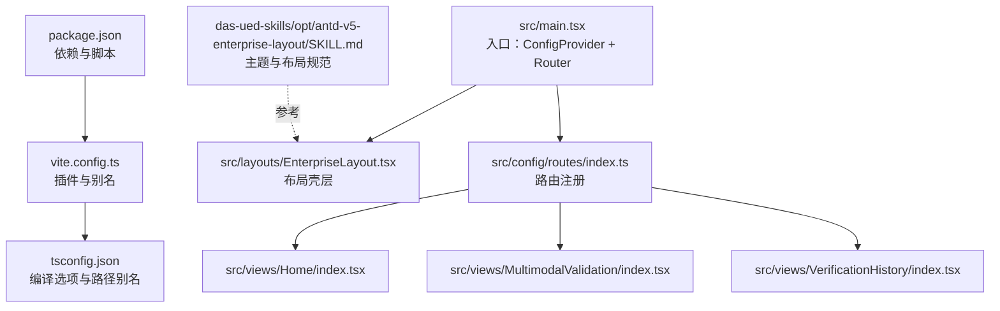
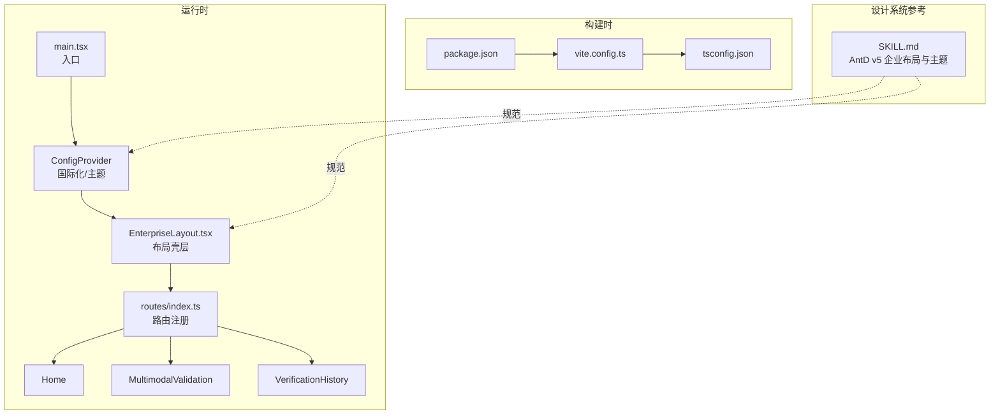
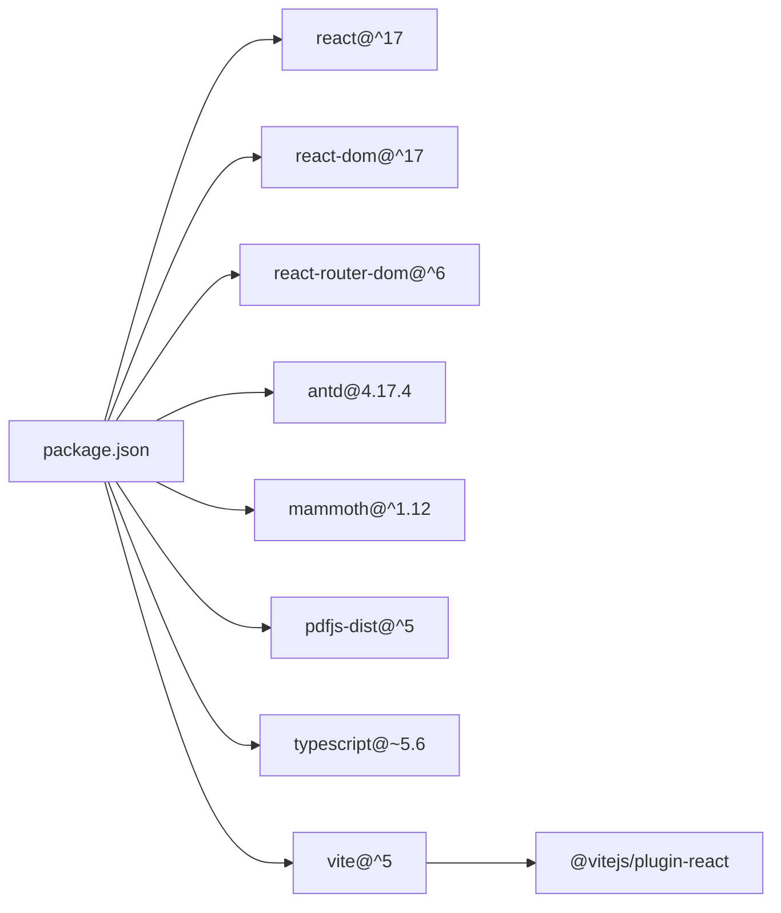

# 代码规范与约定

<cite>
**本文引用的文件**
- [package.json](file://package.json)
- [tsconfig.json](file://tsconfig.json)
- [vite.config.ts](file://vite.config.ts)
- [main.tsx](file://src/main.tsx)
- [EnterpriseLayout.tsx](file://src/layouts/EnterpriseLayout.tsx)
- [routes/index.ts](file://src/config/routes/index.ts)
- [views/Home/index.tsx](file://src/views/Home/index.tsx)
- [views/MultimodalValidation/index.tsx](file://src/views/MultimodalValidation/index.tsx)
- [views/VerificationHistory/index.tsx](file://src/views/VerificationHistory/index.tsx)
- [das-ued-skills/opt/antd-v5-enterprise-layout/SKILL.md](file://das-ued-skills/opt/antd-v5-enterprise-layout/SKILL.md)
- [das-ued-skills/README.md](file://das-ued-skills/README.md)
</cite>

## 目录
1. [引言](#引言)
2. [项目结构](#项目结构)
3. [核心组件](#核心组件)
4. [架构总览](#架构总览)
5. [详细组件分析](#详细组件分析)
6. [依赖关系分析](#依赖关系分析)
7. [性能考虑](#性能考虑)
8. [故障排查指南](#故障排查指南)
9. [结论](#结论)
10. [附录](#附录)

## 引言
本规范面向 APIG 项目，旨在统一 TypeScript 编码风格、命名约定、文件组织结构与组件开发实践，确保在 React + Ant Design 生态下的可维护性、一致性与安全性。规范同时覆盖路由配置、布局与页面组件开发、Hook 使用最佳实践、状态管理约定、Ant Design 组件使用与主题定制、样式编写与主题规则、API 调用约定、内网环境安全与性能优化等方面。

## 项目结构
项目采用基于功能域的组织方式，核心目录如下：
- src：源代码根目录
  - config/routes：集中式路由定义
  - layouts：布局组件（当前为简化版企业布局）
  - views：页面组件（Home、MultimodalValidation、VerificationHistory）
  - main.tsx：应用入口，配置 ConfigProvider、国际化与路由
- 配置文件：
  - package.json：依赖与脚本
  - tsconfig.json：TypeScript 编译选项与路径别名
  - vite.config.ts：Vite 插件与别名配置
- 设计系统与规范参考：
  - das-ued-skills/opt/antd-v5-enterprise-layout/SKILL.md：Ant Design v5 企业布局与主题 Token 规范
  - das-ued-skills/README.md：设计系统与工作流说明

**图表来源**
- [package.json:1-28](file://package.json#L1-L28)
- [vite.config.ts:1-16](file://vite.config.ts#L1-L16)
- [tsconfig.json:1-25](file://tsconfig.json#L1-L25)
- [main.tsx:1-26](file://src/main.tsx#L1-L26)
- [EnterpriseLayout.tsx:1-20](file://src/layouts/EnterpriseLayout.tsx#L1-L20)
- [routes/index.ts:1-26](file://src/config/routes/index.ts#L1-L26)
- [views/Home/index.tsx:1-49](file://src/views/Home/index.tsx#L1-L49)
- [views/MultimodalValidation/index.tsx:1-546](file://src/views/MultimodalValidation/index.tsx#L1-L546)
- [views/VerificationHistory/index.tsx:1-603](file://src/views/VerificationHistory/index.tsx#L1-L603)
- [das-ued-skills/opt/antd-v5-enterprise-layout/SKILL.md:1-800](file://das-ued-skills/opt/antd-v5-enterprise-layout/SKILL.md#L1-L800)

**章节来源**
- [package.json:1-28](file://package.json#L1-L28)
- [tsconfig.json:1-25](file://tsconfig.json#L1-L25)
- [vite.config.ts:1-16](file://vite.config.ts#L1-L16)
- [main.tsx:1-26](file://src/main.tsx#L1-L26)
- [routes/index.ts:1-26](file://src/config/routes/index.ts#L1-L26)

## 核心组件
- 应用入口与国际化
  - 在入口中配置 ConfigProvider 与 zh_CN 本地化，确保 Ant Design 组件显示符合中文习惯。
- 布局组件
  - 当前为简化版企业布局，包含 Header 与 Content，后续可替换为基于 Ant Design v5 的完整布局方案。
- 路由配置
  - 路由集中注册在 config/routes/index.ts，使用 element 字段与 React Router v6 的组件化路由对齐。
- 页面组件
  - Home：演示 Loading/Empty/Feedback 的使用与基础交互。
  - MultimodalValidation：多模态输入检测与输出检测，包含文件上传、OCR 文本提取、Mock 与真实接口回退逻辑。
  - VerificationHistory：历史记录查询、表格展示、Modal 详情与下载 JSON。

**章节来源**
- [main.tsx:1-26](file://src/main.tsx#L1-L26)
- [EnterpriseLayout.tsx:1-20](file://src/layouts/EnterpriseLayout.tsx#L1-L20)
- [routes/index.ts:1-26](file://src/config/routes/index.ts#L1-L26)
- [views/Home/index.tsx:1-49](file://src/views/Home/index.tsx#L1-L49)
- [views/MultimodalValidation/index.tsx:1-546](file://src/views/MultimodalValidation/index.tsx#L1-L546)
- [views/VerificationHistory/index.tsx:1-603](file://src/views/VerificationHistory/index.tsx#L1-L603)

## 架构总览
整体架构围绕“入口配置 -> 布局壳层 -> 路由分发 -> 页面组件”的层次展开，Ant Design 提供 UI 基础能力，Vite 提供构建与开发体验，TypeScript 提供类型安全保障。

**图表来源**
- [main.tsx:1-26](file://src/main.tsx#L1-L26)
- [EnterpriseLayout.tsx:1-20](file://src/layouts/EnterpriseLayout.tsx#L1-L20)
- [routes/index.ts:1-26](file://src/config/routes/index.ts#L1-L26)
- [package.json:1-28](file://package.json#L1-L28)
- [vite.config.ts:1-16](file://vite.config.ts#L1-L16)
- [tsconfig.json:1-25](file://tsconfig.json#L1-L25)
- [das-ued-skills/opt/antd-v5-enterprise-layout/SKILL.md:1-800](file://das-ued-skills/opt/antd-v5-enterprise-layout/SKILL.md#L1-L800)

## 详细组件分析

### TypeScript 编码规范与命名约定
- 类型声明与接口
  - 使用明确的类型标注，避免 any/unknown 的滥用；对复杂对象使用接口或类型别名，提升可读性与可维护性。
- 函数与变量命名
  - 函数命名采用动词短语，如 verifyInputByApi、toVerificationResult；变量命名清晰表达含义，避免缩写。
- 文件命名
  - 页面组件统一使用 PascalCase 且以 index.tsx 结尾；工具函数与常量文件使用小驼峰或大写下划线组合，视用途而定。
- 路径别名
  - 通过 tsconfig.json 与 vite.config.ts 的 @/* 别名，统一导入路径，减少相对路径带来的脆弱性。

**章节来源**
- [tsconfig.json:1-25](file://tsconfig.json#L1-L25)
- [vite.config.ts:1-16](file://vite.config.ts#L1-L16)
- [views/MultimodalValidation/index.tsx:1-546](file://src/views/MultimodalValidation/index.tsx#L1-L546)
- [views/VerificationHistory/index.tsx:1-603](file://src/views/VerificationHistory/index.tsx#L1-L603)

### React 组件开发规范
- 组件结构
  - 使用函数组件与 Hooks，避免不必要的类组件；将复杂逻辑拆分为独立 Hook，提升复用与测试性。
- 渲染条件
  - 依据 loading/error/empty/result 等状态分支渲染不同 UI，保证用户体验与反馈及时。
- 事件与副作用
  - 将副作用封装在 useEffect/useMemo/useCallback 中，避免在渲染期间产生副作用；合理使用依赖数组，防止重复执行。
- 可访问性
  - 为按钮、输入框等提供必要的 aria 属性与键盘交互支持；为图标与装饰元素提供替代文本。

**章节来源**
- [views/Home/index.tsx:1-49](file://src/views/Home/index.tsx#L1-L49)
- [views/MultimodalValidation/index.tsx:1-546](file://src/views/MultimodalValidation/index.tsx#L1-L546)
- [views/VerificationHistory/index.tsx:1-603](file://src/views/VerificationHistory/index.tsx#L1-L603)

### Hook 使用最佳实践
- 状态管理
  - 使用 useState 管理本地 UI 状态；对于跨组件共享的状态，建议引入 Context 或集中式状态管理（如后续演进）。
- 计算与缓存
  - 使用 useMemo 缓存昂贵计算结果；对回调使用 useCallback，避免子组件不必要的重渲染。
- 异步逻辑
  - 将异步请求封装为独立 Hook，统一处理 loading/error/fetching 状态；在组件卸载时清理副作用，避免内存泄漏。
- 文件处理与 OCR
  - 对文件读取、Base64 转换、OCR 文本提取等逻辑进行模块化封装，提供错误兜底与用户提示。

**章节来源**
- [views/MultimodalValidation/index.tsx:1-546](file://src/views/MultimodalValidation/index.tsx#L1-L546)
- [views/VerificationHistory/index.tsx:1-603](file://src/views/VerificationHistory/index.tsx#L1-L603)

### 状态管理约定
- 本地状态优先
  - 页面内部状态优先使用 useState/useContext，避免过度引入外部状态库。
- 请求状态
  - 统一使用 verifying/loading/error/result 等字段表达请求生命周期，确保 UI 与交互一致。
- 数据结构
  - 对接口响应进行类型约束，如 VerificationResult、HistoryRow，确保字段完整性与可读性。

**章节来源**
- [views/MultimodalValidation/index.tsx:18-85](file://src/views/MultimodalValidation/index.tsx#L18-L85)
- [views/VerificationHistory/index.tsx:22-40](file://src/views/VerificationHistory/index.tsx#L22-L40)

### Ant Design 组件使用规范
- 组件选择
  - 根据业务场景选择合适组件：表单使用 Input/TextArea/Select；数据展示使用 Table/Tabs；反馈使用 Message/Modal/Result。
- 样式与布局
  - 使用 Card/Space/Grid 等容器组件进行布局；避免直接使用内联样式，优先通过组件属性与主题 Token 控制外观。
- 交互与反馈
  - 使用 message/Modal/Alert 等组件进行用户反馈；对关键操作提供二次确认与加载状态。

**章节来源**
- [views/Home/index.tsx:1-49](file://src/views/Home/index.tsx#L1-L49)
- [views/MultimodalValidation/index.tsx:1-546](file://src/views/MultimodalValidation/index.tsx#L1-L546)
- [views/VerificationHistory/index.tsx:1-603](file://src/views/VerificationHistory/index.tsx#L1-L603)

### 样式编写标准与主题定制规则
- 主题 Token
  - 基于 Ant Design v5 的 Design Token，统一品牌色、背景层级、文字层级、圆角与阴影等规范；参考企业布局方案中的主题配置。
- 样式组织
  - 优先使用组件属性与 Token 控制样式；必要时使用 CSS 变量或局部样式，避免全局污染。
- 深色布局
  - 在深色侧边栏场景下，确保文字与图标对比度满足可访问性要求；使用 Ghost Border 作为无障碍回退方案。

**章节来源**
- [das-ued-skills/opt/antd-v5-enterprise-layout/SKILL.md:1-800](file://das-ued-skills/opt/antd-v5-enterprise-layout/SKILL.md#L1-L800)
- [EnterpriseLayout.tsx:1-20](file://src/layouts/EnterpriseLayout.tsx#L1-L20)

### 路由配置规范与页面组件开发标准
- 路由注册
  - 路由集中定义在 config/routes/index.ts，使用 element 字段与 React Router v6 的组件化路由；子路由通过 children 注入布局壳层。
- 页面组件
  - 页面组件以功能域划分，统一使用 index.tsx；组件内部状态与逻辑清晰分离；提供默认导出以便路由直接渲染。
- 布局壳层
  - 布局组件通过 Outlet 渲染子路由；后续可替换为基于 Ant Design v5 的完整布局方案。

**章节来源**
- [routes/index.ts:1-26](file://src/config/routes/index.ts#L1-L26)
- [main.tsx:1-26](file://src/main.tsx#L1-L26)
- [EnterpriseLayout.tsx:1-20](file://src/layouts/EnterpriseLayout.tsx#L1-L20)

### 代码注释规范
- 函数与复杂逻辑
  - 对关键函数与复杂算法提供简要注释，说明输入、输出与边界条件；对业务规则与数据结构提供注释说明。
- 组件与 Hook
  - 对组件职责与 Hook 作用提供注释；对状态流转与副作用提供注释说明。
- TODO 与风险提示
  - 对临时实现与潜在风险使用明确注释标记，便于后续修复与优化。

**章节来源**
- [views/MultimodalValidation/index.tsx:1-546](file://src/views/MultimodalValidation/index.tsx#L1-L546)
- [views/VerificationHistory/index.tsx:1-603](file://src/views/VerificationHistory/index.tsx#L1-L603)

### 错误处理模式
- 请求失败回退
  - 对网络请求失败提供 Mock 回退逻辑，保证 UI 可用性；通过 message 提示用户当前处于回退状态。
- 参数与格式校验
  - 对文件扩展名、OCR 文本长度、接口响应结构进行校验；对异常情况进行统一错误处理与提示。
- 用户反馈
  - 使用 message/Alert/Result 等组件进行错误与成功反馈；对关键错误提供重试按钮与引导信息。

**章节来源**
- [views/MultimodalValidation/index.tsx:279-298](file://src/views/MultimodalValidation/index.tsx#L279-L298)
- [views/VerificationHistory/index.tsx:455-467](file://src/views/VerificationHistory/index.tsx#L455-L467)

### API 调用约定
- 请求封装
  - 将 HTTP 请求封装为独立函数，统一处理 Content-Type、Body 序列化与响应解析；对空响应与非 JSON 响应进行异常处理。
- 接口契约
  - 明确接口字段与返回结构，如 requestId、isSafe、action、hitType、hitSubType 等；对缺失字段进行兜底处理。
- Mock 与真实接口
  - 在内网环境下优先使用 Mock 数据，保证开发效率；真实接口失败时自动回退至 Mock，避免阻塞 UI。

**章节来源**
- [views/MultimodalValidation/index.tsx:42-58](file://src/views/MultimodalValidation/index.tsx#L42-L58)
- [views/MultimodalValidation/index.tsx:279-298](file://src/views/MultimodalValidation/index.tsx#L279-L298)

### 内网环境安全编码要求
- 资源加载
  - 在内网环境下，确保 PDF Worker 等资源通过 import.meta.url 正确解析；对动态导入进行 try/catch 处理。
- 文件处理
  - 对上传文件进行扩展名与类型校验；对 OCR 文本提取失败提供降级策略与用户提示。
- 接口安全
  - 对接口返回进行严格校验，避免直接渲染不受信任的数据；对敏感字段进行脱敏处理。

**章节来源**
- [views/MultimodalValidation/index.tsx:141-164](file://src/views/MultimodalValidation/index.tsx#L141-L164)
- [views/MultimodalValidation/index.tsx:230-236](file://src/views/MultimodalValidation/index.tsx#L230-L236)

### 性能优化约定
- 渲染优化
  - 使用 useMemo/useCallback 缓存计算与回调；避免在渲染期间进行昂贵操作。
- 资源加载
  - 对大文件与 OCR 处理进行分页与节流；对 PDF 文本提取限制页数，减少计算开销。
- 组件拆分
  - 将复杂页面拆分为多个子组件，按需渲染；对 Modal/Drawer 等浮层组件进行懒加载。

**章节来源**
- [views/MultimodalValidation/index.tsx:155-163](file://src/views/MultimodalValidation/index.tsx#L155-L163)
- [views/VerificationHistory/index.tsx:526-539](file://src/views/VerificationHistory/index.tsx#L526-L539)

## 依赖关系分析
- 运行时依赖
  - React 17、React DOM、React Router DOM、Ant Design 4.x、mammoth、pdfjs-dist 等。
- 开发依赖
  - TypeScript、Vite、@vitejs/plugin-react、@types/react、@types/react-dom 等。
- 构建与别名
  - Vite 插件与路径别名配置，确保开发与构建一致性。

**图表来源**
- [package.json:1-28](file://package.json#L1-L28)
- [vite.config.ts:1-16](file://vite.config.ts#L1-L16)

**章节来源**
- [package.json:1-28](file://package.json#L1-L28)
- [vite.config.ts:1-16](file://vite.config.ts#L1-L16)

## 性能考虑
- 代码分割与懒加载
  - 对大型页面与第三方库进行按需加载；对 PDF.js 等资源进行动态导入。
- 渲染与计算
  - 使用 useMemo/useCallback 缓存昂贵计算；避免在渲染期间进行 IO 操作。
- 网络请求
  - 对请求进行节流与去抖；对失败请求提供快速回退与重试策略。

[本节为通用指导，无需特定文件引用]

## 故障排查指南
- 路由无法渲染
  - 检查路由注册文件是否正确导出路由数组；确认布局壳层是否包裹 children。
- 布局样式异常
  - 检查 ConfigProvider 是否正确配置主题与国际化；确认路径别名是否生效。
- 组件交互无响应
  - 检查事件绑定与状态更新逻辑；确认 useEffect 的依赖数组是否正确。
- OCR 解析失败
  - 检查文件扩展名与类型；对异常进行 try/catch 并提供降级提示。
- 接口返回异常
  - 检查响应结构与字段；对空响应与非 JSON 做异常处理与回退。

**章节来源**
- [routes/index.ts:1-26](file://src/config/routes/index.ts#L1-L26)
- [main.tsx:1-26](file://src/main.tsx#L1-L26)
- [views/MultimodalValidation/index.tsx:230-236](file://src/views/MultimodalValidation/index.tsx#L230-L236)
- [views/MultimodalValidation/index.tsx:279-298](file://src/views/MultimodalValidation/index.tsx#L279-L298)

## 结论
本规范基于现有项目结构与实现，总结了 TypeScript 编码、React 组件开发、Ant Design 使用、路由与布局、API 调用、安全与性能等方面的约定。建议在后续开发中持续遵循这些规范，逐步引入更完善的主题 Token、状态管理与测试体系，以提升整体代码质量与可维护性。

[本节为总结性内容，无需特定文件引用]

## 附录

### 设计系统与工作流参考
- 设计系统与工作流说明：用于理解项目设计上下文与技能工作流。
- Ant Design v5 企业布局与主题 Token：用于统一品牌色、背景层级、文字层级、圆角与阴影等规范。

**章节来源**
- [das-ued-skills/README.md:1-351](file://das-ued-skills/README.md#L1-L351)
- [das-ued-skills/opt/antd-v5-enterprise-layout/SKILL.md:1-800](file://das-ued-skills/opt/antd-v5-enterprise-layout/SKILL.md#L1-L800)