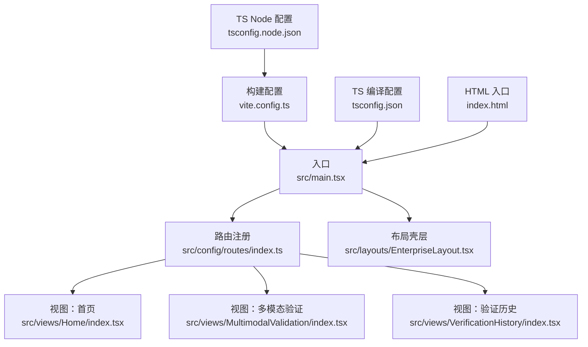
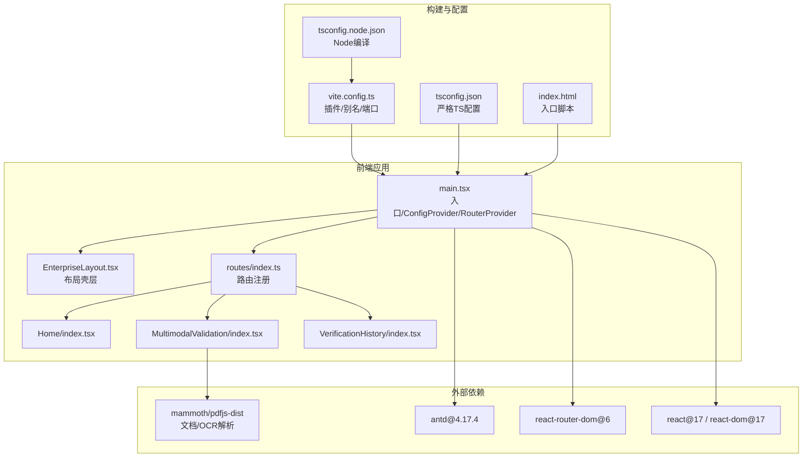
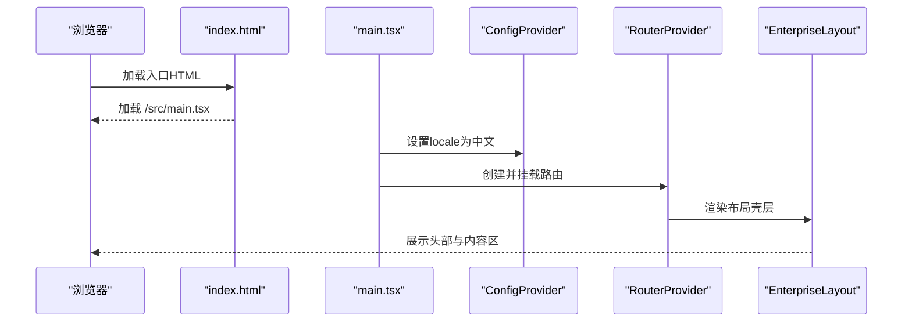
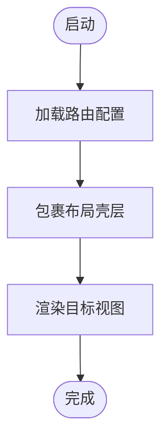
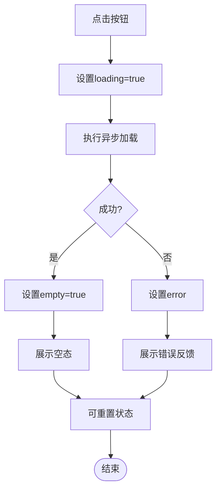
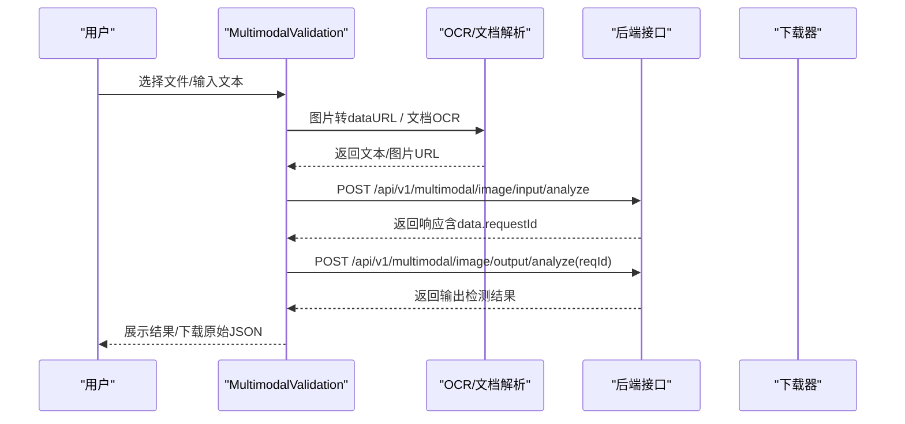
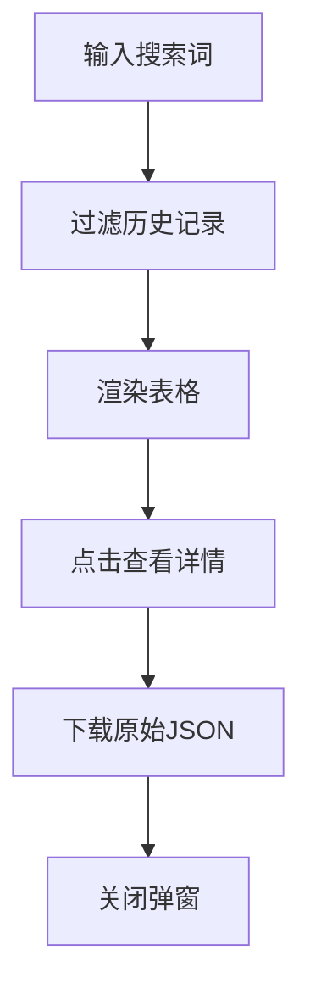
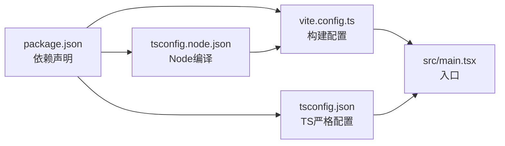

# 开发指南

<cite>
**本文引用的文件**
- [package.json](file://package.json)
- [vite.config.ts](file://vite.config.ts)
- [tsconfig.json](file://tsconfig.json)
- [tsconfig.node.json](file://tsconfig.node.json)
- [index.html](file://index.html)
- [src/main.tsx](file://src/main.tsx)
- [src/config/routes/index.ts](file://src/config/routes/index.ts)
- [src/layouts/EnterpriseLayout.tsx](file://src/layouts/EnterpriseLayout.tsx)
- [src/layouts/theme.config.ts](file://src/layouts/theme.config.ts)
- [src/views/Home/index.tsx](file://src/views/Home/index.tsx)
- [src/views/MultimodalValidation/index.tsx](file://src/views/MultimodalValidation/index.tsx)
- [src/views/VerificationHistory/index.tsx](file://src/views/VerificationHistory/index.tsx)
- [project_description.md](file://project_description.md)
- [das-ued-skills/README.md](file://das-ued-skills/README.md)
- [das-ued-skills/opt/antd-v5-enterprise-layout/SKILL.md](file://das-ued-skills/opt/antd-v5-enterprise-layout/SKILL.md)
</cite>

## 目录
1. [引言](#引言)
2. [项目结构](#项目结构)
3. [核心组件](#核心组件)
4. [架构总览](#架构总览)
5. [详细组件分析](#详细组件分析)
6. [依赖关系分析](#依赖关系分析)
7. [性能考量](#性能考量)
8. [故障排查指南](#故障排查指南)
9. [结论](#结论)
10. [附录](#附录)

## 引言
本指南面向APIG项目的开发者，提供从环境搭建、代码规范、调试与测试到组件开发、状态管理、API调用规范、内网开发注意事项、性能优化与安全考虑的完整实践说明。同时给出团队协作的代码审查标准与Git工作流程建议，帮助团队高效协同、高质量交付。

## 项目结构
项目采用React 17 + antd 4.17 + Vite 5的前端技术栈，页面通过React Router v6集中注册，布局采用企业级壳层，主题配置位于独立文件，便于统一管理与对齐设计系统。

**图表来源**
- [src/main.tsx:1-26](file://src/main.tsx#L1-L26)
- [src/config/routes/index.ts:1-26](file://src/config/routes/index.ts#L1-L26)
- [src/layouts/EnterpriseLayout.tsx:1-20](file://src/layouts/EnterpriseLayout.tsx#L1-L20)
- [src/views/Home/index.tsx:1-49](file://src/views/Home/index.tsx#L1-L49)
- [src/views/MultimodalValidation/index.tsx:1-546](file://src/views/MultimodalValidation/index.tsx#L1-L546)
- [src/views/VerificationHistory/index.tsx:1-603](file://src/views/VerificationHistory/index.tsx#L1-L603)
- [vite.config.ts:1-16](file://vite.config.ts#L1-L16)
- [tsconfig.json:1-25](file://tsconfig.json#L1-L25)
- [tsconfig.node.json:1-11](file://tsconfig.node.json#L1-L11)
- [index.html:1-13](file://index.html#L1-L13)

**章节来源**
- [src/main.tsx:1-26](file://src/main.tsx#L1-L26)
- [src/config/routes/index.ts:1-26](file://src/config/routes/index.ts#L1-L26)
- [src/layouts/EnterpriseLayout.tsx:1-20](file://src/layouts/EnterpriseLayout.tsx#L1-L20)
- [vite.config.ts:1-16](file://vite.config.ts#L1-L16)
- [tsconfig.json:1-25](file://tsconfig.json#L1-L25)
- [tsconfig.node.json:1-11](file://tsconfig.node.json#L1-L11)
- [index.html:1-13](file://index.html#L1-L13)

## 核心组件
- 入口与全局配置：在入口中配置ConfigProvider与国际化、挂载RouterProvider与布局壳层，确保全局主题与路由生效。
- 路由注册：集中于routes文件，使用element字段，便于与React Router v6对齐。
- 布局壳层：提供企业级头部与内容区，支持内网模拟环境下的最小壳层，后续可替换为完整布局。
- 视图组件：包含首页演示Loading/Empty/Feedback、多模态验证（上传图片/文档并OCR提取文本，调用输入/输出检测接口并回退Mock）、验证历史（表格、搜索、详情弹窗）。

**章节来源**
- [src/main.tsx:1-26](file://src/main.tsx#L1-L26)
- [src/config/routes/index.ts:1-26](file://src/config/routes/index.ts#L1-L26)
- [src/layouts/EnterpriseLayout.tsx:1-20](file://src/layouts/EnterpriseLayout.tsx#L1-L20)
- [src/views/Home/index.tsx:1-49](file://src/views/Home/index.tsx#L1-L49)
- [src/views/MultimodalValidation/index.tsx:1-546](file://src/views/MultimodalValidation/index.tsx#L1-L546)
- [src/views/VerificationHistory/index.tsx:1-603](file://src/views/VerificationHistory/index.tsx#L1-L603)

## 架构总览
系统采用“入口 + 路由 + 布局 + 视图”的分层架构，数据流围绕页面状态与API调用展开，支持Mock回退与内网环境适配。

**图表来源**
- [src/main.tsx:1-26](file://src/main.tsx#L1-L26)
- [src/config/routes/index.ts:1-26](file://src/config/routes/index.ts#L1-L26)
- [src/layouts/EnterpriseLayout.tsx:1-20](file://src/layouts/EnterpriseLayout.tsx#L1-L20)
- [src/views/MultimodalValidation/index.tsx:1-546](file://src/views/MultimodalValidation/index.tsx#L1-L546)
- [vite.config.ts:1-16](file://vite.config.ts#L1-L16)
- [tsconfig.json:1-25](file://tsconfig.json#L1-L25)
- [tsconfig.node.json:1-11](file://tsconfig.node.json#L1-L11)
- [index.html:1-13](file://index.html#L1-L13)

## 详细组件分析

### 入口与全局配置
- 入口负责挂载RouterProvider与ConfigProvider，设置locale为中文，确保UI与交互符合国内用户习惯。
- 路由通过createBrowserRouter包裹布局壳层，子路由在routes文件中集中注册。
- 构建配置提供路径别名@指向src，端口默认5173，便于开发与预览。

**图表来源**
- [index.html:1-13](file://index.html#L1-L13)
- [src/main.tsx:1-26](file://src/main.tsx#L1-L26)
- [src/layouts/EnterpriseLayout.tsx:1-20](file://src/layouts/EnterpriseLayout.tsx#L1-L20)

**章节来源**
- [src/main.tsx:1-26](file://src/main.tsx#L1-L26)
- [vite.config.ts:1-16](file://vite.config.ts#L1-L16)
- [index.html:1-13](file://index.html#L1-L13)

### 路由与布局
- 路由集中注册，使用element字段，便于与React Router v6对齐。
- 布局提供Header与Content，内网模拟环境下展示“Mock 企业后台（React17 + antd4）”，后续可替换为完整布局。

**图表来源**
- [src/config/routes/index.ts:1-26](file://src/config/routes/index.ts#L1-L26)
- [src/layouts/EnterpriseLayout.tsx:1-20](file://src/layouts/EnterpriseLayout.tsx#L1-L20)

**章节来源**
- [src/config/routes/index.ts:1-26](file://src/config/routes/index.ts#L1-L26)
- [src/layouts/EnterpriseLayout.tsx:1-20](file://src/layouts/EnterpriseLayout.tsx#L1-L20)

### 首页组件（Home）
- 展示Loading/Empty/Feedback三种状态，演示用户交互与反馈。
- 通过按钮触发异步加载，模拟成功/失败分支，配合消息提示与状态切换。

**图表来源**
- [src/views/Home/index.tsx:1-49](file://src/views/Home/index.tsx#L1-L49)

**章节来源**
- [src/views/Home/index.tsx:1-49](file://src/views/Home/index.tsx#L1-L49)

### 多模态验证组件（MultimodalValidation）
- 支持图片（PNG/JPG/GIF）与文档（DOCX/DOC/PDF）上传，文档通过OCR提取文本。
- 提供输入检测与输出检测两种模式，优先调用真实接口，失败时回退Mock以保证UI可跑通。
- 提供原始JSON下载能力，便于联调与问题定位。

**图表来源**
- [src/views/MultimodalValidation/index.tsx:1-546](file://src/views/MultimodalValidation/index.tsx#L1-L546)

**章节来源**
- [src/views/MultimodalValidation/index.tsx:1-546](file://src/views/MultimodalValidation/index.tsx#L1-L546)

### 验证历史组件（VerificationHistory）
- 提供多模态与文本两类历史记录，支持搜索、分页、查看详情弹窗。
- 展示合规状态、违规类型、任务状态等关键字段，支持复制MD5与下载原始JSON。

**图表来源**
- [src/views/VerificationHistory/index.tsx:1-603](file://src/views/VerificationHistory/index.tsx#L1-L603)

**章节来源**
- [src/views/VerificationHistory/index.tsx:1-603](file://src/views/VerificationHistory/index.tsx#L1-L603)

## 依赖关系分析
- 依赖管理：使用npm/yarn/pnpm均可，按内网镜像策略选择。
- 构建工具：Vite提供开发服务器与打包能力，支持TypeScript与React插件。
- 类型与编译：tsconfig.json启用严格模式与noUnused规则，tsconfig.node.json限定Vite配置编译范围。
- 路由与UI：react-router-dom负责页面导航，antd提供企业级UI组件与主题。

**图表来源**
- [package.json:1-28](file://package.json#L1-L28)
- [vite.config.ts:1-16](file://vite.config.ts#L1-L16)
- [tsconfig.json:1-25](file://tsconfig.json#L1-L25)
- [tsconfig.node.json:1-11](file://tsconfig.node.json#L1-L11)
- [src/main.tsx:1-26](file://src/main.tsx#L1-L26)

**章节来源**
- [package.json:1-28](file://package.json#L1-L28)
- [vite.config.ts:1-16](file://vite.config.ts#L1-L16)
- [tsconfig.json:1-25](file://tsconfig.json#L1-L25)
- [tsconfig.node.json:1-11](file://tsconfig.node.json#L1-L11)

## 性能考量
- 构建与打包
  - 使用Vite进行快速冷启动与热更新，生产构建结合TypeScript编译与Vite打包。
  - 合理拆分代码与懒加载，减少首屏体积。
- 组件渲染
  - 使用React.memo与useMemo缓存计算结果，避免不必要的重渲染。
  - 表格与长列表使用虚拟滚动，降低DOM节点数量。
- 资源加载
  - 图片与文档预览采用按需加载与懒执行，OCR解析在用户触发后进行。
  - CDN与内网镜像策略结合，确保依赖稳定下载。
- 网络请求
  - 请求失败回退Mock，避免阻塞UI；合理设置超时与重试策略。
  - 对高频请求进行节流/防抖，减少重复调用。

[本节为通用性能指导，不直接分析具体文件，故无章节来源]

## 故障排查指南
- 开发环境问题
  - 端口占用：修改vite.config.ts中的server.port，默认5173。
  - 路径别名：确认@指向src，避免导入错误。
  - 依赖安装：内网环境优先使用私有源或离线包，确保antd、react、pdfjs、mammoth等依赖可用。
- 路由与布局
  - 路由不生效：检查routes文件是否正确导出，元素是否使用element字段。
  - 布局异常：确认ConfigProvider与locale设置，检查EnterpriseLayout样式。
- 多模态验证
  - OCR失败：检查文档扩展名与解析流程，必要时降级为文本占位。
  - 接口失败：查看网络面板与回退逻辑，确认Mock数据结构与字段。
- 验证历史
  - 表格空白：确认过滤条件与数据源，检查分页与空态展示。
  - 下载失败：确认Blob与a标签下载逻辑，检查浏览器权限。
- 内网环境
  - 无法访问公网：配置npm/yarn/pnpm私有源，或使用离线包。
  - pdfjs-worker：内网可能需要本地化worker路径，确保加载成功。

**章节来源**
- [vite.config.ts:1-16](file://vite.config.ts#L1-L16)
- [src/config/routes/index.ts:1-26](file://src/config/routes/index.ts#L1-L26)
- [src/layouts/EnterpriseLayout.tsx:1-20](file://src/layouts/EnterpriseLayout.tsx#L1-L20)
- [src/views/MultimodalValidation/index.tsx:1-546](file://src/views/MultimodalValidation/index.tsx#L1-L546)
- [src/views/VerificationHistory/index.tsx:1-603](file://src/views/VerificationHistory/index.tsx#L1-L603)

## 结论
本指南提供了APIG项目的开发环境搭建、代码规范、调试与测试、组件与状态管理、API调用规范、内网开发注意事项、性能优化与安全考虑的系统性实践。建议团队在开发过程中遵循本文规范，结合项目描述与设计系统文档，持续演进为真实业务系统。

[本节为总结性内容，不直接分析具体文件，故无章节来源]

## 附录

### 开发环境搭建
- 安装依赖：根据内网镜像策略选择npm/yarn/pnpm。
- 启动开发：执行npm run dev，访问默认端口5173。
- 构建与预览：npm run build与npm run preview。

**章节来源**
- [project_description.md:28-36](file://project_description.md#L28-L36)
- [package.json:6-10](file://package.json#L6-L10)

### 代码规范与工具
- TypeScript配置
  - 严格模式与未使用变量/参数检查，启用noEmit与jsx配置。
  - 路径别名@映射到src，提升导入可读性。
- Vite配置
  - 插件：@vitejs/plugin-react
  - 别名：@ -> src
  - 端口：5173
- ESLint与Prettier
  - 建议在团队内统一规则，结合pre-commit钩子自动格式化与静态检查。
  - 与TypeScript集成，确保类型与风格一致性。

**章节来源**
- [tsconfig.json:1-25](file://tsconfig.json#L1-L25)
- [vite.config.ts:1-16](file://vite.config.ts#L1-L16)

### 组件开发最佳实践
- 函数组件 + Hooks：统一使用函数组件与useState/useMemo/useEffect。
- 状态管理：页面内状态优先，跨页面共享状态使用Context或轻量状态库。
- 组件拆分：颗粒度清晰，职责单一，便于复用与测试。
- 样式与主题：基于antd主题配置，避免内联样式污染全局。

**章节来源**
- [src/views/Home/index.tsx:1-49](file://src/views/Home/index.tsx#L1-L49)
- [src/views/MultimodalValidation/index.tsx:1-546](file://src/views/MultimodalValidation/index.tsx#L1-L546)
- [src/views/VerificationHistory/index.tsx:1-603](file://src/views/VerificationHistory/index.tsx#L1-L603)
- [src/layouts/theme.config.ts:1-8](file://src/layouts/theme.config.ts#L1-L8)

### API接口调用规范
- 输入检测：POST /api/v1/multimodal/image/input/analyze
- 输出检测：POST /api/v1/multimodal/image/output/analyze（需携带输入检测返回的requestId）
- 失败回退：接口失败时回退Mock，保证UI可跑通并提示用户。
- 数据结构：统一映射为VerificationResult，包含安全状态、命中类型、动作、requestId等字段。

**章节来源**
- [src/views/MultimodalValidation/index.tsx:199-343](file://src/views/MultimodalValidation/index.tsx#L199-L343)

### 内网环境开发注意事项
- 私有源与离线包：优先使用内网镜像源或离线包，确保依赖稳定。
- pdfjs-worker：内网可能需要本地化worker路径，确保加载成功。
- Mock回退：接口失败时回退Mock，避免阻塞联调。

**章节来源**
- [project_description.md:50-61](file://project_description.md#L50-L61)
- [src/views/MultimodalValidation/index.tsx:278-298](file://src/views/MultimodalValidation/index.tsx#L278-L298)

### 安全考虑
- 数据隐私：多模态检测涉及敏感内容（身份证、合同等），需注意数据脱敏与传输加密。
- 权限与认证：建议补充登录认证与权限路由守卫，防止未授权访问。
- 输入校验：对上传文件与输入文本进行白名单与大小限制，避免恶意内容。

**章节来源**
- [project_description.md:56-58](file://project_description.md#L56-L58)

### 测试方法
- 单元测试：针对纯函数与工具函数编写测试，覆盖OCR解析、数据映射等逻辑。
- 集成测试：模拟路由与布局，验证页面渲染与交互。
- 端到端测试：使用自动化工具验证关键流程（上传、OCR、接口调用、回退Mock）。

[本节为通用测试指导，不直接分析具体文件，故无章节来源]

### 团队协作与Git工作流程
- 代码审查标准
  - 提交前执行格式化与静态检查，确保代码风格一致。
  - PR需包含变更说明、影响范围与测试覆盖。
  - 关键改动需有设计系统对齐说明与风险评估。
- Git工作流程建议
  - 分支策略：main（稳定）、dev（开发）、feature/{feature-name}（功能开发）。
  - 提交规范：使用清晰的提交信息，关联Issue与PR。
  - 合并与发布：通过CI/CD进行自动化测试与构建，确保质量门禁。

**章节来源**
- [project_description.md:38-48](file://project_description.md#L38-L48)
- [das-ued-skills/README.md:160-200](file://das-ued-skills/README.md#L160-L200)

### 设计系统与主题对齐
- 品牌色与状态色：参考theme.config.ts与设计系统规范，确保UI一致性。
- 布局与组件：参考企业级布局方案，逐步替换内网模拟壳层为完整布局。

**章节来源**
- [src/layouts/theme.config.ts:1-8](file://src/layouts/theme.config.ts#L1-L8)
- [das-ued-skills/opt/antd-v5-enterprise-layout/SKILL.md:17-201](file://das-ued-skills/opt/antd-v5-enterprise-layout/SKILL.md#L17-L201)