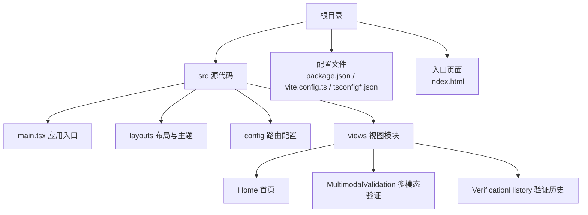
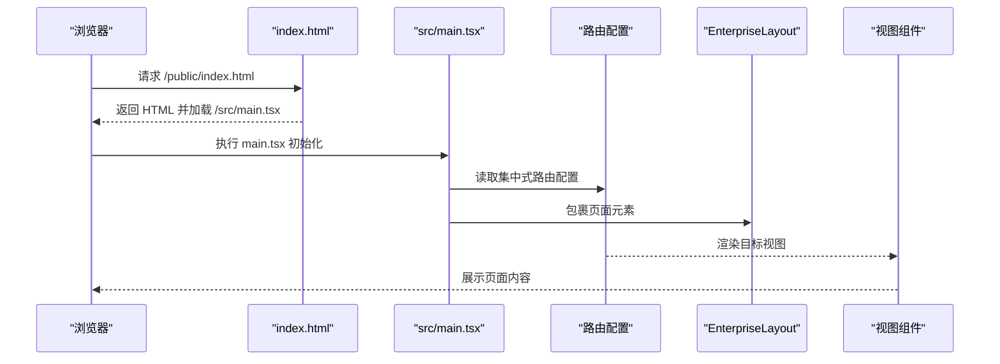
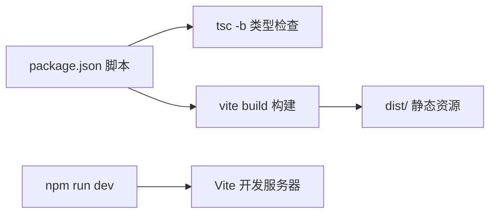

# 开发环境搭建

<cite>
**本文引用的文件**
- [package.json](file://package.json)
- [vite.config.ts](file://vite.config.ts)
- [tsconfig.json](file://tsconfig.json)
- [tsconfig.node.json](file://tsconfig.node.json)
- [index.html](file://index.html)
- [src/main.tsx](file://src/main.tsx)
- [src/vite-env.d.ts](file://src/vite-env.d.ts)
- [src/layouts/theme.config.ts](file://src/layouts/theme.config.ts)
- [src/config/routes/index.ts](file://src/config/routes/index.ts)
- [src/views/Home/index.tsx](file://src/views/Home/index.tsx)
- [src/views/MultimodalValidation/index.tsx](file://src/views/MultimodalValidation/index.tsx)
</cite>

## 目录
1. [简介](#简介)
2. [项目结构](#项目结构)
3. [核心组件](#核心组件)
4. [架构总览](#架构总览)
5. [详细组件分析](#详细组件分析)
6. [依赖分析](#依赖分析)
7. [性能考虑](#性能考虑)
8. [故障排查指南](#故障排查指南)
9. [结论](#结论)
10. [附录](#附录)

## 简介
本指南面向首次参与 APIG 项目的开发者，提供从零搭建开发环境的完整流程，包括 Node.js 版本要求、包管理器选择、依赖安装、TypeScript 与 Vite 配置要点、IDE 推荐与调试设置、开发服务器启动与热重载、端口冲突处理、内网代理与回退策略，以及常见问题排查方法。文中所有技术细节均基于仓库现有配置文件进行提炼与总结。

## 项目结构
该项目采用 React 17 + Ant Design 4 + TypeScript + Vite 的前端工程化方案，使用路径别名组织源码，路由集中注册，视图按功能模块拆分，构建产物由 Vite 生成，开发服务器默认监听本地端口。

图表来源
- [index.html:1-13](file://index.html#L1-L13)
- [src/main.tsx:1-26](file://src/main.tsx#L1-L26)
- [src/config/routes/index.ts:1-26](file://src/config/routes/index.ts#L1-L26)
- [src/views/Home/index.tsx:1-49](file://src/views/Home/index.tsx#L1-L49)
- [src/views/MultimodalValidation/index.tsx:1-546](file://src/views/MultimodalValidation/index.tsx#L1-L546)

章节来源
- [index.html:1-13](file://index.html#L1-L13)
- [src/main.tsx:1-26](file://src/main.tsx#L1-L26)
- [src/config/routes/index.ts:1-26](file://src/config/routes/index.ts#L1-L26)

## 核心组件
- 包管理与脚本
  - 使用 npm 作为包管理器，脚本命令包括 dev、build、preview。
- 构建工具
  - Vite 作为开发服务器与打包工具，启用 React 插件与路径别名。
- 类型系统
  - TypeScript 编译器选项严格，使用 bundler 模块解析，支持 JSX 与路径映射。
- 运行时
  - React 17 + Ant Design 4，中文本地化与样式引入。
- 路由
  - 集中式路由注册，使用 React Router v6 的 element 字段组织页面。

章节来源
- [package.json:1-28](file://package.json#L1-L28)
- [vite.config.ts:1-16](file://vite.config.ts#L1-L16)
- [tsconfig.json:1-25](file://tsconfig.json#L1-L25)
- [tsconfig.node.json:1-11](file://tsconfig.node.json#L1-L11)
- [src/main.tsx:1-26](file://src/main.tsx#L1-L26)
- [src/config/routes/index.ts:1-26](file://src/config/routes/index.ts#L1-L26)

## 架构总览
下图展示了应用启动的关键路径：浏览器加载入口 HTML，加载 main.tsx，初始化路由与布局，渲染对应视图组件。

图表来源
- [index.html:1-13](file://index.html#L1-L13)
- [src/main.tsx:1-26](file://src/main.tsx#L1-L26)
- [src/config/routes/index.ts:1-26](file://src/config/routes/index.ts#L1-L26)

## 详细组件分析

### Node.js 与包管理器
- Node.js 版本
  - TypeScript 依赖版本为 ~5.6.3，建议使用较新 LTS 版本（如 18.x 或 20.x），确保与编译器版本兼容。
- 包管理器选择
  - 仓库包含 package-lock.json，表明使用 npm。
  - 如需切换至 Yarn，请删除 npm 相关锁文件与 node_modules 后执行 yarn 安装；若存在 yarn.lock，可直接使用 yarn。
- 依赖安装步骤
  - 使用 npm ci 或 npm install 安装生产与开发依赖。
  - 安装完成后，确认 @vitejs/plugin-react、typescript、vite、@types/react、@types/react-dom、@types/node 已就绪。

章节来源
- [package.json:1-28](file://package.json#L1-L28)

### TypeScript 配置
- 编译目标与模块系统
  - 目标版本与库配置满足现代浏览器与 DOM API 使用。
  - 模块解析采用 bundler，利于 Vite 与现代打包器优化。
- 严格模式与检查
  - 启用严格模式、未使用变量/参数检查、switch 不穷举检查，提升代码质量。
- 路径别名
  - baseUrl 与 paths 配置配合 Vite alias，统一使用 @/* 引用 src 下资源。
- Node 配置
  - tsconfig.node.json 限定 Vite 配置文件的编译范围，避免污染应用编译上下文。

章节来源
- [tsconfig.json:1-25](file://tsconfig.json#L1-L25)
- [tsconfig.node.json:1-11](file://tsconfig.node.json#L1-L11)
- [vite.config.ts:7-11](file://vite.config.ts#L7-L11)

### Vite 构建与开发服务器
- 插件与 React 支持
  - 启用 @vitejs/plugin-react，适配 JSX 与热更新。
- 路径别名
  - 通过 resolve.alias 将 @ 映射到 src，简化导入路径。
- 开发服务器
  - 默认监听端口 5173；可通过 server.port 修改。
- 入口与运行
  - index.html 中通过 module 类型脚本加载 /src/main.tsx，Vite 将其作为应用入口。

章节来源
- [vite.config.ts:1-16](file://vite.config.ts#L1-L16)
- [index.html:1-13](file://index.html#L1-L13)

### IDE 推荐与调试设置
- VS Code 推荐扩展
  - TypeScript Importer、ES7+ React/Redux/React-Native snippets、Prettier、EditorConfig、Bracket Pair Colorizer。
- 调试建议
  - 使用 Chrome DevTools 调试浏览器端逻辑；在 main.tsx 设置断点验证路由与布局初始化。
  - 如需 Node 端调试，可在 Vite 配置中添加 devServer 环境变量或使用 VS Code 的 Node 调试任务（需自定义 launch.json）。

章节来源
- [src/main.tsx:1-26](file://src/main.tsx#L1-L26)
- [vite.config.ts:12-14](file://vite.config.ts#L12-L14)

### 开发服务器启动与热重载
- 启动命令
  - 使用 npm run dev 启动开发服务器，默认端口 5173。
- 热重载
  - Vite 默认启用 HMR；修改 src 下任意 TS/TSX 文件或样式，浏览器自动刷新。
- 端口冲突
  - 若 5173 被占用，可在 vite.config.ts 中调整 server.port；或通过命令行参数覆盖（如使用 npm 脚本传参）。

章节来源
- [package.json:6-10](file://package.json#L6-L10)
- [vite.config.ts:12-14](file://vite.config.ts#L12-L14)

### 内网环境与代理设置
- 代理需求
  - 项目中多模态验证视图会向 /api/v1/... 发起请求；在内网未连通时，前端会回退到 mock 数据以保证 UI 跑通。
- 代理配置
  - 可在 vite.config.ts 的 server.proxy 中配置后端域名转发，将 /api 前缀代理到后端服务地址，避免跨域与联调问题。
- 回退策略
  - 当真实请求失败时，前端会提示并使用 mock 响应，确保开发体验连续性。

章节来源
- [src/views/MultimodalValidation/index.tsx:278-298](file://src/views/MultimodalValidation/index.tsx#L278-L298)
- [src/views/MultimodalValidation/index.tsx:325-342](file://src/views/MultimodalValidation/index.tsx#L325-L342)
- [vite.config.ts:12-14](file://vite.config.ts#L12-L14)

### 路由与视图
- 路由注册
  - 集中式在 src/config/routes/index.ts 注册，使用 element 字段与 React Router v6 语法。
- 视图组件
  - Home、MultimodalValidation、VerificationHistory 三个视图模块按需加载，支持 Ant Design 组件与本地化。

章节来源
- [src/config/routes/index.ts:1-26](file://src/config/routes/index.ts#L1-L26)
- [src/views/Home/index.tsx:1-49](file://src/views/Home/index.tsx#L1-L49)
- [src/views/MultimodalValidation/index.tsx:1-546](file://src/views/MultimodalValidation/index.tsx#L1-L546)

## 依赖分析
- 运行时依赖
  - React 17、React DOM、React Router DOM、Ant Design 4、mammoth（DOCX 文本提取）、pdfjs-dist（PDF 文本提取）。
- 开发依赖
  - @vitejs/plugin-react、typescript、vite、@types/react、@types/react-dom、@types/node。
- 构建流程
  - 先执行 tsc -b 生成类型检查，再由 vite build 产出静态资源；npm run preview 预览构建产物。

图表来源
- [package.json:6-10](file://package.json#L6-L10)

章节来源
- [package.json:1-28](file://package.json#L1-L28)

## 性能考虑
- 模块解析与打包
  - 使用 bundler 模块解析与 ESNext 模块系统，有利于 Tree Shaking 与按需加载。
- 资源体积
  - pdfjs-dist 与 mammoth 体量较大，建议在生产构建中结合动态导入与懒加载策略，减少首屏体积。
- 热重载与增量编译
  - Vite 的 HMR 与 TS 的增量编译可显著缩短开发等待时间。

## 故障排查指南
- 依赖安装失败
  - 清理缓存与锁定文件后重装：删除 node_modules、package-lock.json，重新 npm install。
- 端口被占用
  - 修改 vite.config.ts 的 server.port，或使用系统命令释放 5173 端口占用进程。
- 跨域与接口不可达
  - 在 vite.config.ts 添加 server.proxy，将 /api 前缀转发至后端；或在 MultimodalValidation 视图中接受 mock 回退。
- TypeScript 报错
  - 检查 tsconfig.json 的 strict、paths 与 moduleResolution 设置是否与实际导入一致；确保 @/* 别名生效。
- React/路由异常
  - 确认 src/main.tsx 中路由初始化与 ConfigProvider、EnterpriseLayout 的包裹顺序正确。

章节来源
- [vite.config.ts:12-14](file://vite.config.ts#L12-L14)
- [src/main.tsx:1-26](file://src/main.tsx#L1-L26)
- [src/views/MultimodalValidation/index.tsx:278-298](file://src/views/MultimodalValidation/index.tsx#L278-L298)

## 结论
本指南基于仓库现有配置，给出了从 Node.js、包管理器、TypeScript、Vite 到 IDE 与调试的完整落地步骤。遵循上述流程，即可快速搭建并稳定运行 APIG 项目。遇到网络或接口问题时，可利用内置的 mock 回退机制保障开发连续性。

## 附录
- 快速清单
  - 安装 Node.js（建议 LTS）与 npm。
  - 在项目根目录执行 npm install 安装依赖。
  - 使用 npm run dev 启动开发服务器，访问 http://localhost:5173。
  - 如需代理后端接口，在 vite.config.ts 中配置 server.proxy。
  - 如需修改端口，调整 vite.config.ts 的 server.port。