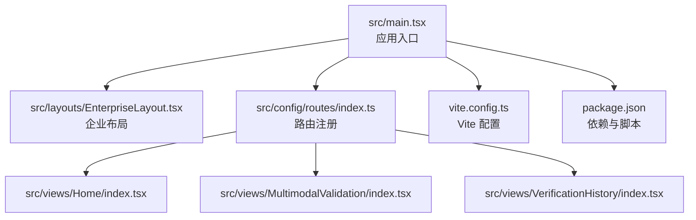
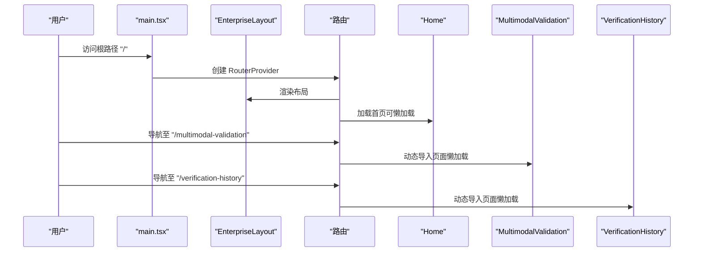
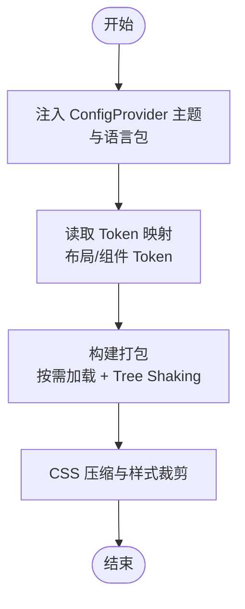
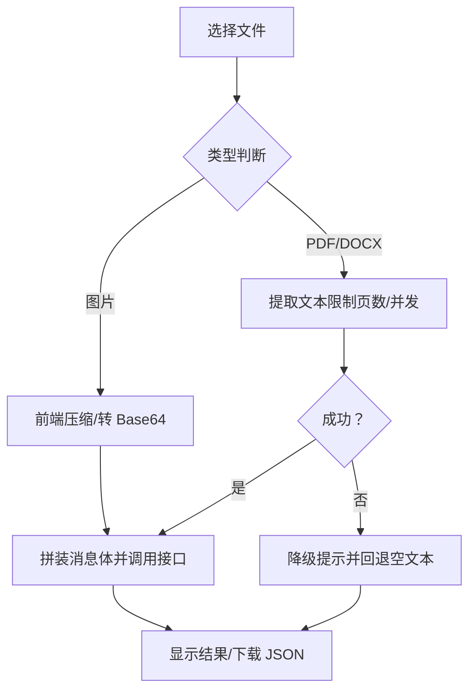
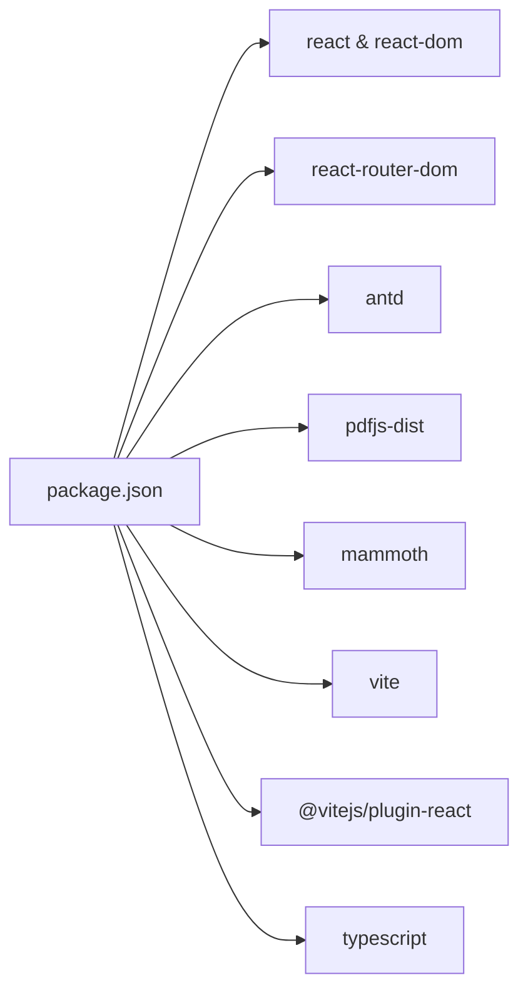

# 性能优化

<cite>
**本文引用的文件**
- [vite.config.ts](file://vite.config.ts)
- [package.json](file://package.json)
- [src/main.tsx](file://src/main.tsx)
- [src/layouts/theme.config.ts](file://src/layouts/theme.config.ts)
- [src/layouts/EnterpriseLayout.tsx](file://src/layouts/EnterpriseLayout.tsx)
- [src/config/routes/index.ts](file://src/config/routes/index.ts)
- [src/views/Home/index.tsx](file://src/views/Home/index.tsx)
- [src/views/MultimodalValidation/index.tsx](file://src/views/MultimodalValidation/index.tsx)
- [src/views/VerificationHistory/index.tsx](file://src/views/VerificationHistory/index.tsx)
- [das-ued-skills/README.md](file://das-ued-skills/README.md)
- [das-ued-skills/opt/antd-v5-enterprise-layout/layout-tokens.md](file://das-ued-skills/opt/antd-v5-enterprise-layout/layout-tokens.md)
</cite>

## 目录
1. [引言](#引言)
2. [项目结构](#项目结构)
3. [核心组件](#核心组件)
4. [架构总览](#架构总览)
5. [详细组件分析](#详细组件分析)
6. [依赖分析](#依赖分析)
7. [性能考虑](#性能考虑)
8. [故障排查指南](#故障排查指南)
9. [结论](#结论)
10. [附录](#附录)

## 引言
本指南围绕 APIG 项目的前端性能优化展开，聚焦 Vite 构建优化、代码分割与懒加载、React 渲染与状态优化、Ant Design 组件按需加载与主题定制、图片与文档 OCR 处理、API 调用优化、内存与资源管理、内网环境性能监控与瓶颈分析，以及缓存、CDN 与静态资源优化建议。内容基于仓库现有实现与通用工程实践，帮助在保证功能完整性的同时显著提升用户体验与运行效率。

## 项目结构
项目采用 React 17 + TypeScript + Vite 的现代前端栈，Ant Design 4 作为基础 UI 库，路由基于 React Router v6。核心目录与职责如下：
- src/main.tsx：应用入口，挂载 RouterProvider 与 ConfigProvider，统一语言与主题。
- src/layouts/EnterpriseLayout.tsx：企业级布局骨架，承载导航与内容区。
- src/config/routes/index.ts：集中式路由注册，便于按需加载与代码分割。
- src/views/*：页面视图，包含首页、多模态验证、历史记录等。
- vite.config.ts：Vite 构建配置，包含插件、路径别名与开发服务器端口。
- package.json：依赖与脚本，包含 React、Antd、PDF.js、Mammoth 等关键库。
- das-ued-skills/*：设计与前端工程化技能文档，包含 Ant Design 主题与布局 Token 参考。

**图表来源**
- [src/main.tsx:1-26](file://src/main.tsx#L1-L26)
- [src/layouts/EnterpriseLayout.tsx:1-20](file://src/layouts/EnterpriseLayout.tsx#L1-L20)
- [src/config/routes/index.ts:1-26](file://src/config/routes/index.ts#L1-L26)
- [src/views/Home/index.tsx:1-49](file://src/views/Home/index.tsx#L1-L49)
- [src/views/MultimodalValidation/index.tsx:1-546](file://src/views/MultimodalValidation/index.tsx#L1-L546)
- [src/views/VerificationHistory/index.tsx:1-603](file://src/views/VerificationHistory/index.tsx#L1-L603)
- [vite.config.ts:1-16](file://vite.config.ts#L1-L16)
- [package.json:1-28](file://package.json#L1-L28)

**章节来源**
- [src/main.tsx:1-26](file://src/main.tsx#L1-L26)
- [src/layouts/EnterpriseLayout.tsx:1-20](file://src/layouts/EnterpriseLayout.tsx#L1-L20)
- [src/config/routes/index.ts:1-26](file://src/config/routes/index.ts#L1-L26)
- [vite.config.ts:1-16](file://vite.config.ts#L1-L16)
- [package.json:1-28](file://package.json#L1-L28)

## 核心组件
- 应用入口与主题配置：在入口处统一注入 ConfigProvider 与语言包，确保全局组件风格一致。
- 路由与布局：集中式路由注册，配合企业布局，减少重复渲染与全局状态波动。
- 页面组件：多模态验证与历史记录页面承担大量交互与数据处理，是性能优化的重点对象。

**章节来源**
- [src/main.tsx:1-26](file://src/main.tsx#L1-L26)
- [src/layouts/EnterpriseLayout.tsx:1-20](file://src/layouts/EnterpriseLayout.tsx#L1-L20)
- [src/config/routes/index.ts:1-26](file://src/config/routes/index.ts#L1-L26)

## 架构总览
下图展示了从入口到页面的数据与控制流，以及关键优化点（懒加载、按需加载、主题注入）：

**图表来源**
- [src/main.tsx:11-25](file://src/main.tsx#L11-L25)
- [src/layouts/EnterpriseLayout.tsx:8-19](file://src/layouts/EnterpriseLayout.tsx#L8-L19)
- [src/config/routes/index.ts:12-25](file://src/config/routes/index.ts#L12-L25)
- [src/views/Home/index.tsx:1-49](file://src/views/Home/index.tsx#L1-L49)
- [src/views/MultimodalValidation/index.tsx:183-546](file://src/views/MultimodalValidation/index.tsx#L183-L546)
- [src/views/VerificationHistory/index.tsx:94-603](file://src/views/VerificationHistory/index.tsx#L94-L603)

## 详细组件分析

### Vite 构建优化与代码分割
- 当前配置要点
  - 插件：使用 @vitejs/plugin-react，启用 React Fast Refresh。
  - 路径别名：通过 @ 指向 src，简化导入路径。
  - 开发服务器：端口 5173。
- 优化建议
  - 代码分割：将大型页面组件（如多模态验证、历史记录）改为动态导入，结合路由懒加载，降低首屏体积。
  - 预构建：对稳定第三方库启用预构建，减少冷启动时间。
  - 构建产物分析：使用 rollup-plugin-visualizer 生成包体分析报告，识别超大依赖。
  - SSR/预渲染：对 SEO 重要页面考虑预渲染或 SSR，进一步缩短 TTFB。

**章节来源**
- [vite.config.ts:1-16](file://vite.config.ts#L1-L16)
- [package.json:6-10](file://package.json#L6-L10)

### React 性能优化与重渲染控制
- 状态与渲染
  - 使用 useState 与 useMemo 控制状态粒度，避免无关组件重渲染。
  - 将计算逻辑抽离到 useMemo，减少每次渲染的重复计算。
- 组件拆分
  - 将高频交互区域拆分为独立子组件，使用 React.memo 包裹纯展示组件。
  - 对表格、列表等长列表，使用虚拟滚动（如 react-window）降低 DOM 数量。
- 事件与回调
  - 将事件处理器绑定在父组件，避免在渲染期间创建新函数。
  - 使用 useCallback 缓存回调，配合子组件 memo 化使用。

**章节来源**
- [src/views/VerificationHistory/index.tsx:132-372](file://src/views/VerificationHistory/index.tsx#L132-L372)
- [src/views/MultimodalValidation/index.tsx:183-385](file://src/views/MultimodalValidation/index.tsx#L183-L385)

### 状态提升与共享策略
- 将跨页面共享的状态（如用户偏好、筛选条件）提升至更高层级，减少重复请求与重复渲染。
- 使用 Context 或轻量状态库（如 Zustand）管理全局状态，避免深层 props 传递。
- 对于复杂业务状态，采用分模块化状态管理，按需订阅，避免全量刷新。

**章节来源**
- [src/main.tsx:11-25](file://src/main.tsx#L11-L25)
- [src/config/routes/index.ts:12-25](file://src/config/routes/index.ts#L12-L25)

### Ant Design 组件按需加载、主题定制与样式压缩
- 按需加载
  - 通过 babel-plugin-import 或 unplugin-auto-import 实现按需引入组件与样式的自动导入，减少打包体积。
- 主题定制
  - 项目使用 antd 4.x，可在 ConfigProvider 中注入主题配置，结合品牌色常量文件统一管理。
  - 参考设计系统 Token 文档，建立布局与组件 Token 映射，确保一致性与可维护性。
- 样式压缩
  - 生产构建开启 CSS 压缩与 Tree Shaking，移除未使用样式。
  - 避免全局样式污染，尽量使用 CSS Modules 或 CSS-in-JS。

**图表来源**
- [src/main.tsx:4-6](file://src/main.tsx#L4-L6)
- [src/layouts/theme.config.ts:5-7](file://src/layouts/theme.config.ts#L5-L7)
- [das-ued-skills/opt/antd-v5-enterprise-layout/layout-tokens.md:17-32](file://das-ued-skills/opt/antd-v5-enterprise-layout/layout-tokens.md#L17-L32)

**章节来源**
- [src/main.tsx:4-6](file://src/main.tsx#L4-L6)
- [src/layouts/theme.config.ts:1-8](file://src/layouts/theme.config.ts#L1-L8)
- [das-ued-skills/README.md:1-351](file://das-ued-skills/README.md#L1-L351)
- [das-ued-skills/opt/antd-v5-enterprise-layout/layout-tokens.md:1-220](file://das-ued-skills/opt/antd-v5-enterprise-layout/layout-tokens.md#L1-L220)

### 图片处理与文档 OCR 性能提升
- 图片处理
  - 上传前进行尺寸与格式校验，必要时在前端压缩，降低传输与后端压力。
  - 使用 Web Worker 或 Service Worker 进行离线处理，避免阻塞主线程。
- 文档 OCR
  - 对 PDF 与 DOCX 提取文本时，限制最大页数与并发数量，避免长时间占用。
  - 使用流式处理与分块读取，减少内存峰值。
  - 对失败场景提供降级策略（如 HTML 解析 fallback），并提示用户。

**图表来源**
- [src/views/MultimodalValidation/index.tsx:183-385](file://src/views/MultimodalValidation/index.tsx#L183-L385)
- [src/views/MultimodalValidation/index.tsx:106-139](file://src/views/MultimodalValidation/index.tsx#L106-L139)
- [src/views/MultimodalValidation/index.tsx:141-164](file://src/views/MultimodalValidation/index.tsx#L141-L164)

**章节来源**
- [src/views/MultimodalValidation/index.tsx:106-164](file://src/views/MultimodalValidation/index.tsx#L106-L164)
- [src/views/MultimodalValidation/index.tsx:183-385](file://src/views/MultimodalValidation/index.tsx#L183-L385)

### API 调用优化
- 请求合并与节流
  - 对频繁触发的搜索/查询，使用防抖/节流，减少无效请求。
- 缓存策略
  - 对只读数据使用内存缓存与本地存储缓存，设置合理过期时间。
- 回退机制
  - 真实接口失败时，使用 mock 数据回退，保证 UI 流畅与可观测性。
- 错误处理
  - 统一拦截器处理错误码与网络异常，提供用户友好提示与重试按钮。

**章节来源**
- [src/views/MultimodalValidation/index.tsx:279-298](file://src/views/MultimodalValidation/index.tsx#L279-L298)
- [src/views/VerificationHistory/index.tsx:455-467](file://src/views/VerificationHistory/index.tsx#L455-L467)

### 内存管理与资源释放
- Blob 与 URL
  - 下载前创建 Blob URL，使用后及时 revokeObjectURL，防止内存泄漏。
- 文件读取
  - FileReader 使用完成后清理引用，避免持有大对象。
- Worker 与定时器
  - Web Worker 退出时清理；定时器在组件卸载时清除。
- 大数组与深拷贝
  - 避免不必要的深拷贝，使用不可变数据结构或浅拷贝策略。

**章节来源**
- [src/views/MultimodalValidation/index.tsx:30-40](file://src/views/MultimodalValidation/index.tsx#L30-L40)
- [src/views/VerificationHistory/index.tsx:82-92](file://src/views/VerificationHistory/index.tsx#L82-L92)

### 内网环境性能监控与瓶颈分析
- 前端监控
  - 使用 Performance API 记录关键指标（FP/FCP/LCP/FID/CLS）与路由切换耗时。
  - 通过埋点统计用户行为与错误日志，定位慢页面与异常。
- 后端与网络
  - 分析接口耗时、并发与错误率，识别慢依赖与限流点。
- 瓶颈定位
  - 结合构建分析报告与浏览器性能面板，定位 CPU 占用高、内存暴涨、长任务阻塞等问题。

**章节来源**
- [src/views/MultimodalValidation/index.tsx:279-298](file://src/views/MultimodalValidation/index.tsx#L279-L298)
- [src/views/VerificationHistory/index.tsx:455-467](file://src/views/VerificationHistory/index.tsx#L455-L467)

### 缓存策略、CDN 与静态资源优化
- 缓存策略
  - 静态资源使用强缓存策略，带哈希后缀；HTML 采用协商缓存。
  - 对接口数据使用合理的缓存 TTL，结合 ETag/Last-Modified。
- CDN
  - 将第三方库与静态资源托管至 CDN，提升首屏与回源效率。
- 静态资源
  - 图片使用现代格式（WebP）与响应式尺寸；字体使用子集化与预加载。
  - 压缩 JS/CSS/HTML，开启 gzip/br 压缩。

**章节来源**
- [package.json:11-18](file://package.json#L11-L18)
- [vite.config.ts:1-16](file://vite.config.ts#L1-L16)

## 依赖分析
- 核心依赖
  - React 17 与 React-DOM：页面渲染与生命周期管理。
  - react-router-dom：路由控制与导航。
  - antd 4：UI 组件库，需配合按需加载与主题定制。
  - pdfjs-dist 与 mammoth：文档 OCR 能力。
- 开发依赖
  - Vite 与 @vitejs/plugin-react：构建与热更新。
  - TypeScript：类型安全与开发体验。

**图表来源**
- [package.json:11-26](file://package.json#L11-L26)

**章节来源**
- [package.json:11-26](file://package.json#L11-L26)

## 性能考虑
- 首屏优化
  - 路由懒加载与关键页面优先渲染，减少首屏阻塞。
  - 将非关键 CSS 延迟加载，避免阻塞渲染。
- 交互流畅性
  - 使用 requestAnimationFrame 与 Web Animations API，避免强制同步布局。
  - 对长任务进行拆分与让出，保持 UI 响应。
- 资源与网络
  - 合理使用 HTTP/2 多路复用与连接复用，减少握手开销。
  - 对大文件采用分块上传与断点续传。

## 故障排查指南
- 构建与运行
  - 端口冲突：调整 vite.config.ts 中 server.port。
  - 路径别名：确认 @ 指向 src，避免相对路径混乱。
- 运行时问题
  - OCR 失败：检查文档类型与文件大小，提供降级提示。
  - API 调用失败：捕获错误并回退 mock，记录错误日志。
  - 内存泄漏：检查 Blob URL 释放与 FileReader 清理。

**章节来源**
- [vite.config.ts:12-14](file://vite.config.ts#L12-L14)
- [src/views/MultimodalValidation/index.tsx:279-298](file://src/views/MultimodalValidation/index.tsx#L279-L298)
- [src/views/MultimodalValidation/index.tsx:30-40](file://src/views/MultimodalValidation/index.tsx#L30-L40)

## 结论
通过在 Vite 构建、React 渲染、Ant Design 主题与按需加载、图片与文档 OCR、API 调用、内存与资源管理、内网监控与缓存策略等方面的系统性优化，APIG 项目可以在保证功能完整性的同时显著提升性能与用户体验。建议优先实施路由懒加载、状态与渲染优化、按需加载与主题裁剪、OCR 降级与缓存策略，并持续利用性能监控工具进行迭代优化。

## 附录
- 设计与前端工程化技能文档提供了丰富的设计系统与前端工程化实践参考，可作为主题 Token 与组件规范的依据。

**章节来源**
- [das-ued-skills/README.md:1-351](file://das-ued-skills/README.md#L1-L351)
- [das-ued-skills/opt/antd-v5-enterprise-layout/layout-tokens.md:1-220](file://das-ued-skills/opt/antd-v5-enterprise-layout/layout-tokens.md#L1-L220)