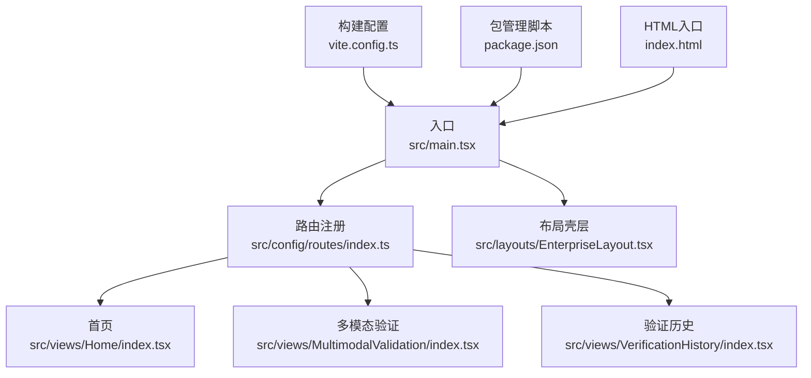
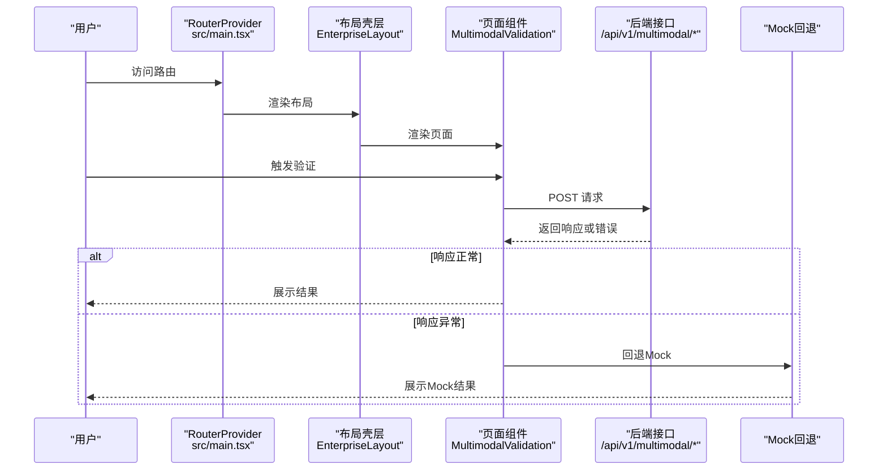
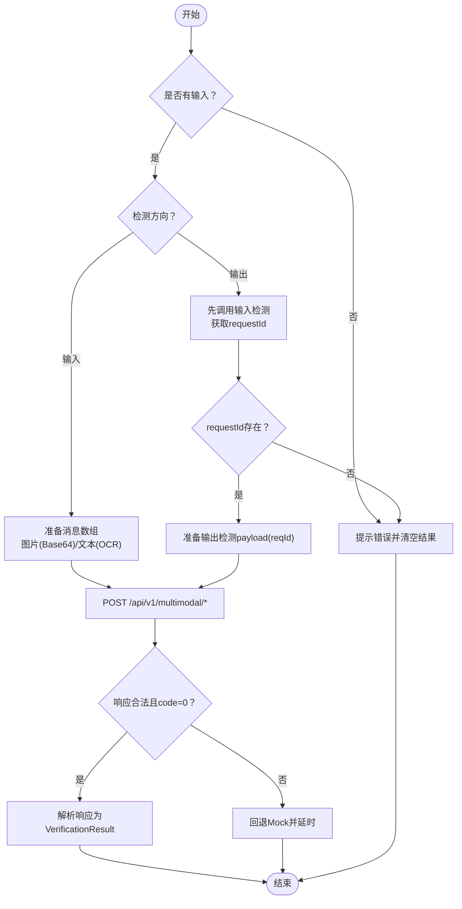
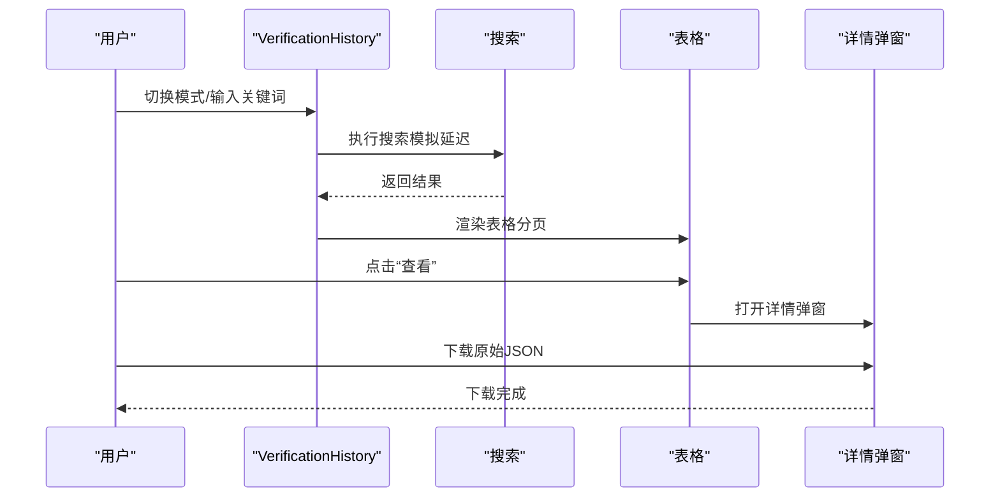
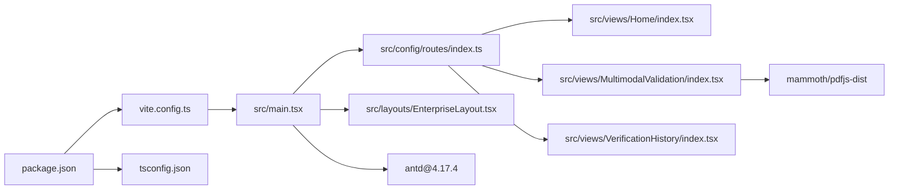

# 调试与测试

<cite>
**本文引用的文件**
- [package.json](file://package.json)
- [vite.config.ts](file://vite.config.ts)
- [index.html](file://index.html)
- [src/main.tsx](file://src/main.tsx)
- [src/config/routes/index.ts](file://src/config/routes/index.ts)
- [src/layouts/EnterpriseLayout.tsx](file://src/layouts/EnterpriseLayout.tsx)
- [src/views/Home/index.tsx](file://src/views/Home/index.tsx)
- [src/views/MultimodalValidation/index.tsx](file://src/views/MultimodalValidation/index.tsx)
- [src/views/VerificationHistory/index.tsx](file://src/views/VerificationHistory/index.tsx)
- [tsconfig.json](file://tsconfig.json)
- [tsconfig.node.json](file://tsconfig.node.json)
- [project_description.md](file://project_description.md)
</cite>

## 目录
1. [简介](#简介)
2. [项目结构](#项目结构)
3. [核心组件](#核心组件)
4. [架构总览](#架构总览)
5. [详细组件分析](#详细组件分析)
6. [依赖分析](#依赖分析)
7. [性能考虑](#性能考虑)
8. [故障排查指南](#故障排查指南)
9. [结论](#结论)
10. [附录](#附录)

## 简介
本指南面向APIG项目的前端开发与测试团队，提供从浏览器开发者工具到Vite开发服务器、从单元测试到端到端测试的全链路调试与测试方法。重点涵盖：
- 浏览器开发者工具使用技巧与React DevTools安装配置
- Vite开发服务器调试配置、网络请求监控与状态检查
- 单元测试与集成测试编写方法、测试框架选择与覆盖率建议
- 组件测试、API测试与端到端测试最佳实践
- 常见问题调试技巧、性能分析与内存泄漏检测
- 内网环境测试策略与Mock数据使用

## 项目结构
项目采用Vite + React 17 + antd 4.17的前端技术栈，页面通过React Router v6集中注册，布局采用企业级壳层，核心页面包括首页、多模态验证与验证历史。

图表来源
- [src/main.tsx:1-26](file://src/main.tsx#L1-L26)
- [src/config/routes/index.ts:1-26](file://src/config/routes/index.ts#L1-L26)
- [src/layouts/EnterpriseLayout.tsx:1-20](file://src/layouts/EnterpriseLayout.tsx#L1-L20)
- [src/views/Home/index.tsx:1-49](file://src/views/Home/index.tsx#L1-L49)
- [src/views/MultimodalValidation/index.tsx:1-546](file://src/views/MultimodalValidation/index.tsx#L1-L546)
- [src/views/VerificationHistory/index.tsx:1-603](file://src/views/VerificationHistory/index.tsx#L1-L603)
- [vite.config.ts:1-16](file://vite.config.ts#L1-L16)
- [package.json:1-28](file://package.json#L1-L28)
- [index.html:1-13](file://index.html#L1-L13)

章节来源
- [project_description.md:13-27](file://project_description.md#L13-L27)
- [vite.config.ts:1-16](file://vite.config.ts#L1-L16)
- [package.json:6-10](file://package.json#L6-L10)

## 核心组件
- 入口与全局配置：应用通过入口文件挂载ConfigProvider与RouterProvider，统一语言与路由。
- 路由注册：集中于路由配置文件，使用element字段对齐React Router v6写法。
- 布局壳层：企业级布局包含Header与Content，承载各页面。
- 页面组件：首页演示Loading/Empty/Feedback；多模态验证页面包含上传、OCR、API调用与回退Mock；验证历史页面包含表格、搜索与详情弹窗。

章节来源
- [src/main.tsx:11-25](file://src/main.tsx#L11-L25)
- [src/config/routes/index.ts:12-25](file://src/config/routes/index.ts#L12-L25)
- [src/layouts/EnterpriseLayout.tsx:8-19](file://src/layouts/EnterpriseLayout.tsx#L8-L19)
- [src/views/Home/index.tsx:4-22](file://src/views/Home/index.tsx#L4-L22)
- [src/views/MultimodalValidation/index.tsx:199-298](file://src/views/MultimodalValidation/index.tsx#L199-L298)
- [src/views/VerificationHistory/index.tsx:94-102](file://src/views/VerificationHistory/index.tsx#L94-L102)

## 架构总览
下图展示从浏览器到页面组件的数据流与交互路径，以及Mock回退策略：

图表来源
- [src/main.tsx:11-25](file://src/main.tsx#L11-L25)
- [src/layouts/EnterpriseLayout.tsx:8-19](file://src/layouts/EnterpriseLayout.tsx#L8-L19)
- [src/views/MultimodalValidation/index.tsx:199-298](file://src/views/MultimodalValidation/index.tsx#L199-L298)

## 详细组件分析

### 多模态验证组件（组件测试重点）
该组件是调试与测试的核心对象，包含：
- 上传与OCR：图片/Base64、DOCX/PDF文本抽取
- API调用：输入/输出检测接口
- 错误回退：真实请求失败时回退Mock
- 结果渲染：安全状态、命中类型、请求ID等字段

图表来源
- [src/views/MultimodalValidation/index.tsx:199-343](file://src/views/MultimodalValidation/index.tsx#L199-L343)

章节来源
- [src/views/MultimodalValidation/index.tsx:183-385](file://src/views/MultimodalValidation/index.tsx#L183-L385)

### 验证历史组件（集成测试重点）
该组件包含表格、搜索、分页与详情弹窗，适合做集成测试与端到端测试：
- 数据源：多模态与文本两类示例数据
- 搜索过滤：基于内容摘要与MD5
- 详情展示：原始JSON下载与字段呈现

图表来源
- [src/views/VerificationHistory/index.tsx:455-599](file://src/views/VerificationHistory/index.tsx#L455-L599)

章节来源
- [src/views/VerificationHistory/index.tsx:94-599](file://src/views/VerificationHistory/index.tsx#L94-L599)

### 首页组件（UI反馈与状态检查）
该组件用于演示Loading/Empty/Feedback状态，适合做状态检查与截图对比测试。

章节来源
- [src/views/Home/index.tsx:4-48](file://src/views/Home/index.tsx#L4-L48)

## 依赖分析
- 构建与运行：Vite提供开发服务器与构建能力，TypeScript编译与路径别名配置确保开发体验与模块解析。
- 路由与布局：React Router v6集中路由注册，企业级布局统一风格。
- 页面功能：多模态验证页面引入mammoth与pdfjs-dist实现文档OCR，Ant Design提供UI与反馈组件。

图表来源
- [package.json:11-26](file://package.json#L11-L26)
- [vite.config.ts:1-16](file://vite.config.ts#L1-L16)
- [tsconfig.json:18-22](file://tsconfig.json#L18-L22)
- [src/main.tsx:1-26](file://src/main.tsx#L1-L26)
- [src/views/MultimodalValidation/index.tsx:107-164](file://src/views/MultimodalValidation/index.tsx#L107-L164)

章节来源
- [package.json:11-26](file://package.json#L11-L26)
- [tsconfig.json:1-25](file://tsconfig.json#L1-L25)
- [tsconfig.node.json:1-11](file://tsconfig.node.json#L1-L11)
- [vite.config.ts:5-15](file://vite.config.ts#L5-L15)

## 性能考虑
- 网络请求优化
  - 合理设置超时与重试策略，避免阻塞UI线程
  - 对大文件上传进行进度提示与分块处理（如适用）
- UI渲染优化
  - 使用useMemo/useCallback缓存计算结果与回调
  - 表格分页与虚拟滚动减少DOM节点数量
- 资源加载
  - 按需加载第三方库（如mammoth、pdfjs-dist）
  - 生产构建开启压缩与Tree Shaking

## 故障排查指南

### 浏览器开发者工具使用技巧
- Elements：检查DOM结构与类名，定位布局与样式问题
- Console：查看错误堆栈与警告，结合源码映射定位问题
- Network：监控接口请求与响应，观察状态码、耗时与负载大小
- Performance：录制用户操作，分析主线程占用与长任务
- Memory：快照对比，识别未释放的对象与事件监听器
- React DevTools：检查组件树、Props/State变化与渲染次数

### React DevTools安装与配置
- 安装：在浏览器扩展商店安装“React Developer Tools”
- 使用：打开页面后切换到“Components”面板，查看组件树与状态；启用“Highlight updates”观察re-render
- 配置：在开发环境下保持严格模式，便于发现副作用与不必要渲染

### Vite开发服务器调试配置
- 启动：执行开发脚本，访问默认端口
- 端口与代理：根据需要在构建配置中调整端口与代理规则
- 热更新：修改源码后自动刷新，结合React DevTools观察状态变化

章节来源
- [project_description.md:30-36](file://project_description.md#L30-L36)
- [vite.config.ts:12-15](file://vite.config.ts#L12-L15)
- [package.json:6-10](file://package.json#L6-L10)

### 网络请求监控与状态检查
- 监控接口：在Network面板筛选XHR/Fetch，关注关键接口（输入/输出检测）
- 状态检查：结合Console与React DevTools，确认组件状态与props同步
- Mock回退：当真实接口失败时，组件会回退Mock，便于继续验证UI

章节来源
- [src/views/MultimodalValidation/index.tsx:278-298](file://src/views/MultimodalValidation/index.tsx#L278-L298)

### 单元测试与集成测试
- 测试框架选择：建议使用Vitest（与Vite生态契合）或Jest（通用性强）
- 覆盖率要求：建议函数覆盖率≥80%，行覆盖率≥70%，分支与语句覆盖率≥70%
- 编写要点：
  - 单元测试：针对纯函数与Hook（如文件扩展名判断、OCR文本抽取辅助函数）进行断言
  - 集成测试：围绕页面组件（多模态验证、验证历史）模拟用户交互，验证状态流转与渲染
- Mock数据：使用内联Mock或外部JSON文件，覆盖正常、异常与边界场景

### 组件测试、API测试与端到端测试最佳实践
- 组件测试
  - 使用React Testing Library或@testing-library/react，以用户视角驱动测试
  - 针对交互（点击、输入、上传）与状态（Loading/Empty/Error）进行断言
- API测试
  - 使用Mock服务或Mock拦截库（如MSW），模拟后端接口行为
  - 覆盖成功、失败、超时与鉴权错误等场景
- 端到端测试
  - 使用Cypress或Playwright，录制用户流程（上传文件、发起验证、查看结果）
  - 在内网环境下配置代理与Mock，保证测试稳定性

### 常见问题调试技巧
- 输入校验：确保所有输入均被校验，避免因空值或异常字符导致崩溃
- 网络抖动：模拟弱网与断网，验证错误提示与重试逻辑
- 大数据集：测试长列表与大量并发操作，避免UI卡顿
- 国际化与多语言：验证RTL、Emoji与CJK字符显示

章节来源
- [das-ued-skills\opt\harden\SKILL.md:344-358](file://das-ued-skills/opt/harden/SKILL.md#L344-L358)

### 性能分析与内存泄漏检测
- 性能分析：使用Performance面板录制关键操作，识别长任务与重排重绘
- 内存泄漏：使用Memory面板进行快照对比，检查未释放的DOM、事件监听器与定时器

### 内网环境下的测试策略与Mock数据
- 私有源与离线包：在内网受限环境中，优先使用私有NPM源或离线包
- Mock策略：对真实API进行拦截，返回稳定Mock数据，确保测试可重复性
- 代理与跨域：在Vite中配置代理，解决开发阶段跨域问题

章节来源
- [project_description.md:50-61](file://project_description.md#L50-L61)
- [vite.config.ts:12-15](file://vite.config.ts#L12-L15)

## 结论
本指南提供了从开发工具到测试体系的完整方法论，结合项目现状（React 17 + antd 4.17 + Vite），建议优先完善单元与集成测试，配合Mock策略保障内网环境下的可测试性与稳定性，并通过性能与内存分析持续优化用户体验。

## 附录

### 快速参考
- 开发启动：执行开发脚本，访问默认端口
- 路由注册：集中于路由配置文件
- 页面入口：入口文件挂载ConfigProvider与RouterProvider
- 构建配置：Vite与TypeScript路径别名配置

章节来源
- [project_description.md:28-36](file://project_description.md#L28-L36)
- [src/main.tsx:11-25](file://src/main.tsx#L11-L25)
- [src/config/routes/index.ts:12-25](file://src/config/routes/index.ts#L12-L25)
- [vite.config.ts:5-15](file://vite.config.ts#L5-L15)
- [tsconfig.json:18-22](file://tsconfig.json#L18-L22)