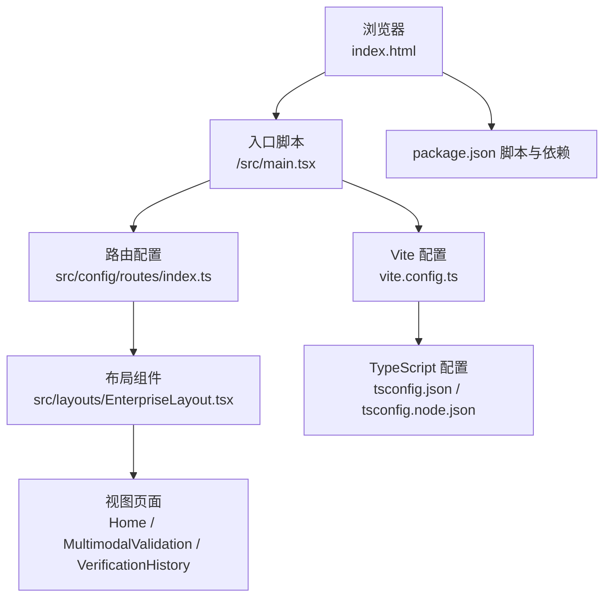
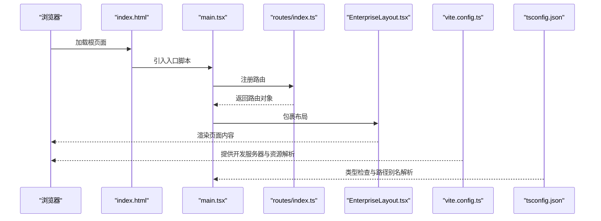
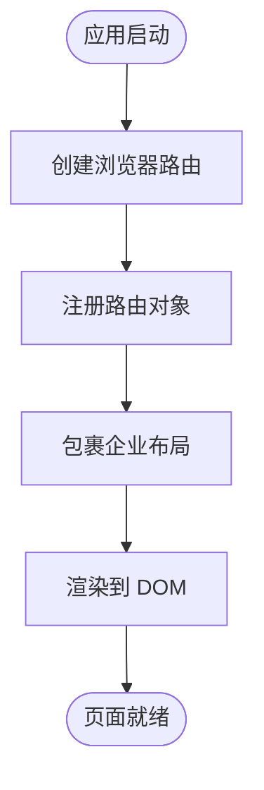
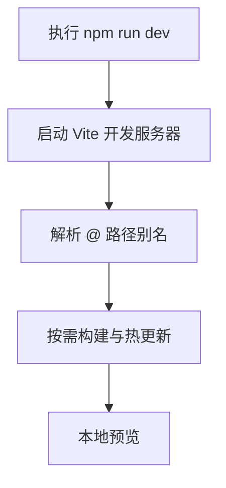
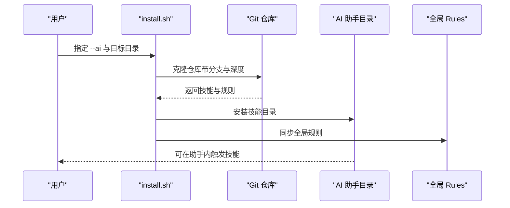
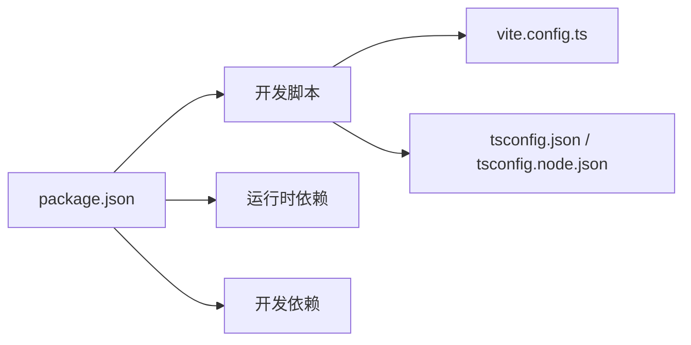

# 快速开始

<cite>
**本文引用的文件**
- [package.json](file://package.json)
- [vite.config.ts](file://vite.config.ts)
- [tsconfig.json](file://tsconfig.json)
- [tsconfig.node.json](file://tsconfig.node.json)
- [index.html](file://index.html)
- [src/main.tsx](file://src/main.tsx)
- [src/layouts/EnterpriseLayout.tsx](file://src/layouts/EnterpriseLayout.tsx)
- [src/config/routes/index.ts](file://src/config/routes/index.ts)
- [das-ued-skills/README.md](file://das-ued-skills/README.md)
- [das-ued-skills/cli/install.sh](file://das-ued-skills/cli/install.sh)
- [das-ued-skills/cli/install-cli.sh](file://das-ued-skills/cli/install-cli.sh)
- [das-ued-skills/project/[组件库] das-component-vue.pen](file://das-ued-skills/project/[组件库] das-component-vue.pen)
</cite>

## 目录
1. [引言](#引言)
2. [项目结构](#项目结构)
3. [核心组件](#核心组件)
4. [架构总览](#架构总览)
5. [详细组件分析](#详细组件分析)
6. [依赖分析](#依赖分析)
7. [性能考虑](#性能考虑)
8. [故障排除指南](#故障排除指南)
9. [结论](#结论)
10. [附录](#附录)

## 引言
本指南帮助你在最短时间内成功运行 APIG 项目，体验核心功能。内容涵盖环境要求、依赖安装、项目启动、基本使用方法，并提供内网环境（私有 npm 源、离线包）的配置要点与常见问题排查。

## 项目结构
该项目是一个基于 Vite + React 17 + Ant Design 4 的前端应用，采用 TypeScript 构建，通过路由集中注册实现页面导航。项目还包含一套 UED Skills 工具集，可在内网环境中配合 AI 助手进行端到端的设计到代码工作流。

图表来源
- [index.html:1-13](file://index.html#L1-L13)
- [src/main.tsx:1-26](file://src/main.tsx#L1-L26)
- [src/config/routes/index.ts:1-26](file://src/config/routes/index.ts#L1-L26)
- [src/layouts/EnterpriseLayout.tsx:1-20](file://src/layouts/EnterpriseLayout.tsx#L1-L20)
- [vite.config.ts:1-16](file://vite.config.ts#L1-L16)
- [tsconfig.json:1-25](file://tsconfig.json#L1-L25)
- [tsconfig.node.json:1-11](file://tsconfig.node.json#L1-L11)
- [package.json:1-28](file://package.json#L1-L28)

章节来源
- [package.json:1-28](file://package.json#L1-L28)
- [vite.config.ts:1-16](file://vite.config.ts#L1-L16)
- [tsconfig.json:1-25](file://tsconfig.json#L1-L25)
- [tsconfig.node.json:1-11](file://tsconfig.node.json#L1-L11)
- [index.html:1-13](file://index.html#L1-L13)
- [src/main.tsx:1-26](file://src/main.tsx#L1-L26)
- [src/layouts/EnterpriseLayout.tsx:1-20](file://src/layouts/EnterpriseLayout.tsx#L1-L20)
- [src/config/routes/index.ts:1-26](file://src/config/routes/index.ts#L1-L26)

## 核心组件
- 入口与渲染
  - 入口脚本负责创建路由、挂载布局与国际化配置，并将应用渲染到 DOM。
- 路由系统
  - 路由集中注册，支持首页、多模态验证、验证历史三个页面。
- 布局系统
  - 企业级布局提供统一的头部与内容区域，适配内网模拟环境。
- 构建与开发
  - 使用 Vite 提供开发服务器与构建能力，TypeScript 提供类型安全保障。

章节来源
- [src/main.tsx:1-26](file://src/main.tsx#L1-L26)
- [src/config/routes/index.ts:1-26](file://src/config/routes/index.ts#L1-L26)
- [src/layouts/EnterpriseLayout.tsx:1-20](file://src/layouts/EnterpriseLayout.tsx#L1-L20)
- [vite.config.ts:1-16](file://vite.config.ts#L1-L16)
- [tsconfig.json:1-25](file://tsconfig.json#L1-L25)
- [tsconfig.node.json:1-11](file://tsconfig.node.json#L1-L11)

## 架构总览
下图展示了从浏览器加载到页面渲染的关键流程，以及开发服务器的启动与资源解析关系。

图表来源
- [index.html:1-13](file://index.html#L1-L13)
- [src/main.tsx:1-26](file://src/main.tsx#L1-L26)
- [src/config/routes/index.ts:1-26](file://src/config/routes/index.ts#L1-L26)
- [src/layouts/EnterpriseLayout.tsx:1-20](file://src/layouts/EnterpriseLayout.tsx#L1-L20)
- [vite.config.ts:1-16](file://vite.config.ts#L1-L16)
- [tsconfig.json:1-25](file://tsconfig.json#L1-L25)

## 详细组件分析

### 入口与路由
- 入口脚本负责创建浏览器路由、配置 Ant Design 国际化、包裹应用并渲染到 DOM。
- 路由集中注册在单一文件中维护，便于扩展与一致性管理。
- 布局组件提供统一的页头与内容区，适配内网模拟环境。

图表来源
- [src/main.tsx:1-26](file://src/main.tsx#L1-L26)
- [src/config/routes/index.ts:1-26](file://src/config/routes/index.ts#L1-L26)
- [src/layouts/EnterpriseLayout.tsx:1-20](file://src/layouts/EnterpriseLayout.tsx#L1-L20)

章节来源
- [src/main.tsx:1-26](file://src/main.tsx#L1-L26)
- [src/config/routes/index.ts:1-26](file://src/config/routes/index.ts#L1-L26)
- [src/layouts/EnterpriseLayout.tsx:1-20](file://src/layouts/EnterpriseLayout.tsx#L1-L20)

### 开发服务器与构建
- Vite 配置启用 React 插件与路径别名，开发端口默认为 5173。
- TypeScript 配置启用严格模式与路径映射，保证类型安全与模块解析。

图表来源
- [vite.config.ts:1-16](file://vite.config.ts#L1-L16)
- [tsconfig.json:1-25](file://tsconfig.json#L1-L25)
- [package.json:1-28](file://package.json#L1-L28)

章节来源
- [vite.config.ts:1-16](file://vite.config.ts#L1-L16)
- [tsconfig.json:1-25](file://tsconfig.json#L1-L25)
- [package.json:1-28](file://package.json#L1-L28)

### UED Skills 工具集（可选）
- 适用于内网 AI 协作场景，提供从“用研 → PRD → 设计稿 → 设计验证 → Vue 3 代码”的端到端工作流。
- 支持一键安装到 Cursor/Claude 等助手的 skills 目录，并可同步全局 rules。
- 提供项目资产同步脚本，便于在目标项目中复用组件库与设计规范。

图表来源
- [das-ued-skills/README.md:65-136](file://das-ued-skills/README.md#L65-L136)
- [das-ued-skills/cli/install.sh:1-189](file://das-ued-skills/cli/install.sh#L1-L189)

章节来源
- [das-ued-skills/README.md:1-351](file://das-ued-skills/README.md#L1-L351)
- [das-ued-skills/cli/install.sh:1-189](file://das-ued-skills/cli/install.sh#L1-L189)
- [das-ued-skills/cli/install-cli.sh:1-19](file://das-ued-skills/cli/install-cli.sh#L1-L19)

## 依赖分析
- 运行时依赖
  - React 17、Ant Design 4、React Router DOM、PDF.js、Mammoth 等。
- 开发依赖
  - Vite、@vitejs/plugin-react、TypeScript、@types/* 等。
- 脚本命令
  - dev：启动开发服务器；build：先类型检查再打包；preview：本地预览。

图表来源
- [package.json:1-28](file://package.json#L1-L28)
- [vite.config.ts:1-16](file://vite.config.ts#L1-L16)
- [tsconfig.json:1-25](file://tsconfig.json#L1-L25)
- [tsconfig.node.json:1-11](file://tsconfig.node.json#L1-L11)

章节来源
- [package.json:1-28](file://package.json#L1-L28)
- [vite.config.ts:1-16](file://vite.config.ts#L1-L16)
- [tsconfig.json:1-25](file://tsconfig.json#L1-L25)
- [tsconfig.node.json:1-11](file://tsconfig.node.json#L1-L11)

## 性能考虑
- 使用 Vite 的按需构建与热更新，提升开发体验。
- TypeScript 严格模式有助于早期发现潜在问题，减少运行时开销。
- 路由集中注册与布局复用降低重复渲染成本。

## 故障排除指南
- Node.js 版本不匹配
  - 现象：安装或运行时报错。
  - 处理：确保使用受支持的 Node.js 版本（具体版本号以项目依赖为准），并清理缓存后重试。
- npm/yarn/pnpm 选择
  - 现象：不同包管理器出现依赖冲突或安装失败。
  - 处理：保持团队一致的包管理器；若必须混用，清理 lockfile 并重新安装。
- 端口占用
  - 现象：开发服务器无法启动，提示端口被占用。
  - 处理：修改 vite.config.ts 中的 server.port 或关闭占用进程。
- 路径别名无效
  - 现象：导入 @/* 报错。
  - 处理：检查 tsconfig.json 的 baseUrl 与 paths 配置是否正确。
- 内网环境无法访问外网
  - 现象：安装依赖失败或下载超时。
  - 处理：配置私有 npm 源（见“内网环境配置”），或使用离线包安装。
- UED Skills 安装失败
  - 现象：install.sh 执行报错或技能未出现在助手目录。
  - 处理：确认 Git 可用、目标目录权限正确；必要时使用 install-cli.sh 安装 CLI 并手动复制技能目录。

章节来源
- [vite.config.ts:1-16](file://vite.config.ts#L1-L16)
- [tsconfig.json:1-25](file://tsconfig.json#L1-L25)
- [das-ued-skills/cli/install.sh:1-189](file://das-ued-skills/cli/install.sh#L1-L189)
- [das-ued-skills/cli/install-cli.sh:1-19](file://das-ued-skills/cli/install-cli.sh#L1-L19)

## 结论
按照本指南，你可以快速完成环境准备、依赖安装与项目启动，并在内网环境下结合 UED Skills 工具集体验端到端工作流。遇到问题时，可依据故障排除指南逐项定位并解决。

## 附录

### 环境要求
- Node.js：满足项目依赖所需的版本范围。
- 包管理器：支持 npm、yarn 或 pnpm，建议团队统一。
- 内网环境：如需离线部署，请参考“内网环境配置”。

章节来源
- [package.json:1-28](file://package.json#L1-L28)

### 依赖安装步骤
- 使用 npm
  - 安装依赖：npm install
  - 启动开发：npm run dev
- 使用 yarn
  - 安装依赖：yarn
  - 启动开发：yarn dev
- 使用 pnpm
  - 安装依赖：pnpm install
  - 启动开发：pnpm dev

章节来源
- [package.json:1-28](file://package.json#L1-L28)

### 项目启动流程
- 启动开发服务器：npm run dev
- 访问地址：默认 http://localhost:5173（可在 vite.config.ts 中调整）

章节来源
- [package.json:1-28](file://package.json#L1-L28)
- [vite.config.ts:1-16](file://vite.config.ts#L1-L16)

### 基本使用方法
- 页面导航：通过路由集中注册的路径访问首页、多模态验证、验证历史。
- 布局样式：企业布局提供统一的页头与内容区，适配内网模拟环境。
- UED Skills（可选）：在内网环境中，使用 install.sh 将技能安装到 AI 助手目录，并在助手内触发相应技能。

章节来源
- [src/config/routes/index.ts:1-26](file://src/config/routes/index.ts#L1-L26)
- [src/layouts/EnterpriseLayout.tsx:1-20](file://src/layouts/EnterpriseLayout.tsx#L1-L20)
- [das-ued-skills/README.md:139-157](file://das-ued-skills/README.md#L139-L157)

### 内网环境配置
- 私有 npm 源
  - 将 registry 指向公司私有源，确保安装依赖与更新缓存。
- 离线包处理
  - 准备离线 tarball 或压缩包，使用包管理器的离线安装能力进行安装。
  - 若使用 install.sh，可将其指向内网 Git 仓库并指定分支与深度，以减少对外部网络的依赖。

章节来源
- [das-ued-skills/cli/install.sh:7-14](file://das-ued-skills/cli/install.sh#L7-L14)
- [das-ued-skills/cli/install.sh:154-156](file://das-ued-skills/cli/install.sh#L154-L156)

### 常见安装问题与解决方案
- 安装失败或超时
  - 使用私有源或离线包替代外网下载。
- 权限不足
  - 确保目标目录具有写权限；必要时使用管理员权限或切换到用户目录。
- 路径别名与类型错误
  - 检查 tsconfig.json 的 baseUrl 与 paths，确保 @/* 映射正确。
- UED Skills 未生效
  - 确认 install.sh 已成功复制技能目录至 AI 助手的 skills 目录，并同步全局 rules。

章节来源
- [tsconfig.json:1-25](file://tsconfig.json#L1-L25)
- [das-ued-skills/cli/install.sh:102-117](file://das-ued-skills/cli/install.sh#L102-L117)
- [das-ued-skills/cli/install.sh:73-100](file://das-ued-skills/cli/install.sh#L73-L100)

### 实际命令行示例与预期输出
- 安装依赖（示例）
  - npm install
  - 预期输出：安装过程日志，最终显示安装完成。
- 启动开发服务器（示例）
  - npm run dev
  - 预期输出：Vite 启动成功，控制台打印本地访问地址（如 http://localhost:5173）。
- UED Skills 安装（示例）
  - ./cli/install.sh --ai cursor
  - 预期输出：克隆仓库、安装技能目录、同步全局 rules，并提示安装完成。

章节来源
- [package.json:6-10](file://package.json#L6-L10)
- [das-ued-skills/cli/install.sh:154-156](file://das-ued-skills/cli/install.sh#L154-L156)
- [das-ued-skills/cli/install.sh:102-117](file://das-ued-skills/cli/install.sh#L102-L117)
- [das-ued-skills/cli/install.sh:73-100](file://das-ued-skills/cli/install.sh#L73-L100)