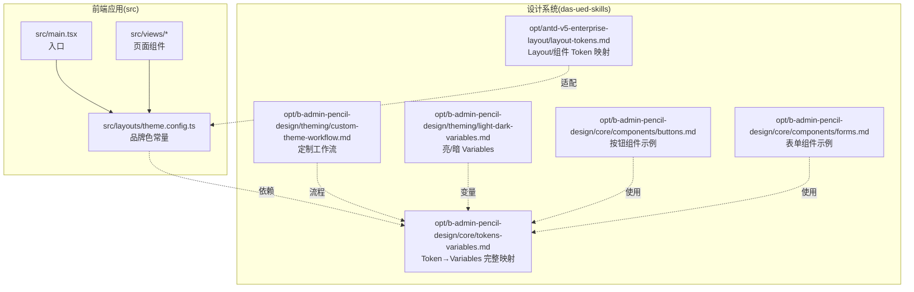
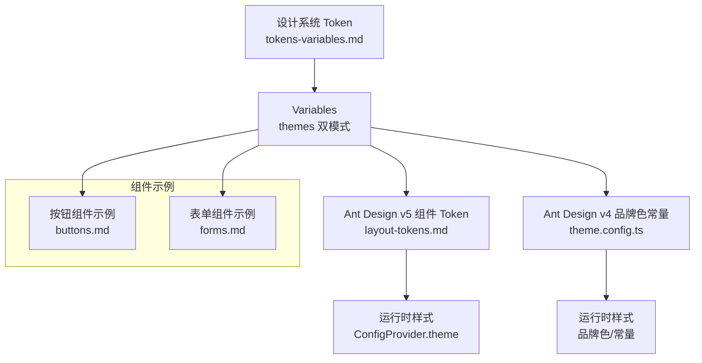
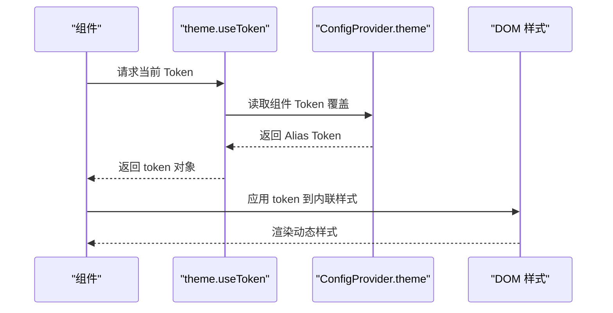
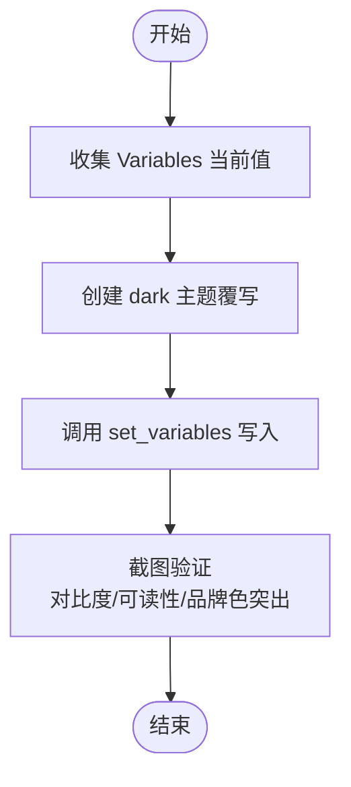
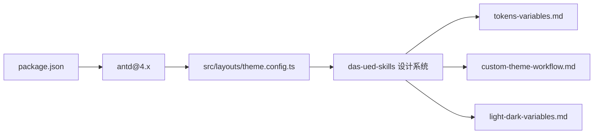

# 主题系统

<cite>
**本文档引用的文件**
- [src/layouts/theme.config.ts](file://src/layouts/theme.config.ts)
- [das-ued-skills/opt/antd-v5-enterprise-layout/layout-tokens.md](file://das-ued-skills/opt/antd-v5-enterprise-layout/layout-tokens.md)
- [das-ued-skills/opt/b-admin-pencil-design/theming/custom-theme-workflow.md](file://das-ued-skills/opt/b-admin-pencil-design/theming/custom-theme-workflow.md)
- [das-ued-skills/opt/b-admin-pencil-design/theming/light-dark-variables.md](file://das-ued-skills/opt/b-admin-pencil-design/theming/light-dark-variables.md)
- [das-ued-skills/opt/b-admin-pencil-design/core/tokens-variables.md](file://das-ued-skills/opt/b-admin-pencil-design/core/tokens-variables.md)
- [das-ued-skills/opt/b-admin-pencil-design/core/components/buttons.md](file://das-ued-skills/opt/b-admin-pencil-design/core/components/buttons.md)
- [das-ued-skills/opt/b-admin-pencil-design/core/components/forms.md](file://das-ued-skills/opt/b-admin-pencil-design/core/components/forms.md)
- [package.json](file://package.json)
</cite>

## 目录
1. [引言](#引言)
2. [项目结构](#项目结构)
3. [核心组件](#核心组件)
4. [架构总览](#架构总览)
5. [详细组件分析](#详细组件分析)
6. [依赖分析](#依赖分析)
7. [性能考虑](#性能考虑)
8. [故障排查指南](#故障排查指南)
9. [结论](#结论)
10. [附录](#附录)

## 引言
本文件系统性阐述 APIG 项目的主题系统，聚焦于 Ant Design 主题配置、Token 系统与品牌定制的落地实现。文档基于仓库内的设计系统与主题规范文件，梳理了从品牌色到组件 Token 的映射、亮/暗双模式的变量配置、以及在 Ant Design v4 与 v5 之间的适配策略。同时给出主题切换、动态样式与响应式设计的实现要点，并总结最佳实践与维护策略。

## 项目结构
APIG 项目采用“前端应用 + 设计系统与主题规范”的组织方式：
- 前端应用位于 src 目录，包含布局与主题常量定义。
- 设计系统与主题规范位于 das-ued-skills 目录，覆盖 Token → Variables 的映射、定制工作流、亮/暗变量配置及组件示例。

图表来源
- [src/layouts/theme.config.ts:1-8](file://src/layouts/theme.config.ts#L1-L8)
- [das-ued-skills/opt/antd-v5-enterprise-layout/layout-tokens.md:1-220](file://das-ued-skills/opt/antd-v5-enterprise-layout/layout-tokens.md#L1-L220)
- [das-ued-skills/opt/b-admin-pencil-design/theming/custom-theme-workflow.md:1-114](file://das-ued-skills/opt/b-admin-pencil-design/theming/custom-theme-workflow.md#L1-L114)
- [das-ued-skills/opt/b-admin-pencil-design/theming/light-dark-variables.md:1-82](file://das-ued-skills/opt/b-admin-pencil-design/theming/light-dark-variables.md#L1-L82)
- [das-ued-skills/opt/b-admin-pencil-design/core/tokens-variables.md:1-246](file://das-ued-skills/opt/b-admin-pencil-design/core/tokens-variables.md#L1-L246)
- [das-ued-skills/opt/b-admin-pencil-design/core/components/buttons.md:1-65](file://das-ued-skills/opt/b-admin-pencil-design/core/components/buttons.md#L1-L65)
- [das-ued-skills/opt/b-admin-pencil-design/core/components/forms.md:1-150](file://das-ued-skills/opt/b-admin-pencil-design/core/components/forms.md#L1-L150)

章节来源
- [src/layouts/theme.config.ts:1-8](file://src/layouts/theme.config.ts#L1-L8)
- [package.json:1-28](file://package.json#L1-L28)

## 核心组件
- 品牌色常量与布局引用
  - 项目在布局/页面层沉淀品牌色等常量，供全局引用。该文件明确标注：Ant Design v4 无 v5 Design Token，此处仅做品牌色常量沉淀。
  - 参考路径：[品牌色常量定义:5-7](file://src/layouts/theme.config.ts#L5-L7)

- Ant Design v5 Token 分层与组件专属 Token
  - 项目采用三层 Token 结构：Seed Token、Map Token、Alias Token。Layout、Menu、Card、Table、Button、Input/Form 等组件均有专属 Token，便于精细化控制。
  - 参考路径：
    - [Token 分层说明与组件 Token:3-13](file://das-ued-skills/opt/antd-v5-enterprise-layout/layout-tokens.md#L3-L13)
    - [Layout 组件专属 Token:15-32](file://das-ued-skills/opt/antd-v5-enterprise-layout/layout-tokens.md#L15-L32)
    - [Menu 组件专属 Token:34-63](file://das-ued-skills/opt/antd-v5-enterprise-layout/layout-tokens.md#L34-L63)
    - [常用组件 Token 速查:68-136](file://das-ued-skills/opt/antd-v5-enterprise-layout/layout-tokens.md#L68-L136)

- 亮/暗 Variables 配置
  - 通过 Variables 的 themes 对象支持亮/暗双模式，颜色变量按对照表进行覆写，非颜色类 Token 保持单值格式。
  - 参考路径：
    - [双模式 Variables 配置:1-82](file://das-ued-skills/opt/b-admin-pencil-design/theming/light-dark-variables.md#L1-L82)
    - [Token → Variables 完整映射（含双模式）:22-138](file://das-ued-skills/opt/b-admin-pencil-design/core/tokens-variables.md#L22-L138)

- 定制主题工作流
  - 明确品牌色来源优先级、8 个维度的配置、品牌色系列推导、Variables 写入、暗色模式扩展与验证步骤。
  - 参考路径：
    - [定制主题工作流:7-114](file://das-ued-skills/opt/b-admin-pencil-design/theming/custom-theme-workflow.md#L7-L114)

- 组件示例中的 Token 使用
  - 按钮与表单组件示例展示了如何通过 Variables 引用颜色、圆角、间距、字号等 Token，确保设计一致性。
  - 参考路径：
    - [按钮组件示例:7-65](file://das-ued-skills/opt/b-admin-pencil-design/core/components/buttons.md#L7-L65)
    - [表单组件示例:5-150](file://das-ued-skills/opt/b-admin-pencil-design/core/components/forms.md#L5-L150)

章节来源
- [src/layouts/theme.config.ts:1-8](file://src/layouts/theme.config.ts#L1-L8)
- [das-ued-skills/opt/antd-v5-enterprise-layout/layout-tokens.md:1-220](file://das-ued-skills/opt/antd-v5-enterprise-layout/layout-tokens.md#L1-L220)
- [das-ued-skills/opt/b-admin-pencil-design/theming/light-dark-variables.md:1-82](file://das-ued-skills/opt/b-admin-pencil-design/theming/light-dark-variables.md#L1-L82)
- [das-ued-skills/opt/b-admin-pencil-design/core/tokens-variables.md:1-246](file://das-ued-skills/opt/b-admin-pencil-design/core/tokens-variables.md#L1-L246)
- [das-ued-skills/opt/b-admin-pencil-design/theming/custom-theme-workflow.md:1-114](file://das-ued-skills/opt/b-admin-pencil-design/theming/custom-theme-workflow.md#L1-L114)
- [das-ued-skills/opt/b-admin-pencil-design/core/components/buttons.md:1-65](file://das-ued-skills/opt/b-admin-pencil-design/core/components/buttons.md#L1-L65)
- [das-ued-skills/opt/b-admin-pencil-design/core/components/forms.md:1-150](file://das-ued-skills/opt/b-admin-pencil-design/core/components/forms.md#L1-L150)

## 架构总览
主题系统围绕“设计 Token → Variables → 组件 Token → 运行时样式”展开，形成从设计到实现的闭环。Ant Design v4 通过品牌色常量与组件 Token 覆盖实现主题定制；Ant Design v5 通过三层 Token 体系与 ConfigProvider 进行更细粒度的控制。

图表来源
- [das-ued-skills/opt/b-admin-pencil-design/core/tokens-variables.md:1-246](file://das-ued-skills/opt/b-admin-pencil-design/core/tokens-variables.md#L1-L246)
- [das-ued-skills/opt/antd-v5-enterprise-layout/layout-tokens.md:1-220](file://das-ued-skills/opt/antd-v5-enterprise-layout/layout-tokens.md#L1-L220)
- [src/layouts/theme.config.ts:1-8](file://src/layouts/theme.config.ts#L1-L8)
- [das-ued-skills/opt/b-admin-pencil-design/core/components/buttons.md:1-65](file://das-ued-skills/opt/b-admin-pencil-design/core/components/buttons.md#L1-L65)
- [das-ued-skills/opt/b-admin-pencil-design/core/components/forms.md:1-150](file://das-ued-skills/opt/b-admin-pencil-design/core/components/forms.md#L1-L150)

## 详细组件分析

### Ant Design v5 Token 体系与组件覆盖
- 三层 Token 分层
  - Seed Token：基础种子值，派生其他 Token。
  - Map Token：系统自动从 Seed 派生，可局部覆盖。
  - Alias Token：具体组件使用的最终值。
  - 参考路径：[Token 分层说明:3-13](file://das-ued-skills/opt/antd-v5-enterprise-layout/layout-tokens.md#L3-L13)

- 组件专属 Token
  - Layout：header/footer/body 背景、尺寸等。
  - Menu：项高度、图标尺寸、颜色、圆角、分组标签等。
  - Card/Table/Button/Input/Form：背景、颜色、阴影、边框、密度、尺寸等。
  - 参考路径：
    - [Layout 组件专属 Token:15-32](file://das-ued-skills/opt/antd-v5-enterprise-layout/layout-tokens.md#L15-L32)
    - [Menu 组件专属 Token:34-63](file://das-ued-skills/opt/antd-v5-enterprise-layout/layout-tokens.md#L34-L63)
    - [常用组件 Token 速查:68-136](file://das-ued-skills/opt/antd-v5-enterprise-layout/layout-tokens.md#L68-L136)

- useToken Hook 与动态样式
  - 在组件内部通过 theme.useToken 读取当前 Token，实现动态样式与响应式调整。
  - 参考路径：[useToken Hook 用法:162-184](file://das-ued-skills/opt/antd-v5-enterprise-layout/layout-tokens.md#L162-L184)

图表来源
- [das-ued-skills/opt/antd-v5-enterprise-layout/layout-tokens.md:162-184](file://das-ued-skills/opt/antd-v5-enterprise-layout/layout-tokens.md#L162-L184)

章节来源
- [das-ued-skills/opt/antd-v5-enterprise-layout/layout-tokens.md:1-220](file://das-ued-skills/opt/antd-v5-enterprise-layout/layout-tokens.md#L1-L220)

### 亮/暗双模式 Variables 配置
- 变量格式与双模式
  - 颜色变量使用 themes 对象支持亮/暗双模式；非颜色类 Token 使用单值 value。
  - 参考路径：[双模式格式说明:10-19](file://das-ued-skills/opt/b-admin-pencil-design/core/tokens-variables.md#L10-L19)

- 暗色变量对照
  - 提供常用颜色变量在亮/暗模式下的对照表，便于快速覆写。
  - 参考路径：[双模式对照速查:55-73](file://das-ued-skills/opt/b-admin-pencil-design/theming/light-dark-variables.md#L55-L73)

- 变量到 CSS 变量映射
  - Pencil Variables 与 CSS Variables 的一一对应关系，确保设计值与运行时值一致。
  - 参考路径：[Pencil → CSS 变量映射:191-228](file://das-ued-skills/opt/b-admin-pencil-design/core/tokens-variables.md#L191-L228)

图表来源
- [das-ued-skills/opt/b-admin-pencil-design/theming/light-dark-variables.md:10-52](file://das-ued-skills/opt/b-admin-pencil-design/theming/light-dark-variables.md#L10-L52)
- [das-ued-skills/opt/b-admin-pencil-design/theming/custom-theme-workflow.md:95-114](file://das-ued-skills/opt/b-admin-pencil-design/theming/custom-theme-workflow.md#L95-L114)

章节来源
- [das-ued-skills/opt/b-admin-pencil-design/theming/light-dark-variables.md:1-82](file://das-ued-skills/opt/b-admin-pencil-design/theming/light-dark-variables.md#L1-L82)
- [das-ued-skills/opt/b-admin-pencil-design/core/tokens-variables.md:1-246](file://das-ued-skills/opt/b-admin-pencil-design/core/tokens-variables.md#L1-L246)
- [das-ued-skills/opt/b-admin-pencil-design/theming/custom-theme-workflow.md:1-114](file://das-ued-skills/opt/b-admin-pencil-design/theming/custom-theme-workflow.md#L1-L114)

### 定制主题工作流与 Token 对齐
- 品牌色来源优先级
  - 用户/客户明确提供的品牌色 > 主线产品未指定 > 定制项目未提供。
  - 参考路径：[颜色来源优先级:7-18](file://das-ued-skills/opt/b-admin-pencil-design/theming/custom-theme-workflow.md#L7-L18)

- 8 维度配置与品牌色系列推导
  - 包括 color-mode、brand-color、bg-tone、spacing-scale、info-density、font-base、radius-style、layout-type。
  - 品牌色系列：normal/hover/active/disabled/light 及 text/brand。
  - 参考路径：[操作流程与维度:21-46](file://das-ued-skills/opt/b-admin-pencil-design/theming/custom-theme-workflow.md#L21-L46)、[品牌色系列推导:49-61](file://das-ued-skills/opt/b-admin-pencil-design/theming/custom-theme-workflow.md#L49-L61)

- Variables 写入与暗色模式扩展
  - 按需写入 Variables，必要时覆写暗色模式下的品牌色相关值。
  - 参考路径：[生成 Variables 配置并写入:64-101](file://das-ued-skills/opt/b-admin-pencil-design/theming/custom-theme-workflow.md#L64-L101)

- Token 对齐策略
  - 以 tokens-variables.md 为权威映射表，确保设计层与实现层的一致性。
  - 参考路径：[Token → Variables 完整映射:1-246](file://das-ued-skills/opt/b-admin-pencil-design/core/tokens-variables.md#L1-L246)

章节来源
- [das-ued-skills/opt/b-admin-pencil-design/theming/custom-theme-workflow.md:1-114](file://das-ued-skills/opt/b-admin-pencil-design/theming/custom-theme-workflow.md#L1-L114)
- [das-ued-skills/opt/b-admin-pencil-design/core/tokens-variables.md:1-246](file://das-ued-skills/opt/b-admin-pencil-design/core/tokens-variables.md#L1-L246)

### 组件层面的主题适配
- 按钮组件
  - 通过 Variables 引用品牌色、圆角、密度与字号，保证按钮在亮/暗模式下的一致表现。
  - 参考路径：[按钮组件示例:7-65](file://das-ued-skills/opt/b-admin-pencil-design/core/components/buttons.md#L7-L65)

- 表单组件
  - 表单容器、分组标题、输入框、边框与分割线均使用 Variables，确保风格统一。
  - 参考路径：[表单组件示例:5-150](file://das-ued-skills/opt/b-admin-pencil-design/core/components/forms.md#L5-L150)

章节来源
- [das-ued-skills/opt/b-admin-pencil-design/core/components/buttons.md:1-65](file://das-ued-skills/opt/b-admin-pencil-design/core/components/buttons.md#L1-L65)
- [das-ued-skills/opt/b-admin-pencil-design/core/components/forms.md:1-150](file://das-ued-skills/opt/b-admin-pencil-design/core/components/forms.md#L1-L150)

## 依赖分析
- 前端依赖
  - 项目依赖 Ant Design v4，品牌色常量在布局/页面层沉淀，供全局引用。
  - 参考路径：[package.json 依赖:11-18](file://package.json#L11-L18)

- 设计系统依赖
  - 主题系统依赖 das-ued-skills 中的 Token → Variables 映射、定制工作流与亮/暗变量配置。
  - 参考路径：
    - [Token → Variables 完整映射:1-246](file://das-ued-skills/opt/b-admin-pencil-design/core/tokens-variables.md#L1-L246)
    - [定制主题工作流:1-114](file://das-ued-skills/opt/b-admin-pencil-design/theming/custom-theme-workflow.md#L1-L114)
    - [亮/暗 Variables 配置:1-82](file://das-ued-skills/opt/b-admin-pencil-design/theming/light-dark-variables.md#L1-L82)

图表来源
- [package.json:11-18](file://package.json#L11-L18)
- [src/layouts/theme.config.ts:1-8](file://src/layouts/theme.config.ts#L1-L8)
- [das-ued-skills/opt/b-admin-pencil-design/core/tokens-variables.md:1-246](file://das-ued-skills/opt/b-admin-pencil-design/core/tokens-variables.md#L1-L246)
- [das-ued-skills/opt/b-admin-pencil-design/theming/custom-theme-workflow.md:1-114](file://das-ued-skills/opt/b-admin-pencil-design/theming/custom-theme-workflow.md#L1-L114)
- [das-ued-skills/opt/b-admin-pencil-design/theming/light-dark-variables.md:1-82](file://das-ued-skills/opt/b-admin-pencil-design/theming/light-dark-variables.md#L1-L82)

章节来源
- [package.json:1-28](file://package.json#L1-L28)
- [src/layouts/theme.config.ts:1-8](file://src/layouts/theme.config.ts#L1-L8)
- [das-ued-skills/opt/b-admin-pencil-design/core/tokens-variables.md:1-246](file://das-ued-skills/opt/b-admin-pencil-design/core/tokens-variables.md#L1-L246)
- [das-ued-skills/opt/b-admin-pencil-design/theming/custom-theme-workflow.md:1-114](file://das-ued-skills/opt/b-admin-pencil-design/theming/custom-theme-workflow.md#L1-L114)
- [das-ued-skills/opt/b-admin-pencil-design/theming/light-dark-variables.md:1-82](file://das-ued-skills/opt/b-admin-pencil-design/theming/light-dark-variables.md#L1-L82)

## 性能考虑
- Token 层级与覆盖
  - 通过合理使用 Seed/Map/Alias 三层 Token，减少重复覆盖，降低样式计算成本。
- 动态样式与 useToken
  - 在组件内部使用 useToken 读取当前 Token，避免全局重绘，提升渲染效率。
- 变量集中管理
  - 将颜色、圆角、间距、字号等统一存储在 Variables，减少样式分散带来的维护与性能问题。

## 故障排查指南
- 主题切换后样式异常
  - 检查 Variables 是否正确写入，特别是亮/暗模式下的颜色变量对照。
  - 参考路径：[双模式对照速查:55-73](file://das-ued-skills/opt/b-admin-pencil-design/theming/light-dark-variables.md#L55-L73)
- 品牌色对比度不足
  - 确认品牌色在亮/暗模式下的对比度满足可读性要求，必要时调整品牌色系列。
  - 参考路径：[品牌色系列推导:49-61](file://das-ued-skills/opt/b-admin-pencil-design/theming/custom-theme-workflow.md#L49-L61)
- 组件圆角/密度不一致
  - 核对 Variables 中 radius/* 与 density/* 字段，确保与组件 Token 对齐。
  - 参考路径：[Token → Variables 映射:191-228](file://das-ued-skills/opt/b-admin-pencil-design/core/tokens-variables.md#L191-L228)
- Ant Design v4 品牌色常量未生效
  - 确认品牌色常量已在布局/页面层正确引用，并检查构建与缓存清理。
  - 参考路径：[品牌色常量定义:5-7](file://src/layouts/theme.config.ts#L5-L7)

章节来源
- [das-ued-skills/opt/b-admin-pencil-design/theming/light-dark-variables.md:55-73](file://das-ued-skills/opt/b-admin-pencil-design/theming/light-dark-variables.md#L55-L73)
- [das-ued-skills/opt/b-admin-pencil-design/theming/custom-theme-workflow.md:49-61](file://das-ued-skills/opt/b-admin-pencil-design/theming/custom-theme-workflow.md#L49-L61)
- [das-ued-skills/opt/b-admin-pencil-design/core/tokens-variables.md:191-228](file://das-ued-skills/opt/b-admin-pencil-design/core/tokens-variables.md#L191-L228)
- [src/layouts/theme.config.ts:5-7](file://src/layouts/theme.config.ts#L5-L7)

## 结论
APIG 项目通过“设计 Token → Variables → 组件 Token → 运行时样式”的链路，实现了从品牌色到组件细节的全链路主题定制。Ant Design v4 侧重品牌色常量与组件覆盖，Ant Design v5 则通过三层 Token 体系与 ConfigProvider 提供更精细的控制。结合亮/暗双模式 Variables 配置与定制工作流，项目能够在保证设计一致性的同时，灵活适配不同业务场景与视觉需求。

## 附录
- 主题配置示例（路径指引）
  - 品牌色常量：[品牌色常量定义:5-7](file://src/layouts/theme.config.ts#L5-L7)
  - 组件 Token 覆盖：[常用组件 Token 速查:68-136](file://das-ued-skills/opt/antd-v5-enterprise-layout/layout-tokens.md#L68-L136)
  - 亮/暗 Variables：[双模式对照速查:55-73](file://das-ued-skills/opt/b-admin-pencil-design/theming/light-dark-variables.md#L55-L73)
  - 定制工作流：[定制主题工作流:21-114](file://das-ued-skills/opt/b-admin-pencil-design/theming/custom-theme-workflow.md#L21-L114)
- 自定义组件主题适配方法
  - 使用 Variables 引用颜色、圆角、间距、字号等 Token，确保组件在亮/暗模式下风格一致。
  - 参考路径：
    - [按钮组件示例:7-65](file://das-ued-skills/opt/b-admin-pencil-design/core/components/buttons.md#L7-L65)
    - [表单组件示例:5-150](file://das-ued-skills/opt/b-admin-pencil-design/core/components/forms.md#L5-L150)