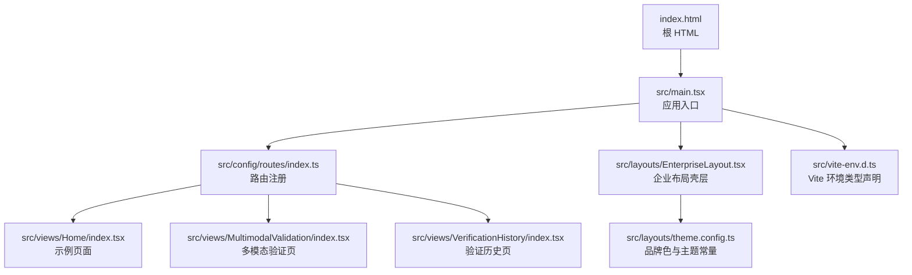
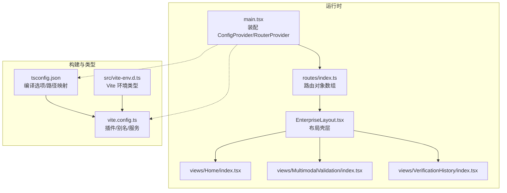
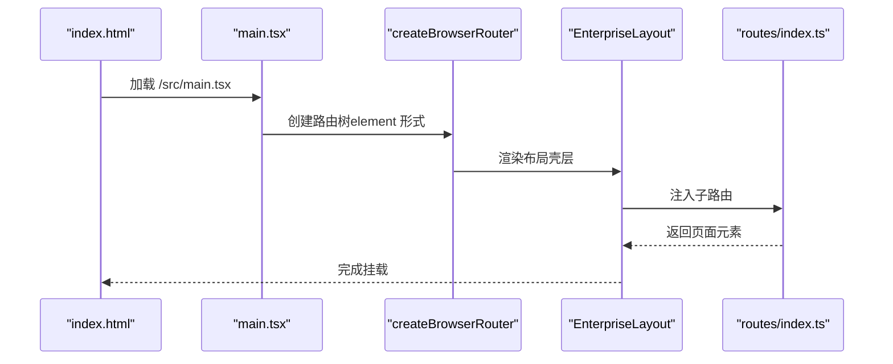
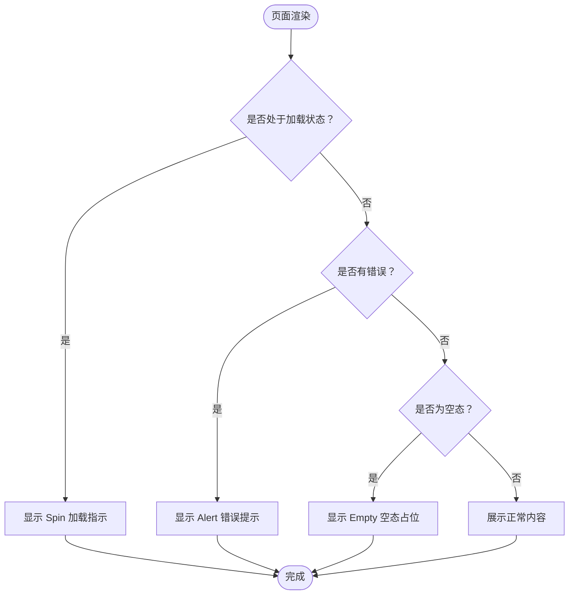
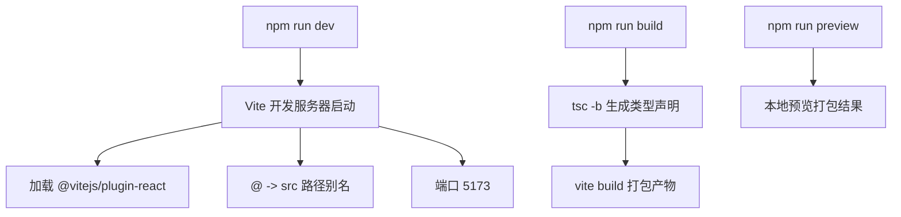
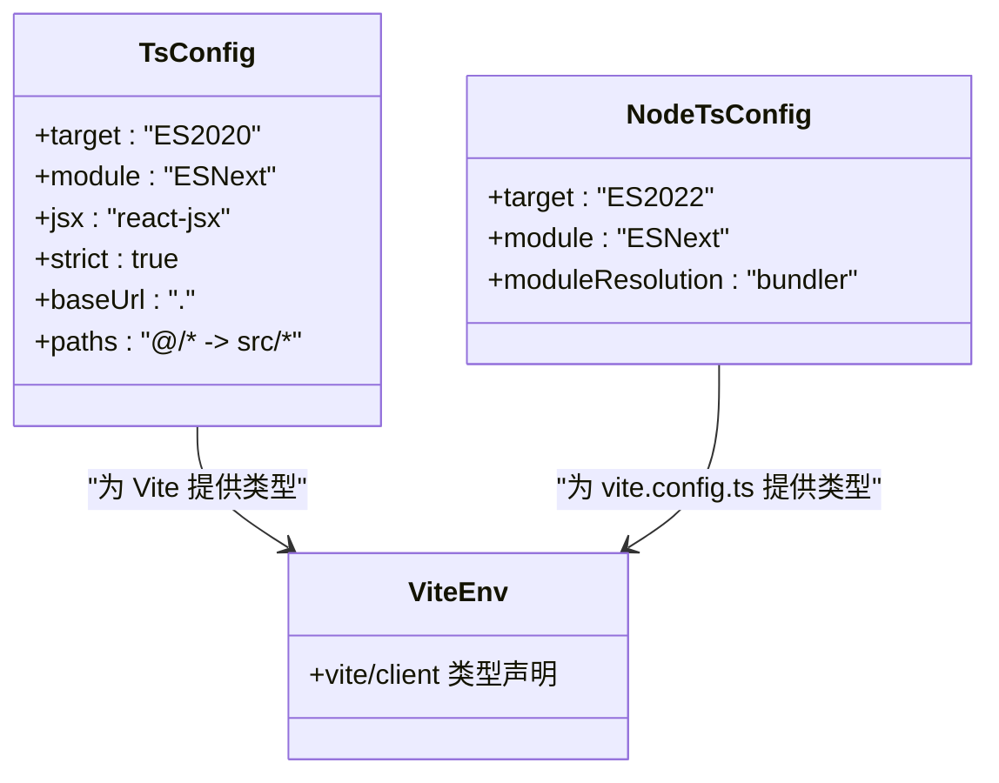
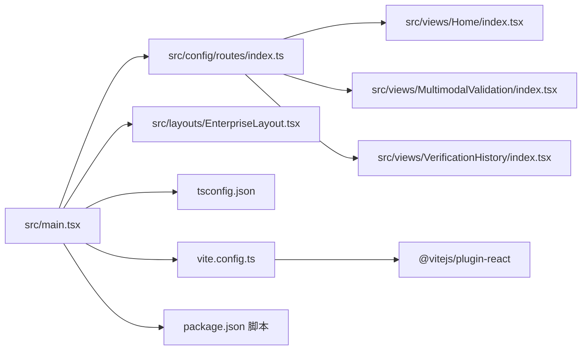

# 前端技术栈

<cite>
**本文引用的文件**
- [package.json](file://package.json)
- [vite.config.ts](file://vite.config.ts)
- [tsconfig.json](file://tsconfig.json)
- [tsconfig.node.json](file://tsconfig.node.json)
- [src/main.tsx](file://src/main.tsx)
- [src/layouts/EnterpriseLayout.tsx](file://src/layouts/EnterpriseLayout.tsx)
- [src/config/routes/index.ts](file://src/config/routes/index.ts)
- [src/views/Home/index.tsx](file://src/views/Home/index.tsx)
- [src/layouts/theme.config.ts](file://src/layouts/theme.config.ts)
- [src/vite-env.d.ts](file://src/vite-env.d.ts)
- [index.html](file://index.html)
- [project_description.md](file://project_description.md)
</cite>

## 目录
1. [引言](#引言)
2. [项目结构](#项目结构)
3. [核心组件](#核心组件)
4. [架构总览](#架构总览)
5. [详细组件分析](#详细组件分析)
6. [依赖关系分析](#依赖关系分析)
7. [性能考量](#性能考量)
8. [故障排查指南](#故障排查指南)
9. [结论](#结论)
10. [附录](#附录)

## 引言
本文件面向 APIG 项目的前端技术栈，系统阐述 React 17、TypeScript、Ant Design 4.17、Vite 等核心技术的选择原因、版本兼容性、配置要点与最佳实践。结合项目实际代码与配置文件，给出可落地的使用方式、类型系统应用、构建优化策略以及第三方依赖管理与安全注意事项。

## 项目结构
项目采用“入口 + 路由 + 布局 + 视图 + 类型声明”的组织方式，核心入口负责挂载路由与全局 UI 配置，路由集中注册，视图按模块拆分，布局提供统一壳层与主题常量，类型声明文件为 Vite 提供 TS 环境类型支持。

**图表来源**
- [index.html:1-13](file://index.html#L1-L13)
- [src/main.tsx:1-26](file://src/main.tsx#L1-L26)
- [src/config/routes/index.ts:1-26](file://src/config/routes/index.ts#L1-L26)
- [src/layouts/EnterpriseLayout.tsx:1-20](file://src/layouts/EnterpriseLayout.tsx#L1-L20)
- [src/views/Home/index.tsx:1-49](file://src/views/Home/index.tsx#L1-L49)
- [src/layouts/theme.config.ts:1-8](file://src/layouts/theme.config.ts#L1-L8)
- [src/vite-env.d.ts:1-2](file://src/vite-env.d.ts#L1-L2)

**章节来源**
- [index.html:1-13](file://index.html#L1-L13)
- [src/main.tsx:1-26](file://src/main.tsx#L1-L26)
- [src/config/routes/index.ts:1-26](file://src/config/routes/index.ts#L1-L26)
- [src/layouts/EnterpriseLayout.tsx:1-20](file://src/layouts/EnterpriseLayout.tsx#L1-L20)
- [src/views/Home/index.tsx:1-49](file://src/views/Home/index.tsx#L1-L49)
- [src/layouts/theme.config.ts:1-8](file://src/layouts/theme.config.ts#L1-L8)
- [src/vite-env.d.ts:1-2](file://src/vite-env.d.ts#L1-L2)

## 核心组件
- React 17：函数组件 + Hooks，配合 React Router v6 的 element 写法，提供简洁的路由渲染模型。
- Ant Design 4.17：提供成熟的企业级 UI 能力，包含反馈、表格、表单、弹窗等组件，并通过 ConfigProvider 设置语言与主题。
- Vite 5：基于原生 ESM 的快速开发服务器与构建工具，支持路径别名与 React 插件。
- TypeScript 5：严格模式、路径映射、模块解析策略与 JSX 转换配置，确保类型安全与开发体验。

**章节来源**
- [src/main.tsx:1-26](file://src/main.tsx#L1-L26)
- [src/layouts/EnterpriseLayout.tsx:1-20](file://src/layouts/EnterpriseLayout.tsx#L1-L20)
- [vite.config.ts:1-16](file://vite.config.ts#L1-L16)
- [tsconfig.json:1-25](file://tsconfig.json#L1-L25)

## 架构总览
前端整体采用“入口装配 + 路由驱动 + 布局壳层 + 视图模块”的分层架构。入口负责全局 Provider、国际化与路由挂载；路由集中注册页面；布局提供统一 Header/Content；视图模块承载业务页面与交互逻辑；类型声明为开发环境提供类型感知。

**图表来源**
- [src/main.tsx:1-26](file://src/main.tsx#L1-L26)
- [src/config/routes/index.ts:1-26](file://src/config/routes/index.ts#L1-L26)
- [src/layouts/EnterpriseLayout.tsx:1-20](file://src/layouts/EnterpriseLayout.tsx#L1-L20)
- [src/views/Home/index.tsx:1-49](file://src/views/Home/index.tsx#L1-L49)
- [tsconfig.json:1-25](file://tsconfig.json#L1-L25)
- [vite.config.ts:1-16](file://vite.config.ts#L1-L16)
- [src/vite-env.d.ts:1-2](file://src/vite-env.d.ts#L1-L2)

## 详细组件分析

### React 17 与路由集成
- 使用 React 17 与 React Router v6 的 element 写法集中注册路由，简化页面渲染与嵌套结构。
- 入口通过 RouterProvider 与 createBrowserRouter 组合，配合 ConfigProvider 设置语言与主题。

**图表来源**
- [index.html:1-13](file://index.html#L1-L13)
- [src/main.tsx:1-26](file://src/main.tsx#L1-L26)
- [src/config/routes/index.ts:1-26](file://src/config/routes/index.ts#L1-L26)
- [src/layouts/EnterpriseLayout.tsx:1-20](file://src/layouts/EnterpriseLayout.tsx#L1-L20)

**章节来源**
- [src/main.tsx:1-26](file://src/main.tsx#L1-L26)
- [src/config/routes/index.ts:1-26](file://src/config/routes/index.ts#L1-L26)
- [src/layouts/EnterpriseLayout.tsx:1-20](file://src/layouts/EnterpriseLayout.tsx#L1-L20)

### Ant Design 4.17 集成与主题
- 通过 ConfigProvider 设置语言为简体中文，引入全局样式文件。
- 布局壳层使用 Layout/Header/Content 组织页面结构，页面内使用 Card/Empty/Spin/Alert/Button/message 等组件演示 Loading/Empty/Feedback 场景。

**图表来源**
- [src/views/Home/index.tsx:1-49](file://src/views/Home/index.tsx#L1-L49)

**章节来源**
- [src/main.tsx:1-26](file://src/main.tsx#L1-L26)
- [src/views/Home/index.tsx:1-49](file://src/views/Home/index.tsx#L1-L49)
- [src/layouts/EnterpriseLayout.tsx:1-20](file://src/layouts/EnterpriseLayout.tsx#L1-L20)

### Vite 构建与开发服务器
- 插件：使用 @vitejs/plugin-react 提供 React JSX 转换与 HMR。
- 路径别名：通过 resolve.alias 将 @ 指向 src，提升导入可读性。
- 本地服务：默认端口 5173，便于开发调试。
- 构建命令：先执行 tsc -b 生成类型声明，再执行 vite build 进行打包。

**图表来源**
- [package.json:6-10](file://package.json#L6-L10)
- [vite.config.ts:1-16](file://vite.config.ts#L1-L16)

**章节来源**
- [package.json:6-10](file://package.json#L6-L10)
- [vite.config.ts:1-16](file://vite.config.ts#L1-L16)

### TypeScript 类型系统与编译配置
- 编译目标与模块：ES2020/ESNext，启用严格模式与 JSX 转换。
- 模块解析：bundler 模式，配合 Vite 的原生 ESM。
- 路径映射：baseUrl 与 paths 配合 Vite 的 alias，保证开发与构建一致性。
- 环境声明：src/vite-env.d.ts 为 Vite 环境提供类型支持。
- Node 配置：tsconfig.node.json 用于 vite.config.ts 的编译，采用 ESNext 与 bundler 解析。

**图表来源**
- [tsconfig.json:1-25](file://tsconfig.json#L1-L25)
- [tsconfig.node.json:1-11](file://tsconfig.node.json#L1-L11)
- [src/vite-env.d.ts:1-2](file://src/vite-env.d.ts#L1-L2)

**章节来源**
- [tsconfig.json:1-25](file://tsconfig.json#L1-L25)
- [tsconfig.node.json:1-11](file://tsconfig.node.json#L1-L11)
- [src/vite-env.d.ts:1-2](file://src/vite-env.d.ts#L1-L2)

### 第三方依赖与版本兼容性
- 核心依赖：react@17、react-dom@17、react-router-dom@6、antd@4.17.4、pdfjs-dist、mammoth。
- 开发依赖：@types/react、@types/react-dom、@types/node、@vitejs/plugin-react、typescript、vite。
- 兼容性要点：React 17 与 React Router v6 的 element 写法兼容；Ant Design 4.17 与 Vite 的按需样式与全局样式均可使用；TypeScript 5 与 Vite 的 bundler 解析协同工作。

**章节来源**
- [package.json:11-26](file://package.json#L11-L26)
- [src/main.tsx:1-26](file://src/main.tsx#L1-L26)

### 主题与品牌色配置
- 品牌主色：通过 theme.config.ts 导出常量，供布局与页面引用。
- 布局色：Header/Content/卡片背景等在布局与页面内联样式中体现。
- 设计 Token：项目基于 antd4 的颜色体系与圆角、字号等默认值，必要时可在设计系统规范中对齐。

**章节来源**
- [src/layouts/theme.config.ts:1-8](file://src/layouts/theme.config.ts#L1-L8)
- [project_description.md:103-187](file://project_description.md#L103-L187)

## 依赖关系分析
- 入口依赖：main.tsx 依赖路由注册、布局与 UI Provider。
- 路由依赖：routes/index.ts 依赖各页面组件，形成页面到路由的映射。
- 布局依赖：EnterpriseLayout 依赖 antd 的 Layout/Typography 与 react-router-dom 的 Outlet。
- 类型与构建：tsconfig.json 与 tsconfig.node.json 分别服务于应用与 Vite 配置的类型需求；vite.config.ts 与 package.json 的脚本共同决定开发与构建流程。

**图表来源**
- [src/main.tsx:1-26](file://src/main.tsx#L1-L26)
- [src/config/routes/index.ts:1-26](file://src/config/routes/index.ts#L1-L26)
- [src/layouts/EnterpriseLayout.tsx:1-20](file://src/layouts/EnterpriseLayout.tsx#L1-L20)
- [src/views/Home/index.tsx:1-49](file://src/views/Home/index.tsx#L1-L49)
- [tsconfig.json:1-25](file://tsconfig.json#L1-L25)
- [vite.config.ts:1-16](file://vite.config.ts#L1-L16)
- [package.json:6-10](file://package.json#L6-L10)

**章节来源**
- [src/main.tsx:1-26](file://src/main.tsx#L1-L26)
- [src/config/routes/index.ts:1-26](file://src/config/routes/index.ts#L1-L26)
- [src/layouts/EnterpriseLayout.tsx:1-20](file://src/layouts/EnterpriseLayout.tsx#L1-L20)
- [src/views/Home/index.tsx:1-49](file://src/views/Home/index.tsx#L1-L49)
- [tsconfig.json:1-25](file://tsconfig.json#L1-L25)
- [vite.config.ts:1-16](file://vite.config.ts#L1-L16)
- [package.json:6-10](file://package.json#L6-L10)

## 性能考量
- 构建顺序：先 tsc -b 生成类型声明，再 vite build，有助于在构建前发现类型问题，减少运行时错误。
- 模块解析：bundler 模式与 Vite 的原生 ESM 相结合，有利于 Tree Shaking 与按需加载。
- 路径别名：统一使用 @ 指向 src，降低深层相对路径带来的维护成本与拼写错误。
- 组件按需：Ant Design 4.17 支持按需引入与全局样式，建议在实际业务中结合打包分析工具评估体积。

[本节为通用性能建议，不直接分析具体文件]

## 故障排查指南
- 开发服务器端口冲突：修改 vite.config.ts 的 server.port。
- 路由不生效：检查 routes/index.ts 的 element 写法与路径配置，确保与入口 RouterProvider 的嵌套一致。
- 样式不生效：确认 main.tsx 中的 antd 全局样式引入与 ConfigProvider 的语言设置。
- 类型报错：核对 tsconfig.json 的 strict、jsx、moduleResolution 与 baseUrl/paths，确保与 Vite 的 alias 保持一致。
- 构建失败：确认 package.json 的 build 脚本顺序，先 tsc -b 再 vite build。

**章节来源**
- [vite.config.ts:12-14](file://vite.config.ts#L12-L14)
- [src/config/routes/index.ts:1-26](file://src/config/routes/index.ts#L1-L26)
- [src/main.tsx:1-26](file://src/main.tsx#L1-L26)
- [tsconfig.json:1-25](file://tsconfig.json#L1-L25)
- [package.json:8-8](file://package.json#L8-L8)

## 结论
本项目以 React 17 + Ant Design 4.17 + Vite 5 + TypeScript 5 组成的前端技术栈，实现了清晰的入口装配、集中路由注册、统一布局壳层与类型安全的开发体验。通过合理的配置与最佳实践，能够在内网环境下稳定开发与构建，并为后续接入真实后端、完善设计系统与安全加固提供坚实基础。

[本节为总结性内容，不直接分析具体文件]

## 附录
- 常用命令
  - 启动开发：npm run dev
  - 构建生产：npm run build
  - 预览构建：npm run preview
- 路径别名：@ 指向 src，便于统一导入
- 端口：5173
- 语言与主题：ConfigProvider 设置 zh_CN 与 antd 全局样式

**章节来源**
- [package.json:6-10](file://package.json#L6-L10)
- [vite.config.ts:7-14](file://vite.config.ts#L7-L14)
- [src/main.tsx:1-26](file://src/main.tsx#L1-L26)
- [project_description.md:120-127](file://project_description.md#L120-L127)