# 技术架构

<cite>
**本文引用的文件**
- [package.json](file://package.json)
- [vite.config.ts](file://vite.config.ts)
- [tsconfig.json](file://tsconfig.json)
- [index.html](file://index.html)
- [src/main.tsx](file://src/main.tsx)
- [src/config/routes/index.ts](file://src/config/routes/index.ts)
- [src/layouts/EnterpriseLayout.tsx](file://src/layouts/EnterpriseLayout.tsx)
- [src/layouts/theme.config.ts](file://src/layouts/theme.config.ts)
- [src/views/Home/index.tsx](file://src/views/Home/index.tsx)
- [src/views/MultimodalValidation/index.tsx](file://src/views/MultimodalValidation/index.tsx)
- [src/views/VerificationHistory/index.tsx](file://src/views/VerificationHistory/index.tsx)
- [project_description.md](file://project_description.md)
- [docs/context/architecture.md](file://docs/context/architecture.md)
- [docs/context/constraints.md](file://docs/context/constraints.md)
</cite>

## 目录
1. [引言](#引言)
2. [项目结构](#项目结构)
3. [核心组件](#核心组件)
4. [架构总览](#架构总览)
5. [详细组件分析](#详细组件分析)
6. [依赖分析](#依赖分析)
7. [性能考量](#性能考量)
8. [故障排查指南](#故障排查指南)
9. [结论](#结论)
10. [附录](#附录)

## 引言
本技术架构文档面向 APIG 项目，聚焦于 React 17 + Ant Design 4.17 的前端体系在内网隔离环境下的整体设计与实现。系统采用 Vite 构建工具，结合 React Router v6 实现路由控制，Ant Design 4 提供企业级 UI 能力，页面围绕“输入/输出多模态内容安全检测”与“验证历史追溯”两大主线展开。本文从系统边界、模块交互、数据流、技术决策与约束、基础设施与可扩展性、部署拓扑、跨领域关注点（安全、监控、灾备）等方面进行全面阐述。

## 项目结构
项目采用“按功能域划分”的组织方式，核心目录与职责如下：
- src/main.tsx：应用入口，负责挂载 ConfigProvider、RouterProvider 与全局路由树。
- src/config/routes/index.ts：集中式路由注册，统一对外暴露 RouteObject 数组。
- src/layouts/EnterpriseLayout.tsx：企业级布局壳层，承载 Header 与 Content，并通过 Outlet 渲染子路由页面。
- src/layouts/theme.config.ts：品牌与主题常量沉淀，支撑布局与页面风格一致性。
- src/views/*：页面集合，包含 Home（示例交互）、MultimodalValidation（多模态检测）、VerificationHistory（历史记录）。
- vite.config.ts：构建与开发服务器配置，含路径别名与端口设置。
- tsconfig.json：TypeScript 编译选项，启用严格模式与 JSX 转换。
- index.html：HTML 入口模板，挂载 #root 容器与入口脚本。

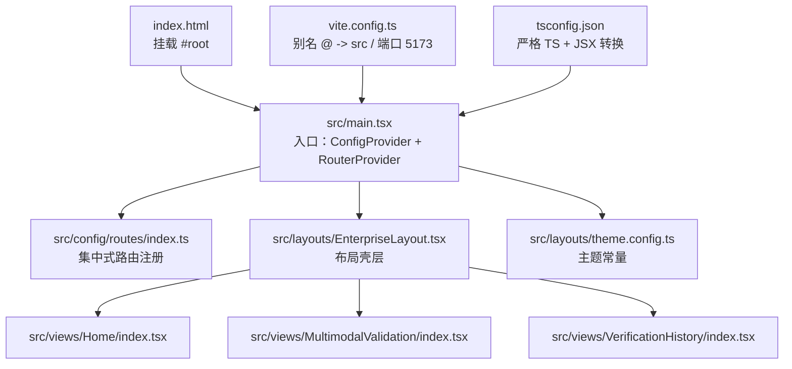

图表来源
- [index.html:1-13](file://index.html#L1-L13)
- [src/main.tsx:1-26](file://src/main.tsx#L1-L26)
- [src/config/routes/index.ts:1-26](file://src/config/routes/index.ts#L1-L26)
- [src/layouts/EnterpriseLayout.tsx:1-20](file://src/layouts/EnterpriseLayout.tsx#L1-L20)
- [src/layouts/theme.config.ts:1-8](file://src/layouts/theme.config.ts#L1-L8)
- [src/views/Home/index.tsx:1-49](file://src/views/Home/index.tsx#L1-L49)
- [src/views/MultimodalValidation/index.tsx:1-546](file://src/views/MultimodalValidation/index.tsx#L1-L546)
- [src/views/VerificationHistory/index.tsx:1-603](file://src/views/VerificationHistory/index.tsx#L1-L603)
- [vite.config.ts:1-16](file://vite.config.ts#L1-L16)
- [tsconfig.json:1-25](file://tsconfig.json#L1-L25)

章节来源
- [project_description.md:13-27](file://project_description.md#L13-L27)
- [docs/context/architecture.md:3-30](file://docs/context/architecture.md#L3-L30)
- [vite.config.ts:5-15](file://vite.config.ts#L5-L15)
- [tsconfig.json:1-25](file://tsconfig.json#L1-L25)
- [index.html:1-13](file://index.html#L1-L13)

## 核心组件
- 应用入口与全局配置
  - main.tsx：创建浏览器端路由实例，包裹 ConfigProvider 与 RouterProvider，注入 zh_CN 语言包，挂载到 #root。
  - theme.config.ts：定义企业主题主色等常量，供布局与页面引用。
- 路由系统
  - routes/index.ts：集中注册三类页面路由，使用 React Router v6 的 element 写法，便于与下游技能对齐。
- 布局系统
  - EnterpriseLayout.tsx：最小企业布局骨架，Header 固定深蓝背景，Content 区域承载 Outlet 子页面。
- 页面视图
  - Home：演示 Loading/Empty/Error/Feedback 的交互闭环。
  - MultimodalValidation：多模态输入/输出检测，支持图片与文档上传、OCR 文本提取、请求 mock 回退与结果展示。
  - VerificationHistory：历史记录查询、筛选、详情弹窗与原始 JSON 导出。

章节来源
- [src/main.tsx:11-25](file://src/main.tsx#L11-L25)
- [src/layouts/theme.config.ts:5-7](file://src/layouts/theme.config.ts#L5-L7)
- [src/config/routes/index.ts:12-25](file://src/config/routes/index.ts#L12-L25)
- [src/layouts/EnterpriseLayout.tsx:8-19](file://src/layouts/EnterpriseLayout.tsx#L8-L19)
- [src/views/Home/index.tsx:4-49](file://src/views/Home/index.tsx#L4-L49)
- [src/views/MultimodalValidation/index.tsx:183-546](file://src/views/MultimodalValidation/index.tsx#L183-L546)
- [src/views/VerificationHistory/index.tsx:94-603](file://src/views/VerificationHistory/index.tsx#L94-L603)

## 架构总览
系统采用“入口 + 路由 + 布局 + 页面 + 主题”的分层架构，核心交互链路如下：
- 入口挂载 ConfigProvider 与 RouterProvider，形成全局上下文与路由容器。
- 路由注册集中于 routes/index.ts，统一由入口引用，保证路由契约稳定。
- 布局 EnterpriseLayout 作为壳层，承载页面内容并通过 Outlet 渲染具体视图。
- 页面内部通过 Ant Design 组件与本地状态管理实现交互，部分页面集成第三方库（mammoth、pdfjs-dist）实现文档 OCR。
- 主题常量在 theme.config.ts 中沉淀，贯穿布局与页面风格。

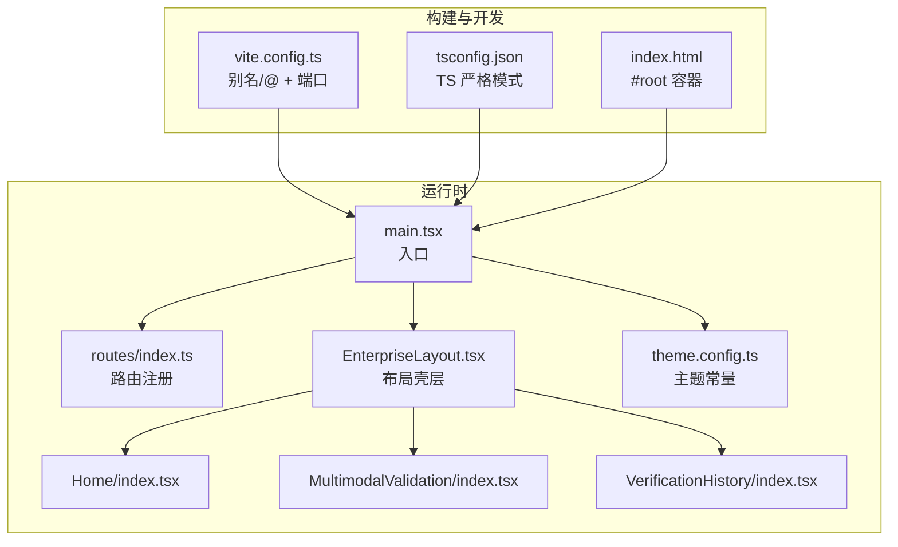

图表来源
- [src/main.tsx:11-25](file://src/main.tsx#L11-L25)
- [src/config/routes/index.ts:12-25](file://src/config/routes/index.ts#L12-L25)
- [src/layouts/EnterpriseLayout.tsx:8-19](file://src/layouts/EnterpriseLayout.tsx#L8-L19)
- [src/layouts/theme.config.ts:5-7](file://src/layouts/theme.config.ts#L5-L7)
- [vite.config.ts:7-15](file://vite.config.ts#L7-L15)
- [tsconfig.json:14-22](file://tsconfig.json#L14-L22)
- [index.html:8-12](file://index.html#L8-L12)

## 详细组件分析

### 入口与全局配置（main.tsx）
- 责任边界
  - 创建浏览器端路由实例，注入 zh_CN 语言包，包裹 RouterProvider。
  - 以 EnterpriseLayout 为根布局，children 为集中式路由数组。
- 关键交互
  - ConfigProvider(locale) 为全局组件提供本地化能力。
  - RouterProvider(router) 作为路由容器，承载所有页面切换。
- 错误处理与健壮性
  - 通过 StrictMode 包裹，提升开发期异常暴露概率。
  - 路由失败由 React Router v6 默认兜底，页面层面通过状态与反馈组件呈现。

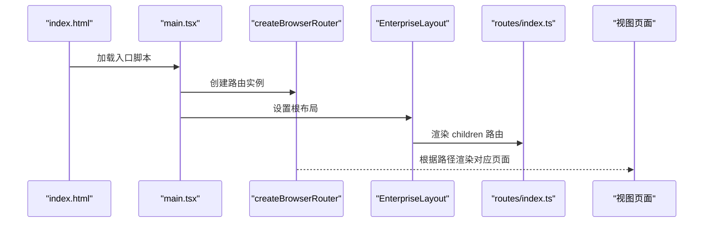

图表来源
- [index.html:8-12](file://index.html#L8-L12)
- [src/main.tsx:11-25](file://src/main.tsx#L11-L25)
- [src/config/routes/index.ts:12-25](file://src/config/routes/index.ts#L12-L25)
- [src/layouts/EnterpriseLayout.tsx:8-19](file://src/layouts/EnterpriseLayout.tsx#L8-L19)

章节来源
- [src/main.tsx:11-25](file://src/main.tsx#L11-L25)
- [index.html:8-12](file://index.html#L8-L12)

### 路由配置（routes/index.ts）
- 路由注册
  - 集中式导出路由对象数组，包含首页、多模态验证、验证历史三个页面。
  - 使用 element 字段，与 React Router v6 的“element/component 自适配”保持一致。
- 可扩展性
  - 新增页面只需在该文件追加 RouteObject，无需改动入口或其他模块。
  - 下游技能可自动识别 element 写法，便于路由契约对齐。

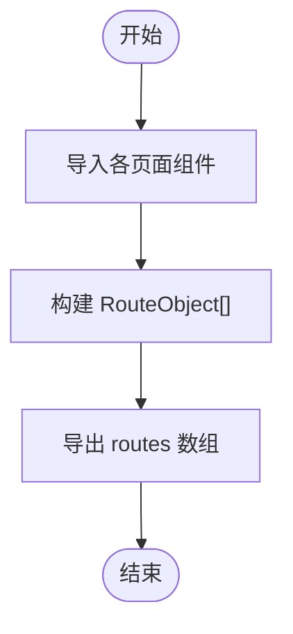

图表来源
- [src/config/routes/index.ts:12-25](file://src/config/routes/index.ts#L12-L25)

章节来源
- [src/config/routes/index.ts:8-25](file://src/config/routes/index.ts#L8-L25)
- [docs/context/architecture.md:8-10](file://docs/context/architecture.md#L8-L10)

### 布局系统（EnterpriseLayout.tsx）
- 结构与职责
  - Header：深蓝色背景，承载标题文案，体现企业风格。
  - Content：承载 Outlet，作为页面渲染区域。
- 主题与品牌
  - 主色调来源于 theme.config.ts，确保与设计系统对齐。
- 可替换性
  - 当前为最小壳层，后续可替换为完整企业布局骨架。

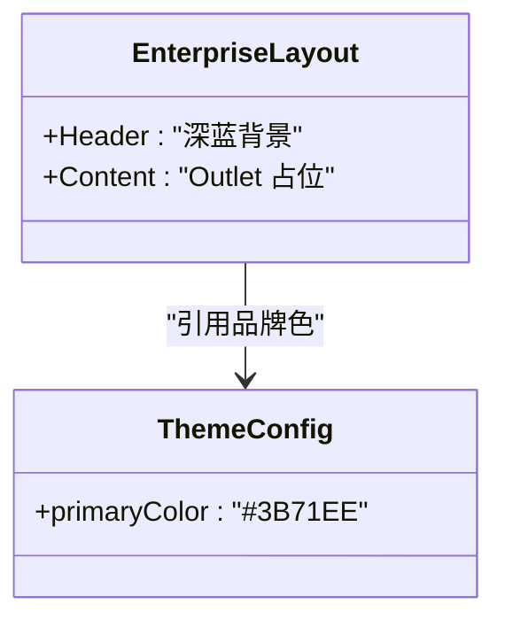

图表来源
- [src/layouts/EnterpriseLayout.tsx:8-19](file://src/layouts/EnterpriseLayout.tsx#L8-L19)
- [src/layouts/theme.config.ts:5-7](file://src/layouts/theme.config.ts#L5-L7)

章节来源
- [src/layouts/EnterpriseLayout.tsx:7-19](file://src/layouts/EnterpriseLayout.tsx#L7-L19)
- [src/layouts/theme.config.ts:1-8](file://src/layouts/theme.config.ts#L1-L8)

### 主题配置（theme.config.ts）
- 作用
  - 沉淀品牌主色等常量，供布局与页面引用，避免硬编码。
- 与 Ant Design 4 的关系
  - Ant Design 4 无 v5 Design Token 机制，主题定制可通过 LESS 变量、CSS 自定义属性或 ConfigProvider 的 theme 配置（有限支持）实现。

章节来源
- [src/layouts/theme.config.ts:1-8](file://src/layouts/theme.config.ts#L1-L8)
- [docs/context/constraints.md:15-18](file://docs/context/constraints.md#L15-L18)

### 页面组件

#### Home（示例交互）
- 功能要点
  - 通过本地状态模拟 Loading/Empty/Error/Feedback，演示 antd4 组件组合。
- 交互流程
  - 点击按钮触发异步流程，根据状态切换不同 UI 片段。

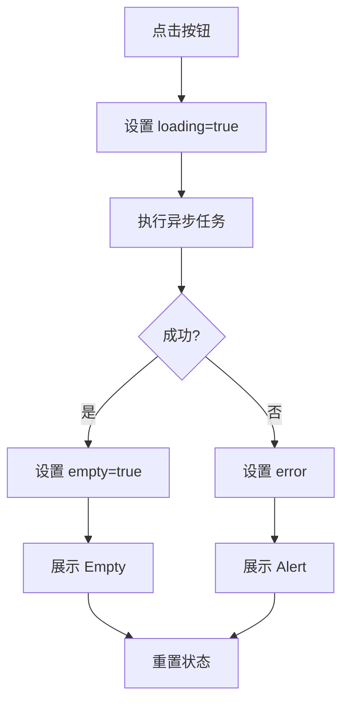

图表来源
- [src/views/Home/index.tsx:9-22](file://src/views/Home/index.tsx#L9-L22)

章节来源
- [src/views/Home/index.tsx:4-49](file://src/views/Home/index.tsx#L4-L49)

#### MultimodalValidation（多模态验证）
- 功能要点
  - 支持图片（PNG/JPG/GIF）与文档（DOCX/DOC/PDF）上传。
  - 图片转 Base64 dataURL；文档通过 mammoth/pdfjs-dist 提取文本。
  - 输入检测与输出检测接口调用，失败时回退至 mock 数据。
  - 输出检测依赖输入检测返回的 requestId。
- 数据流
  - 用户输入 → 组装消息数组 → 调用输入检测接口 → 成功则获取 requestId → 调用输出检测接口 → 展示结果或错误。
- 第三方库
  - mammoth：DOCX 文本提取。
  - pdfjs-dist：PDF 文本提取（worker 配置在内网可能需要本地化）。

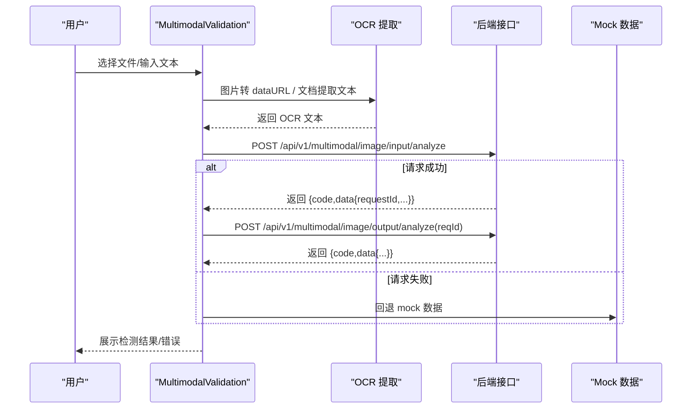

图表来源
- [src/views/MultimodalValidation/index.tsx:199-398](file://src/views/MultimodalValidation/index.tsx#L199-L398)
- [src/views/MultimodalValidation/index.tsx:42-58](file://src/views/MultimodalValidation/index.tsx#L42-L58)
- [src/views/MultimodalValidation/index.tsx:106-139](file://src/views/MultimodalValidation/index.tsx#L106-L139)
- [src/views/MultimodalValidation/index.tsx:141-164](file://src/views/MultimodalValidation/index.tsx#L141-L164)

章节来源
- [src/views/MultimodalValidation/index.tsx:183-546](file://src/views/MultimodalValidation/index.tsx#L183-L546)
- [docs/context/architecture.md:20-24](file://docs/context/architecture.md#L20-L24)
- [docs/context/constraints.md:35-41](file://docs/context/constraints.md#L35-L41)

#### VerificationHistory（验证历史）
- 功能要点
  - Tab 切换多模态验证与文本检测两类记录。
  - 表格展示验证时间、完成时间、检测内容、方向、合规状态、MD5、违规类型、任务状态。
  - 支持按文件名/MD5 搜索；详情弹窗展示完整检测结果与原始 JSON 下载。
- 交互流程
  - 输入搜索关键词 → 触发搜索请求（当前为模拟）→ 更新表格数据 → 无数据时展示 Empty。

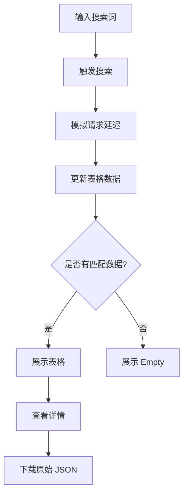

图表来源
- [src/views/VerificationHistory/index.tsx:455-467](file://src/views/VerificationHistory/index.tsx#L455-L467)
- [src/views/VerificationHistory/index.tsx:374-378](file://src/views/VerificationHistory/index.tsx#L374-L378)
- [src/views/VerificationHistory/index.tsx:543-599](file://src/views/VerificationHistory/index.tsx#L543-L599)

章节来源
- [src/views/VerificationHistory/index.tsx:94-603](file://src/views/VerificationHistory/index.tsx#L94-L603)

## 依赖分析
- 运行时依赖
  - react@17、react-dom@17：UI 渲染与生命周期管理。
  - react-router-dom@6：浏览器端路由控制。
  - antd@4.17.4：企业级 UI 组件库。
  - mammoth：DOCX 文本提取。
  - pdfjs-dist：PDF 文本提取。
- 开发依赖
  - vite@5：构建与开发服务器。
  - @vitejs/plugin-react：React HMR 与 JSX 转换。
  - typescript、@types/react、@types/react-dom：类型声明。
- 路径别名与端口
  - vite.config.ts 配置 @ → src，便于模块导入。
  - 开发端口 5173，符合内网交付约定。

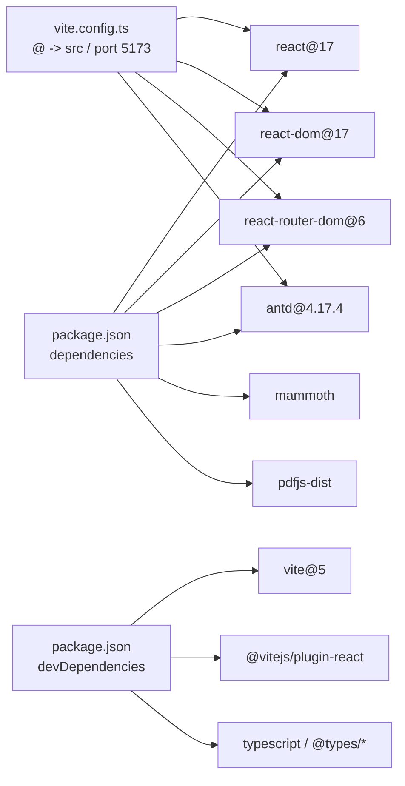

图表来源
- [package.json:11-26](file://package.json#L11-L26)
- [vite.config.ts:7-15](file://vite.config.ts#L7-L15)

章节来源
- [package.json:11-26](file://package.json#L11-L26)
- [vite.config.ts:5-15](file://vite.config.ts#L5-L15)
- [docs/context/architecture.md:31-40](file://docs/context/architecture.md#L31-L40)

## 性能考量
- 构建与打包
  - 使用 Vite 的原生 ES 模块与按需编译，减少冷启动与热更新开销。
  - TypeScript 严格模式与 noEmit 配置，降低运行时体积与类型检查成本。
- 运行时优化
  - 页面内组件按需引入，避免全量引入导致的包体膨胀。
  - 多模态页面的 OCR 与网络请求采用异步与状态管理，避免阻塞 UI。
- 内网环境
  - pdfjs-dist worker 配置需在内网本地化，减少外部资源加载失败风险。
  - 依赖安装建议使用内网镜像或离线包，保障构建稳定性。

[本节为通用指导，不直接分析具体文件]

## 故障排查指南
- 路由与入口
  - 若页面不显示，请检查 main.tsx 中 RouterProvider 与 EnterpriseLayout 的组合是否正确，以及 routes/index.ts 的导出是否为 RouteObject[]。
- 多模态验证
  - OCR 失败：DOC/DOCX 解析不稳定，优先尝试 DOCX；PDF 需确保 worker 资源可访问。
  - 接口失败：当前会回退 mock，若需真实联调，检查后端可达性与接口契约。
- 验证历史
  - 搜索无结果：确认搜索关键词大小写与匹配逻辑，或检查模拟请求是否正常完成。
- 主题与样式
  - antd4 无 v5 token：通过 ConfigProvider theme 或 CSS 变量覆盖实现主题定制。

章节来源
- [src/main.tsx:11-25](file://src/main.tsx#L11-L25)
- [src/config/routes/index.ts:12-25](file://src/config/routes/index.ts#L12-L25)
- [src/views/MultimodalValidation/index.tsx:292-298](file://src/views/MultimodalValidation/index.tsx#L292-L298)
- [docs/context/constraints.md:5-7](file://docs/context/constraints.md#L5-L7)

## 结论
APIG 项目以 React 17 + Ant Design 4.17 为基础，结合 Vite 构建体系，在内网隔离环境下实现了清晰的模块边界与稳定的交互流程。通过集中式路由注册、企业级布局壳层与主题常量沉淀，系统具备良好的可维护性与可扩展性。后续可在接入真实后端接口、完善权限与认证、补齐测试体系、对齐设计系统 Token 与组件库规范等方面持续演进。

[本节为总结性内容，不直接分析具体文件]

## 附录

### 系统上下文图
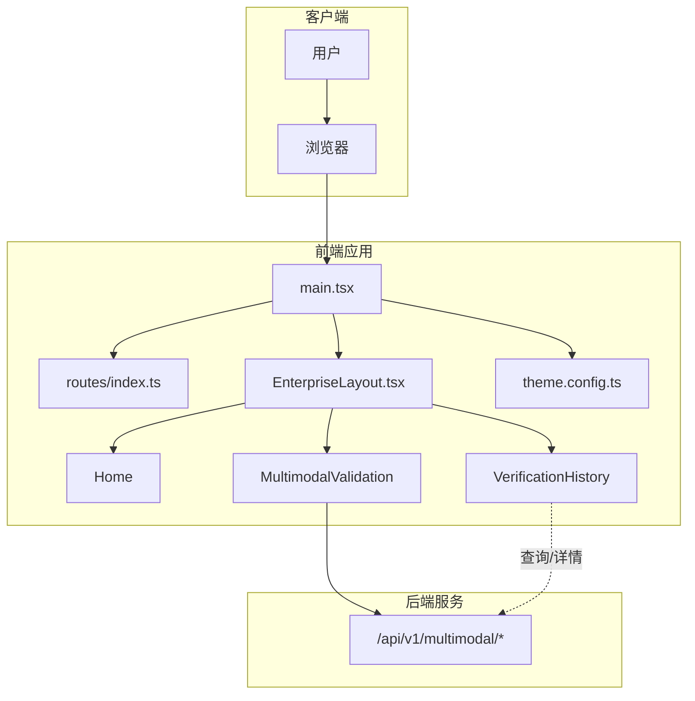

图表来源
- [src/main.tsx:11-25](file://src/main.tsx#L11-L25)
- [src/config/routes/index.ts:12-25](file://src/config/routes/index.ts#L12-L25)
- [src/layouts/EnterpriseLayout.tsx:8-19](file://src/layouts/EnterpriseLayout.tsx#L8-L19)
- [src/layouts/theme.config.ts:5-7](file://src/layouts/theme.config.ts#L5-L7)
- [src/views/MultimodalValidation/index.tsx:280-298](file://src/views/MultimodalValidation/index.tsx#L280-L298)
- [src/views/VerificationHistory/index.tsx:543-599](file://src/views/VerificationHistory/index.tsx#L543-L599)

### 组件分解图（代码级）
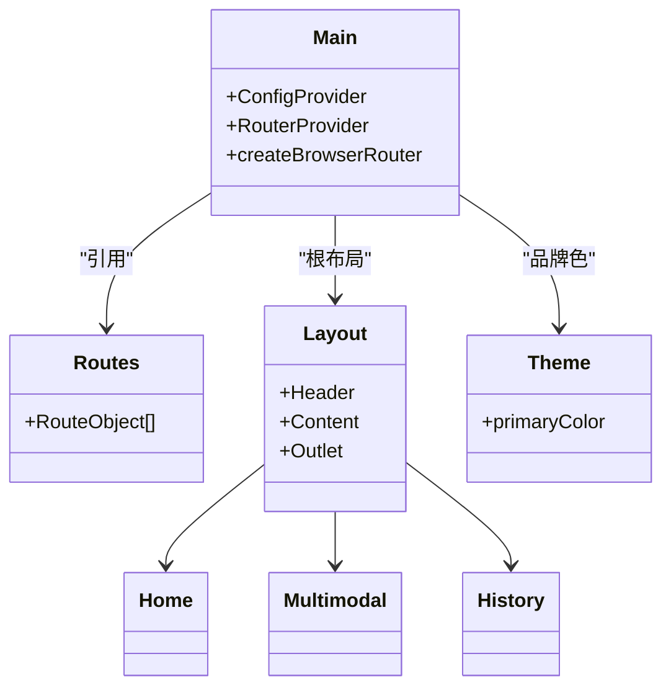

图表来源
- [src/main.tsx:11-25](file://src/main.tsx#L11-L25)
- [src/config/routes/index.ts:12-25](file://src/config/routes/index.ts#L12-L25)
- [src/layouts/EnterpriseLayout.tsx:8-19](file://src/layouts/EnterpriseLayout.tsx#L8-L19)
- [src/layouts/theme.config.ts:5-7](file://src/layouts/theme.config.ts#L5-L7)
- [src/views/Home/index.tsx:4-49](file://src/views/Home/index.tsx#L4-L49)
- [src/views/MultimodalValidation/index.tsx:183-546](file://src/views/MultimodalValidation/index.tsx#L183-L546)
- [src/views/VerificationHistory/index.tsx:94-603](file://src/views/VerificationHistory/index.tsx#L94-L603)

### 技术栈与版本兼容性
- React 17 + Ant Design 4.17：稳定生态与广泛兼容性，适合内网环境。
- React Router v6：现代路由模型，element 写法与下游技能对齐。
- Vite 5：快速开发与构建体验，支持按需编译与 HMR。
- TypeScript：严格类型检查，提升代码质量与可维护性。
- 第三方库：mammoth（DOCX）、pdfjs-dist（PDF）需在内网环境本地化 worker。

章节来源
- [package.json:11-26](file://package.json#L11-L26)
- [docs/context/architecture.md:31-40](file://docs/context/architecture.md#L31-L40)
- [docs/context/constraints.md:5-7](file://docs/context/constraints.md#L5-L7)

### 基础设施需求与部署拓扑
- 开发环境
  - Node.js（npm/pnpm/yarn 任选，以内网镜像为准）。
  - Vite 开发服务器，默认端口 5173。
  - 路径别名 @ → src，便于模块导入。
- 生产构建
  - tsc -b && vite build：先类型检查，再构建产物。
  - 预览：vite preview。
- 部署拓扑（概念示意）
  - 前端静态资源部署至 Web 服务器或 CDN。
  - 后端接口通过反向代理暴露，前端通过相对路径调用。
  - 内网环境需确保 pdfjs-dist worker 资源可访问或本地化。

章节来源
- [project_description.md:28-37](file://project_description.md#L28-L37)
- [vite.config.ts:12-15](file://vite.config.ts#L12-L15)
- [docs/context/architecture.md:41-46](file://docs/context/architecture.md#L41-L46)

### 跨领域关注点
- 安全
  - 多模态检测涉及敏感内容（身份证、合同等），需注意数据隐私与传输加密。
  - 接口失败回退至 mock 可能掩盖真实问题，建议在联调阶段关闭回退或增强日志。
- 监控
  - 建议在关键页面埋点（进入/离开、按钮点击、接口耗时），结合浏览器性能 API 与后端日志。
- 灾难恢复
  - 前端构建产物具备缓存与回滚策略，后端接口需具备降级与熔断能力。

章节来源
- [docs/context/constraints.md:54-58](file://docs/context/constraints.md#L54-L58)
- [src/views/MultimodalValidation/index.tsx:292-298](file://src/views/MultimodalValidation/index.tsx#L292-L298)