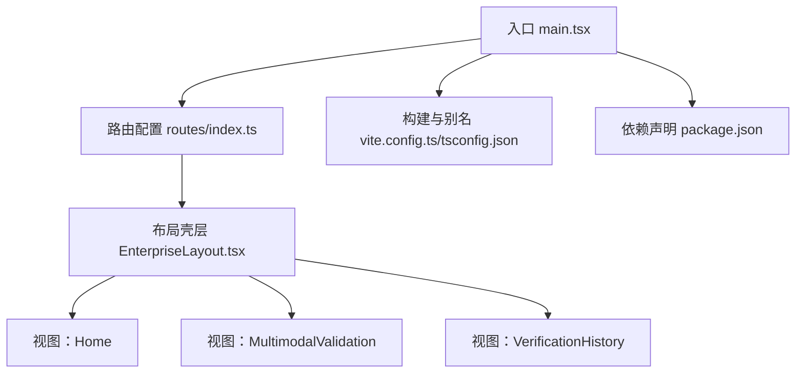
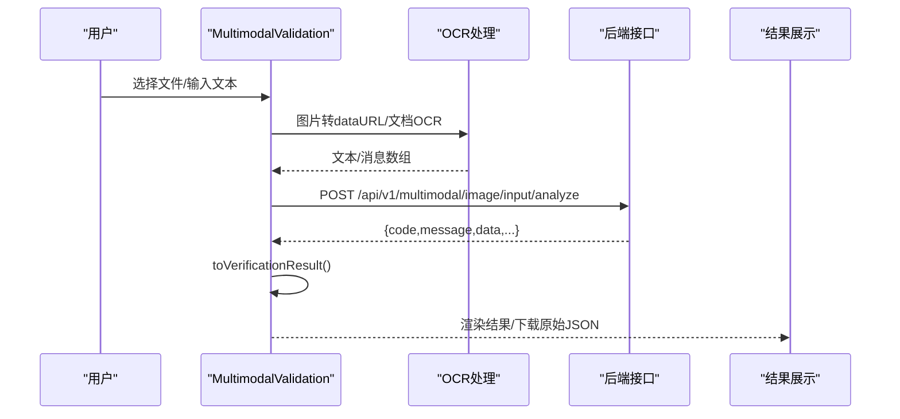
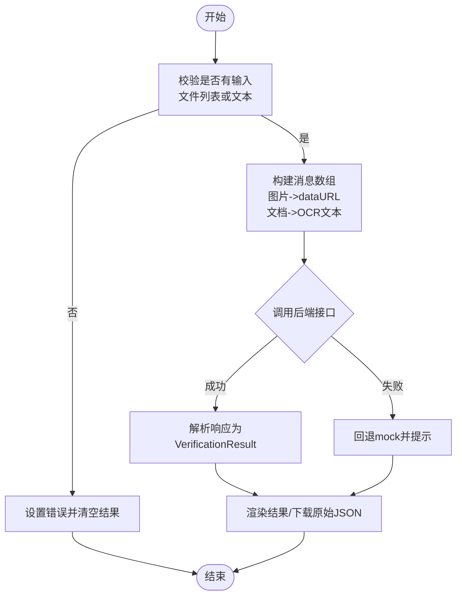
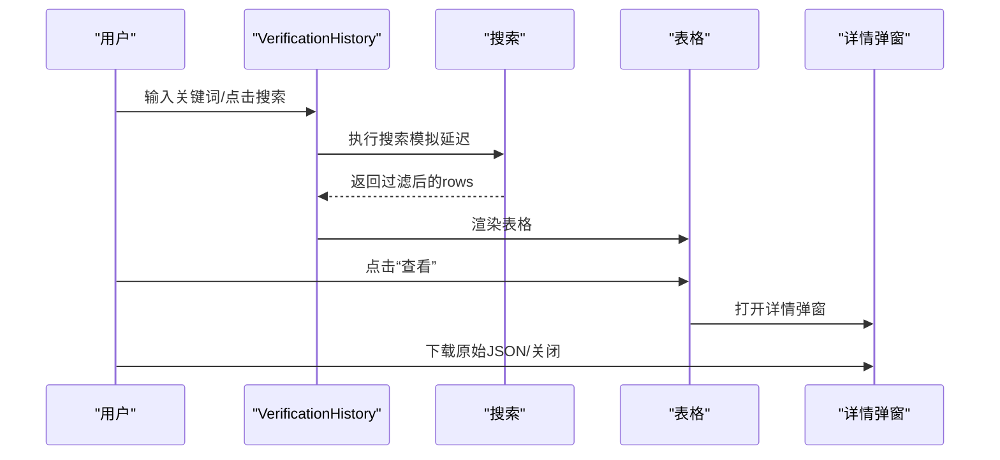
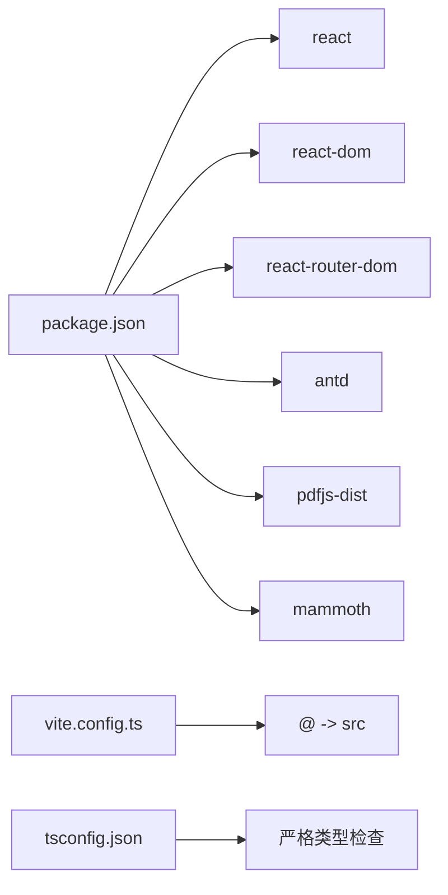

# 数据流设计

<cite>
**本文引用的文件**
- [src/main.tsx](file://src/main.tsx)
- [src/config/routes/index.ts](file://src/config/routes/index.ts)
- [src/layouts/EnterpriseLayout.tsx](file://src/layouts/EnterpriseLayout.tsx)
- [src/views/Home/index.tsx](file://src/views/Home/index.tsx)
- [src/views/MultimodalValidation/index.tsx](file://src/views/MultimodalValidation/index.tsx)
- [src/views/VerificationHistory/index.tsx](file://src/views/VerificationHistory/index.tsx)
- [package.json](file://package.json)
- [vite.config.ts](file://vite.config.ts)
- [tsconfig.json](file://tsconfig.json)
- [project_description.md](file://project_description.md)
</cite>

## 目录
1. [简介](#简介)
2. [项目结构](#项目结构)
3. [核心组件](#核心组件)
4. [架构总览](#架构总览)
5. [详细组件分析](#详细组件分析)
6. [依赖关系分析](#依赖关系分析)
7. [性能考量](#性能考量)
8. [故障排查指南](#故障排查指南)
9. [结论](#结论)
10. [附录](#附录)

## 简介
本文件面向APIG项目，聚焦“数据流设计”。文档从用户输入到API调用的数据转换过程入手，覆盖文件上传、OCR处理与结果展示；解释状态提升、单向数据流与状态持久化策略；阐述异步数据处理、错误处理与加载状态管理；记录数据模型定义、接口规范与数据验证规则；并提供数据流图与状态变化示例，帮助开发者与产品人员快速理解与演进系统。

## 项目结构
项目采用React 17 + antd 4.17 + Vite的前端技术栈，页面按功能拆分为三个视图：首页（Home）、多模态验证（MultimodalValidation）、验证历史（VerificationHistory）。路由集中注册，统一通过布局壳层渲染。

图表来源
- [src/main.tsx:1-26](file://src/main.tsx#L1-L26)
- [src/config/routes/index.ts:1-26](file://src/config/routes/index.ts#L1-L26)
- [src/layouts/EnterpriseLayout.tsx:1-20](file://src/layouts/EnterpriseLayout.tsx#L1-L20)
- [src/views/Home/index.tsx:1-49](file://src/views/Home/index.tsx#L1-L49)
- [src/views/MultimodalValidation/index.tsx:1-546](file://src/views/MultimodalValidation/index.tsx#L1-L546)
- [src/views/VerificationHistory/index.tsx:1-603](file://src/views/VerificationHistory/index.tsx#L1-L603)
- [vite.config.ts:1-16](file://vite.config.ts#L1-L16)
- [tsconfig.json:1-25](file://tsconfig.json#L1-L25)
- [package.json:1-28](file://package.json#L1-L28)

章节来源
- [src/main.tsx:1-26](file://src/main.tsx#L1-L26)
- [src/config/routes/index.ts:1-26](file://src/config/routes/index.ts#L1-L26)
- [src/layouts/EnterpriseLayout.tsx:1-20](file://src/layouts/EnterpriseLayout.tsx#L1-L20)
- [vite.config.ts:1-16](file://vite.config.ts#L1-L16)
- [tsconfig.json:1-25](file://tsconfig.json#L1-L25)
- [package.json:1-28](file://package.json#L1-L28)
- [project_description.md:13-27](file://project_description.md#L13-L27)

## 核心组件
- 入口与路由
  - 入口文件负责创建BrowserRouter并挂载ConfigProvider与RouterProvider，统一语言环境与UI主题。
  - 路由集中注册Home、MultimodalValidation、VerificationHistory三类页面。
- 布局壳层
  - 提供统一Header与Content区域，承载各页面内容。
- 视图组件
  - Home：演示Loading/Empty/Feedback状态切换。
  - MultimodalValidation：文件上传（图片/文档）、OCR文本抽取、输入/输出检测、结果展示与原始JSON下载。
  - VerificationHistory：历史记录表格、搜索过滤、详情弹窗与原始JSON下载。

章节来源
- [src/main.tsx:1-26](file://src/main.tsx#L1-L26)
- [src/config/routes/index.ts:1-26](file://src/config/routes/index.ts#L1-L26)
- [src/layouts/EnterpriseLayout.tsx:1-20](file://src/layouts/EnterpriseLayout.tsx#L1-L20)
- [src/views/Home/index.tsx:1-49](file://src/views/Home/index.tsx#L1-L49)
- [src/views/MultimodalValidation/index.tsx:1-546](file://src/views/MultimodalValidation/index.tsx#L1-L546)
- [src/views/VerificationHistory/index.tsx:1-603](file://src/views/VerificationHistory/index.tsx#L1-L603)

## 架构总览
系统采用“单向数据流”：用户交互触发状态变更，状态驱动UI渲染；异步API调用与本地计算（OCR）均通过状态回写实现UI更新。文件上传与OCR处理在前端完成，随后将消息体（messages）提交至后端接口；后端返回统一结构，前端解析为VerificationResult并渲染。

图表来源
- [src/views/MultimodalValidation/index.tsx:199-298](file://src/views/MultimodalValidation/index.tsx#L199-L298)
- [src/views/MultimodalValidation/index.tsx:300-343](file://src/views/MultimodalValidation/index.tsx#L300-L343)
- [src/views/MultimodalValidation/index.tsx:60-85](file://src/views/MultimodalValidation/index.tsx#L60-L85)

章节来源
- [src/views/MultimodalValidation/index.tsx:199-343](file://src/views/MultimodalValidation/index.tsx#L199-L343)
- [project_description.md:23-26](file://project_description.md#L23-L26)

## 详细组件分析

### 多模态验证（MultimodalValidation）数据流
- 输入与状态
  - 状态包括：方向（输入/输出）、文本输入、文件列表、验证中、错误、结果对象。
  - 状态提升：所有状态集中在组件内部，通过useState与useMemo管理。
- 文件上传与OCR
  - 支持扩展名：.png/.jpg/.jpeg/.gif/.docx/.doc/.pdf。
  - 图片：使用FileReader转为dataURL；文档：根据扩展名选择OCR路径（pdf使用pdfjs，docx/doc使用mammoth）。
  - OCR失败时降级提示并继续流程。
- 请求构造与调用
  - 输入检测：构造messages数组，包含image_url或text条目，附加文件名与大小；调用输入检测接口；若后端失败则回退mock。
  - 输出检测：先执行输入检测获取requestId，再调用输出检测接口；同样支持回退mock。
- 结果解析与展示
  - 统一解析函数将后端响应映射为VerificationResult，包含安全状态、命中类型、动作、请求ID、原始数据等。
  - 支持下载原始JSON，便于调试与审计。
- 错误与加载
  - 加载：verifying控制；错误：error；空态：result为空且非verifying。
  - API失败时提示并回退mock，保证UI可继续演示。

图表来源
- [src/views/MultimodalValidation/index.tsx:199-343](file://src/views/MultimodalValidation/index.tsx#L199-L343)
- [src/views/MultimodalValidation/index.tsx:60-85](file://src/views/MultimodalValidation/index.tsx#L60-L85)

章节来源
- [src/views/MultimodalValidation/index.tsx:1-546](file://src/views/MultimodalValidation/index.tsx#L1-L546)
- [project_description.md:23-26](file://project_description.md#L23-L26)

### 验证历史（VerificationHistory）数据流
- 数据模型
  - 行模型包含：id、验证时间、完成时间、内容摘要、方向（入/出）、是否合规、MD5、违规类型列表、任务状态、请求ID、动作、命中类型、二级类型、内容描述、原始数据。
- 搜索与过滤
  - 支持按内容摘要或MD5模糊搜索；搜索触发时显示加载状态，失败时展示错误与重试。
- 列表渲染
  - 使用Table展示，列包含方向、合规性、MD5、违规类型、任务状态与查看按钮。
  - 违规类型超过一定数量时，仅展示前两项并用Tooltip展示全部。
- 详情弹窗
  - 点击“查看”打开Modal，展示安全状态、命中类型、二级类型、检测方向、内容描述与原始JSON下载。
- 状态管理
  - mode（multimodal/text）、search、loading、error、detailVisible、detailRow等状态集中管理。

图表来源
- [src/views/VerificationHistory/index.tsx:94-603](file://src/views/VerificationHistory/index.tsx#L94-L603)

章节来源
- [src/views/VerificationHistory/index.tsx:1-603](file://src/views/VerificationHistory/index.tsx#L1-L603)

### 首页（Home）数据流
- 状态管理
  - loading、error、empty三态切换，演示Loading/Empty/Feedback。
- 交互
  - 点击按钮触发异步加载，模拟成功/失败分支，最终回到对应UI状态。

章节来源
- [src/views/Home/index.tsx:1-49](file://src/views/Home/index.tsx#L1-L49)

## 依赖关系分析
- 运行时依赖
  - react、react-dom、react-router-dom、antd、pdfjs-dist、mammoth。
- 构建与别名
  - Vite插件与路径别名@指向src，便于模块导入。
- 类型与严格性
  - TypeScript启用严格模式，减少运行时隐患。

图表来源
- [package.json:11-26](file://package.json#L11-L26)
- [vite.config.ts:7-11](file://vite.config.ts#L7-L11)
- [tsconfig.json:14-17](file://tsconfig.json#L14-L17)

章节来源
- [package.json:1-28](file://package.json#L1-L28)
- [vite.config.ts:1-16](file://vite.config.ts#L1-L16)
- [tsconfig.json:1-25](file://tsconfig.json#L1-L25)

## 性能考量
- 前端OCR
  - PDF与DOCX/DOC的OCR在前端执行，建议：
    - 控制并发与最大页数/页数上限，避免长文档阻塞UI。
    - 对大文件进行体积校验与提示，必要时分批处理。
- 网络请求
  - API调用失败回退mock，建议：
    - 记录失败次数与原因，避免无限回退。
    - 对mock数据标注来源，便于后续替换。
- UI渲染
  - 大列表分页与虚拟滚动（如后续扩展）可降低渲染压力。
  - 合理使用useMemo/useCallback，避免不必要的重渲染。

## 故障排查指南
- 常见问题
  - 上传文件不支持：确认扩展名是否在支持列表内。
  - OCR失败：检查pdfjs-worker配置与mammoth兼容性；必要时降级提示。
  - API调用失败：查看网络面板与后端返回；确认回退mock提示是否出现。
  - 结果解析异常：检查响应结构是否包含requestId与isSafe等字段。
- 状态定位
  - verifying：验证中；error：错误信息；result：结果对象；fileList：已选文件。
  - history页面：loading/error控制表格状态；search过滤关键词。
- 建议
  - 添加日志埋点与错误上报，区分mock与真实失败场景。
  - 对OCR文本长度与质量进行阈值判断，避免无效输入。

章节来源
- [src/views/MultimodalValidation/index.tsx:199-343](file://src/views/MultimodalValidation/index.tsx#L199-L343)
- [src/views/VerificationHistory/index.tsx:455-467](file://src/views/VerificationHistory/index.tsx#L455-L467)

## 结论
本项目以“单向数据流”为核心，结合前端OCR与后端接口，实现了从用户输入到结果展示的完整闭环。通过状态提升与集中管理，确保了UI一致性与可维护性。未来演进方向包括：接入真实后端、完善权限与认证、增强错误与日志体系、优化OCR性能与稳定性、以及引入更完善的测试与监控。

## 附录

### 数据模型与接口规范
- VerificationResult（后端响应映射）
  - 字段：safeStatus（安全/不安全）、requestId（可选）、action（可选）、hitType、hitSubType、contentDescription（可选）、direction、raw（原始响应）。
  - 解析函数：toVerificationResult，负责从后端响应中提取并标准化字段。
- 历史记录行（HistoryRow）
  - 字段：id、verifyAt、completionAt、contentSummary、direction（入/出）、isSafe（0/1）、md5、violations（违规类型列表）、taskStatus（已完成/进行中/已取消）、requestId、action、hitType、hitSubType、contentDescription（可选）、raw。
- 接口契约（预留）
  - 输入检测：POST /api/v1/multimodal/image/input/analyze
  - 输出检测：POST /api/v1/multimodal/image/output/analyze
  - 请求体：messages（图片转dataURL或文本OCR），输出检测需携带reqId。
  - 响应：统一包含code/message/data/time等字段，data中包含requestId、isSafe、action、hitType、subHitType、contentDescription等。

章节来源
- [src/views/MultimodalValidation/index.tsx:18-85](file://src/views/MultimodalValidation/index.tsx#L18-L85)
- [src/views/VerificationHistory/index.tsx:22-41](file://src/views/VerificationHistory/index.tsx#L22-L41)
- [project_description.md:23-26](file://project_description.md#L23-L26)

### 数据验证规则
- 文件类型与扩展名
  - 支持：png/jpg/jpeg/gif/docx/doc/pdf；其他扩展名抛出错误。
- OCR文本长度
  - 文档OCR后文本长度需≥5字符，否则提示“未解析到可用文字”。
- 响应结构
  - 必须包含data.requestId；当code不为0/“0”时视为失败。
- 状态约束
  - verifying为true时禁用验证/重置按钮；error存在时优先展示错误状态。

章节来源
- [src/views/MultimodalValidation/index.tsx:102-181](file://src/views/MultimodalValidation/index.tsx#L102-L181)
- [src/views/MultimodalValidation/index.tsx:278-297](file://src/views/MultimodalValidation/index.tsx#L278-L297)
- [src/views/MultimodalValidation/index.tsx:325-342](file://src/views/MultimodalValidation/index.tsx#L325-L342)

### 状态变化示例
- 多模态验证
  - 未提供输入：error='未提供输入（图片或文本）'，result=null。
  - 验证中：verifying=true，禁用按钮；完成后verifying=false，展示结果或错误。
  - 输出检测：先执行输入检测，再携带reqId执行输出检测。
- 验证历史
  - 搜索触发：loading=true；成功后恢复表格；失败时展示错误与重试。
  - 详情弹窗：打开时设置detailRow并显示安全状态、命中类型、违规类型与原始JSON下载。

章节来源
- [src/views/MultimodalValidation/index.tsx:345-385](file://src/views/MultimodalValidation/index.tsx#L345-L385)
- [src/views/VerificationHistory/index.tsx:455-467](file://src/views/VerificationHistory/index.tsx#L455-L467)