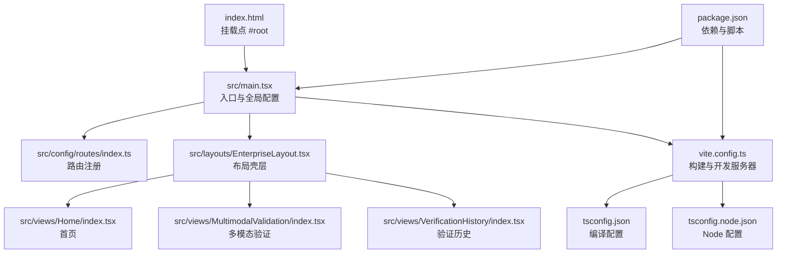
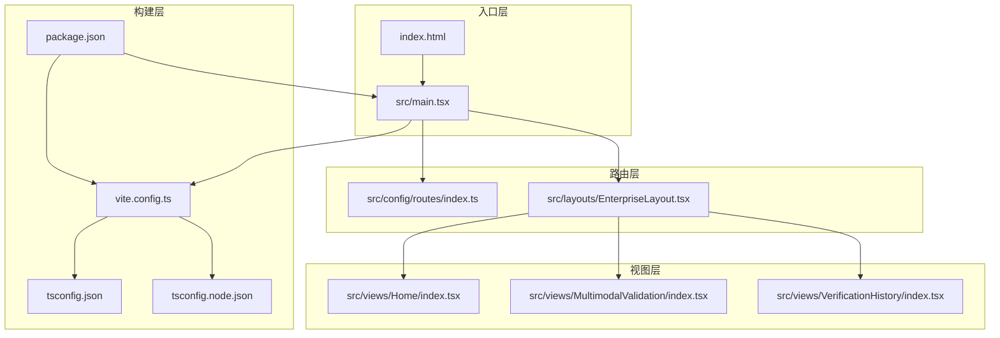
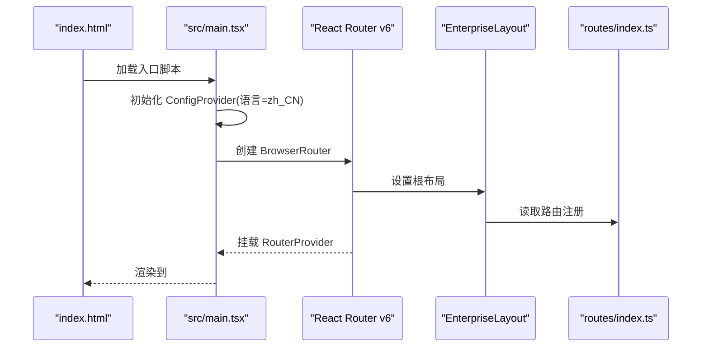
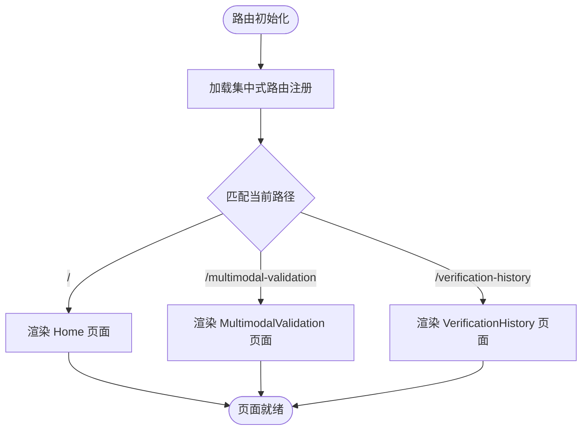
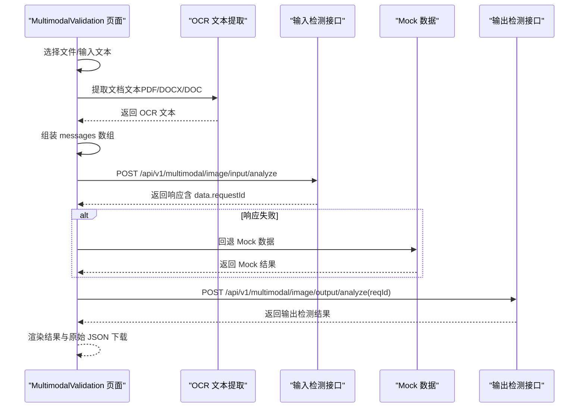
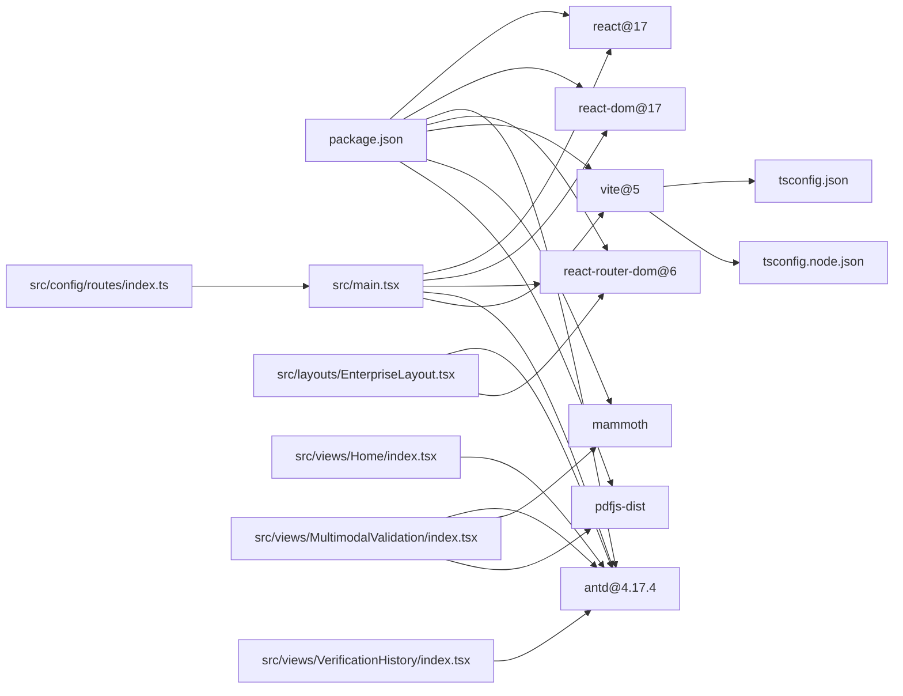

# 系统架构设计

<cite>
**本文档引用的文件**
- [package.json](file://package.json)
- [vite.config.ts](file://vite.config.ts)
- [tsconfig.json](file://tsconfig.json)
- [tsconfig.node.json](file://tsconfig.node.json)
- [index.html](file://index.html)
- [src/main.tsx](file://src/main.tsx)
- [src/config/routes/index.ts](file://src/config/routes/index.ts)
- [src/layouts/EnterpriseLayout.tsx](file://src/layouts/EnterpriseLayout.tsx)
- [src/layouts/theme.config.ts](file://src/layouts/theme.config.ts)
- [src/views/Home/index.tsx](file://src/views/Home/index.tsx)
- [src/views/MultimodalValidation/index.tsx](file://src/views/MultimodalValidation/index.tsx)
- [src/views/VerificationHistory/index.tsx](file://src/views/VerificationHistory/index.tsx)
- [project_description.md](file://project_description.md)
- [docs/context/architecture.md](file://docs/context/architecture.md)
</cite>

## 目录
1. [引言](#引言)
2. [项目结构](#项目结构)
3. [核心组件](#核心组件)
4. [架构总览](#架构总览)
5. [详细组件分析](#详细组件分析)
6. [依赖关系分析](#依赖关系分析)
7. [性能考虑](#性能考虑)
8. [故障排查指南](#故障排查指南)
9. [结论](#结论)
10. [附录](#附录)

## 引言
本项目是一个基于 React 17 + antd 4.17 的多模态内容安全审核平台前端应用，采用 Vite 作为构建工具与开发服务器，使用 React Router v6 进行页面路由管理。系统当前处于脚手架阶段，已实现基础路由与三个示例页面（首页、多模态验证、验证历史），并预留了真实后端接口调用路径与 Mock 回退机制。项目遵循统一的设计系统规范，强调可扩展性与内网隔离环境下的稳定性。

## 项目结构
项目采用按功能域分层的组织方式，核心目录与职责如下：
- src/main.tsx：应用入口，负责初始化全局配置（ConfigProvider）、挂载路由（RouterProvider）并渲染根节点。
- src/config/routes/index.ts：集中式路由注册，使用 React Router v6 的 element 写法，便于与技能契约对齐。
- src/layouts/EnterpriseLayout.tsx：企业级布局壳层，提供 Header 与 Content 区域，并通过 Outlet 承载子页面。
- src/views/*：页面模块，包含首页、多模态验证、验证历史三个功能页面。
- vite.config.ts：Vite 构建与开发服务器配置，包括路径别名 @ 指向 src、开发端口等。
- package.json：依赖声明与脚本命令，涵盖 React、antd、react-router-dom、Vite、mammoth、pdfjs-dist 等。
- tsconfig.json/tsconfig.node.json：TypeScript 编译配置，启用 JSX、严格模式与路径别名。
- index.html：HTML 入口模板，包含挂载点 root 与入口脚本。

**图表来源**
- [index.html:1-13](file://index.html#L1-L13)
- [src/main.tsx:1-26](file://src/main.tsx#L1-L26)
- [src/config/routes/index.ts:1-26](file://src/config/routes/index.ts#L1-L26)
- [src/layouts/EnterpriseLayout.tsx:1-20](file://src/layouts/EnterpriseLayout.tsx#L1-L20)
- [src/views/Home/index.tsx:1-49](file://src/views/Home/index.tsx#L1-L49)
- [src/views/MultimodalValidation/index.tsx:1-546](file://src/views/MultimodalValidation/index.tsx#L1-L546)
- [src/views/VerificationHistory/index.tsx:1-603](file://src/views/VerificationHistory/index.tsx#L1-L603)
- [vite.config.ts:1-16](file://vite.config.ts#L1-L16)
- [tsconfig.json:1-25](file://tsconfig.json#L1-L25)
- [tsconfig.node.json:1-11](file://tsconfig.node.json#L1-L11)
- [package.json:1-28](file://package.json#L1-L28)

**章节来源**
- [project_description.md:13-27](file://project_description.md#L13-L27)
- [docs/context/architecture.md:3-30](file://docs/context/architecture.md#L3-L30)

## 核心组件
- 应用入口与全局配置
  - 初始化 antd 的 ConfigProvider，设置语言为 zh_CN，确保组件国际化。
  - 创建 BrowserRouter 并将 EnterpriseLayout 作为根布局，children 使用集中式路由注册。
  - 渲染根节点，完成应用启动。
- 路由系统
  - 路由注册集中在 src/config/routes/index.ts，采用 React Router v6 的 element 写法，便于与技能契约对齐。
  - 路由对象数组包含首页、多模态验证、验证历史三个页面。
- 布局壳层
  - EnterpriseLayout 提供 Header 与 Content 区域，Header 使用品牌色背景，Content 提供页面承载区域。
  - 通过 Outlet 承载子页面，形成统一的企业级外观。
- 页面模块
  - 首页：演示 Loading/Empty/Error/Feedback 状态切换，使用本地状态模拟异步加载。
  - 多模态验证：支持图片与文档上传（OCR 文本提取），提供输入/输出检测流程，预留真实 API 调用与 Mock 回退。
  - 验证历史：表格展示历史记录，支持 Tab 切换、搜索、详情弹窗与原始 JSON 下载。

**章节来源**
- [src/main.tsx:11-25](file://src/main.tsx#L11-L25)
- [src/config/routes/index.ts:12-25](file://src/config/routes/index.ts#L12-L25)
- [src/layouts/EnterpriseLayout.tsx:8-19](file://src/layouts/EnterpriseLayout.tsx#L8-L19)
- [src/views/Home/index.tsx:4-48](file://src/views/Home/index.tsx#L4-L48)
- [src/views/MultimodalValidation/index.tsx:183-544](file://src/views/MultimodalValidation/index.tsx#L183-L544)
- [src/views/VerificationHistory/index.tsx:94-601](file://src/views/VerificationHistory/index.tsx#L94-L601)

## 架构总览
系统采用前端单页应用（SPA）架构，核心组件交互关系如下：
- 入口层：index.html 提供挂载点，src/main.tsx 初始化全局配置并挂载 RouterProvider。
- 路由层：src/config/routes/index.ts 注册页面路由，EnterpriseLayout 作为根布局承载页面。
- 视图层：三个页面分别处理不同业务场景，均使用 antd 组件库与本地状态管理。
- 构建层：Vite 提供开发服务器与打包能力，TypeScript 编译配置确保类型安全与路径别名。

**图表来源**
- [index.html:1-13](file://index.html#L1-L13)
- [src/main.tsx:1-26](file://src/main.tsx#L1-L26)
- [src/config/routes/index.ts:1-26](file://src/config/routes/index.ts#L1-L26)
- [src/layouts/EnterpriseLayout.tsx:1-20](file://src/layouts/EnterpriseLayout.tsx#L1-L20)
- [src/views/Home/index.tsx:1-49](file://src/views/Home/index.tsx#L1-L49)
- [src/views/MultimodalValidation/index.tsx:1-546](file://src/views/MultimodalValidation/index.tsx#L1-L546)
- [src/views/VerificationHistory/index.tsx:1-603](file://src/views/VerificationHistory/index.tsx#L1-L603)
- [vite.config.ts:1-16](file://vite.config.ts#L1-L16)
- [tsconfig.json:1-25](file://tsconfig.json#L1-L25)
- [tsconfig.node.json:1-11](file://tsconfig.node.json#L1-L11)
- [package.json:1-28](file://package.json#L1-L28)

## 详细组件分析

### 应用入口与全局配置
- 初始化步骤
  - 引入 antd 的 ConfigProvider 并设置语言为 zh_CN。
  - 创建 BrowserRouter，根元素为 EnterpriseLayout，children 使用集中式路由注册。
  - 渲染 React.StrictMode 包裹的根组件到 #root。
- 设计原则
  - 全局配置集中管理，确保组件国际化与主题一致性。
  - 路由与布局解耦，便于扩展新页面与修改布局。

**图表来源**
- [index.html:8-12](file://index.html#L8-L12)
- [src/main.tsx:18-25](file://src/main.tsx#L18-L25)
- [src/config/routes/index.ts:12-25](file://src/config/routes/index.ts#L12-L25)
- [src/layouts/EnterpriseLayout.tsx:8-19](file://src/layouts/EnterpriseLayout.tsx#L8-L19)

**章节来源**
- [src/main.tsx:11-25](file://src/main.tsx#L11-L25)
- [index.html:8-12](file://index.html#L8-L12)

### 路由系统与页面组织
- 路由注册
  - 路由对象数组包含首页、多模态验证、验证历史三个页面，均使用 element 字段。
  - 路由路径分别为根路径、多模态验证路径与验证历史路径。
- 页面组织
  - 首页：演示 Loading/Empty/Error/Feedback 状态切换。
  - 多模态验证：支持图片与文档上传，OCR 文本提取，输入/输出检测流程。
  - 验证历史：表格展示历史记录，支持 Tab 切换、搜索、详情弹窗与原始 JSON 下载。

**图表来源**
- [src/config/routes/index.ts:12-25](file://src/config/routes/index.ts#L12-L25)
- [src/views/Home/index.tsx:4-48](file://src/views/Home/index.tsx#L4-L48)
- [src/views/MultimodalValidation/index.tsx:183-544](file://src/views/MultimodalValidation/index.tsx#L183-L544)
- [src/views/VerificationHistory/index.tsx:94-601](file://src/views/VerificationHistory/index.tsx#L94-L601)

**章节来源**
- [src/config/routes/index.ts:12-25](file://src/config/routes/index.ts#L12-L25)
- [docs/context/architecture.md:8-29](file://docs/context/architecture.md#L8-L29)

### 多模态验证页面（核心业务流程）
- 功能概述
  - 支持图片（PNG/JPG/GIF）与文档（DOCX/DOC/PDF）上传。
  - 文档通过 OCR 提取文本，图片转换为 Base64 dataURL。
  - 提供输入/输出检测流程，输出检测依赖输入检测返回的 requestId。
  - 真实接口调用失败时回退到 Mock 数据，保证 UI 可用性。
- 数据流
  - 文件上传与 OCR 文本提取：根据文件扩展名判断类型，执行相应提取逻辑。
  - 请求构造：将提取后的消息组装为 messages 数组，调用输入检测接口。
  - 响应处理：解析响应为 VerificationResult，支持原始 JSON 下载。
  - 输出检测：先调用输入检测获取 requestId，再调用输出检测接口。

**图表来源**
- [src/views/MultimodalValidation/index.tsx:199-398](file://src/views/MultimodalValidation/index.tsx#L199-L398)
- [src/views/MultimodalValidation/index.tsx:42-58](file://src/views/MultimodalValidation/index.tsx#L42-L58)
- [src/views/MultimodalValidation/index.tsx:106-181](file://src/views/MultimodalValidation/index.tsx#L106-L181)

**章节来源**
- [src/views/MultimodalValidation/index.tsx:183-544](file://src/views/MultimodalValidation/index.tsx#L183-L544)
- [project_description.md:23-26](file://project_description.md#L23-L26)

### 验证历史页面（数据展示与交互）
- 功能概述
  - 支持多模态验证与文本检测两种模式的 Tab 切换。
  - 表格展示验证时间、完成时间、检测内容、方向、合规状态、MD5、违规类型、任务状态。
  - 支持按文件名与 MD5 搜索，详情弹窗展示完整检测结果与原始 JSON 下载。
- 数据流
  - 数据源：根据模式返回预置的历史记录数组。
  - 过滤：根据搜索关键词过滤数据。
  - 渲染：表格列定义与渲染函数，Tag 与 Tooltip 辅助展示。

```mermaid
flowchart TD
Init(["进入验证历史页面"]) --> LoadData["加载基础数据多模态/文本"]
LoadData --> Filter{"是否有搜索关键词"}
Filter --> |是| ApplyFilter["按文件名/MD5 过滤"]
Filter --> |否| ShowAll["显示全部数据"]
ApplyFilter --> Render["渲染表格与分页"]
ShowAll --> Render
Render --> Detail{"查看详情？"}
Detail --> |是| Modal["打开详情弹窗"]
Detail --> |否| End(["结束"])
Modal --> Download["下载原始 JSON"]
Download --> End
```

**图表来源**
- [src/views/VerificationHistory/index.tsx:132-372](file://src/views/VerificationHistory/index.tsx#L132-L372)
- [src/views/VerificationHistory/index.tsx:380-453](file://src/views/VerificationHistory/index.tsx#L380-L453)
- [src/views/VerificationHistory/index.tsx:543-599](file://src/views/VerificationHistory/index.tsx#L543-L599)

**章节来源**
- [src/views/VerificationHistory/index.tsx:94-601](file://src/views/VerificationHistory/index.tsx#L94-L601)

### 首页（状态演示）
- 功能概述
  - 演示 Loading/Empty/Error/Feedback 状态切换，使用本地状态模拟异步加载。
  - 通过按钮触发加载流程，展示不同状态下的 UI 呈现。
- 设计原则
  - 通过简单交互验证 antd 组件在不同状态下的表现，便于后续业务页面复用。

**章节来源**
- [src/views/Home/index.tsx:4-48](file://src/views/Home/index.tsx#L4-L48)

## 依赖关系分析
- 外部依赖
  - React 17 与 react-dom 17：提供组件模型与 DOM 渲染。
  - antd 4.17.4：提供 UI 组件库与主题配置。
  - react-router-dom 6：提供路由管理与导航能力。
  - Vite 5：提供开发服务器与打包能力。
  - mammoth：DOCX 文档文本提取。
  - pdfjs-dist：PDF 文档文本提取。
- 内部依赖
  - src/main.tsx 依赖路由注册与布局壳层。
  - 路由注册依赖各页面组件。
  - 页面组件依赖 antd 组件库与本地状态管理。
  - 构建配置依赖 Vite 插件与 TypeScript 配置。

**图表来源**
- [package.json:11-26](file://package.json#L11-L26)
- [src/main.tsx:1-26](file://src/main.tsx#L1-L26)
- [src/config/routes/index.ts:1-26](file://src/config/routes/index.ts#L1-L26)
- [src/layouts/EnterpriseLayout.tsx:1-20](file://src/layouts/EnterpriseLayout.tsx#L1-L20)
- [src/views/Home/index.tsx:1-49](file://src/views/Home/index.tsx#L1-L49)
- [src/views/MultimodalValidation/index.tsx:1-546](file://src/views/MultimodalValidation/index.tsx#L1-L546)
- [src/views/VerificationHistory/index.tsx:1-603](file://src/views/VerificationHistory/index.tsx#L1-L603)
- [vite.config.ts:1-16](file://vite.config.ts#L1-16)
- [tsconfig.json:1-25](file://tsconfig.json#L1-L25)
- [tsconfig.node.json:1-11](file://tsconfig.node.json#L1-L11)

**章节来源**
- [package.json:11-26](file://package.json#L11-L26)
- [docs/context/architecture.md:31-39](file://docs/context/architecture.md#L31-L39)

## 性能考虑
- 构建优化
  - 使用 Vite 的原生 ESM 与按需编译，提升开发体验与构建速度。
  - TypeScript 编译配置启用严格模式与路径别名，减少运行时开销。
- 运行时优化
  - 页面组件使用本地状态管理，避免不必要的全局状态同步。
  - 多模态验证页面在 OCR 文本提取与文件上传时进行条件判断，减少无效计算。
- 资源加载
  - PDF 文档解析使用 pdfjs-dist 的 worker 配置，建议在内网环境下进行本地化以降低网络依赖。
  - DOCX 文档解析依赖 mammoth，建议缓存解析结果以减少重复解析成本。

## 故障排查指南
- 路由与布局问题
  - 确认路由注册文件路径正确，element 字段与页面组件导出一致。
  - 检查 EnterpriseLayout 的 Outlet 是否正确承载子页面。
- 接口调用问题
  - 多模态验证页面在真实接口调用失败时会回退到 Mock 数据，可通过控制台日志确认回退路径。
  - 输出检测必须先调用输入检测获取 requestId，若缺失将抛出错误提示。
- 构建与开发问题
  - 确认 Vite 开发端口（5173）未被占用，路径别名 @ 指向 src。
  - TypeScript 编译配置中 baseUrl 与 paths 设置需与实际目录结构一致。

**章节来源**
- [src/config/routes/index.ts:12-25](file://src/config/routes/index.ts#L12-L25)
- [src/layouts/EnterpriseLayout.tsx:8-19](file://src/layouts/EnterpriseLayout.tsx#L8-L19)
- [src/views/MultimodalValidation/index.tsx:292-298](file://src/views/MultimodalValidation/index.tsx#L292-L298)
- [vite.config.ts:12-15](file://vite.config.ts#L12-L15)
- [tsconfig.json:18-22](file://tsconfig.json#L18-L22)

## 结论
本项目采用清晰的分层架构与集中式路由管理，结合 antd 组件库与 Vite 构建工具，实现了多模态内容安全审核平台的前端基础框架。系统在内网隔离环境下具备良好的可扩展性，通过预留的真实接口调用与 Mock 回退机制，能够在联调阶段快速推进开发进度。未来可进一步完善权限路由、用户认证、测试体系与设计系统对齐，以支撑更复杂的业务场景。

## 附录
- 系统边界定义
  - 内部边界：src 目录内的入口、路由、布局与页面模块。
  - 外部边界：Vite 构建工具、TypeScript 编译器、antd 组件库、react-router-dom、mammoth、pdfjs-dist。
- 外部依赖接口与集成模式
  - 输入检测接口：POST /api/v1/multimodal/image/input/analyze
  - 输出检测接口：POST /api/v1/multimodal/image/output/analyze
  - 集成模式：页面组件通过 fetch 调用后端接口，失败时回退到 Mock 数据，保证 UI 可用性。
- 扩展性考虑
  - 新增页面：在路由注册文件中添加新的 RouteObject，即可快速接入新页面。
  - 主题与设计系统：通过 theme.config.ts 沉淀品牌色等常量，配合设计系统规范进行主题定制。
  - 数据流演进：当前使用本地状态与 Mock 异步，后续可接入真实后端服务与状态管理库。

**章节来源**
- [project_description.md:23-26](file://project_description.md#L23-L26)
- [docs/context/architecture.md:41-46](file://docs/context/architecture.md#L41-L46)
- [src/layouts/theme.config.ts:5-7](file://src/layouts/theme.config.ts#L5-L7)