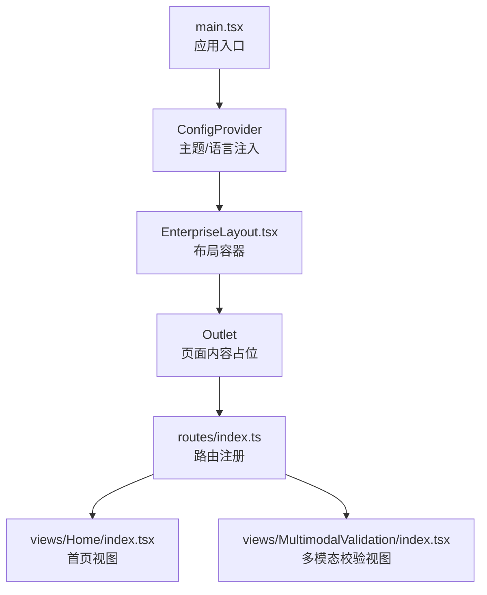
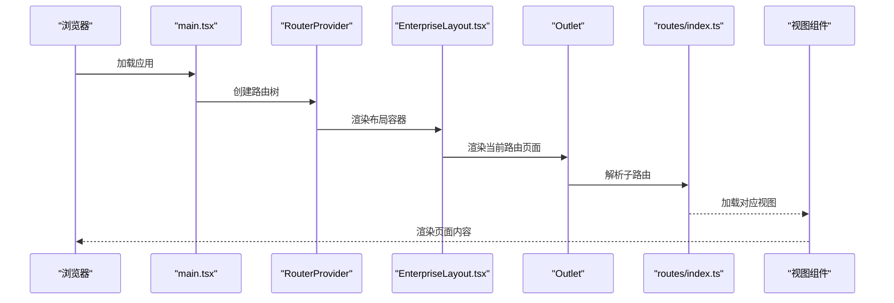
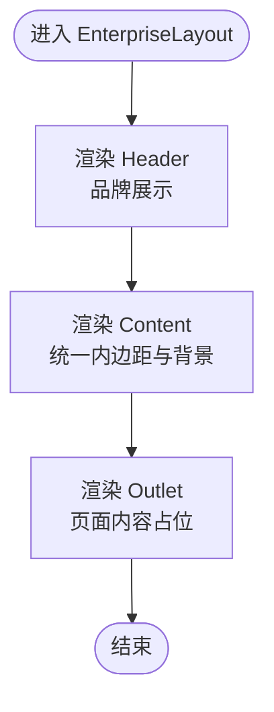
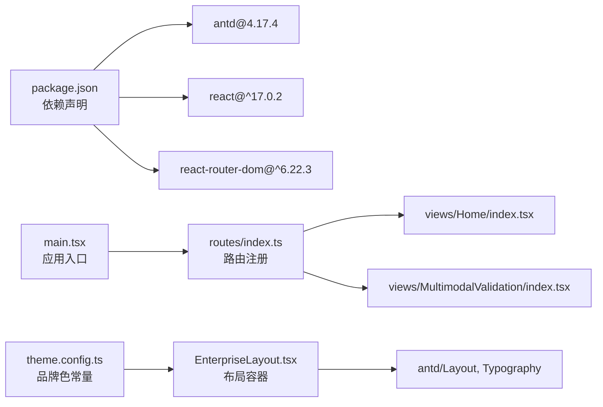

# 布局组件

<cite>
**本文引用的文件**
- [EnterpriseLayout.tsx](file://src/layouts/EnterpriseLayout.tsx)
- [theme.config.ts](file://src/layouts/theme.config.ts)
- [main.tsx](file://src/main.tsx)
- [routes/index.ts](file://src/config/routes/index.ts)
- [Home/index.tsx](file://src/views/Home/index.tsx)
- [MultimodalValidation/index.tsx](file://src/views/MultimodalValidation/index.tsx)
- [package.json](file://package.json)
- [SKILL.md](file://das-ued-skills/opt/antd-v5-enterprise-layout/SKILL.md)
- [layout-tokens.md](file://das-ued-skills/opt/antd-v5-enterprise-layout/layout-tokens.md)
- [custom-theme-workflow.md](file://das-ued-skills/opt/b-admin-pencil-design/theming/custom-theme-workflow.md)
- [light-dark-variables.md](file://das-ued-skills/opt/b-admin-pencil-design/theming/light-dark-variables.md)
</cite>

## 目录
1. [简介](#简介)
2. [项目结构](#项目结构)
3. [核心组件](#核心组件)
4. [架构总览](#架构总览)
5. [详细组件分析](#详细组件分析)
6. [依赖关系分析](#依赖关系分析)
7. [性能考量](#性能考量)
8. [故障排查指南](#故障排查指南)
9. [结论](#结论)
10. [附录](#附录)

## 简介
本文件围绕 APIG 项目中的 EnterpriseLayout 企业级布局组件，系统阐述其设计理念、实现原理与使用方法。重点覆盖：
- Header 头部区域的品牌展示与导航承载
- Content 内容区域的页面承载能力与容器化设计
- 与 Ant Design Layout 组件的关系与扩展方式
- 主题配置、响应式设计与品牌色彩的应用
- 布局组件的定制化方案与最佳实践
- 具体的使用场景与代码示例路径

EnterpriseLayout 当前处于“内网模拟环境”的最小壳层形态，后续可平滑替换为基于 Ant Design v5 的完整骨架方案（opt-antd-v5-enterprise-layout），以获得更丰富的布局、导航、主题与密度规范。

## 项目结构
本项目采用“路由 + 布局 + 视图”的分层组织方式：
- 路由集中配置于 routes/index.ts，统一注册各页面视图
- 布局位于 layouts/EnterpriseLayout.tsx，负责页面骨架与主题注入
- 视图位于 views/ 下，每个页面独立实现业务逻辑
- 主入口 main.tsx 负责挂载 RouterProvider 与 ConfigProvider，注入语言与主题

图表来源
- [main.tsx:11-25](file://src/main.tsx#L11-L25)
- [routes/index.ts:12-25](file://src/config/routes/index.ts#L12-L25)
- [EnterpriseLayout.tsx:8-19](file://src/layouts/EnterpriseLayout.tsx#L8-L19)

章节来源
- [main.tsx:1-26](file://src/main.tsx#L1-L26)
- [routes/index.ts:1-26](file://src/config/routes/index.ts#L1-L26)

## 核心组件
EnterpriseLayout 是一个轻量的布局容器，基于 Ant Design 的 Layout 组件实现，主要职责包括：
- 提供 Header 与 Content 的基础结构
- 注入品牌色与背景色常量
- 通过 Outlet 承载路由页面内容
- 为后续扩展（如 Sider、Menu、面包屑、Footer）预留空间

当前实现要点：
- Header 使用深蓝色背景与白色文字进行品牌展示
- Content 提供统一内边距与浅蓝背景，保证内容区的可读性与层次感
- 通过 theme.config.ts 暴露品牌主色常量，供布局与页面引用

章节来源
- [EnterpriseLayout.tsx:1-20](file://src/layouts/EnterpriseLayout.tsx#L1-L20)
- [theme.config.ts:1-8](file://src/layouts/theme.config.ts#L1-L8)

## 架构总览
下图展示了从应用入口到布局再到页面视图的数据流与控制流：

图表来源
- [main.tsx:11-25](file://src/main.tsx#L11-L25)
- [routes/index.ts:12-25](file://src/config/routes/index.ts#L12-L25)
- [EnterpriseLayout.tsx:14-16](file://src/layouts/EnterpriseLayout.tsx#L14-L16)

## 详细组件分析

### EnterpriseLayout 组件
- 设计理念
  - 以“最小壳层”为目标，快速落地企业后台的骨架与品牌色
  - 为后续引入 Sider、Menu、面包屑、Footer 等完整布局要素留出扩展点
- 结构组成
  - Header：品牌展示区，使用深色背景与白色文字
  - Content：页面内容承载区，提供统一内边距与背景色
  - Outlet：路由页面内容占位
- 与 Ant Design 的关系
  - 直接使用 Layout、Typography 等组件
  - 通过 ConfigProvider 注入主题配置（当前在 main.tsx 中注入）
  - 后续可升级为基于 Ant Design v5 的完整布局方案（opt-antd-v5-enterprise-layout）

图表来源
- [EnterpriseLayout.tsx:8-19](file://src/layouts/EnterpriseLayout.tsx#L8-L19)

章节来源
- [EnterpriseLayout.tsx:1-20](file://src/layouts/EnterpriseLayout.tsx#L1-L20)

### 主题配置与品牌色彩
- 品牌色常量
  - 通过 theme.config.ts 暴露 primaryColor 常量，供布局与页面引用
- 主题注入
  - 当前在 main.tsx 中通过 ConfigProvider 注入 locale，主题配置可按需迁移至该处
- 后续扩展
  - 可参考 opt-antd-v5-enterprise-layout 的完整主题配置，包含 Seed Token、Map Token、Alias Token 的分层与组件级 Token

章节来源
- [theme.config.ts:5-7](file://src/layouts/theme.config.ts#L5-L7)
- [main.tsx:20-22](file://src/main.tsx#L20-L22)
- [SKILL.md:25-98](file://das-ued-skills/opt/antd-v5-enterprise-layout/SKILL.md#L25-L98)

### 响应式设计与布局扩展
- 当前布局
  - Header 与 Content 的基础样式固定，适合中小屏展示
- 后续扩展（基于 opt-antd-v5-enterprise-layout）
  - 引入 Sider 与 Menu，支持左侧导航与折叠
  - 使用 useToken 动态读取 Token，实现动态样式
  - 采用 No-Line Rule（背景色差替代分割线）、Ambient Shadow、Glassmorphism 等视觉语言
  - 提供深色/浅色双模式 Variables 配置

章节来源
- [SKILL.md:205-397](file://das-ued-skills/opt/antd-v5-enterprise-layout/SKILL.md#L205-L397)
- [layout-tokens.md:15-32](file://das-ued-skills/opt/antd-v5-enterprise-layout/layout-tokens.md#L15-L32)
- [light-dark-variables.md:23-48](file://das-ued-skills/opt/b-admin-pencil-design/theming/light-dark-variables.md#L23-L48)

### 使用场景与示例路径
- 首页视图
  - 通过 routes/index.ts 注册，作为默认路由
  - 使用 Card、Empty、Spin、Alert 等组件演示反馈态
- 多模态校验视图
  - 展示上传、文本输入、结果展示与下载等复杂交互
  - 体现 Content 区域承载复杂页面的能力

章节来源
- [routes/index.ts:12-25](file://src/config/routes/index.ts#L12-L25)
- [Home/index.tsx:24-48](file://src/views/Home/index.tsx#L24-L48)
- [MultimodalValidation/index.tsx:397-543](file://src/views/MultimodalValidation/index.tsx#L397-L543)

## 依赖关系分析
- 组件依赖
  - EnterpriseLayout 依赖 Ant Design 的 Layout、Typography
  - main.tsx 依赖 react-router-dom 的 RouterProvider 与 createBrowserRouter
- 主题与路由
  - theme.config.ts 提供品牌色常量
  - routes/index.ts 集中注册页面路由
- 外部依赖
  - package.json 指定 antd、react、react-router-dom 等版本

图表来源
- [package.json:11-17](file://package.json#L11-L17)
- [main.tsx:3-9](file://src/main.tsx#L3-L9)
- [routes/index.ts:4-6](file://src/config/routes/index.ts#L4-L6)
- [EnterpriseLayout.tsx:1-5](file://src/layouts/EnterpriseLayout.tsx#L1-L5)

章节来源
- [package.json:1-28](file://package.json#L1-L28)
- [main.tsx:1-26](file://src/main.tsx#L1-L26)
- [routes/index.ts:1-26](file://src/config/routes/index.ts#L1-L26)

## 性能考量
- 轻量布局
  - 当前布局仅包含 Header 与 Content，渲染开销小，适合快速启动
- 主题注入位置
  - 建议将主题配置迁移至 main.tsx 的 ConfigProvider，避免重复注入
- 组件复用
  - 将品牌色与 Token 常量集中管理，减少重复计算与样式切换成本
- 后续优化
  - 引入 useToken 动态样式，按需渲染，降低全局样式变更带来的重绘
  - 采用 No-Line Rule 与背景色差，减少边框绘制与阴影层级

## 故障排查指南
- 布局不生效
  - 检查 main.tsx 是否正确包裹 RouterProvider 与 ConfigProvider
  - 确认路由配置 routes/index.ts 的 element 字段是否正确指向视图组件
- 样式异常
  - 确认 theme.config.ts 的品牌色常量是否被正确引用
  - 如需使用 Ant Design v5 的完整主题，参考 opt-antd-v5-enterprise-layout 的主题配置
- 语言与本地化
  - 确认 main.tsx 中是否正确设置 locale（如 zhCN）

章节来源
- [main.tsx:18-25](file://src/main.tsx#L18-L25)
- [routes/index.ts:12-25](file://src/config/routes/index.ts#L12-L25)
- [theme.config.ts:5-7](file://src/layouts/theme.config.ts#L5-L7)

## 结论
EnterpriseLayout 为企业后台提供了简洁而可扩展的布局骨架。当前实现聚焦 Header 与 Content 的基础结构与品牌色应用，后续可通过 opt-antd-v5-enterprise-layout 的完整方案引入 Sider、Menu、面包屑与 Footer，并结合 Ant Design v5 的 Design Token 体系实现主题化、响应式与高一致性设计。建议在项目早期即完成主题与 Token 的统一治理，确保后续扩展的稳定性与可维护性。

## 附录

### 主题配置迁移建议
- 将主题配置从 theme.config.ts 迁移至 main.tsx 的 ConfigProvider，统一管理
- 参考 opt-antd-v5-enterprise-layout 的完整主题配置，包含 Seed Token、Map Token、Alias Token 与组件级 Token

章节来源
- [SKILL.md:25-184](file://das-ued-skills/opt/antd-v5-enterprise-layout/SKILL.md#L25-L184)

### 品牌色与色彩体系
- 品牌主色：#3B71EE（可在 theme.config.ts 与 ConfigProvider 中统一引用）
- 背景层级：页面底色、容器、弹层等层级的背景色差
- 状态色：成功、告警、错误等状态色，配合 Token 使用

章节来源
- [theme.config.ts:6](file://src/layouts/theme.config.ts#L6)
- [SKILL.md:548-601](file://das-ued-skills/opt/antd-v5-enterprise-layout/SKILL.md#L548-L601)

### 布局扩展清单
- 引入 Sider 与 Menu，支持左侧导航与折叠
- 使用 useToken 动态读取 Token，实现动态样式
- 采用 No-Line Rule、Ambient Shadow、Glassmorphism 等视觉语言
- 提供深色/浅色双模式 Variables 配置

章节来源
- [SKILL.md:205-397](file://das-ued-skills/opt/antd-v5-enterprise-layout/SKILL.md#L205-L397)
- [layout-tokens.md:15-32](file://das-ued-skills/opt/antd-v5-enterprise-layout/layout-tokens.md#L15-L32)
- [light-dark-variables.md:23-48](file://das-ued-skills/opt/b-admin-pencil-design/theming/light-dark-variables.md#L23-L48)