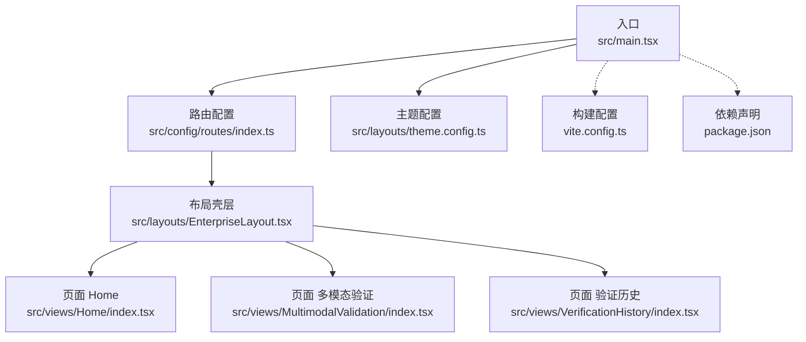
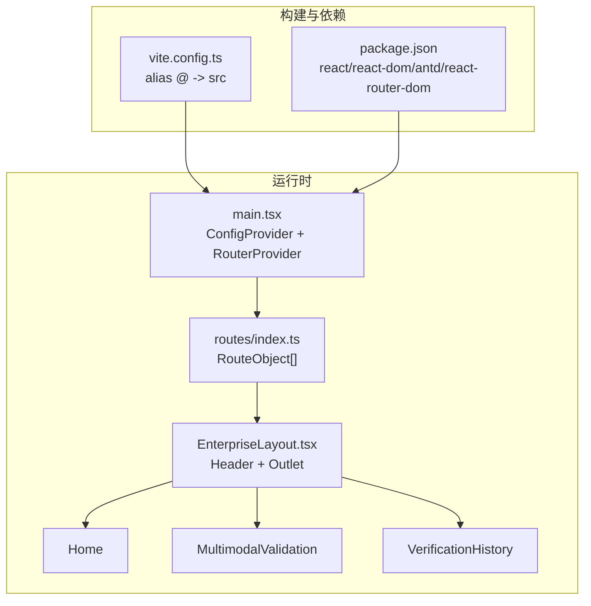
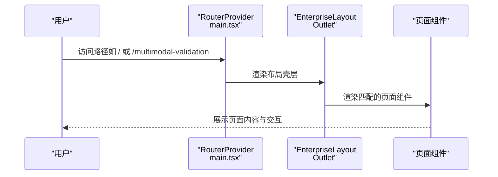
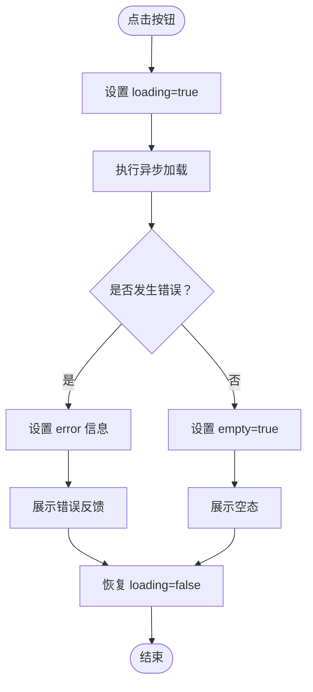
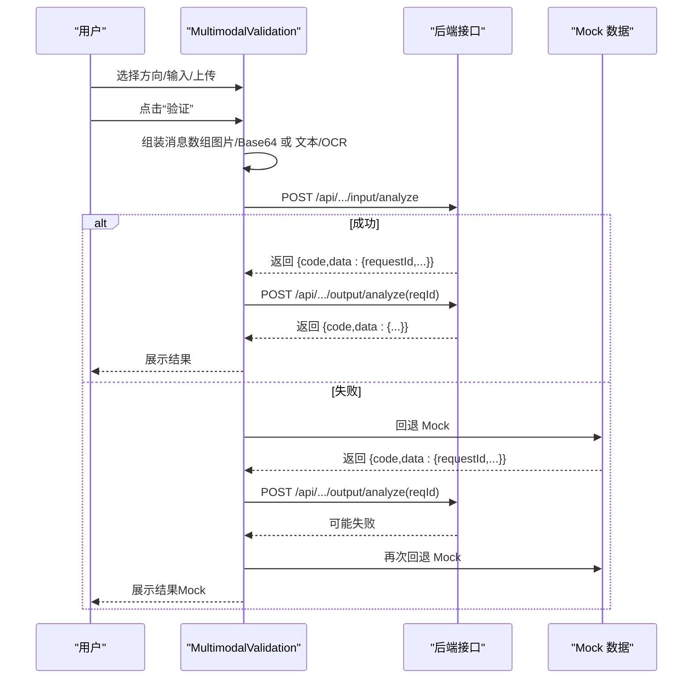
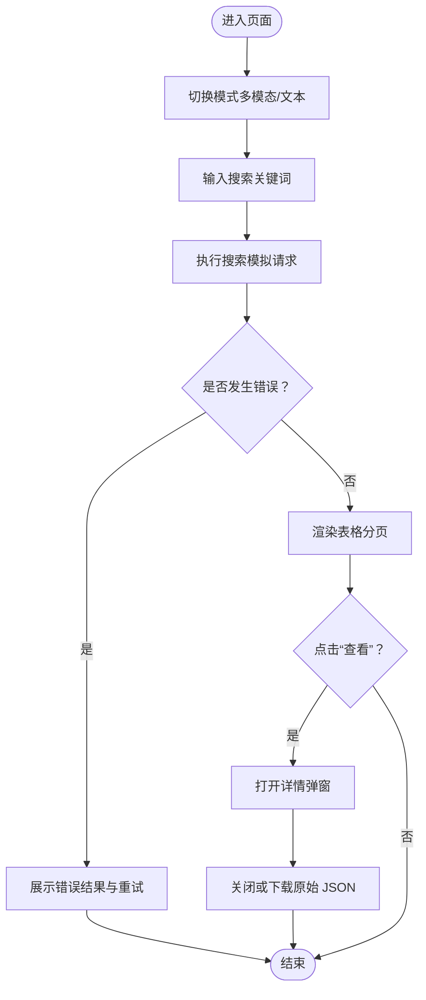
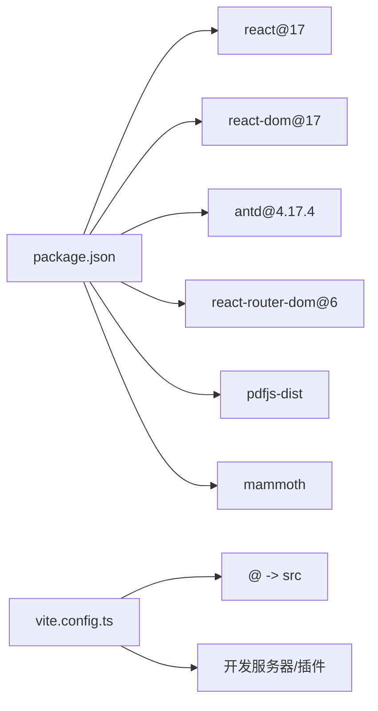

# 组件交互

<cite>
**本文引用的文件**
- [src/main.tsx](file://src/main.tsx)
- [src/config/routes/index.ts](file://src/config/routes/index.ts)
- [src/layouts/EnterpriseLayout.tsx](file://src/layouts/EnterpriseLayout.tsx)
- [src/views/Home/index.tsx](file://src/views/Home/index.tsx)
- [src/views/MultimodalValidation/index.tsx](file://src/views/MultimodalValidation/index.tsx)
- [src/views/VerificationHistory/index.tsx](file://src/views/VerificationHistory/index.tsx)
- [src/layouts/theme.config.ts](file://src/layouts/theme.config.ts)
- [vite.config.ts](file://vite.config.ts)
- [package.json](file://package.json)
- [docs/context/architecture.md](file://docs/context/architecture.md)
- [docs/context/constraints.md](file://docs/context/constraints.md)
- [project_description.md](file://project_description.md)
</cite>

## 目录
1. [简介](#简介)
2. [项目结构](#项目结构)
3. [核心组件](#核心组件)
4. [架构总览](#架构总览)
5. [详细组件分析](#详细组件分析)
6. [依赖分析](#依赖分析)
7. [性能考虑](#性能考虑)
8. [故障排查指南](#故障排查指南)
9. [结论](#结论)
10. [附录](#附录)

## 简介
本文件围绕 APIG 项目的组件交互展开，聚焦以下目标：
- 组件间通信机制、数据传递与事件处理流程
- 路由配置如何管理页面跳转与状态同步
- 状态提升、回调函数与上下文（Context）使用场景
- 生命周期管理、副作用处理与错误边界设计
- 组件解耦策略、依赖注入与模块化设计最佳实践
- 具体交互示例与调试技巧

项目采用 React 17 + antd 4.17 + React Router v6 + Vite 技术栈，通过集中路由注册与布局壳层承载页面，页面内部通过本地状态驱动 UI 与交互，同时预留真实 API 调用与回退 Mock 的能力。

## 项目结构
项目采用“入口 -> 路由 -> 布局壳层 -> 页面”的层次化组织方式，配合路径别名与构建配置，形成清晰的模块边界与可演进的架构基线。

图表来源
- [src/main.tsx:1-26](file://src/main.tsx#L1-L26)
- [src/config/routes/index.ts:1-26](file://src/config/routes/index.ts#L1-L26)
- [src/layouts/EnterpriseLayout.tsx:1-20](file://src/layouts/EnterpriseLayout.tsx#L1-L20)
- [src/views/Home/index.tsx:1-49](file://src/views/Home/index.tsx#L1-L49)
- [src/views/MultimodalValidation/index.tsx:1-546](file://src/views/MultimodalValidation/index.tsx#L1-L546)
- [src/views/VerificationHistory/index.tsx:1-603](file://src/views/VerificationHistory/index.tsx#L1-L603)
- [vite.config.ts:1-16](file://vite.config.ts#L1-L16)
- [package.json:1-28](file://package.json#L1-L28)

章节来源
- [src/main.tsx:1-26](file://src/main.tsx#L1-L26)
- [src/config/routes/index.ts:1-26](file://src/config/routes/index.ts#L1-L26)
- [src/layouts/EnterpriseLayout.tsx:1-20](file://src/layouts/EnterpriseLayout.tsx#L1-L20)
- [vite.config.ts:1-16](file://vite.config.ts#L1-L16)
- [package.json:1-28](file://package.json#L1-L28)
- [project_description.md:13-27](file://project_description.md#L13-L27)

## 核心组件
- 入口与全局配置：负责挂载 ConfigProvider（语言与主题）、RouterProvider（路由容器），并以集中路由配置为入口。
- 路由注册：集中定义页面级路由对象，统一使用 element 字段，便于与下游技能对齐。
- 布局壳层：提供最小 Header/Content 骨架，通过 Outlet 承载具体页面。
- 页面组件：
  - Home：演示 Loading/Empty/Error/Feedback 状态切换与消息提示。
  - MultimodalValidation：多模态输入/输出检测，含文件上传、OCR 文本提取、请求链路与 Mock 回退。
  - VerificationHistory：历史记录表格、搜索、详情弹窗与原始 JSON 导出。

章节来源
- [src/main.tsx:1-26](file://src/main.tsx#L1-L26)
- [src/config/routes/index.ts:1-26](file://src/config/routes/index.ts#L1-L26)
- [src/layouts/EnterpriseLayout.tsx:1-20](file://src/layouts/EnterpriseLayout.tsx#L1-L20)
- [src/views/Home/index.tsx:1-49](file://src/views/Home/index.tsx#L1-L49)
- [src/views/MultimodalValidation/index.tsx:1-546](file://src/views/MultimodalValidation/index.tsx#L1-L546)
- [src/views/VerificationHistory/index.tsx:1-603](file://src/views/VerificationHistory/index.tsx#L1-L603)
- [docs/context/architecture.md:18-29](file://docs/context/architecture.md#L18-L29)

## 架构总览
下图展示了从入口到页面的数据与控制流，以及路由与布局之间的协作关系。

图表来源
- [src/main.tsx:1-26](file://src/main.tsx#L1-L26)
- [src/config/routes/index.ts:1-26](file://src/config/routes/index.ts#L1-L26)
- [src/layouts/EnterpriseLayout.tsx:1-20](file://src/layouts/EnterpriseLayout.tsx#L1-L20)
- [vite.config.ts:1-16](file://vite.config.ts#L1-L16)
- [package.json:1-28](file://package.json#L1-L28)

## 详细组件分析

### 路由与页面跳转
- 路由注册集中于路由配置文件，使用 element 字段声明页面组件，便于与下游技能对齐。
- 入口通过 createBrowserRouter 创建路由器，以布局壳层为父级容器，children 为路由集合。
- 布局壳层通过 Outlet 承载当前路由对应的页面组件，实现页面级别的状态隔离与共享。

图表来源
- [src/main.tsx:11-16](file://src/main.tsx#L11-L16)
- [src/config/routes/index.ts:12-25](file://src/config/routes/index.ts#L12-L25)
- [src/layouts/EnterpriseLayout.tsx:15](file://src/layouts/EnterpriseLayout.tsx#L15)

章节来源
- [src/main.tsx:11-16](file://src/main.tsx#L11-L16)
- [src/config/routes/index.ts:12-25](file://src/config/routes/index.ts#L12-L25)
- [src/layouts/EnterpriseLayout.tsx:8-19](file://src/layouts/EnterpriseLayout.tsx#L8-L19)

### Home 组件：状态驱动的反馈循环
- 状态：loading、error、empty 三态切换，结合消息提示与反馈组件。
- 事件：按钮点击触发异步加载，最终根据结果切换到空态或成功态。
- 交互要点：通过本地状态管理 Loading/Empty/Error，避免跨组件耦合；消息提示与反馈组件统一风格。

图表来源
- [src/views/Home/index.tsx:9-22](file://src/views/Home/index.tsx#L9-L22)
- [src/views/Home/index.tsx:24-47](file://src/views/Home/index.tsx#L24-L47)

章节来源
- [src/views/Home/index.tsx:1-49](file://src/views/Home/index.tsx#L1-L49)

### MultimodalValidation 组件：输入/输出检测与链路传递
- 状态与输入：
  - 方向选择（输入/输出）
  - 文本输入与文件上传（图片/文档）
  - 验证中、错误、结果三态
- 数据流：
  - 输入检测：收集文件与文本，图片转 Base64，文档 OCR 提取文本，构造消息数组，调用输入检测接口；失败回退 Mock。
  - 输出检测：先调用输入检测获取 requestId，再调用输出检测接口；失败同样回退 Mock。
  - 结果展示：安全状态、命中类型、动作、请求 ID、原始 JSON 下载。
- 事件与回调：
  - 上传前置处理、移除文件、重置状态、触发验证、下载 JSON。
- 错误处理：
  - 接口异常时提示并回退 Mock；UI 层通过消息提示与错误结果区反馈。

图表来源
- [src/views/MultimodalValidation/index.tsx:199-298](file://src/views/MultimodalValidation/index.tsx#L199-L298)
- [src/views/MultimodalValidation/index.tsx:300-343](file://src/views/MultimodalValidation/index.tsx#L300-L343)
- [src/views/MultimodalValidation/index.tsx:345-385](file://src/views/MultimodalValidation/index.tsx#L345-L385)

章节来源
- [src/views/MultimodalValidation/index.tsx:1-546](file://src/views/MultimodalValidation/index.tsx#L1-L546)
- [docs/context/architecture.md:20-29](file://docs/context/architecture.md#L20-L29)
- [docs/context/constraints.md:33-41](file://docs/context/constraints.md#L33-L41)

### VerificationHistory 组件：历史记录与详情弹窗
- 状态与输入：
  - 模式切换（多模态/文本）
  - 搜索关键词（文件名/MD5）
  - 加载、错误、空态三态
- 数据与展示：
  - 表格列包含验证时间、完成时间、检测内容、方向、合规状态、MD5、违规类型、任务状态。
  - 详情弹窗展示完整检测结果与原始 JSON 下载。
- 事件与回调：
  - Tabs 切换清空搜索；搜索触发后模拟请求延迟；错误时提供重试按钮；点击“查看”打开详情弹窗。

图表来源
- [src/views/VerificationHistory/index.tsx:94-603](file://src/views/VerificationHistory/index.tsx#L94-L603)

章节来源
- [src/views/VerificationHistory/index.tsx:1-603](file://src/views/VerificationHistory/index.tsx#L1-L603)

### 布局与主题：上下文与样式注入
- 布局壳层：提供 Header 与 Content 的最小骨架，通过 Outlet 承载页面。
- 主题配置：沉淀品牌色等常量，供布局与页面引用。
- 全局配置：入口通过 ConfigProvider 注入语言与主题配置，保证组件库样式一致性。

章节来源
- [src/layouts/EnterpriseLayout.tsx:1-20](file://src/layouts/EnterpriseLayout.tsx#L1-L20)
- [src/layouts/theme.config.ts:1-8](file://src/layouts/theme.config.ts#L1-L8)
- [src/main.tsx:18-25](file://src/main.tsx#L18-L25)

## 依赖分析
- 运行时依赖：react、react-dom、antd、react-router-dom、pdfjs-dist、mammoth。
- 构建与开发：Vite、@vitejs/plugin-react、TypeScript。
- 路径别名：@ 指向 src，简化导入路径。

图表来源
- [package.json:11-26](file://package.json#L11-L26)
- [vite.config.ts:7-11](file://vite.config.ts#L7-L11)

章节来源
- [package.json:1-28](file://package.json#L1-L28)
- [vite.config.ts:1-16](file://vite.config.ts#L1-L16)

## 性能考虑
- 资源懒加载与按需引入：文档解析（mammoth、pdfjs）采用动态 import，减少首屏体积。
- 上传与 OCR：图片转 Base64 与 PDF 文本提取在前端完成，建议限制文件大小与页数，避免阻塞 UI。
- 表格分页：历史记录页面使用分页，降低一次性渲染压力。
- Mock 回退：网络异常时回退 Mock，保障用户体验，但需在联调阶段及时替换真实接口。

章节来源
- [src/views/MultimodalValidation/index.tsx:107-139](file://src/views/MultimodalValidation/index.tsx#L107-L139)
- [src/views/MultimodalValidation/index.tsx:142-164](file://src/views/MultimodalValidation/index.tsx#L142-L164)
- [src/views/VerificationHistory/index.tsx:530-536](file://src/views/VerificationHistory/index.tsx#L530-L536)
- [docs/context/architecture.md:43-46](file://docs/context/architecture.md#L43-L46)

## 故障排查指南
- 路由不生效或页面空白：
  - 检查路由配置是否正确导出 RouteObject[]，路径与 element 是否匹配。
  - 确认入口是否使用 RouterProvider 包裹布局壳层。
- 布局壳层不显示：
  - 检查 Outlet 是否存在于布局组件中。
- 多模态验证接口失败：
  - 查看网络面板与控制台错误；确认接口 URL 与请求体格式。
  - 确认 Mock 回退逻辑是否被触发；联调阶段需替换为真实接口。
- PDF/DOCX 解析异常：
  - 检查动态导入路径与 worker 配置；内网环境可能需要本地化 worker。
- 历史记录搜索无结果：
  - 确认搜索关键词与过滤逻辑；检查模拟请求是否成功。

章节来源
- [src/config/routes/index.ts:12-25](file://src/config/routes/index.ts#L12-L25)
- [src/main.tsx:11-16](file://src/main.tsx#L11-L16)
- [src/layouts/EnterpriseLayout.tsx:15](file://src/layouts/EnterpriseLayout.tsx#L15)
- [src/views/MultimodalValidation/index.tsx:279-298](file://src/views/MultimodalValidation/index.tsx#L279-L298)
- [docs/context/constraints.md:5-7](file://docs/context/constraints.md#L5-L7)
- [src/views/VerificationHistory/index.tsx:455-467](file://src/views/VerificationHistory/index.tsx#L455-L467)

## 结论
本项目通过集中路由与布局壳层实现了清晰的页面级交互边界，页面内部以本地状态驱动 UI 与反馈，同时预留真实 API 调用与 Mock 回退机制。建议在后续演进中：
- 明确状态提升与回调边界，避免深层嵌套的 props drilling。
- 在需要跨页面共享的状态场景引入 Context，但保持最小化与可测试性。
- 逐步替换 Mock 为真实接口，完善错误边界与重试策略。
- 强化模块化与依赖注入，减少组件间紧耦合。

## 附录
- 路由注册文件路径与职责：集中于路由配置文件，统一使用 element 字段。
- 页面输出目录与命名：页面默认输出至 views/{Module}/index.tsx。
- 构建与路径别名：Vite 配置中 @ 指向 src，开发端口 5173。

章节来源
- [project_description.md:40-46](file://project_description.md#L40-L46)
- [vite.config.ts:7-11](file://vite.config.ts#L7-L11)
- [docs/context/architecture.md:8-10](file://docs/context/architecture.md#L8-L10)