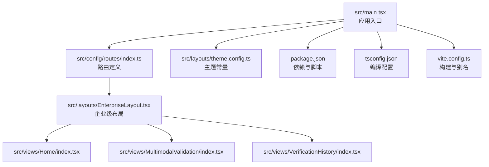
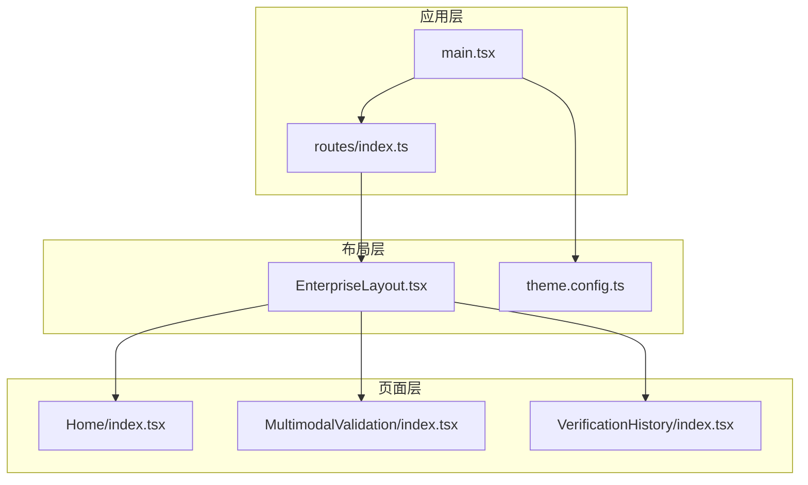
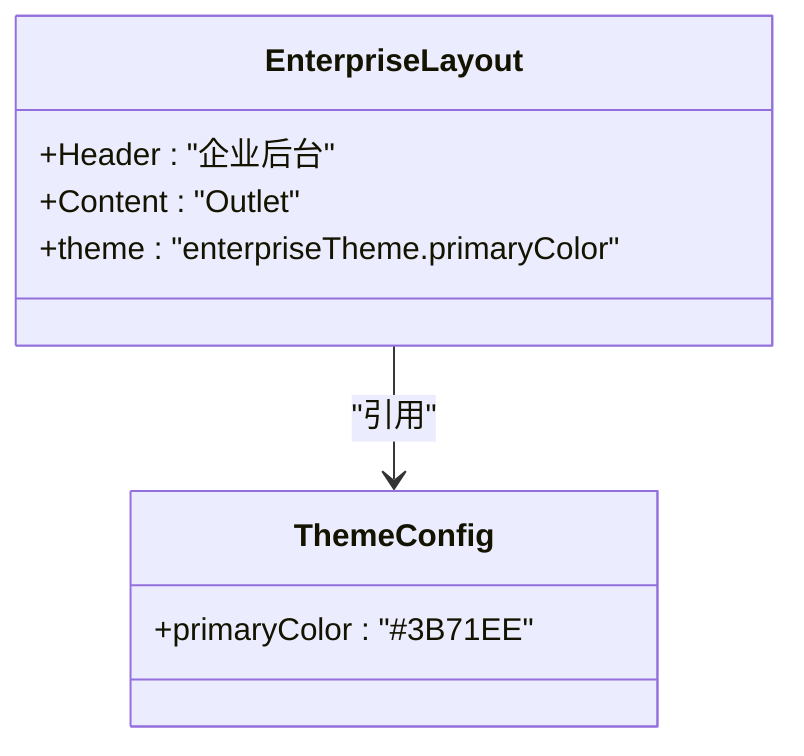
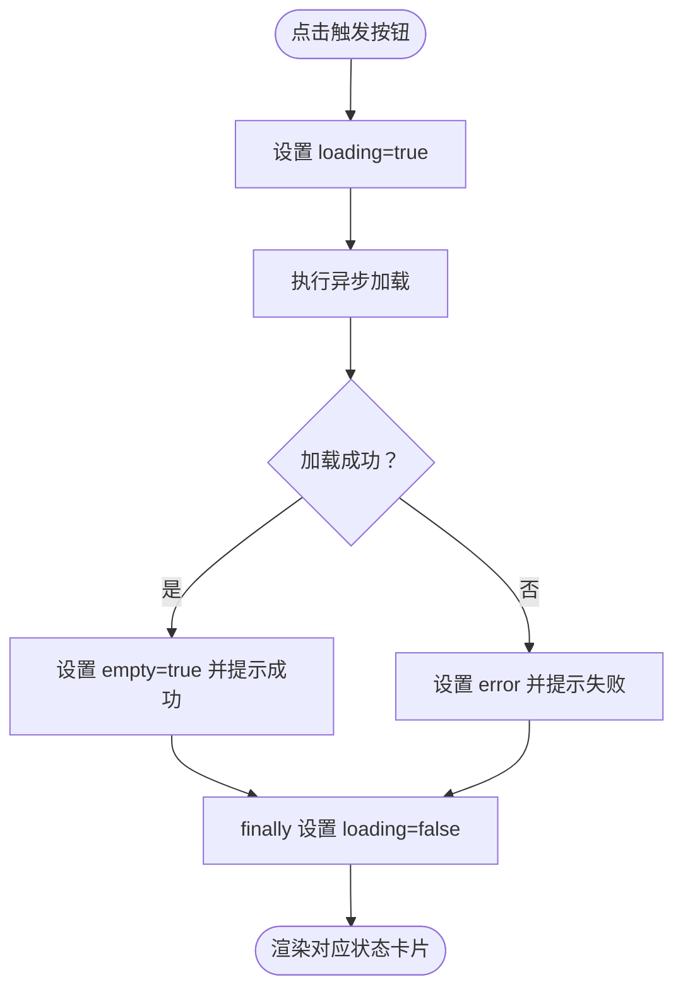
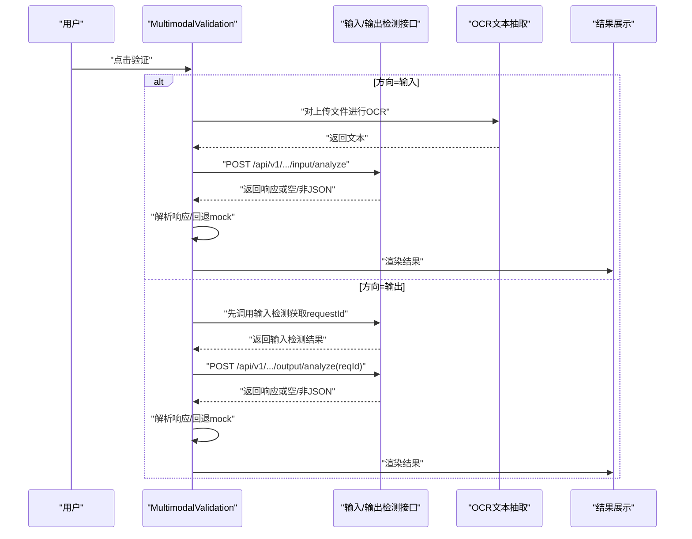
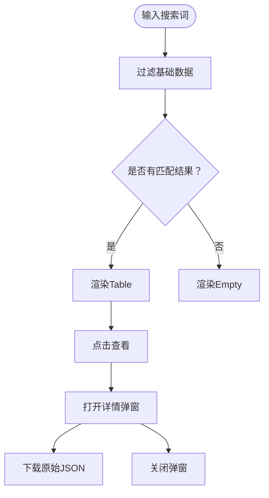
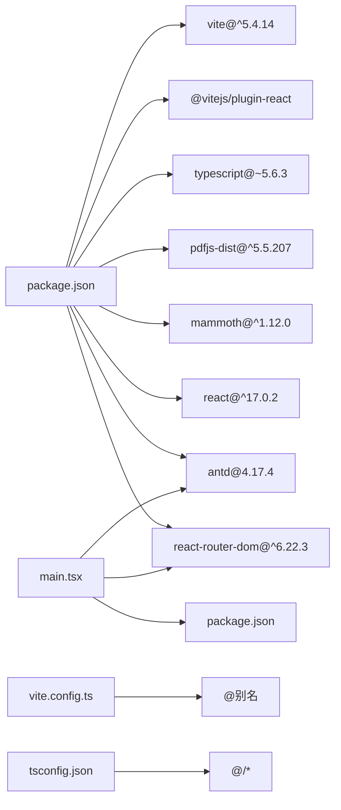

# 组件架构

<cite>
**本文引用的文件**
- [EnterpriseLayout.tsx](file://src/layouts/EnterpriseLayout.tsx)
- [theme.config.ts](file://src/layouts/theme.config.ts)
- [main.tsx](file://src/main.tsx)
- [routes/index.ts](file://src/config/routes/index.ts)
- [Home/index.tsx](file://src/views/Home/index.tsx)
- [MultimodalValidation/index.tsx](file://src/views/MultimodalValidation/index.tsx)
- [VerificationHistory/index.tsx](file://src/views/VerificationHistory/index.tsx)
- [package.json](file://package.json)
- [tsconfig.json](file://tsconfig.json)
- [vite.config.ts](file://vite.config.ts)
- [buttons.md](file://das-ued-skills/opt/b-admin-pencil-design/core/components/buttons.md)
- [tables.md](file://das-ued-skills/opt/b-admin-pencil-design/core/components/tables.md)
- [forms.md](file://das-ued-skills/opt/b-admin-pencil-design/core/components/forms.md)
</cite>

## 目录
1. [引言](#引言)
2. [项目结构](#项目结构)
3. [核心组件](#核心组件)
4. [架构总览](#架构总览)
5. [组件详细分析](#组件详细分析)
6. [依赖关系分析](#依赖关系分析)
7. [性能考量](#性能考量)
8. [故障排查指南](#故障排查指南)
9. [结论](#结论)
10. [附录](#附录)

## 引言
本文件面向APIG项目的前端组件架构，聚焦于React函数组件的设计模式、组件层次结构与复用策略，系统阐述企业级布局组件EnterpriseLayout的设计理念与实现细节，说明页面组件的组织方式、状态管理模式与生命周期处理，以及组件间通信机制、props传递与事件处理。同时覆盖可维护性设计、性能优化与测试策略，并提供使用示例与最佳实践指导，帮助团队在保持一致性的同时提升开发效率与质量。

## 项目结构
项目采用按功能域划分的目录组织方式：
- src/layouts：企业级布局与主题配置
- src/views：页面级组件（Home、MultimodalValidation、VerificationHistory）
- src/config/routes：路由定义与注册
- src/main.tsx：应用入口与路由装配
- 顶层配置：package.json、tsconfig.json、vite.config.ts
- 设计系统参考：das-ued-skills/opt/b-admin-pencil-design 下的组件规范文档

图表来源
- [main.tsx:1-26](file://src/main.tsx#L1-L26)
- [routes/index.ts:1-26](file://src/config/routes/index.ts#L1-L26)
- [EnterpriseLayout.tsx:1-20](file://src/layouts/EnterpriseLayout.tsx#L1-L20)
- [Home/index.tsx:1-49](file://src/views/Home/index.tsx#L1-L49)
- [MultimodalValidation/index.tsx:1-546](file://src/views/MultimodalValidation/index.tsx#L1-L546)
- [VerificationHistory/index.tsx:1-603](file://src/views/VerificationHistory/index.tsx#L1-L603)
- [theme.config.ts:1-8](file://src/layouts/theme.config.ts#L1-L8)
- [package.json:1-28](file://package.json#L1-L28)
- [tsconfig.json:1-25](file://tsconfig.json#L1-L25)
- [vite.config.ts:1-16](file://vite.config.ts#L1-L16)

章节来源
- [main.tsx:1-26](file://src/main.tsx#L1-L26)
- [routes/index.ts:1-26](file://src/config/routes/index.ts#L1-L26)
- [EnterpriseLayout.tsx:1-20](file://src/layouts/EnterpriseLayout.tsx#L1-L20)
- [Home/index.tsx:1-49](file://src/views/Home/index.tsx#L1-L49)
- [MultimodalValidation/index.tsx:1-546](file://src/views/MultimodalValidation/index.tsx#L1-L546)
- [VerificationHistory/index.tsx:1-603](file://src/views/VerificationHistory/index.tsx#L1-L603)
- [theme.config.ts:1-8](file://src/layouts/theme.config.ts#L1-L8)
- [package.json:1-28](file://package.json#L1-L28)
- [tsconfig.json:1-25](file://tsconfig.json#L1-L25)
- [vite.config.ts:1-16](file://vite.config.ts#L1-L16)

## 核心组件
- 企业级布局EnterpriseLayout：提供统一的头部与内容区容器，承载页面级Outlet，确保所有页面共享一致的顶部导航与内容区域。
- 页面组件：
  - Home：演示Loading/Empty/Feedback等状态切换与消息提示。
  - MultimodalValidation：多模态输入/输出检测流程，包含上传、OCR文本抽取、接口调用与结果展示。
  - VerificationHistory：历史记录查询与详情展示，包含搜索、分页、状态标签与详情弹窗。
- 主入口与路由：main.tsx装配ConfigProvider与RouterProvider，routes/index.ts集中注册页面路由。

章节来源
- [EnterpriseLayout.tsx:1-20](file://src/layouts/EnterpriseLayout.tsx#L1-L20)
- [Home/index.tsx:1-49](file://src/views/Home/index.tsx#L1-L49)
- [MultimodalValidation/index.tsx:1-546](file://src/views/MultimodalValidation/index.tsx#L1-L546)
- [VerificationHistory/index.tsx:1-603](file://src/views/VerificationHistory/index.tsx#L1-L603)
- [main.tsx:1-26](file://src/main.tsx#L1-L26)
- [routes/index.ts:1-26](file://src/config/routes/index.ts#L1-L26)

## 架构总览
应用采用“布局-页面”的分层架构，布局负责全局UI骨架，页面负责具体业务逻辑与交互。路由系统通过React Router v6的element字段统一管理页面组件，配合ConfigProvider提供国际化与主题能力。

图表来源
- [main.tsx:1-26](file://src/main.tsx#L1-L26)
- [routes/index.ts:1-26](file://src/config/routes/index.ts#L1-L26)
- [EnterpriseLayout.tsx:1-20](file://src/layouts/EnterpriseLayout.tsx#L1-L20)
- [theme.config.ts:1-8](file://src/layouts/theme.config.ts#L1-L8)
- [Home/index.tsx:1-49](file://src/views/Home/index.tsx#L1-L49)
- [MultimodalValidation/index.tsx:1-546](file://src/views/MultimodalValidation/index.tsx#L1-L546)
- [VerificationHistory/index.tsx:1-603](file://src/views/VerificationHistory/index.tsx#L1-L603)

## 组件详细分析

### 企业级布局组件EnterpriseLayout
- 设计理念
  - 以最小壳层实现内网模拟环境，后续可平滑替换为opt-antd4-enterprise-layout完整骨架。
  - 统一Header与Content区域，保证页面一致性与可扩展性。
- 实现要点
  - 使用Layout.Header/Content承载头部与内容。
  - 通过Outlet渲染子路由页面。
  - 头部背景色与内容区背景色在theme.config.ts中集中管理，便于品牌色统一。
- 复用策略
  - 所有页面均包裹该布局，形成一致的导航与内容区。
  - 主题色通过enterpriseTheme导出，供布局与页面引用。

图表来源
- [EnterpriseLayout.tsx:1-20](file://src/layouts/EnterpriseLayout.tsx#L1-L20)
- [theme.config.ts:1-8](file://src/layouts/theme.config.ts#L1-L8)

章节来源
- [EnterpriseLayout.tsx:1-20](file://src/layouts/EnterpriseLayout.tsx#L1-L20)
- [theme.config.ts:1-8](file://src/layouts/theme.config.ts#L1-L8)

### 页面组件组织与状态管理

#### Home页面
- 组织方式
  - 函数组件，内部使用useState管理loading、error、empty三态。
  - 通过Card/Spin/Empty/Alert等Ant Design组件组合呈现不同状态。
- 生命周期处理
  - 通过异步函数模拟加载过程，在finally中统一收尾，避免状态悬挂。
- 事件处理
  - 触发按钮绑定onClick事件，调用异步加载函数，结合message反馈用户操作结果。

图表来源
- [Home/index.tsx:1-49](file://src/views/Home/index.tsx#L1-L49)

章节来源
- [Home/index.tsx:1-49](file://src/views/Home/index.tsx#L1-L49)

#### MultimodalValidation页面
- 组织方式
  - 函数组件，使用useState管理检测方向、文本输入、文件列表、验证中、错误与结果。
  - 使用useMemo缓存acceptExt与rows，减少重复计算。
- 状态管理
  - 输入检测与输出检测分别封装为verifyInputByApi与verifyOutputByApi，后者依赖前者返回的requestId。
  - 错误回退：当真实接口不可用时，回退至mock响应，保证UI可跑通。
- 事件处理
  - 上传组件支持图片与文档，文档通过OCR抽取文本后参与检测。
  - 提交按钮根据方向属性决定调用输入或输出检测流程。
- 复杂逻辑
  - 文件类型识别、OCR文本抽取（PDF与DOCX）、数据URL转换、接口调用与响应解析。
  - 结果展示包含原始JSON下载与字段映射。

图表来源
- [MultimodalValidation/index.tsx:1-546](file://src/views/MultimodalValidation/index.tsx#L1-L546)

章节来源
- [MultimodalValidation/index.tsx:1-546](file://src/views/MultimodalValidation/index.tsx#L1-L546)

#### VerificationHistory页面
- 组织方式
  - 函数组件，使用Tabs切换多模态与文本两种模式，Table展示历史记录。
  - 使用useMemo缓存基础数据与列定义，提高渲染性能。
- 状态管理
  - 搜索关键词、加载状态、错误状态、详情弹窗可见性与当前行。
  - 列渲染函数包括合规标签、任务状态标签、MD5复制与违规类型省略展示。
- 事件处理
  - 搜索框onSearch触发doSearch，模拟请求延迟后更新结果。
  - 查看按钮打开详情弹窗，支持原始JSON下载。

图表来源
- [VerificationHistory/index.tsx:1-603](file://src/views/VerificationHistory/index.tsx#L1-L603)

章节来源
- [VerificationHistory/index.tsx:1-603](file://src/views/VerificationHistory/index.tsx#L1-L603)

### 组件间通信机制、Props传递与事件处理
- 布局与页面
  - EnterpriseLayout通过Outlet接收子路由元素，页面组件无需显式props即可被注入。
- 页面内部
  - Home：通过按钮onClick触发状态切换。
  - MultimodalValidation：通过按钮onClick触发验证流程，上传组件onChange/onRemove更新文件列表，文本框onChange更新文本值。
  - VerificationHistory：通过Tabs.onChange切换模式，Table列渲染函数回调设置详情行与可见性。
- 事件与副作用
  - 所有异步操作均在事件回调中触发，finally统一收尾，避免状态泄漏。
  - message用于用户反馈，Modal用于详情展示。

章节来源
- [EnterpriseLayout.tsx:1-20](file://src/layouts/EnterpriseLayout.tsx#L1-L20)
- [Home/index.tsx:1-49](file://src/views/Home/index.tsx#L1-L49)
- [MultimodalValidation/index.tsx:1-546](file://src/views/MultimodalValidation/index.tsx#L1-L546)
- [VerificationHistory/index.tsx:1-603](file://src/views/VerificationHistory/index.tsx#L1-L603)

## 依赖关系分析
- 运行时依赖
  - React 17、React Router DOM v6、Ant Design 4.17、mammoth（DOCX）、pdfjs-dist（PDF）。
- 开发时依赖
  - Vite、@vitejs/plugin-react、TypeScript、@types/react等。
- 路径别名
  - @指向src，简化导入路径。
- 国际化与主题
  - ConfigProvider提供zhCN语言包；theme.config.ts集中品牌色常量。

图表来源
- [package.json:1-28](file://package.json#L1-L28)
- [main.tsx:1-26](file://src/main.tsx#L1-L26)
- [vite.config.ts:1-16](file://vite.config.ts#L1-L16)
- [tsconfig.json:1-25](file://tsconfig.json#L1-L25)

章节来源
- [package.json:1-28](file://package.json#L1-L28)
- [main.tsx:1-26](file://src/main.tsx#L1-L26)
- [vite.config.ts:1-16](file://vite.config.ts#L1-L16)
- [tsconfig.json:1-25](file://tsconfig.json#L1-L25)

## 性能考量
- 渲染优化
  - 使用useMemo缓存静态数据与列定义，减少不必要的重渲染。
  - 将复杂渲染逻辑拆分为独立函数（如标签渲染、违规类型展示），降低组件内部计算开销。
- 异步与节流
  - 搜索与加载使用Promise延迟模拟，finally统一收尾，避免状态悬挂。
  - 对OCR文本抽取与PDF解析采用按需加载模块，减少首屏体积。
- UI反馈
  - Spin与Empty/Result在不同状态下快速切换，提升用户体验。
- 构建与打包
  - Vite提供快速开发体验；TypeScript严格模式减少运行时错误。

章节来源
- [MultimodalValidation/index.tsx:1-546](file://src/views/MultimodalValidation/index.tsx#L1-L546)
- [VerificationHistory/index.tsx:1-603](file://src/views/VerificationHistory/index.tsx#L1-L603)
- [Home/index.tsx:1-49](file://src/views/Home/index.tsx#L1-L49)
- [vite.config.ts:1-16](file://vite.config.ts#L1-L16)
- [tsconfig.json:1-25](file://tsconfig.json#L1-L25)

## 故障排查指南
- 接口异常
  - 输入/输出检测接口返回空内容或非JSON时，会抛出错误并回退mock，同时通过message提示用户。
  - 建议：在网络面板确认接口可达性，检查CORS与跨域配置。
- OCR解析失败
  - DOCX/DOC/PDF解析失败时，组件会降级提示并继续流程，建议检查文件格式与大小。
- 状态未更新
  - 确认事件回调中finally是否正确收尾，避免loading状态长期为true。
- 主题不生效
  - 检查ConfigProvider是否包裹根节点，以及theme.config.ts中的primaryColor是否被引用。

章节来源
- [MultimodalValidation/index.tsx:1-546](file://src/views/MultimodalValidation/index.tsx#L1-L546)
- [VerificationHistory/index.tsx:1-603](file://src/views/VerificationHistory/index.tsx#L1-L603)
- [main.tsx:1-26](file://src/main.tsx#L1-L26)
- [theme.config.ts:1-8](file://src/layouts/theme.config.ts#L1-L8)

## 结论
本项目以EnterpriseLayout为核心骨架，结合清晰的页面职责划分与严格的函数组件设计模式，实现了高内聚、低耦合的前端架构。通过useMemo、事件驱动与ConfigProvider等手段，兼顾了可维护性与性能表现。建议在后续迭代中逐步引入更完整的布局骨架与设计系统规范，持续完善测试与监控体系。

## 附录

### 组件使用示例与最佳实践
- 使用EnterpriseLayout
  - 在路由中统一包裹EnterpriseLayout，确保所有页面共享一致的头部与内容区。
  - 通过theme.config.ts集中管理品牌色，避免硬编码颜色。
- 页面组件最佳实践
  - 使用useState管理简单状态，useMemo缓存昂贵计算。
  - 将异步逻辑集中在事件回调中，finally统一收尾。
  - 使用message与Modal提供即时反馈与详情展示。
- 设计系统参考
  - 按钮、表格、表单等组件规范可参考b-admin-pencil-design文档，确保视觉与交互一致性。

章节来源
- [EnterpriseLayout.tsx:1-20](file://src/layouts/EnterpriseLayout.tsx#L1-L20)
- [theme.config.ts:1-8](file://src/layouts/theme.config.ts#L1-L8)
- [buttons.md:1-65](file://das-ued-skills/opt/b-admin-pencil-design/core/components/buttons.md#L1-L65)
- [tables.md:1-75](file://das-ued-skills/opt/b-admin-pencil-design/core/components/tables.md#L1-L75)
- [forms.md:1-150](file://das-ued-skills/opt/b-admin-pencil-design/core/components/forms.md#L1-L150)