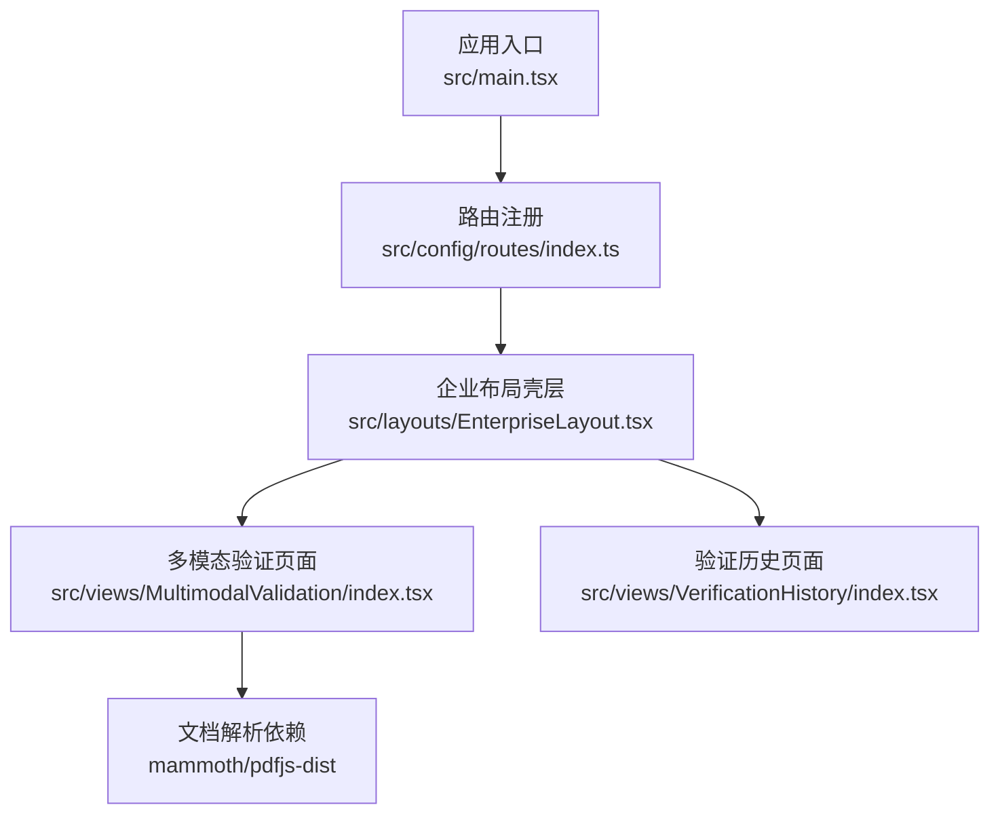
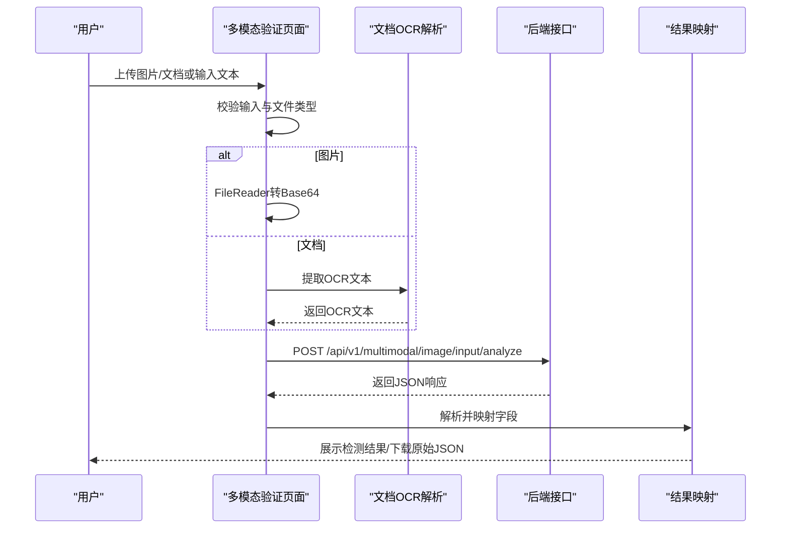
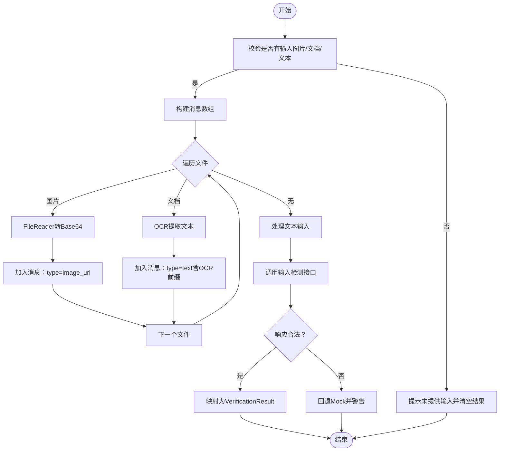
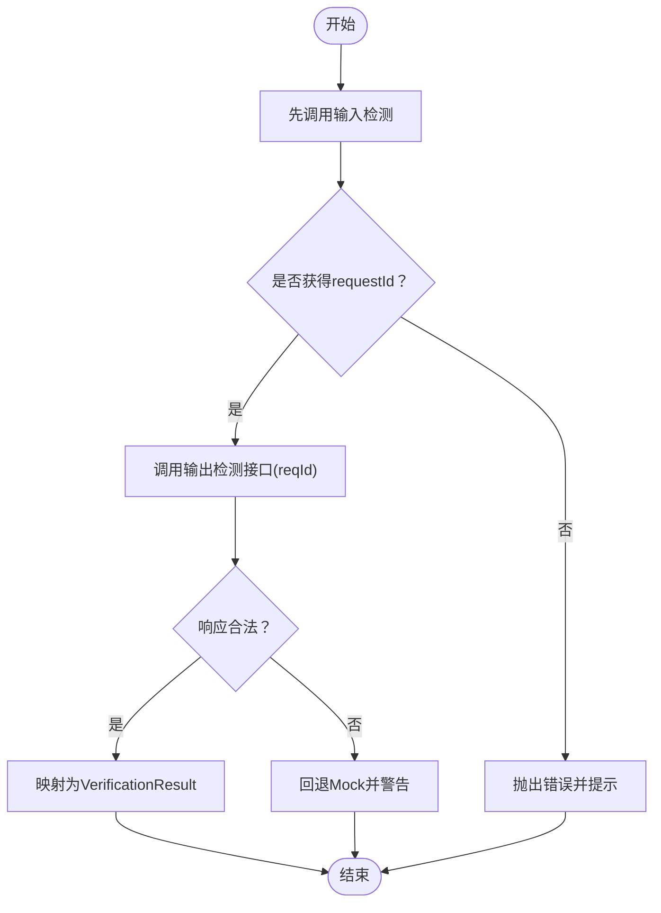
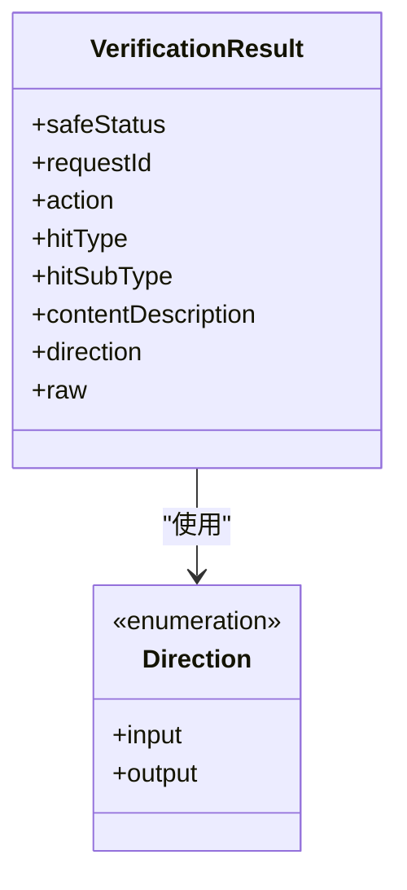
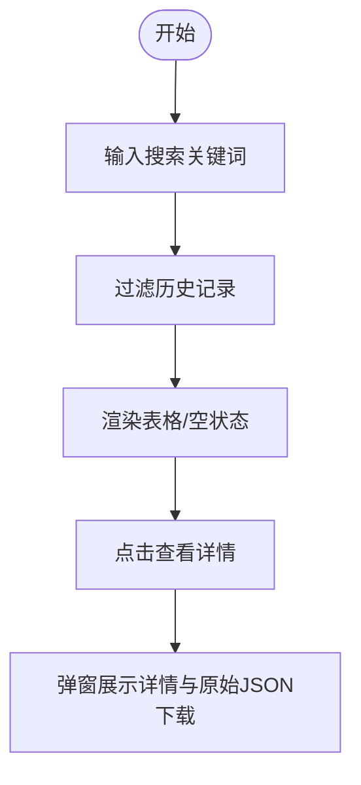
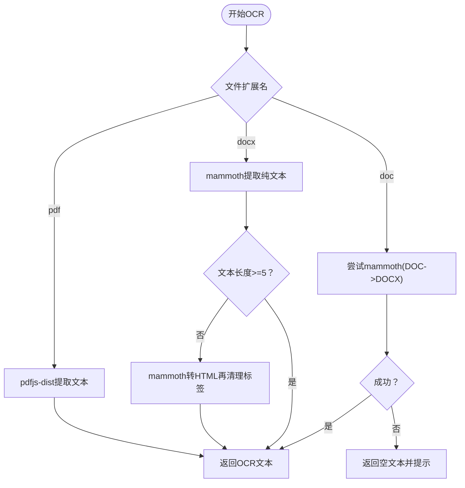
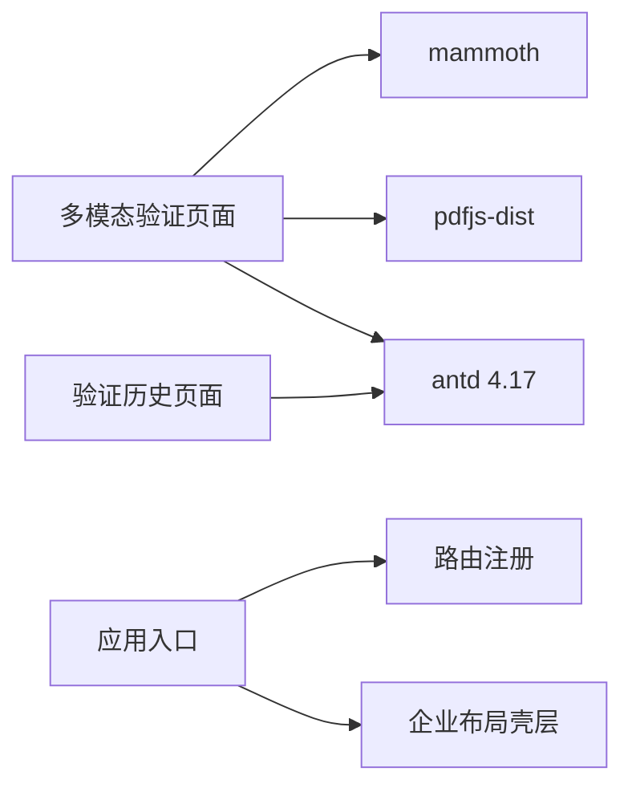

# 多模态验证组件

<cite>
**本文引用的文件**
- [src/views/MultimodalValidation/index.tsx](file://src/views/MultimodalValidation/index.tsx)
- [src/views/VerificationHistory/index.tsx](file://src/views/VerificationHistory/index.tsx)
- [src/config/routes/index.ts](file://src/config/routes/index.ts)
- [src/main.tsx](file://src/main.tsx)
- [src/layouts/EnterpriseLayout.tsx](file://src/layouts/EnterpriseLayout.tsx)
- [package.json](file://package.json)
- [project_description.md](file://project_description.md)
- [docs/context/architecture.md](file://docs/context/architecture.md)
</cite>

## 目录
1. [简介](#简介)
2. [项目结构](#项目结构)
3. [核心组件](#核心组件)
4. [架构总览](#架构总览)
5. [详细组件分析](#详细组件分析)
6. [依赖关系分析](#依赖关系分析)
7. [性能考量](#性能考量)
8. [故障排查指南](#故障排查指南)
9. [结论](#结论)
10. [附录](#附录)

## 简介
本文件面向APIG项目中的“多模态验证组件”，系统性阐述其作为核心业务功能页面的设计架构与实现逻辑。组件支持图片与文档（DOCX、DOC、PDF）上传，自动进行OCR文本提取（文档）与Base64转换（图片），并提供输入/输出两种检测模式。文档还解释了API接口调用机制、请求参数构建、响应数据处理、文件格式校验、错误处理、加载状态管理与用户反馈机制，并给出配置选项、扩展点与性能优化策略，帮助开发者快速理解与演进该组件。

## 项目结构
- 入口与路由
  - 应用入口位于 [src/main.tsx](file://src/main.tsx)，通过 React Router v6 注册路由，承载企业级布局。
  - 路由集中注册于 [src/config/routes/index.ts](file://src/config/routes/index.ts)，包含首页、多模态验证、验证历史三个页面。
- 页面与布局
  - 多模态验证页面：[src/views/MultimodalValidation/index.tsx](file://src/views/MultimodalValidation/index.tsx)
  - 验证历史页面：[src/views/VerificationHistory/index.tsx](file://src/views/VerificationHistory/index.tsx)
  - 企业级布局壳层：[src/layouts/EnterpriseLayout.tsx](file://src/layouts/EnterpriseLayout.tsx)
- 依赖与技术栈
  - 前端框架：React 17、Ant Design 4.17、react-router-dom 6
  - 文档解析：mammoth（DOCX）、pdfjs-dist（PDF）
  - 构建工具：Vite 5、TypeScript

图表来源
- [src/main.tsx:1-26](file://src/main.tsx#L1-L26)
- [src/config/routes/index.ts:1-26](file://src/config/routes/index.ts#L1-L26)
- [src/layouts/EnterpriseLayout.tsx:1-20](file://src/layouts/EnterpriseLayout.tsx#L1-L20)
- [src/views/MultimodalValidation/index.tsx:1-546](file://src/views/MultimodalValidation/index.tsx#L1-L546)
- [src/views/VerificationHistory/index.tsx:1-603](file://src/views/VerificationHistory/index.tsx#L1-L603)
- [package.json:11-18](file://package.json#L11-L18)

章节来源
- [src/main.tsx:1-26](file://src/main.tsx#L1-L26)
- [src/config/routes/index.ts:1-26](file://src/config/routes/index.ts#L1-L26)
- [src/layouts/EnterpriseLayout.tsx:1-20](file://src/layouts/EnterpriseLayout.tsx#L1-L20)
- [package.json:11-18](file://package.json#L11-L18)

## 核心组件
- 多模态验证页面（MultimodalValidation）
  - 支持图片与文档上传（PNG/JPG/GIF/DOCX/DOC/PDF），自动识别并处理不同文件类型。
  - 图片：通过FileReader转换为Base64 dataURL，随消息体发送。
  - 文档：前端使用mammoth/pdfjs-dist提取文本，拼接为OCR文本后发送。
  - 检测模式：输入检测（独立调用输入接口）与输出检测（先输入检测获取requestId，再调用输出接口）。
  - 结果呈现：安全状态、命中类型、动作、请求ID、内容描述等字段统一映射与展示，并支持原始JSON下载。
- 验证历史页面（VerificationHistory）
  - 展示历史记录，支持按内容摘要与MD5搜索，支持多模态验证与文本检测两个Tab切换。
  - 提供详情弹窗查看完整检测结果与原始JSON下载。

章节来源
- [src/views/MultimodalValidation/index.tsx:183-546](file://src/views/MultimodalValidation/index.tsx#L183-L546)
- [src/views/VerificationHistory/index.tsx:94-603](file://src/views/VerificationHistory/index.tsx#L94-L603)

## 架构总览
组件采用“前端预处理 + 接口调用 + 回退Mock”的架构。前端负责：
- 文件类型判断与格式校验
- 图片Base64转换
- 文档OCR文本提取
- 请求参数构建与发送
- 响应数据解析与结果映射
- 加载状态、错误处理与用户反馈

图表来源
- [src/views/MultimodalValidation/index.tsx:199-298](file://src/views/MultimodalValidation/index.tsx#L199-L298)
- [src/views/MultimodalValidation/index.tsx:300-343](file://src/views/MultimodalValidation/index.tsx#L300-L343)
- [src/views/MultimodalValidation/index.tsx:60-85](file://src/views/MultimodalValidation/index.tsx#L60-L85)

## 详细组件分析

### 组件A：多模态验证页面（输入/输出检测）
- 功能职责
  - 文件上传与类型识别：支持图片与文档，自动区分并处理。
  - 图片处理：FileReader读取为dataURL，作为image_url消息体发送。
  - 文档处理：DOCX使用mammoth提取纯文本；PDF使用pdfjs-dist分页提取文本；DOC优先尝试DOCX解析，失败回退空文本。
  - 检测模式
    - 输入检测：独立调用输入接口，返回包含requestId等字段的结果。
    - 输出检测：先执行输入检测获取requestId，再调用输出接口，携带reqId。
  - 结果映射：统一将后端响应映射为组件内部VerificationResult结构，包含安全状态、命中类型、动作、请求ID、内容描述等。
  - 用户反馈：加载状态、错误提示、成功提示、原始JSON下载。
- 关键流程图（输入检测）

图表来源
- [src/views/MultimodalValidation/index.tsx:199-298](file://src/views/MultimodalValidation/index.tsx#L199-L298)
- [src/views/MultimodalValidation/index.tsx:87-94](file://src/views/MultimodalValidation/index.tsx#L87-L94)
- [src/views/MultimodalValidation/index.tsx:106-181](file://src/views/MultimodalValidation/index.tsx#L106-L181)

- 关键流程图（输出检测）

图表来源
- [src/views/MultimodalValidation/index.tsx:300-343](file://src/views/MultimodalValidation/index.tsx#L300-L343)

- 类型与数据结构

图表来源
- [src/views/MultimodalValidation/index.tsx:16-28](file://src/views/MultimodalValidation/index.tsx#L16-L28)
- [src/views/MultimodalValidation/index.tsx:183-185](file://src/views/MultimodalValidation/index.tsx#L183-L185)

- API调用机制与契约
  - 输入检测：POST /api/v1/multimodal/image/input/analyze
  - 输出检测：POST /api/v1/multimodal/image/output/analyze(reqId)
  - 请求体messages结构：图片为image_url对象，文档为text（带OCR前缀），文本直接为text字段。
  - 响应解析：统一映射到VerificationResult，包含isSafe、action、hitType、subHitType、requestId、contentDescription等。
  - 回退策略：当真实接口调用失败或响应异常时，回退到Mock数据并发出警告，保证UI可继续演示。

章节来源
- [src/views/MultimodalValidation/index.tsx:199-343](file://src/views/MultimodalValidation/index.tsx#L199-L343)
- [src/views/MultimodalValidation/index.tsx:60-85](file://src/views/MultimodalValidation/index.tsx#L60-L85)
- [docs/context/architecture.md:41-47](file://docs/context/architecture.md#L41-L47)
- [project_description.md:23-26](file://project_description.md#L23-L26)

### 组件B：验证历史页面（历史记录与详情）
- 功能职责
  - Tab切换：多模态验证与文本检测两类历史记录。
  - 表格展示：验证时间、完成时间、检测内容摘要、方向、合规状态、MD5、违规类型、任务状态。
  - 搜索：按文件名或MD5过滤。
  - 详情弹窗：展示完整检测结果与原始JSON下载。
- 关键流程图（搜索与加载）

图表来源
- [src/views/VerificationHistory/index.tsx:374-378](file://src/views/VerificationHistory/index.tsx#L374-L378)
- [src/views/VerificationHistory/index.tsx:455-467](file://src/views/VerificationHistory/index.tsx#L455-L467)
- [src/views/VerificationHistory/index.tsx:543-599](file://src/views/VerificationHistory/index.tsx#L543-L599)

章节来源
- [src/views/VerificationHistory/index.tsx:94-603](file://src/views/VerificationHistory/index.tsx#L94-L603)

### 组件C：文档OCR解析（DOCX、DOC、PDF）
- DOCX：使用mammoth提取纯文本；若提取为空，回退HTML转文本并清理标签。
- DOC：优先尝试mammoth（DOCX路径），失败则返回空文本，由上层提示。
- PDF：使用pdfjs-dist加载PDF，限制最多3页，逐页提取文本并拼接。
- 错误处理：捕获解析异常并降级为空文本，同时向用户发出警告提示。

图表来源
- [src/views/MultimodalValidation/index.tsx:106-181](file://src/views/MultimodalValidation/index.tsx#L106-L181)
- [src/views/MultimodalValidation/index.tsx:141-164](file://src/views/MultimodalValidation/index.tsx#L141-L164)
- [src/views/MultimodalValidation/index.tsx:106-139](file://src/views/MultimodalValidation/index.tsx#L106-L139)

章节来源
- [src/views/MultimodalValidation/index.tsx:106-181](file://src/views/MultimodalValidation/index.tsx#L106-L181)

### 组件D：图片上传与Base64转换
- 使用FileReader将图片文件读取为dataURL，作为image_url发送至后端。
- 支持PNG/JPG/JPEG/GIF格式识别与校验。

章节来源
- [src/views/MultimodalValidation/index.tsx:87-94](file://src/views/MultimodalValidation/index.tsx#L87-L94)
- [src/views/MultimodalValidation/index.tsx:102-104](file://src/views/MultimodalValidation/index.tsx#L102-L104)

### 组件E：输入/输出两种检测模式的区别与使用场景
- 输入检测（input）
  - 适用场景：对输入的图片/文档/文本进行合规性初审，产出requestId。
  - 特点：独立调用，无需前置条件。
- 输出检测（output）
  - 适用场景：在生成内容（如大模型生成的图片/内容）完成后进行二次合规性复核。
  - 特点：必须先执行输入检测获取requestId，并将其作为reqId传入输出检测接口。
- 使用建议
  - 先输入检测，再输出检测，确保链路可追踪与可审计。
  - 在内网环境或接口不可用时，组件会回退到Mock数据，保障体验连续性。

章节来源
- [src/views/MultimodalValidation/index.tsx:199-343](file://src/views/MultimodalValidation/index.tsx#L199-L343)
- [docs/context/architecture.md:45](file://docs/context/architecture.md#L45)

## 依赖关系分析
- 外部依赖
  - 文档解析：mammoth（DOCX）、pdfjs-dist（PDF）
  - UI框架：antd 4.17、react 17、react-router-dom 6
  - 构建：vite 5、typescript
- 组件耦合
  - 多模态验证页面与文档解析库存在运行时动态导入，避免打包体积过大。
  - 验证历史页面与多模态验证页面解耦，通过路由与数据结构相互独立。

图表来源
- [package.json:11-18](file://package.json#L11-L18)
- [src/views/MultimodalValidation/index.tsx:106-181](file://src/views/MultimodalValidation/index.tsx#L106-L181)
- [src/views/VerificationHistory/index.tsx:1-18](file://src/views/VerificationHistory/index.tsx#L1-L18)
- [src/main.tsx:1-26](file://src/main.tsx#L1-L26)
- [src/config/routes/index.ts:1-26](file://src/config/routes/index.ts#L1-L26)
- [src/layouts/EnterpriseLayout.tsx:1-20](file://src/layouts/EnterpriseLayout.tsx#L1-L20)

章节来源
- [package.json:11-18](file://package.json#L11-L18)
- [src/views/MultimodalValidation/index.tsx:106-181](file://src/views/MultimodalValidation/index.tsx#L106-L181)
- [src/views/VerificationHistory/index.tsx:1-18](file://src/views/VerificationHistory/index.tsx#L1-L18)
- [src/main.tsx:1-26](file://src/main.tsx#L1-L26)
- [src/config/routes/index.ts:1-26](file://src/config/routes/index.ts#L1-L26)
- [src/layouts/EnterpriseLayout.tsx:1-20](file://src/layouts/EnterpriseLayout.tsx#L1-L20)

## 性能考量
- 文档OCR解析
  - DOCX：优先提取纯文本，若为空则回退HTML清理，避免阻塞主线程。
  - PDF：限制最多3页，减少文本拼接开销。
- 图片处理
  - 使用FileReader同步读取，建议在大文件场景下考虑分块或异步策略，避免阻塞UI。
- 接口调用
  - 已内置回退Mock，接口失败时快速恢复用户体验；建议在真实环境中增加超时与重试策略。
- 渲染优化
  - 使用useMemo缓存acceptExt与rows，减少不必要的重渲染。
  - 表格分页与空状态处理，提升大数据量下的交互流畅度。

章节来源
- [src/views/MultimodalValidation/index.tsx:155-163](file://src/views/MultimodalValidation/index.tsx#L155-L163)
- [src/views/VerificationHistory/index.tsx:132-372](file://src/views/VerificationHistory/index.tsx#L132-L372)

## 故障排查指南
- 常见问题
  - 未提供输入：检查图片/文档/文本输入是否为空，组件会提示并清空结果。
  - 文档解析失败：组件会发出警告并提示使用文本输入为主；确认文件格式与内容。
  - 接口调用失败：组件会回退Mock并发出警告；检查网络与后端接口可用性。
  - 输出检测缺少requestId：先执行输入检测，确保返回requestId后再执行输出检测。
- 错误处理与反馈
  - 组件通过message与Result/Error组件进行用户反馈，支持重试按钮与关闭提示。
  - 历史页面提供“重试”按钮与错误状态展示，便于定位问题。

章节来源
- [src/views/MultimodalValidation/index.tsx:345-385](file://src/views/MultimodalValidation/index.tsx#L345-L385)
- [src/views/MultimodalValidation/index.tsx:230-235](file://src/views/MultimodalValidation/index.tsx#L230-L235)
- [src/views/MultimodalValidation/index.tsx:304-306](file://src/views/MultimodalValidation/index.tsx#L304-L306)
- [src/views/VerificationHistory/index.tsx:501-518](file://src/views/VerificationHistory/index.tsx#L501-L518)

## 结论
多模态验证组件通过清晰的输入/输出检测模式、完善的文件格式校验与OCR解析、稳健的错误回退与用户反馈机制，构建了可扩展、可维护的前端验证能力。结合验证历史页面，形成从“输入合规—输出复核—历史追溯”的闭环。建议在真实环境下进一步完善接口超时/重试、大文件处理与并发控制，持续优化用户体验与系统稳定性。

## 附录
- 配置选项与扩展点
  - 文件类型扩展：可在acceptExt处添加更多扩展名，配合OCR解析函数扩展。
  - 检测模式扩展：可新增其他检测模式（如文本检测），复用消息体构建与结果映射逻辑。
  - 接口扩展：可替换或扩展postJson函数，支持鉴权、埋点、日志上报等。
- 性能优化建议
  - 文档OCR：对大文件采用分页/分块策略，或在服务端进行OCR处理。
  - 图片：对大图进行压缩或缩略图预览，减少传输与渲染压力。
  - 缓存：对重复文件MD5校验与结果缓存，减少重复请求。
- 安全与合规
  - 注意敏感内容（如身份证、合同）的处理与存储，遵循数据隐私保护要求。
  - 在内网环境部署时，确保pdfjs-dist worker资源可访问或本地化。