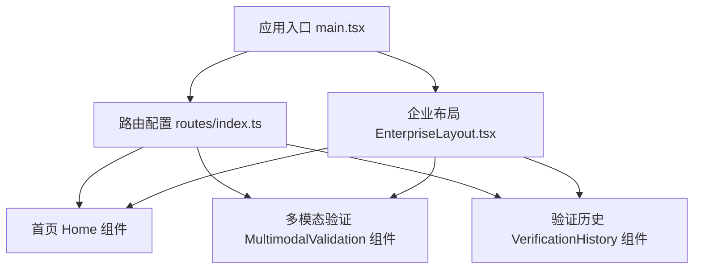
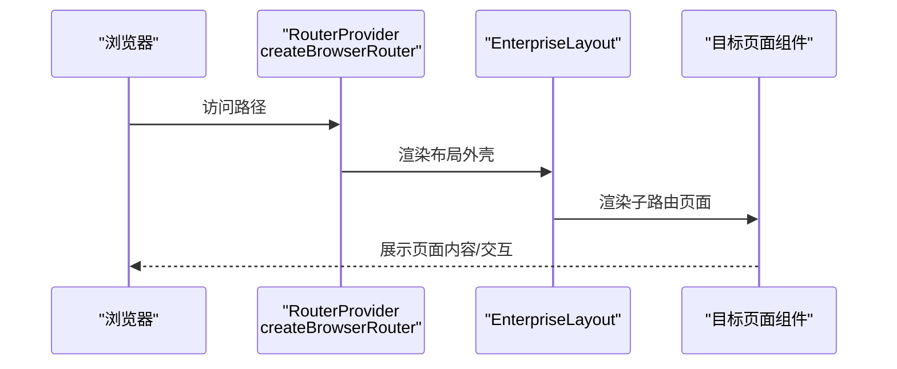
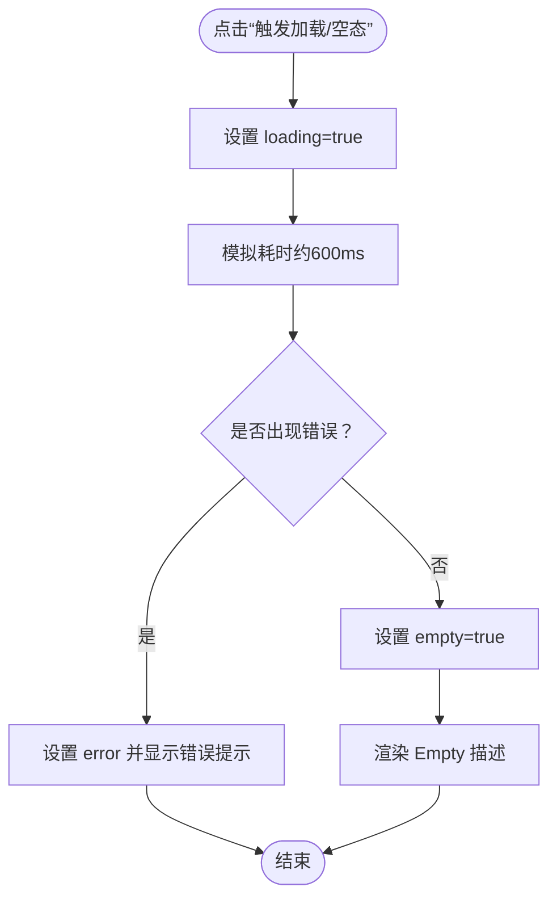
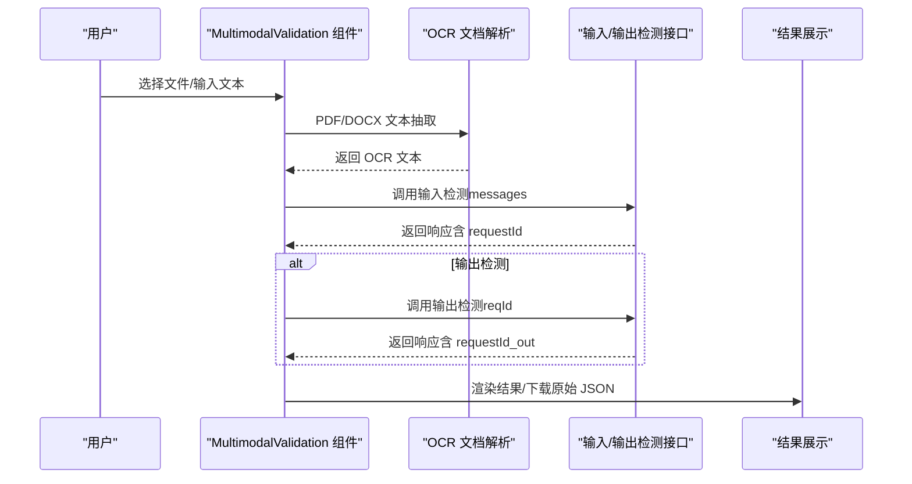
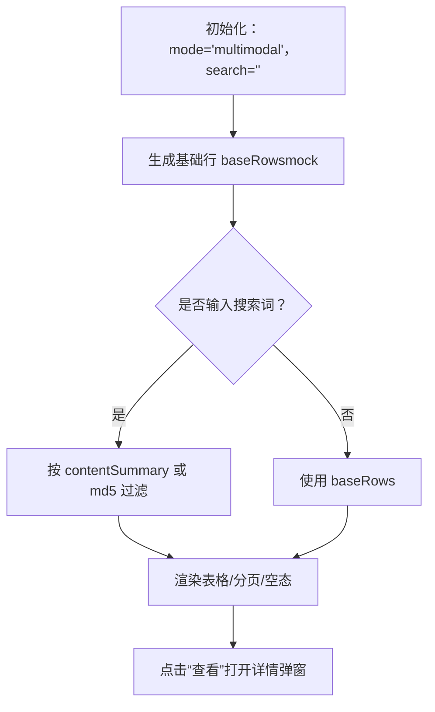
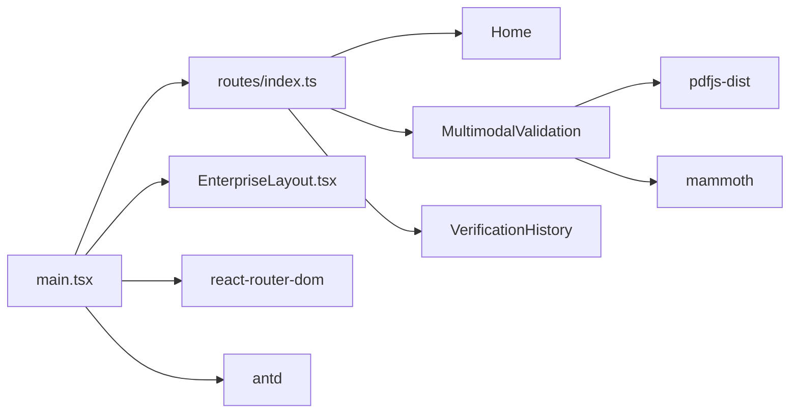

# 页面组件

<cite>
**本文引用的文件**
- [src/views/Home/index.tsx](file://src/views/Home/index.tsx)
- [src/views/MultimodalValidation/index.tsx](file://src/views/MultimodalValidation/index.tsx)
- [src/views/VerificationHistory/index.tsx](file://src/views/VerificationHistory/index.tsx)
- [src/config/routes/index.ts](file://src/config/routes/index.ts)
- [src/main.tsx](file://src/main.tsx)
- [src/layouts/EnterpriseLayout.tsx](file://src/layouts/EnterpriseLayout.tsx)
- [package.json](file://package.json)
- [vite.config.ts](file://vite.config.ts)
</cite>

## 目录
1. [简介](#简介)
2. [项目结构](#项目结构)
3. [核心组件](#核心组件)
4. [架构总览](#架构总览)
5. [详细组件分析](#详细组件分析)
6. [依赖分析](#依赖分析)
7. [性能考虑](#性能考虑)
8. [故障排查指南](#故障排查指南)
9. [结论](#结论)
10. [附录](#附录)

## 简介
本文件面向APIG项目的页面组件，系统性梳理首页 Home、多模态验证 MultimodalValidation、验证历史 VerificationHistory 三大页面的功能职责、实现逻辑与用户交互设计。重点覆盖：
- 状态管理模式与数据流处理
- 用户界面设计与交互反馈
- 页面间导航关系、路由配置与参数传递
- 开发规范与性能优化建议

## 项目结构
项目采用基于文件组织的页面级结构，页面组件位于 src/views 下，路由集中配置于 src/config/routes，应用入口在 src/main.tsx 中装配路由与布局。

图表来源
- [src/main.tsx:11-16](file://src/main.tsx#L11-L16)
- [src/config/routes/index.ts:12-25](file://src/config/routes/index.ts#L12-L25)
- [src/layouts/EnterpriseLayout.tsx:8-18](file://src/layouts/EnterpriseLayout.tsx#L8-L18)

章节来源
- [src/main.tsx:1-26](file://src/main.tsx#L1-L26)
- [src/config/routes/index.ts:1-26](file://src/config/routes/index.ts#L1-L26)
- [src/layouts/EnterpriseLayout.tsx:1-20](file://src/layouts/EnterpriseLayout.tsx#L1-L20)

## 核心组件
- 首页 Home：演示 Loading/Empty/Error/Success 等状态切换与用户反馈，用于快速验证 UI 组件与交互。
- 多模态验证 MultimodalValidation：支持图片与文档上传（含 OCR 文本抽取）、文本输入、输入/输出双方向检测、结果展示与原始 JSON 导出。
- 验证历史 VerificationHistory：多模态与文本两类历史记录的表格展示、搜索过滤、详情弹窗、状态标签与 MD5 复制。

章节来源
- [src/views/Home/index.tsx:1-49](file://src/views/Home/index.tsx#L1-L49)
- [src/views/MultimodalValidation/index.tsx:1-546](file://src/views/MultimodalValidation/index.tsx#L1-L546)
- [src/views/VerificationHistory/index.tsx:1-603](file://src/views/VerificationHistory/index.tsx#L1-L603)

## 架构总览
应用使用 React Router v6 与 createBrowserRouter，统一在根路由下挂载企业布局，子路由分别指向三个页面组件。Ant Design v4 提供 UI 组件与主题配置。

图表来源
- [src/main.tsx:11-16](file://src/main.tsx#L11-L16)
- [src/layouts/EnterpriseLayout.tsx:8-18](file://src/layouts/EnterpriseLayout.tsx#L8-L18)
- [src/config/routes/index.ts:12-25](file://src/config/routes/index.ts#L12-L25)

## 详细组件分析

### 首页 Home 组件
- 功能职责
  - 演示基础状态：Loading、Empty、Error、Success。
  - 提供触发按钮，模拟异步加载与状态切换。
- 状态管理
  - 使用 useState 管理 loading、error、empty 三类状态。
  - 通过 message 组件提供轻提示反馈。
- 用户交互设计
  - 卡片右上角按钮触发加载流程，根据状态渲染 Spin、Alert、Empty 或普通内容。
- 数据流
  - 触发 -> 设置 loading -> 模拟耗时 -> 切换 empty -> 成功提示。
- 性能与可维护性
  - 状态粒度清晰，逻辑简单，适合演示与回归测试。

图表来源
- [src/views/Home/index.tsx:9-22](file://src/views/Home/index.tsx#L9-L22)

章节来源
- [src/views/Home/index.tsx:1-49](file://src/views/Home/index.tsx#L1-L49)

### 多模态验证 MultimodalValidation 组件
- 功能职责
  - 支持图片与文档（PDF/DOC/DOCX）上传，文档自动 OCR 抽取文本。
  - 文本输入与图片/文档混合输入。
  - 输入检测与输出检测双向流程，支持请求 ID 串联与 mock 回退。
  - 结果展示与原始 JSON 下载。
- 状态管理
  - 方向 direction（input/output）、文本 textValue、文件列表 fileList。
  - 验证中 verifying、错误 error、结果 result。
  - 通过 useMemo 缓存 acceptExt 与结果转换。
- 数据流
  - 上传文件/文本 -> 组装消息数组 -> 调用输入检测接口 -> 成功则进入输出检测（携带 requestId）-> 返回结果 -> 下载原始 JSON。
  - 接口失败时回退至 mock 数据，保证 UI 流程可走通。
- 用户交互设计
  - 左侧输入区：拖拽上传、文件移除、文本输入、方向切换、验证/重置按钮。
  - 右侧结果区：Loading、错误结果、检测结果卡片、原始 JSON 下载。
- 复杂逻辑
  - 文档 OCR：PDF 使用 pdfjs-dist，DOC/DOCX 使用 mammoth，失败时降级提示。
  - 请求构造：图片转 dataURL，文档转 OCR 文本，统一封装为 messages 数组。
  - 接口调用：postJson 封装 fetch，toVerificationResult 解析响应为统一结构。
  - mock 回退：输入检测与输出检测均具备 mock 回退，提升内网联调体验。

图表来源
- [src/views/MultimodalValidation/index.tsx:199-385](file://src/views/MultimodalValidation/index.tsx#L199-L385)
- [src/views/MultimodalValidation/index.tsx:141-164](file://src/views/MultimodalValidation/index.tsx#L141-L164)
- [src/views/MultimodalValidation/index.tsx:106-139](file://src/views/MultimodalValidation/index.tsx#L106-L139)

章节来源
- [src/views/MultimodalValidation/index.tsx:1-546](file://src/views/MultimodalValidation/index.tsx#L1-L546)

### 验证历史 VerificationHistory 组件
- 功能职责
  - 展示多模态与文本两类历史记录，支持搜索过滤、分页与详情弹窗。
  - 表格列包含：验证时间、完成时间、检测内容、方向、是否合规、文件 MD5、违规类型、任务状态。
- 状态管理
  - 模式 mode（multimodal/text）、搜索词 search。
  - 加载 loading、错误 error。
  - 详情弹窗 detailVisible 与 detailRow。
- 数据流
  - 基础数据 baseRows（mock）按模式切换；search 过滤 filteredRows；columns 定义表格列与渲染逻辑。
  - doSearch 模拟请求延迟，更新提示。
- 用户交互设计
  - 顶部搜索框与 Tabs 切换；表格行操作“查看”打开详情弹窗；MD5 支持复制；支持下载原始 JSON。
- 复杂逻辑
  - 违规类型 cell：仅展示前两项，其余用 +n 并 Tooltip 展示全部。
  - 标签渲染：合规/不合规、任务状态、方向标签。
  - 详情弹窗：展示安全状态、命中类型、二级类型、检测方向、内容描述、违规类型与原始 JSON 下载。

图表来源
- [src/views/VerificationHistory/index.tsx:132-372](file://src/views/VerificationHistory/index.tsx#L132-L372)
- [src/views/VerificationHistory/index.tsx:380-453](file://src/views/VerificationHistory/index.tsx#L380-L453)
- [src/views/VerificationHistory/index.tsx:455-467](file://src/views/VerificationHistory/index.tsx#L455-L467)

章节来源
- [src/views/VerificationHistory/index.tsx:1-603](file://src/views/VerificationHistory/index.tsx#L1-L603)

## 依赖分析
- 路由与入口
  - main.tsx 使用 createBrowserRouter 包裹 EnterpriseLayout，并在 children 中注入 routes。
  - routes/index.ts 定义三页面路由，使用 element 字段声明组件实例。
- 布局
  - EnterpriseLayout 提供统一 Header 与 Content 区域，Outlet 承载子路由页面。
- 依赖与构建
  - package.json 指定 antd、react、react-router-dom、pdfjs-dist、mammoth 等依赖。
  - vite.config.ts 配置别名 @ 指向 src，开发服务器端口 5173。

图表来源
- [src/main.tsx:11-16](file://src/main.tsx#L11-L16)
- [src/config/routes/index.ts:12-25](file://src/config/routes/index.ts#L12-L25)
- [src/layouts/EnterpriseLayout.tsx:8-18](file://src/layouts/EnterpriseLayout.tsx#L8-L18)
- [package.json:11-17](file://package.json#L11-L17)
- [vite.config.ts:7-11](file://vite.config.ts#L7-L11)

章节来源
- [src/main.tsx:1-26](file://src/main.tsx#L1-L26)
- [src/config/routes/index.ts:1-26](file://src/config/routes/index.ts#L1-L26)
- [src/layouts/EnterpriseLayout.tsx:1-20](file://src/layouts/EnterpriseLayout.tsx#L1-L20)
- [package.json:1-28](file://package.json#L1-L28)
- [vite.config.ts:1-16](file://vite.config.ts#L1-L16)

## 性能考虑
- 状态与渲染
  - 使用 useMemo 缓存 acceptExt 与 columns，减少不必要的重渲染。
  - 多模态验证中对 OCR 文档解析采用按需导入，避免首屏体积过大。
- 网络与回退
  - 输入/输出检测接口失败时回退 mock，保证 UI 流程稳定，降低联调阻塞。
- 交互反馈
  - Loading/Empty/Error/Success 状态明确，配合 message 提示，提升用户体验。
- 建议
  - 对 VerificationHistory 的搜索可引入防抖策略，减少频繁请求。
  - 对 MultimodalValidation 的 OCR 文档解析可增加进度提示与超时控制。
  - 对大表格分页与虚拟滚动（如后续扩展）可进一步优化长列表性能。

## 故障排查指南
- 首页 Home
  - 症状：点击按钮无反应或状态不切换。
  - 排查：确认按钮事件绑定与状态更新逻辑；检查 message 是否被覆盖。
- 多模态验证
  - 症状：上传文件后未触发验证或报错。
  - 排查：检查文件类型与大小；确认 OCR 文档解析是否抛错；查看接口返回结构是否包含 requestId。
  - 症状：输出检测报错“缺少 requestId”。
  - 排查：确保先完成输入检测并正确获取 requestId。
  - 症状：PDF/DOCX 解析失败。
  - 排查：确认 pdfjs-dist 与 mammoth 版本兼容；检查文件是否损坏。
- 验证历史
  - 症状：搜索无结果或异常。
  - 排查：确认搜索词大小写与过滤逻辑；检查 baseRows 数据是否正确。
  - 症状：详情弹窗无法关闭或内容为空。
  - 排查：确认 detailRow 是否赋值；检查弹窗可见性状态。

章节来源
- [src/views/Home/index.tsx:9-22](file://src/views/Home/index.tsx#L9-L22)
- [src/views/MultimodalValidation/index.tsx:292-298](file://src/views/MultimodalValidation/index.tsx#L292-L298)
- [src/views/MultimodalValidation/index.tsx:300-343](file://src/views/MultimodalValidation/index.tsx#L300-L343)
- [src/views/MultimodalValidation/index.tsx:141-164](file://src/views/MultimodalValidation/index.tsx#L141-L164)
- [src/views/MultimodalValidation/index.tsx:106-139](file://src/views/MultimodalValidation/index.tsx#L106-L139)
- [src/views/VerificationHistory/index.tsx:455-467](file://src/views/VerificationHistory/index.tsx#L455-L467)

## 结论
本项目页面组件围绕状态驱动与用户反馈展开，Home 用于演示基础状态切换，MultimodalValidation 实现了从输入到输出的完整链路与 mock 回退，VerificationHistory 提供了结构化的数据展示与交互细节。整体架构清晰、职责明确，具备良好的可扩展性与可维护性。

## 附录
- 路由配置与页面映射
  - 首页：/（Home）
  - 多模态验证：/multimodal-validation（MultimodalValidation）
  - 验证历史：/verification-history（VerificationHistory）

章节来源
- [src/config/routes/index.ts:12-25](file://src/config/routes/index.ts#L12-L25)