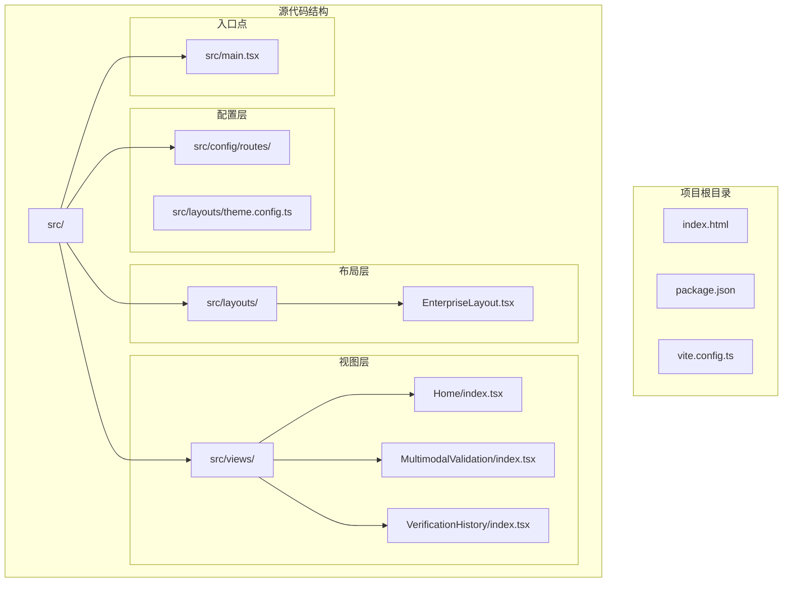
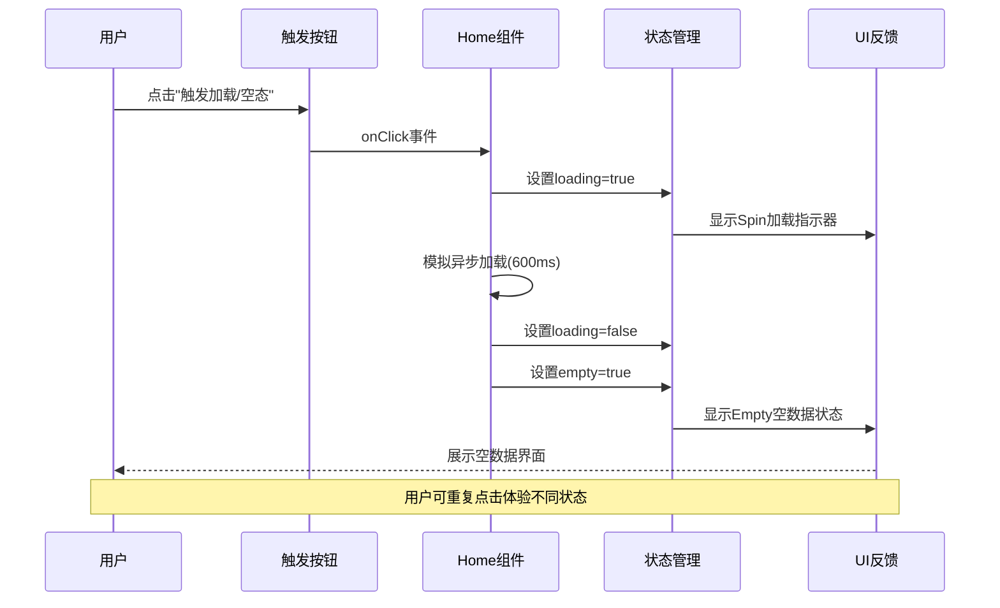
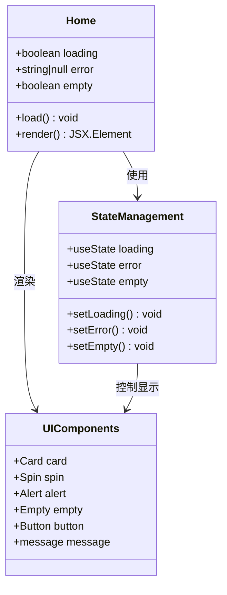
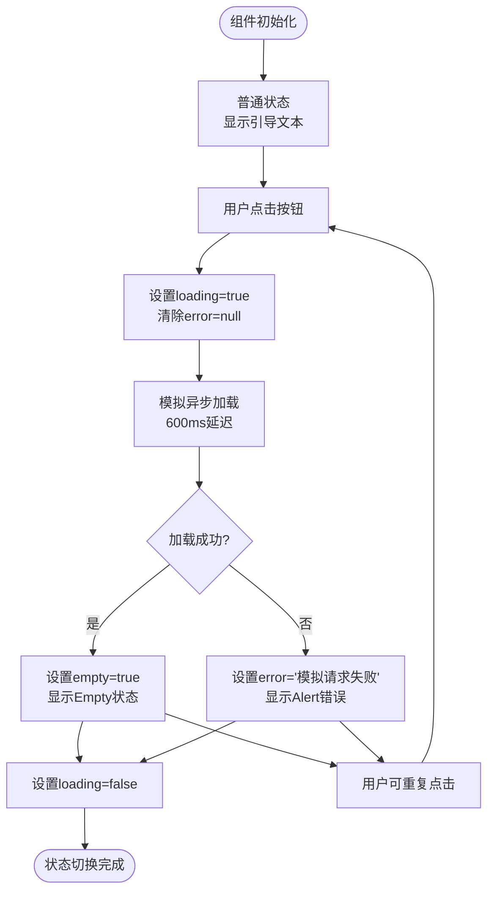
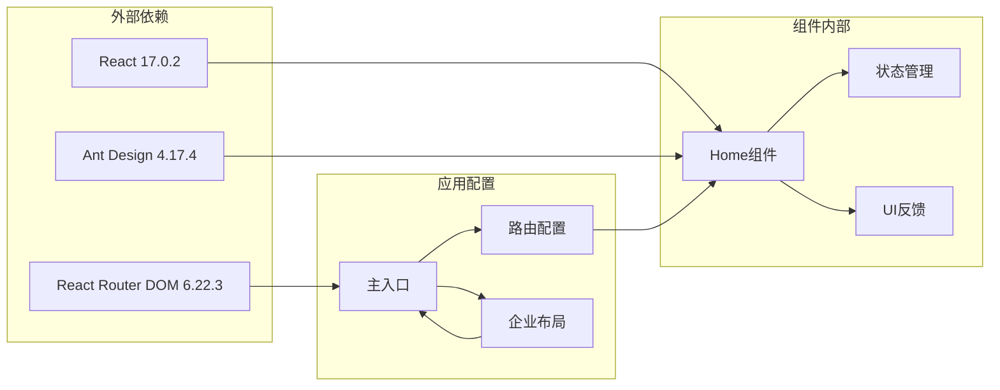

# 首页组件

<cite>
**本文档中引用的文件**
- [src/views/Home/index.tsx](file://src/views/Home/index.tsx)
- [src/main.tsx](file://src/main.tsx)
- [src/config/routes/index.ts](file://src/config/routes/index.ts)
- [src/layouts/EnterpriseLayout.tsx](file://src/layouts/EnterpriseLayout.tsx)
- [package.json](file://package.json)
</cite>

## 目录
1. [简介](#简介)
2. [项目结构](#项目结构)
3. [核心组件](#核心组件)
4. [架构概览](#架构概览)
5. [详细组件分析](#详细组件分析)
6. [依赖关系分析](#依赖关系分析)
7. [性能考虑](#性能考虑)
8. [故障排除指南](#故障排除指南)
9. [结论](#结论)

## 简介

APIG项目的首页组件（Home组件）是一个演示性页面，专门用于展示React + Ant Design 4.x在企业级应用中的状态管理和UI反馈模式。该组件通过模拟异步加载过程，展示了三种核心状态：加载中（Loading）、错误（Error）和空数据（Empty），为开发者提供了完整的用户体验设计参考。

该组件采用现代化的React Hooks模式，结合Ant Design的反馈组件，实现了优雅的状态切换和用户交互流程。通过简单的按钮触发机制，用户可以直观地体验到不同状态下的界面表现和交互行为。

## 项目结构

APIG项目采用模块化的文件组织方式，Home组件位于视图层的专用目录中，体现了清晰的分层架构设计。

**图表来源**
- [src/views/Home/index.tsx:1-49](file://src/views/Home/index.tsx#L1-L49)
- [src/config/routes/index.ts:1-26](file://src/config/routes/index.ts#L1-L26)
- [src/main.tsx:1-26](file://src/main.tsx#L1-L26)

**章节来源**
- [src/views/Home/index.tsx:1-49](file://src/views/Home/index.tsx#L1-L49)
- [src/config/routes/index.ts:1-26](file://src/config/routes/index.ts#L1-L26)
- [src/main.tsx:1-26](file://src/main.tsx#L1-L26)

## 核心组件

Home组件是整个应用的演示核心，它集成了多种Ant Design反馈组件来展示不同的状态场景。组件的核心功能包括状态管理、异步加载模拟和用户交互响应。

### 组件状态管理

组件使用React的useState Hook管理三个核心状态：
- **loading**: 控制加载状态的布尔值
- **error**: 存储错误信息的字符串或null值
- **empty**: 控制空数据状态的布尔值

### 异步加载机制

组件内置了一个模拟的异步加载函数，通过Promise和setTimeout实现延迟效果，模拟真实的网络请求过程。这个机制为开发者提供了完整的状态切换演示。

### UI反馈系统

组件集成了Ant Design的四种核心反馈组件：
- **Spin**: 加载指示器
- **Alert**: 错误消息提示
- **Empty**: 空数据占位符
- **Card**: 内容容器和布局基础

**章节来源**
- [src/views/Home/index.tsx:4-22](file://src/views/Home/index.tsx#L4-L22)

## 架构概览

Home组件在整个应用架构中扮演着演示和测试的角色，它通过路由系统被集成到企业级布局中，形成了完整的前端应用架构。

**图表来源**
- [src/views/Home/index.tsx:9-22](file://src/views/Home/index.tsx#L9-L22)
- [src/config/routes/index.ts:12-16](file://src/config/routes/index.ts#L12-L16)

**章节来源**
- [src/views/Home/index.tsx:24-48](file://src/views/Home/index.tsx#L24-L48)
- [src/layouts/EnterpriseLayout.tsx:7-18](file://src/layouts/EnterpriseLayout.tsx#L7-L18)

## 详细组件分析

### 组件结构设计

Home组件采用了简洁而功能完整的结构设计，通过Flexbox布局实现了响应式的页面组织。

**图表来源**
- [src/views/Home/index.tsx:4-48](file://src/views/Home/index.tsx#L4-L48)

### 状态切换逻辑

组件实现了三种主要状态之间的智能切换，确保用户能够获得清晰的反馈和良好的体验。

**图表来源**
- [src/views/Home/index.tsx:9-22](file://src/views/Home/index.tsx#L9-L22)

### UI组件集成分析

组件巧妙地集成了Ant Design的多种反馈组件，每种组件都有其特定的使用场景和最佳实践。

#### Card组件的应用

Card作为容器组件，提供了标准的企业级内容展示框架，支持标题、额外操作区域和内容区域的灵活组合。

#### Spin组件的使用

Spin组件提供了旋转加载指示器，通过设置适当的尺寸和颜色，确保在不同背景下的可见性和一致性。

#### Alert组件的配置

Alert组件用于显示错误信息，支持多种类型和图标显示，为用户提供明确的错误反馈。

#### Empty组件的展示

Empty组件专门用于空数据状态的优雅展示，提供了丰富的自定义选项和扩展能力。

**章节来源**
- [src/views/Home/index.tsx:24-48](file://src/views/Home/index.tsx#L24-L48)

## 依赖关系分析

Home组件的依赖关系相对简单但功能完整，主要依赖于React和Ant Design生态系统。

**图表来源**
- [package.json:11-18](file://package.json#L11-L18)
- [src/main.tsx:1-26](file://src/main.tsx#L1-L26)
- [src/config/routes/index.ts:1-26](file://src/config/routes/index.ts#L1-L26)

**章节来源**
- [package.json:1-28](file://package.json#L1-L28)
- [src/main.tsx:1-26](file://src/main.tsx#L1-L26)

## 性能考虑

虽然Home组件主要用于演示，但在性能方面仍有一些重要的考量因素：

### 状态更新优化

组件使用了合理的状态更新策略，避免了不必要的重渲染。通过精确的状态管理，确保只有在状态变化时才触发UI更新。

### 异步操作处理

模拟的异步加载通过Promise和setTimeout实现，延迟时间为600毫秒，这个时间点既足够让用户感知到加载过程，又不会造成过长的等待时间。

### 内存管理

组件没有持久化存储任何数据，所有状态都在组件内部管理，确保了内存使用的可控性。

## 故障排除指南

### 常见问题及解决方案

**问题1：状态无法正确切换**
- 检查状态更新函数是否正确调用
- 确认异步操作的Promise链路完整性
- 验证finally块中的状态重置逻辑

**问题2：UI反馈不显示**
- 确认Ant Design组件的导入正确性
- 检查CSS样式的加载状态
- 验证组件的渲染条件判断逻辑

**问题3：按钮点击无响应**
- 检查onClick事件绑定
- 确认事件处理器的this上下文
- 验证异步函数的执行权限

### 调试技巧

1. **状态监控**：使用浏览器开发者工具监控组件状态变化
2. **日志输出**：在关键状态转换点添加console.log语句
3. **条件断点**：在状态判断处设置断点进行调试

**章节来源**
- [src/views/Home/index.tsx:9-22](file://src/views/Home/index.tsx#L9-L22)

## 结论

APIG项目的Home组件是一个精心设计的演示组件，它成功地展示了现代React应用中状态管理和UI反馈的最佳实践。通过简洁的代码结构和完整的功能实现，该组件为开发者提供了宝贵的参考案例。

组件的主要优势包括：
- **清晰的状态管理**：通过三个核心状态实现了完整的用户体验覆盖
- **优雅的UI反馈**：合理运用Ant Design组件提供了专业的视觉效果
- **良好的可维护性**：模块化的代码结构便于理解和扩展
- **实用的演示价值**：为类似场景提供了直接的实现参考

对于企业级应用开发而言，Home组件不仅是一个功能演示，更是状态管理、用户体验设计和组件集成的综合体现。它为构建高质量的React应用提供了重要的指导意义。