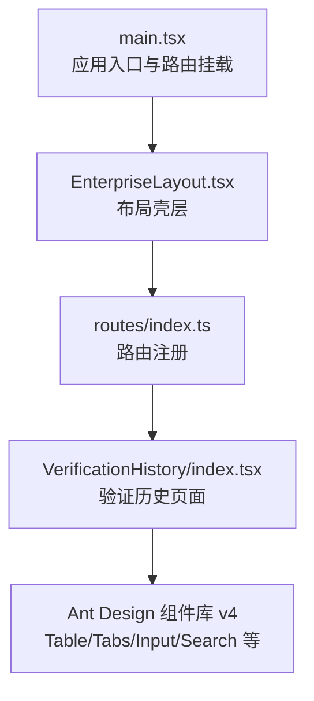
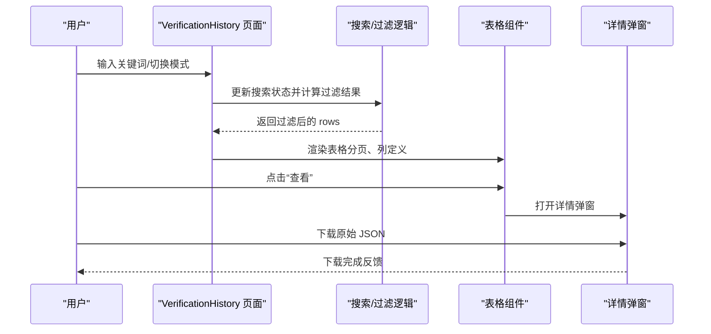
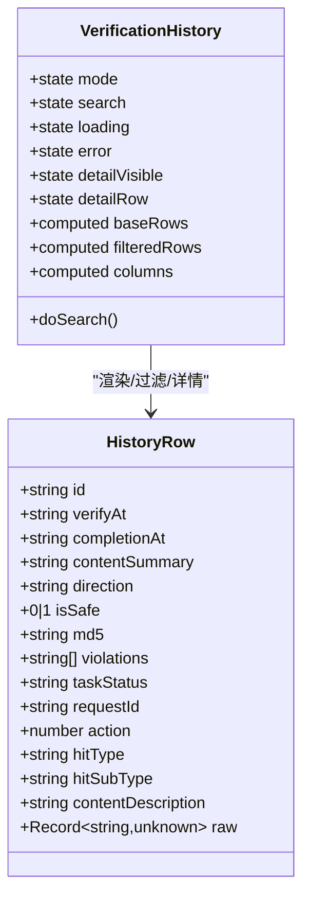
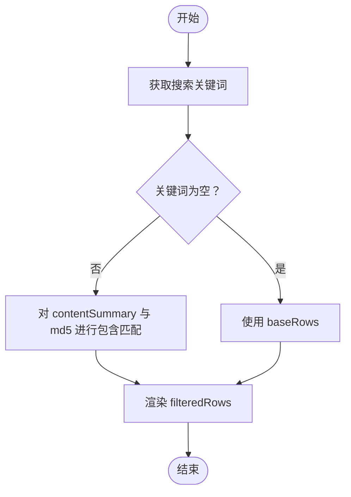

# 验证历史组件

<cite>
**本文引用的文件**
- [VerificationHistory/index.tsx](file://src/views/VerificationHistory/index.tsx)
- [routes/index.ts](file://src/config/routes/index.ts)
- [main.tsx](file://src/main.tsx)
- [EnterpriseLayout.tsx](file://src/layouts/EnterpriseLayout.tsx)
- [architecture.md](file://docs/context/architecture.md)
- [constraints.md](file://docs/context/constraints.md)
- [project_description.md](file://project_description.md)
- [heuristic-report.md](file://docs/ux/verification-history/heuristic-report.md)
- [tables.md](file://das-ued-skills/opt/b-admin-pencil-design/core/components/tables.md)
- [search-bars.md](file://das-ued-skills/opt/b-admin-pencil-design/core/components/search-bars.md)
- [page-card-grid.md](file://das-ued-skills/opt/b-admin-pencil-design/core/patterns/page-card-grid.md)
</cite>

## 目录
1. [简介](#简介)
2. [项目结构](#项目结构)
3. [核心组件](#核心组件)
4. [架构总览](#架构总览)
5. [组件详细分析](#组件详细分析)
6. [依赖关系分析](#依赖关系分析)
7. [性能考量](#性能考量)
8. [故障排查指南](#故障排查指南)
9. [结论](#结论)
10. [附录](#附录)

## 简介
本文件面向APIG项目中的“验证历史”组件，系统化阐述历史记录管理页面的设计思路、数据处理逻辑与交互体验。重点覆盖以下方面：
- 历史数据的获取、存储与展示机制
- 搜索过滤功能的实现原理（关键词搜索、日期范围筛选、违规类型分类）
- 历史记录的详情查看、数据导出能力与统计分析
- 表格的排序、分页与响应式设计
- 数据刷新机制、缓存策略与性能优化方案
- 用户操作流程与界面交互最佳实践

## 项目结构
验证历史页面位于 views 层，采用函数组件与受控状态管理，结合 Ant Design v4 组件构建交互。页面通过路由注册与布局壳层统一承载，整体结构如下：

图表来源
- [main.tsx:11-25](file://src/main.tsx#L11-L25)
- [EnterpriseLayout.tsx:8-19](file://src/layouts/EnterpriseLayout.tsx#L8-L19)
- [routes/index.ts:12-25](file://src/config/routes/index.ts#L12-L25)
- [VerificationHistory/index.tsx:94-601](file://src/views/VerificationHistory/index.tsx#L94-L601)

章节来源
- [main.tsx:11-25](file://src/main.tsx#L11-L25)
- [EnterpriseLayout.tsx:8-19](file://src/layouts/EnterpriseLayout.tsx#L8-L19)
- [routes/index.ts:12-25](file://src/config/routes/index.ts#L12-L25)
- [VerificationHistory/index.tsx:94-601](file://src/views/VerificationHistory/index.tsx#L94-L601)

## 核心组件
- 页面容器与布局：卡片容器、垂直间距、背景色与最小高度，满足设计系统规范。
- 搜索与筛选：顶部搜索框（关键词搜索）、模式切换（多模态/文本）。
- 表格展示：列定义、行渲染、分页与空态。
- 详情弹窗：合规状态、命中类型、违规类型、原始 JSON 导出。
- 反馈与错误处理：加载态、空态、错误态与重试按钮。

章节来源
- [VerificationHistory/index.tsx:94-601](file://src/views/VerificationHistory/index.tsx#L94-L601)
- [tables.md:1-57](file://das-ued-skills/opt/b-admin-pencil-design/core/components/tables.md#L1-L57)
- [search-bars.md:73-122](file://das-ued-skills/opt/b-admin-pencil-design/core/components/search-bars.md#L73-L122)
- [page-card-grid.md:203-241](file://das-ued-skills/opt/b-admin-pencil-design/core/patterns/page-card-grid.md#L203-L241)

## 架构总览
验证历史页面的数据流与交互流程如下：

图表来源
- [VerificationHistory/index.tsx:374-378](file://src/views/VerificationHistory/index.tsx#L374-L378)
- [VerificationHistory/index.tsx:455-467](file://src/views/VerificationHistory/index.tsx#L455-L467)
- [VerificationHistory/index.tsx:543-598](file://src/views/VerificationHistory/index.tsx#L543-L598)

章节来源
- [VerificationHistory/index.tsx:374-378](file://src/views/VerificationHistory/index.tsx#L374-L378)
- [VerificationHistory/index.tsx:455-467](file://src/views/VerificationHistory/index.tsx#L455-L467)
- [VerificationHistory/index.tsx:543-598](file://src/views/VerificationHistory/index.tsx#L543-L598)

## 组件详细分析

### 数据模型与列定义
- 数据模型：HistoryRow 包含验证时间、完成时间、内容摘要、方向、合规状态、MD5、违规类型、任务状态、请求 ID、命中类型、命中子类型、内容描述与原始数据等字段。
- 列定义：验证时间、完成时间、检测内容、方向、是否合规、文件 MD5、违规类型、任务状态、操作（查看）。
- 渲染策略：合规状态与任务状态使用标签颜色区分；MD5 支持复制与 Tooltip；违规类型支持首两项展示与 Tooltip 展示其余项。

图表来源
- [VerificationHistory/index.tsx:22-40](file://src/views/VerificationHistory/index.tsx#L22-L40)
- [VerificationHistory/index.tsx:132-372](file://src/views/VerificationHistory/index.tsx#L132-L372)
- [VerificationHistory/index.tsx:380-453](file://src/views/VerificationHistory/index.tsx#L380-L453)

章节来源
- [VerificationHistory/index.tsx:22-40](file://src/views/VerificationHistory/index.tsx#L22-L40)
- [VerificationHistory/index.tsx:132-372](file://src/views/VerificationHistory/index.tsx#L132-L372)
- [VerificationHistory/index.tsx:380-453](file://src/views/VerificationHistory/index.tsx#L380-L453)

### 搜索与过滤逻辑
- 关键词搜索：对内容摘要与 MD5 进行大小写无关的包含匹配。
- 模式切换：多模态与文本两种模式，切换时清空搜索并重置错误状态。
- 过滤流程：先根据关键词过滤 baseRows，再将结果传递给表格渲染。

图表来源
- [VerificationHistory/index.tsx:374-378](file://src/views/VerificationHistory/index.tsx#L374-L378)
- [VerificationHistory/index.tsx:491-495](file://src/views/VerificationHistory/index.tsx#L491-L495)

章节来源
- [VerificationHistory/index.tsx:374-378](file://src/views/VerificationHistory/index.tsx#L374-L378)
- [VerificationHistory/index.tsx:491-495](file://src/views/VerificationHistory/index.tsx#L491-L495)

### 表格展示与交互
- 表格列：验证时间、完成时间、检测内容、方向、是否合规、文件 MD5、违规类型、任务状态、操作（查看）。
- 排序：当前未显式设置排序回调，保持默认顺序。
- 分页：每页 5 条，底部居中，不显示尺寸选择器。
- 响应式：通过列宽与容器布局实现自适应，MD5 单元格支持省略与复制。
- 空态：当过滤结果为空时显示空态提示。

章节来源
- [VerificationHistory/index.tsx:380-453](file://src/views/VerificationHistory/index.tsx#L380-L453)
- [VerificationHistory/index.tsx:526-539](file://src/views/VerificationHistory/index.tsx#L526-L539)

### 详情查看与数据导出
- 详情弹窗：展示合规状态、命中类型、命中子类型、检测方向、内容描述、违规类型与原始 JSON。
- 原始 JSON 导出：点击“原始 JSON”按钮下载对应文件。
- 复制 MD5：点击复制按钮将 MD5 复制到剪贴板，并给出成功/失败提示。

章节来源
- [VerificationHistory/index.tsx:543-598](file://src/views/VerificationHistory/index.tsx#L543-L598)
- [VerificationHistory/index.tsx:82-92](file://src/views/VerificationHistory/index.tsx#L82-L92)
- [VerificationHistory/index.tsx:60-80](file://src/views/VerificationHistory/index.tsx#L60-L80)

### 错误处理与反馈
- 错误态：当搜索失败时显示错误结果与重试按钮。
- 加载态：搜索过程中显示旋转指示器。
- 成功反馈：搜索完成后提示“已更新搜索结果”。

章节来源
- [VerificationHistory/index.tsx:501-518](file://src/views/VerificationHistory/index.tsx#L501-L518)
- [VerificationHistory/index.tsx:521-524](file://src/views/VerificationHistory/index.tsx#L521-L524)
- [VerificationHistory/index.tsx:455-467](file://src/views/VerificationHistory/index.tsx#L455-L467)

### 设计系统与交互规范
- 表格密度与高度：遵循设计系统对表格行高与容器边框的要求。
- 搜索工具栏：顶部 Tab 切换 + 搜索框组合，符合设计规范。
- 页面根元素：采用 Flex 布局、间距、背景色与最小高度，满足页面根元素样式要求。

章节来源
- [tables.md:1-57](file://das-ued-skills/opt/b-admin-pencil-design/core/components/tables.md#L1-L57)
- [search-bars.md:73-122](file://das-ued-skills/opt/b-admin-pencil-design/core/components/search-bars.md#L73-L122)
- [page-card-grid.md:203-241](file://das-ued-skills/opt/b-admin-pencil-design/core/patterns/page-card-grid.md#L203-L241)
- [VerificationHistory/index.tsx:469-475](file://src/views/VerificationHistory/index.tsx#L469-L475)

## 依赖关系分析
- 路由与布局：页面通过路由注册与布局壳层统一承载，确保导航与主题一致性。
- 组件依赖：Ant Design v4 提供表格、标签、输入、模态框等基础组件。
- 数据来源：当前为本地内存数据与模拟搜索，预留真实 API 调用逻辑。

图表来源
- [routes/index.ts:12-25](file://src/config/routes/index.ts#L12-L25)
- [EnterpriseLayout.tsx:8-19](file://src/layouts/EnterpriseLayout.tsx#L8-L19)
- [main.tsx:11-25](file://src/main.tsx#L11-L25)
- [VerificationHistory/index.tsx:94-601](file://src/views/VerificationHistory/index.tsx#L94-L601)

章节来源
- [routes/index.ts:12-25](file://src/config/routes/index.ts#L12-L25)
- [EnterpriseLayout.tsx:8-19](file://src/layouts/EnterpriseLayout.tsx#L8-L19)
- [main.tsx:11-25](file://src/main.tsx#L11-L25)
- [VerificationHistory/index.tsx:94-601](file://src/views/VerificationHistory/index.tsx#L94-L601)

## 性能考量
- 计算复杂度：过滤逻辑对 baseRows 进行一次线性扫描，时间复杂度 O(n)，空间复杂度 O(n)。
- 渲染优化：使用 useMemo 缓存 baseRows 与 columns，减少不必要的重渲染。
- 分页策略：每页 5 条，降低单次渲染压力；可按需扩展为服务端分页以提升大数据量场景性能。
- 缓存策略：当前为本地内存数据，建议在接入真实 API 后引入请求去重、缓存失效与增量更新策略。
- 交互反馈：加载态与空态提升用户体验，避免长时间无响应带来的感知延迟。

章节来源
- [VerificationHistory/index.tsx:132-372](file://src/views/VerificationHistory/index.tsx#L132-L372)
- [VerificationHistory/index.tsx:380-453](file://src/views/VerificationHistory/index.tsx#L380-L453)
- [VerificationHistory/index.tsx:526-539](file://src/views/VerificationHistory/index.tsx#L526-L539)

## 故障排查指南
- 搜索失败：检查错误提示与重试按钮，确认网络状态与后端接口可用性。
- 空数据：确认关键词是否正确、模式是否匹配，尝试清除搜索条件。
- 导出失败：确认浏览器允许下载与文件名格式，检查原始数据结构。
- 复制失败：确认浏览器权限与剪贴板 API 可用性，提示用户授权。

章节来源
- [VerificationHistory/index.tsx:501-518](file://src/views/VerificationHistory/index.tsx#L501-L518)
- [VerificationHistory/index.tsx:526-539](file://src/views/VerificationHistory/index.tsx#L526-L539)
- [VerificationHistory/index.tsx:82-92](file://src/views/VerificationHistory/index.tsx#L82-L92)
- [VerificationHistory/index.tsx:69-76](file://src/views/VerificationHistory/index.tsx#L69-L76)

## 结论
验证历史组件以简洁的“模式切换 + 搜索 + 表格”的信息架构，实现了对历史记录的高效检索与可视化呈现。组件在交互反馈、可读性与可维护性方面均遵循设计系统规范。建议后续在真实后端对接时，完善日期范围筛选、违规类型分类与统计分析能力，并引入缓存与分页优化策略，以进一步提升性能与用户体验。

## 附录

### 用户操作流程与最佳实践
- 模式切换：先选择“多模态验证”或“文本检测”，再进行搜索。
- 搜索技巧：优先使用文件名或 MD5 关键词，避免过长模糊词导致结果过多。
- 详情查看：点击“查看”进入详情弹窗，核对命中类型与违规类型，必要时下载原始 JSON 用于审计。
- 复制与导出：使用 MD5 复制按钮快速复制标识，使用“原始 JSON”导出进行归档。

章节来源
- [VerificationHistory/index.tsx:489-499](file://src/views/VerificationHistory/index.tsx#L489-L499)
- [VerificationHistory/index.tsx:479-486](file://src/views/VerificationHistory/index.tsx#L479-L486)
- [VerificationHistory/index.tsx:543-598](file://src/views/VerificationHistory/index.tsx#L543-L598)
- [VerificationHistory/index.tsx:60-80](file://src/views/VerificationHistory/index.tsx#L60-L80)