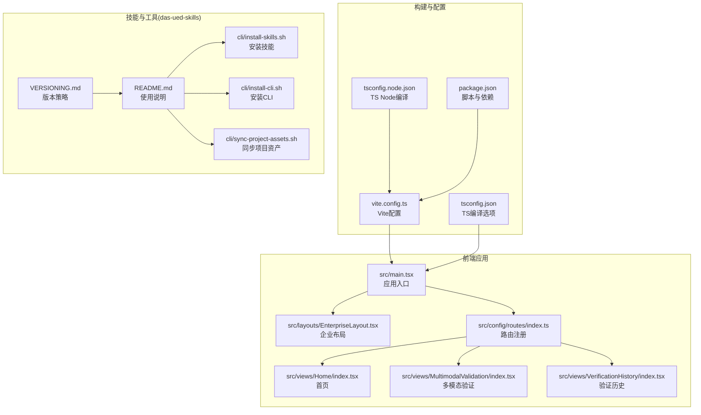
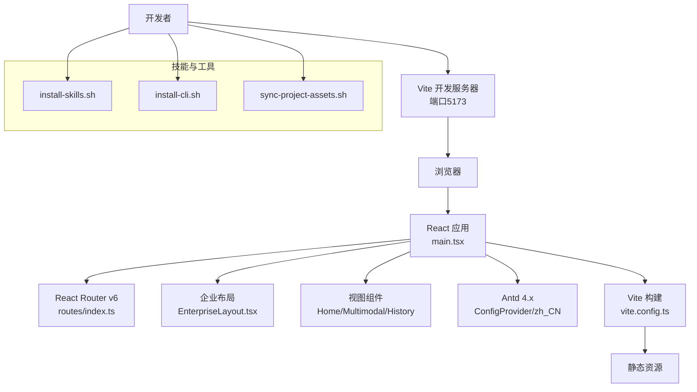
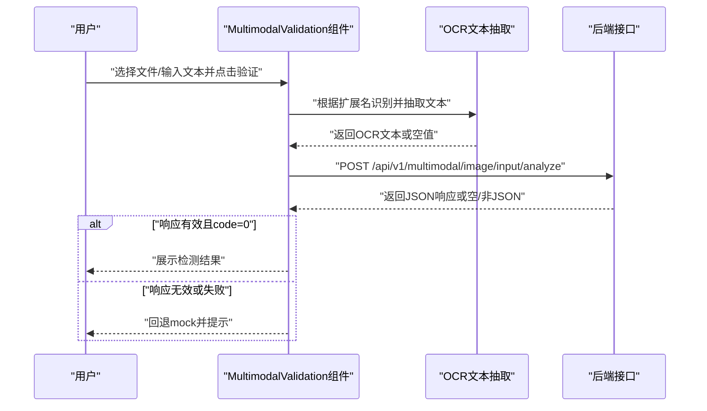
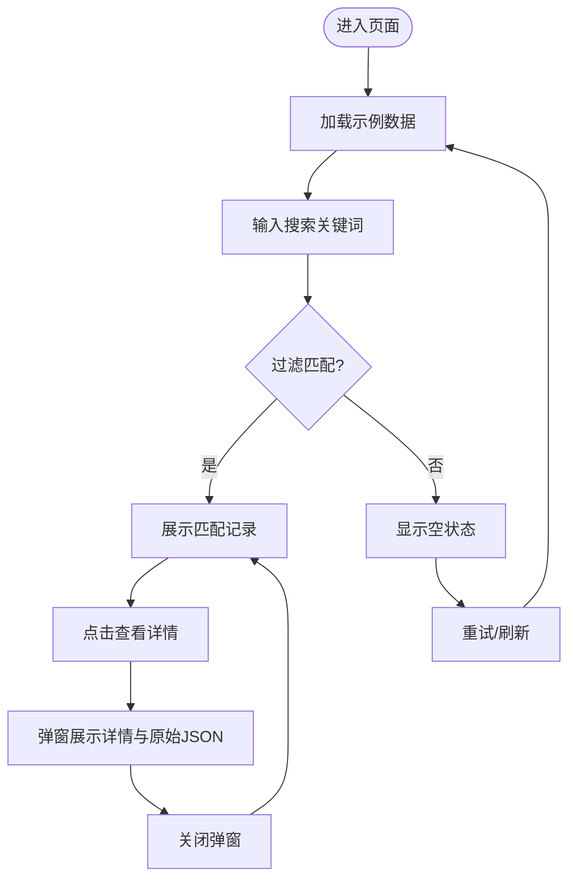
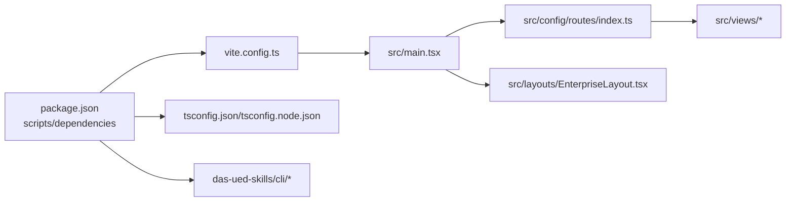

# 故障排除与FAQ

<cite>
**本文引用的文件**
- [package.json](file://package.json)
- [vite.config.ts](file://vite.config.ts)
- [tsconfig.json](file://tsconfig.json)
- [tsconfig.node.json](file://tsconfig.node.json)
- [src/main.tsx](file://src/main.tsx)
- [src/config/routes/index.ts](file://src/config/routes/index.ts)
- [src/layouts/EnterpriseLayout.tsx](file://src/layouts/EnterpriseLayout.tsx)
- [src/views/Home/index.tsx](file://src/views/Home/index.tsx)
- [src/views/MultimodalValidation/index.tsx](file://src/views/MultimodalValidation/index.tsx)
- [src/views/VerificationHistory/index.tsx](file://src/views/VerificationHistory/index.tsx)
- [das-ued-skills/README.md](file://das-ued-skills/README.md)
- [das-ued-skills/VERSIONING.md](file://das-ued-skills/VERSIONING.md)
- [das-ued-skills/cli/install-skills.sh](file://das-ued-skills/cli/install-skills.sh)
- [das-ued-skills/cli/install-cli.sh](file://das-ued-skills/cli/install-cli.sh)
- [das-ued-skills/cli/sync-project-assets.sh](file://das-ued-skills/cli/sync-project-assets.sh)
</cite>

## 目录
1. [引言](#引言)
2. [项目结构](#项目结构)
3. [核心组件](#核心组件)
4. [架构总览](#架构总览)
5. [详细组件分析](#详细组件分析)
6. [依赖关系分析](#依赖关系分析)
7. [性能考虑](#性能考虑)
8. [故障排除指南](#故障排除指南)
9. [结论](#结论)
10. [附录](#附录)

## 引言
本文件旨在为APIG项目提供系统性的故障排除与常见问题解答，覆盖内网环境配置、依赖安装、构建与运行时异常、性能优化、兼容性与安全防护、版本升级与迁移回滚等主题。内容基于仓库实际代码与脚本，提供可操作的诊断步骤、错误解读与修复建议，帮助不同经验水平的开发者快速定位并解决问题。

## 项目结构
APIG是一个基于 Vite + React 17 + TypeScript + Ant Design 4 的前端应用，采用模块化组织与路径别名，路由集中注册于统一文件，布局组件提供企业后台风格外壳。同时包含一套用于AI辅助设计/开发的技能集（das-ued-skills），提供一键安装、全局规则同步与项目资产同步等CLI工具。

图表来源
- [src/main.tsx:1-26](file://src/main.tsx#L1-L26)
- [src/layouts/EnterpriseLayout.tsx:1-20](file://src/layouts/EnterpriseLayout.tsx#L1-L20)
- [src/config/routes/index.ts:1-26](file://src/config/routes/index.ts#L1-L26)
- [src/views/Home/index.tsx:1-49](file://src/views/Home/index.tsx#L1-L49)
- [src/views/MultimodalValidation/index.tsx:1-546](file://src/views/MultimodalValidation/index.tsx#L1-L546)
- [src/views/VerificationHistory/index.tsx:1-603](file://src/views/VerificationHistory/index.tsx#L1-L603)
- [vite.config.ts:1-16](file://vite.config.ts#L1-L16)
- [tsconfig.json:1-25](file://tsconfig.json#L1-L25)
- [tsconfig.node.json:1-11](file://tsconfig.node.json#L1-L11)
- [package.json:1-28](file://package.json#L1-L28)
- [das-ued-skills/README.md:1-351](file://das-ued-skills/README.md#L1-L351)
- [das-ued-skills/VERSIONING.md:1-73](file://das-ued-skills/VERSIONING.md#L1-L73)
- [das-ued-skills/cli/install-skills.sh:1-185](file://das-ued-skills/cli/install-skills.sh#L1-L185)
- [das-ued-skills/cli/install-cli.sh:1-19](file://das-ued-skills/cli/install-cli.sh#L1-L19)
- [das-ued-skills/cli/sync-project-assets.sh:1-119](file://das-ued-skills/cli/sync-project-assets.sh#L1-L119)

章节来源
- [package.json:1-28](file://package.json#L1-L28)
- [vite.config.ts:1-16](file://vite.config.ts#L1-L16)
- [tsconfig.json:1-25](file://tsconfig.json#L1-L25)
- [tsconfig.node.json:1-11](file://tsconfig.node.json#L1-L11)
- [src/main.tsx:1-26](file://src/main.tsx#L1-L26)
- [src/config/routes/index.ts:1-26](file://src/config/routes/index.ts#L1-L26)
- [src/layouts/EnterpriseLayout.tsx:1-20](file://src/layouts/EnterpriseLayout.tsx#L1-L20)
- [src/views/Home/index.tsx:1-49](file://src/views/Home/index.tsx#L1-L49)
- [src/views/MultimodalValidation/index.tsx:1-546](file://src/views/MultimodalValidation/index.tsx#L1-L546)
- [src/views/VerificationHistory/index.tsx:1-603](file://src/views/VerificationHistory/index.tsx#L1-L603)
- [das-ued-skills/README.md:1-351](file://das-ued-skills/README.md#L1-L351)
- [das-ued-skills/VERSIONING.md:1-73](file://das-ued-skills/VERSIONING.md#L1-L73)
- [das-ued-skills/cli/install-skills.sh:1-185](file://das-ued-skills/cli/install-skills.sh#L1-L185)
- [das-ued-skills/cli/install-cli.sh:1-19](file://das-ued-skills/cli/install-cli.sh#L1-L19)
- [das-ued-skills/cli/sync-project-assets.sh:1-119](file://das-ued-skills/cli/sync-project-assets.sh#L1-L119)

## 核心组件
- 应用入口与国际化：应用在入口处配置Ant Design语言包与全局样式，使用React Router v6创建BrowserRouter并挂载到DOM节点。
- 路由系统：路由集中注册于统一文件，使用element字段与React 17语法，便于与后续阶段的element/component自适配对齐。
- 布局组件：企业布局提供Header与Content区域，作为内网模拟环境的最小壳层，后续可替换为完整骨架。
- 视图组件：
  - 首页：演示Loading/Empty/Feedback交互，模拟加载与错误分支。
  - 多模态验证：支持图片与文档上传，OCR文本抽取，调用输入/输出检测接口，具备内网回退mock能力。
  - 验证历史：表格展示历史记录，支持搜索、分页、详情查看与原始JSON导出。

章节来源
- [src/main.tsx:1-26](file://src/main.tsx#L1-L26)
- [src/config/routes/index.ts:1-26](file://src/config/routes/index.ts#L1-L26)
- [src/layouts/EnterpriseLayout.tsx:1-20](file://src/layouts/EnterpriseLayout.tsx#L1-L20)
- [src/views/Home/index.tsx:1-49](file://src/views/Home/index.tsx#L1-L49)
- [src/views/MultimodalValidation/index.tsx:1-546](file://src/views/MultimodalValidation/index.tsx#L1-L546)
- [src/views/VerificationHistory/index.tsx:1-603](file://src/views/VerificationHistory/index.tsx#L1-L603)

## 架构总览
前端采用Vite进行开发与打包，TypeScript提供类型约束，Ant Design提供UI基础组件。路由与布局解耦，视图组件按功能拆分，便于维护与扩展。das-ued-skills提供AI辅助工作流与CLI工具，支持技能安装、全局规则同步与项目资产同步。

图表来源
- [vite.config.ts:1-16](file://vite.config.ts#L1-L16)
- [src/main.tsx:1-26](file://src/main.tsx#L1-L26)
- [src/config/routes/index.ts:1-26](file://src/config/routes/index.ts#L1-L26)
- [src/layouts/EnterpriseLayout.tsx:1-20](file://src/layouts/EnterpriseLayout.tsx#L1-L20)
- [src/views/Home/index.tsx:1-49](file://src/views/Home/index.tsx#L1-L49)
- [src/views/MultimodalValidation/index.tsx:1-546](file://src/views/MultimodalValidation/index.tsx#L1-L546)
- [src/views/VerificationHistory/index.tsx:1-603](file://src/views/VerificationHistory/index.tsx#L1-L603)
- [das-ued-skills/cli/install-skills.sh:1-185](file://das-ued-skills/cli/install-skills.sh#L1-L185)
- [das-ued-skills/cli/install-cli.sh:1-19](file://das-ued-skills/cli/install-cli.sh#L1-L19)
- [das-ued-skills/cli/sync-project-assets.sh:1-119](file://das-ued-skills/cli/sync-project-assets.sh#L1-L119)

## 详细组件分析

### 多模态验证组件（MultimodalValidation）
该组件负责多模态内容的安全检测，支持图片与文档上传，文档OCR文本抽取，调用后端接口并具备内网环境回退mock的能力。其核心流程如下：

图表来源
- [src/views/MultimodalValidation/index.tsx:199-298](file://src/views/MultimodalValidation/index.tsx#L199-L298)

章节来源
- [src/views/MultimodalValidation/index.tsx:1-546](file://src/views/MultimodalValidation/index.tsx#L1-L546)

### 验证历史组件（VerificationHistory）
该组件提供历史记录的查询、筛选与详情查看，支持分页与原始JSON导出。其核心流程如下：

图表来源
- [src/views/VerificationHistory/index.tsx:455-601](file://src/views/VerificationHistory/index.tsx#L455-L601)

章节来源
- [src/views/VerificationHistory/index.tsx:1-603](file://src/views/VerificationHistory/index.tsx#L1-L603)

### 路由与布局
- 路由集中注册，使用element字段与React 17语法，便于与后续阶段的element/component自适配对齐。
- 布局组件提供Header与Content区域，作为内网模拟环境的最小壳层。

章节来源
- [src/config/routes/index.ts:1-26](file://src/config/routes/index.ts#L1-L26)
- [src/layouts/EnterpriseLayout.tsx:1-20](file://src/layouts/EnterpriseLayout.tsx#L1-L20)

## 依赖关系分析
- 构建与运行时依赖：Vite、TypeScript、React 17、Ant Design 4、React Router DOM。
- 脚本与配置：dev/build/preview脚本、路径别名、端口配置、严格类型检查。
- CLI工具：安装技能、安装CLI、同步项目资产，支持多种AI助手目录与规则同步。

图表来源
- [package.json:1-28](file://package.json#L1-L28)
- [vite.config.ts:1-16](file://vite.config.ts#L1-L16)
- [tsconfig.json:1-25](file://tsconfig.json#L1-L25)
- [tsconfig.node.json:1-11](file://tsconfig.node.json#L1-L11)
- [src/main.tsx:1-26](file://src/main.tsx#L1-L26)
- [src/config/routes/index.ts:1-26](file://src/config/routes/index.ts#L1-L26)
- [src/layouts/EnterpriseLayout.tsx:1-20](file://src/layouts/EnterpriseLayout.tsx#L1-L20)
- [das-ued-skills/cli/install-skills.sh:1-185](file://das-ued-skills/cli/install-skills.sh#L1-L185)
- [das-ued-skills/cli/install-cli.sh:1-19](file://das-ued-skills/cli/install-cli.sh#L1-L19)
- [das-ued-skills/cli/sync-project-assets.sh:1-119](file://das-ued-skills/cli/sync-project-assets.sh#L1-L119)

章节来源
- [package.json:1-28](file://package.json#L1-L28)
- [vite.config.ts:1-16](file://vite.config.ts#L1-L16)
- [tsconfig.json:1-25](file://tsconfig.json#L1-L25)
- [tsconfig.node.json:1-11](file://tsconfig.node.json#L1-L11)
- [src/main.tsx:1-26](file://src/main.tsx#L1-L26)
- [src/config/routes/index.ts:1-26](file://src/config/routes/index.ts#L1-L26)
- [src/layouts/EnterpriseLayout.tsx:1-20](file://src/layouts/EnterpriseLayout.tsx#L1-L20)
- [das-ued-skills/cli/install-skills.sh:1-185](file://das-ued-skills/cli/install-skills.sh#L1-L185)
- [das-ued-skills/cli/install-cli.sh:1-19](file://das-ued-skills/cli/install-cli.sh#L1-L19)
- [das-ued-skills/cli/sync-project-assets.sh:1-119](file://das-ued-skills/cli/sync-project-assets.sh#L1-L119)

## 性能考虑
- 构建与打包
  - 使用Vite的bundler模块解析与ESNext模块策略，提升打包速度与Tree-shaking效果。
  - TypeScript严格模式与noEmit配置减少运行时开销。
- 运行时性能
  - 多模态验证组件对PDF/DOCX进行分页与文本抽取，建议控制最大页数与并发数量，避免长文档阻塞UI。
  - 图片上传采用Base64 DataURL，建议在内网或低并发场景使用，高并发时考虑服务端直传以降低前端内存压力。
- 资源与网络
  - Vite开发服务器默认端口为5173，确保代理与跨域配置正确，避免重复请求与缓存问题。
  - OCR与接口调用具备回退mock，建议在内网环境提前准备mock数据，减少等待时间。

[本节为通用性能建议，不直接分析特定文件，故无章节来源]

## 故障排除指南

### 一、内网环境配置问题
- 症状
  - 页面空白或白屏
  - 控制台报错：找不到模块或路径别名无效
  - 路由无法跳转或布局不生效
- 诊断步骤
  - 检查Vite配置中的路径别名与端口是否正确。
  - 确认应用入口是否正确挂载到DOM节点。
  - 核对路由注册文件是否包含正确的element与children。
- 修复建议
  - 确保路径别名与实际目录结构一致。
  - 检查ConfigProvider与locale配置是否正确。
  - 确认EnterpriseLayout包裹的Outlet是否渲染。

章节来源
- [vite.config.ts:1-16](file://vite.config.ts#L1-L16)
- [src/main.tsx:1-26](file://src/main.tsx#L1-L26)
- [src/config/routes/index.ts:1-26](file://src/config/routes/index.ts#L1-L26)
- [src/layouts/EnterpriseLayout.tsx:1-20](file://src/layouts/EnterpriseLayout.tsx#L1-L20)

### 二、依赖安装失败
- 症状
  - npm/yarn安装卡住或超时
  - 安装后命令不可用（如CLI）
- 诊断步骤
  - 检查网络与镜像源配置。
  - 确认Node.js与包管理器版本满足要求。
  - 验证CLI安装脚本是否正确复制到~/.local/bin并加入PATH。
- 修复建议
  - 使用稳定镜像源或代理。
  - 清理缓存并重试安装。
  - 按脚本提示将~/.local/bin加入PATH并重启终端。

章节来源
- [das-ued-skills/cli/install-cli.sh:1-19](file://das-ued-skills/cli/install-cli.sh#L1-L19)
- [das-ued-skills/README.md:1-351](file://das-ued-skills/README.md#L1-L351)

### 三、构建错误
- 症状
  - tsc编译失败或Vite构建报错
  - 类型检查失败（noUnusedLocals/noUnusedParameters等）
- 诊断步骤
  - 查看TypeScript配置是否启用bundler模块解析与严格模式。
  - 检查路径别名与模块解析策略。
  - 确认JSX与React版本兼容。
- 修复建议
  - 保持TypeScript与React版本匹配。
  - 修正未使用变量与参数，或调整严格模式配置。
  - 确保noEmit仅在开发时使用，生产构建由Vite处理。

章节来源
- [tsconfig.json:1-25](file://tsconfig.json#L1-L25)
- [tsconfig.node.json:1-11](file://tsconfig.node.json#L1-L11)
- [package.json:1-28](file://package.json#L1-L28)

### 四、运行时异常
- 症状
  - 多模态验证页面接口返回空/非JSON
  - OCR文本抽取失败或返回空
  - 验证历史页面搜索/分页异常
- 诊断步骤
  - 检查fetch响应状态与JSON解析逻辑。
  - 确认OCR支持的扩展名与文档类型。
  - 校验表格列渲染与状态管理。
- 修复建议
  - 在接口失败时回退mock并提示用户。
  - 对OCR异常进行降级处理（HTML清洗或空文本）。
  - 保证搜索关键词大小写不敏感与过滤逻辑正确。

章节来源
- [src/views/MultimodalValidation/index.tsx:42-58](file://src/views/MultimodalValidation/index.tsx#L42-L58)
- [src/views/MultimodalValidation/index.tsx:106-139](file://src/views/MultimodalValidation/index.tsx#L106-L139)
- [src/views/VerificationHistory/index.tsx:374-378](file://src/views/VerificationHistory/index.tsx#L374-L378)

### 五、兼容性问题处理
- 症状
  - Ant Design 4与React 17组合在新环境下出现警告
  - Vite模块解析在某些平台不兼容
- 修复建议
  - 保持React 17与Antd 4版本组合，避免跨版本升级带来的破坏性变更。
  - 使用bundler模块解析与force模块检测策略，确保ESM与CommonJS混用场景稳定。

章节来源
- [package.json:11-26](file://package.json#L11-L26)
- [tsconfig.json:1-25](file://tsconfig.json#L1-L25)

### 六、安全与合规
- 症状
  - 文档OCR解析失败引发异常
  - 接口返回非JSON或空内容
- 修复建议
  - 对OCR异常进行捕获与降级，避免影响整体流程。
  - 对fetch响应进行严格校验，确保JSON解析与字段完整性。

章节来源
- [src/views/MultimodalValidation/index.tsx:230-240](file://src/views/MultimodalValidation/index.tsx#L230-L240)
- [src/views/MultimodalValidation/index.tsx:49-58](file://src/views/MultimodalValidation/index.tsx#L49-L58)

### 七、版本升级注意事项
- 升级策略
  - 采用语义化版本（MAJOR.MINOR.PATCH），重大变更需谨慎评估。
  - 发布前执行发版检查清单，确保CLI可用、Shell脚本同步、README更新与CHANGELOG维护。
- 迁移步骤
  - 逐步升级依赖版本，先升级开发依赖，再升级运行时依赖。
  - 在升级React/TypeScript/Vite后，逐一修复类型与模块解析问题。
- 回滚策略
  - 保留上一版本的package-lock与构建产物，必要时回退至稳定版本。
  - 使用版本标签与CHANGELOG对比，快速定位引入问题的变更。

章节来源
- [das-ued-skills/VERSIONING.md:1-73](file://das-ued-skills/VERSIONING.md#L1-L73)
- [das-ued-skills/README.md:346-351](file://das-ued-skills/README.md#L346-L351)

### 八、CLI与技能安装问题
- 症状
  - 安装后找不到技能
  - 全局规则未同步
  - 项目资产未同步到目标项目
- 诊断步骤
  - 检查--ai参数与目标目录映射。
  - 确认rules目录是否存在与复制权限。
  - 校验--project-root路径与目标项目根目录。
- 修复建议
  - 使用--target-dir覆盖默认安装目录。
  - 确保安装脚本具有执行权限并正确复制文件。
  - 使用--force/--move/--dry-run进行调试与确认。

章节来源
- [das-ued-skills/cli/install-skills.sh:1-185](file://das-ued-skills/cli/install-skills.sh#L1-L185)
- [das-ued-skills/cli/sync-project-assets.sh:1-119](file://das-ued-skills/cli/sync-project-assets.sh#L1-L119)
- [das-ued-skills/README.md:1-351](file://das-ued-skills/README.md#L1-L351)

## 结论
通过系统化的故障排除与FAQ，开发者可以快速定位并解决内网环境、依赖安装、构建与运行时异常等问题。结合性能优化建议、兼容性处理与安全防护策略，以及版本升级与迁移回滚方案，能够显著提升开发效率与系统稳定性。建议在日常开发中定期回顾本指南，并结合实际问题持续补充与完善。

[本节为总结性内容，不直接分析特定文件，故无章节来源]

## 附录
- 常用命令参考
  - 开发：npm run dev
  - 构建：npm run build
  - 预览：npm run preview
- 关键配置参考
  - Vite端口与路径别名
  - TypeScript严格模式与模块解析
  - Ant Design语言包与样式引入

[本节为通用附录，不直接分析特定文件，故无章节来源]