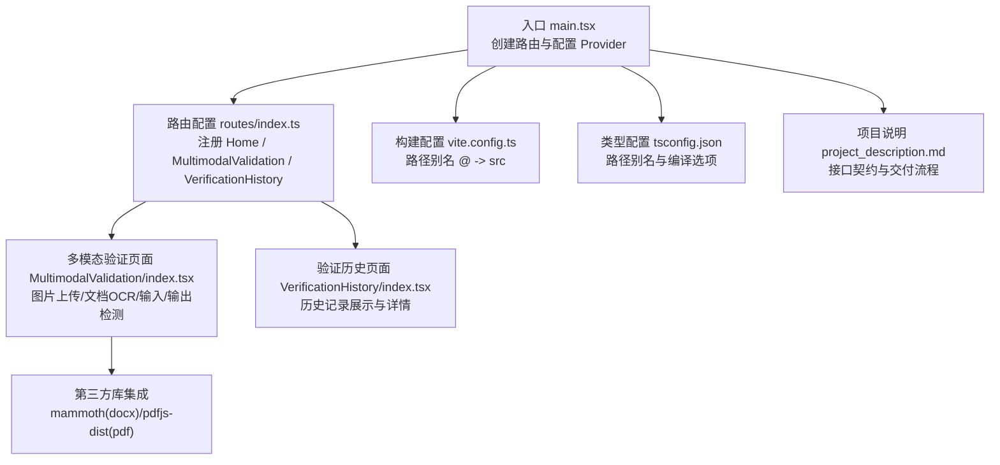
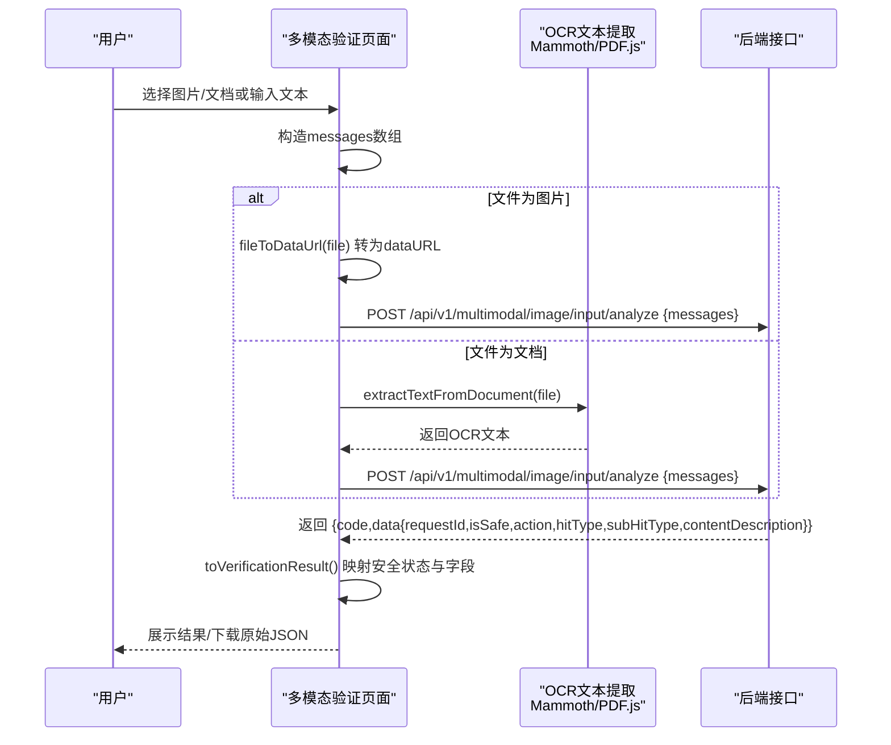
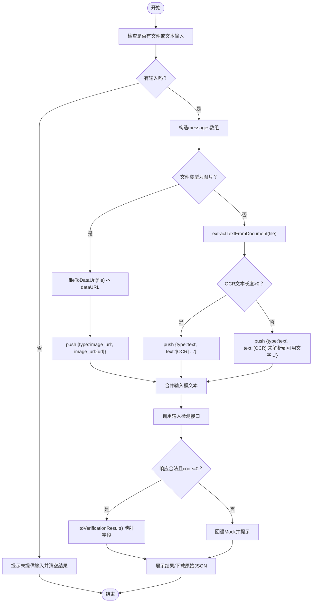
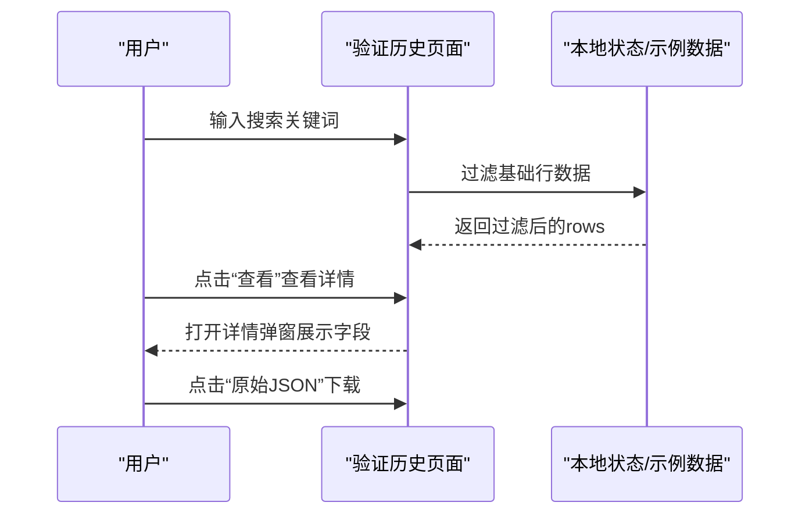
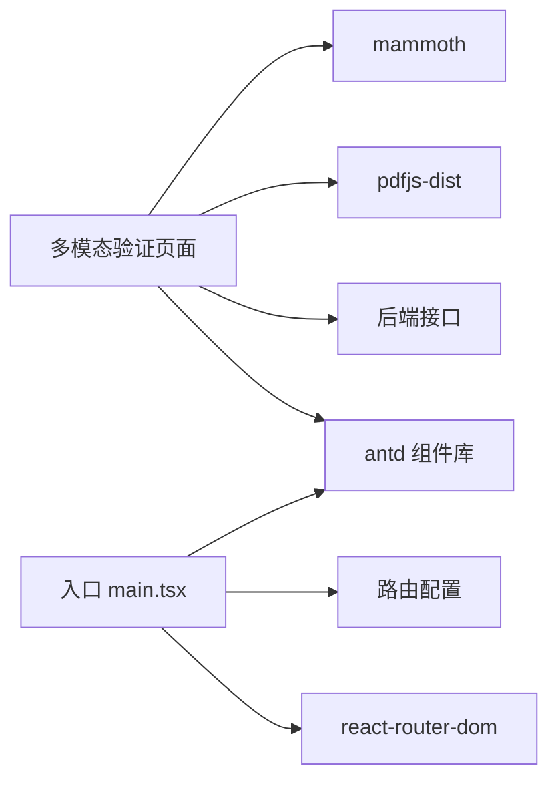

# 多模态验证模块

<cite>
**本文引用的文件**
- [src/views/MultimodalValidation/index.tsx](file://src/views/MultimodalValidation/index.tsx)
- [src/views/VerificationHistory/index.tsx](file://src/views/VerificationHistory/index.tsx)
- [src/config/routes/index.ts](file://src/config/routes/index.ts)
- [src/main.tsx](file://src/main.tsx)
- [package.json](file://package.json)
- [vite.config.ts](file://vite.config.ts)
- [tsconfig.json](file://tsconfig.json)
- [project_description.md](file://project_description.md)
</cite>

## 目录
1. [简介](#简介)
2. [项目结构](#项目结构)
3. [核心组件](#核心组件)
4. [架构总览](#架构总览)
5. [详细组件分析](#详细组件分析)
6. [依赖关系分析](#依赖关系分析)
7. [性能考量](#性能考量)
8. [故障排查指南](#故障排查指南)
9. [结论](#结论)
10. [附录](#附录)

## 简介
本文件面向APIG项目的多模态验证模块，聚焦两大核心能力：
- 图片内容安全检测：支持 PNG/JPG/GIF，采用Base64 dataURL上传，调用输入检测接口进行内容安全判定。
- 文档OCR解析：支持 DOCX、DOC、PDF，前端通过Mammoth与PDF.js进行文本提取，将OCR文本作为“text”消息发送至输入检测接口。

同时，文档阐述输入/输出两种检测模式的区别与适用场景，详解API接口调用流程、请求参数构造与响应数据处理，并提供完整的代码示例路径、数据流转与状态管理策略，帮助开发者扩展与定制。

## 项目结构
多模态验证模块位于前端工程中，采用React 17 + antd 4.17 + Vite 5技术栈，页面通过路由集中注册，布局统一由企业级布局壳层包裹。

图表来源
- [src/main.tsx:11-25](file://src/main.tsx#L11-L25)
- [src/config/routes/index.ts:12-25](file://src/config/routes/index.ts#L12-L25)
- [src/views/MultimodalValidation/index.tsx:183-544](file://src/views/MultimodalValidation/index.tsx#L183-L544)
- [src/views/VerificationHistory/index.tsx:94-601](file://src/views/VerificationHistory/index.tsx#L94-L601)
- [vite.config.ts:7-11](file://vite.config.ts#L7-L11)
- [tsconfig.json:19-21](file://tsconfig.json#L19-L21)
- [project_description.md:13-27](file://project_description.md#L13-L27)

章节来源
- [src/main.tsx:11-25](file://src/main.tsx#L11-L25)
- [src/config/routes/index.ts:12-25](file://src/config/routes/index.ts#L12-L25)
- [project_description.md:13-27](file://project_description.md#L13-L27)

## 核心组件
- 多模态验证页面（MultimodalValidation/index.tsx）
  - 负责：图片上传（Base64 dataURL）、文档OCR（Mammoth/ PDF.js）、输入/输出检测API调用、结果展示与原始JSON下载。
  - 关键函数：文件转Base64、OCR文本提取、消息构造、API调用与回退Mock、结果映射。
- 验证历史页面（VerificationHistory/index.tsx）
  - 负责：历史记录表格展示、搜索过滤、详情弹窗、原始JSON下载。
- 路由与入口
  - 路由集中注册，页面通过element字段挂载；入口配置ConfigProvider与RouterProvider。

章节来源
- [src/views/MultimodalValidation/index.tsx:183-544](file://src/views/MultimodalValidation/index.tsx#L183-L544)
- [src/views/VerificationHistory/index.tsx:94-601](file://src/views/VerificationHistory/index.tsx#L94-L601)
- [src/config/routes/index.ts:12-25](file://src/config/routes/index.ts#L12-L25)
- [src/main.tsx:11-25](file://src/main.tsx#L11-L25)

## 架构总览
多模态验证模块的数据流与交互如下：

图表来源
- [src/views/MultimodalValidation/index.tsx:199-298](file://src/views/MultimodalValidation/index.tsx#L199-L298)
- [src/views/MultimodalValidation/index.tsx:106-181](file://src/views/MultimodalValidation/index.tsx#L106-L181)
- [src/views/MultimodalValidation/index.tsx:60-85](file://src/views/MultimodalValidation/index.tsx#L60-L85)

章节来源
- [src/views/MultimodalValidation/index.tsx:199-298](file://src/views/MultimodalValidation/index.tsx#L199-L298)
- [src/views/MultimodalValidation/index.tsx:106-181](file://src/views/MultimodalValidation/index.tsx#L106-L181)
- [src/views/MultimodalValidation/index.tsx:60-85](file://src/views/MultimodalValidation/index.tsx#L60-L85)

## 详细组件分析

### 组件A：多模态验证页面（MultimodalValidation）
- 功能职责
  - 支持图片（PNG/JPG/GIF）与文档（DOCX/DOC/PDF）上传。
  - 图片：使用FileReader转为Base64 dataURL，封装为image_url消息。
  - 文档：使用Mammoth提取DOCX/DOC文本；使用PDF.js提取PDF文本（最多3页），封装为text消息。
  - 输入检测：构造messages数组，调用输入检测接口；若失败则回退Mock。
  - 输出检测：先执行输入检测获取requestId，再调用输出检测接口；失败同样回退Mock。
  - 结果展示：安全状态、命中类型、动作、请求ID、内容描述等字段映射与展示；支持下载原始JSON。
- 关键实现点
  - Base64图片处理流程：[fileToDataUrl:87-94](file://src/views/MultimodalValidation/index.tsx#L87-L94)
  - 文档OCR解析：
    - DOCX/DOC：[extractTextFromDocx:106-139](file://src/views/MultimodalValidation/index.tsx#L106-L139)
    - PDF：[extractTextFromPdf:141-164](file://src/views/MultimodalValidation/index.tsx#L141-L164)，[extractTextFromDocument:166-181](file://src/views/MultimodalValidation/index.tsx#L166-L181)
  - 请求参数构造与调用：
    - 输入检测：[verifyInputByApi:199-298](file://src/views/MultimodalValidation/index.tsx#L199-L298)
    - 输出检测：[verifyOutputByApi:300-343](file://src/views/MultimodalValidation/index.tsx#L300-L343)
  - 响应数据处理与展示：[toVerificationResult:60-85](file://src/views/MultimodalValidation/index.tsx#L60-L85)
  - 原始JSON下载：[downloadJson:30-40](file://src/views/MultimodalValidation/index.tsx#L30-L40)

图表来源
- [src/views/MultimodalValidation/index.tsx:199-298](file://src/views/MultimodalValidation/index.tsx#L199-L298)
- [src/views/MultimodalValidation/index.tsx:87-94](file://src/views/MultimodalValidation/index.tsx#L87-L94)
- [src/views/MultimodalValidation/index.tsx:106-181](file://src/views/MultimodalValidation/index.tsx#L106-L181)
- [src/views/MultimodalValidation/index.tsx:60-85](file://src/views/MultimodalValidation/index.tsx#L60-L85)

章节来源
- [src/views/MultimodalValidation/index.tsx:183-544](file://src/views/MultimodalValidation/index.tsx#L183-L544)

### 组件B：验证历史页面（VerificationHistory）
- 功能职责
  - 展示多模态验证与文本检测的历史记录，支持按内容摘要或MD5搜索。
  - 详情弹窗展示安全状态、命中类型、动作、请求ID、内容描述、违规类型等字段。
  - 支持下载原始JSON。
- 关键实现点
  - 表格列定义与渲染：[columns:380-453](file://src/views/VerificationHistory/index.tsx#L380-L453)
  - 搜索与过滤：[filteredRows:374-378](file://src/views/VerificationHistory/index.tsx#L374-L378)
  - 详情弹窗与下载：[detailVisible/detailRow:101-102](file://src/views/VerificationHistory/index.tsx#L101-L102), [downloadJson:82-92](file://src/views/VerificationHistory/index.tsx#L82-L92)

图表来源
- [src/views/VerificationHistory/index.tsx:374-378](file://src/views/VerificationHistory/index.tsx#L374-L378)
- [src/views/VerificationHistory/index.tsx:380-453](file://src/views/VerificationHistory/index.tsx#L380-L453)
- [src/views/VerificationHistory/index.tsx:82-92](file://src/views/VerificationHistory/index.tsx#L82-L92)

章节来源
- [src/views/VerificationHistory/index.tsx:94-601](file://src/views/VerificationHistory/index.tsx#L94-L601)

### 组件C：路由与入口
- 入口配置：创建BrowserRouter，包裹ConfigProvider与RouterProvider，设置antd中文语言。
- 路由注册：集中注册Home、MultimodalValidation、VerificationHistory三个页面，使用element字段。
- 构建配置：路径别名@指向src，开发端口5173。
- 类型配置：启用严格模式与路径别名，确保模块解析正确。

章节来源
- [src/main.tsx:11-25](file://src/main.tsx#L11-L25)
- [src/config/routes/index.ts:12-25](file://src/config/routes/index.ts#L12-L25)
- [vite.config.ts:7-11](file://vite.config.ts#L7-L11)
- [tsconfig.json:19-21](file://tsconfig.json#L19-L21)

## 依赖关系分析
- 第三方库
  - mammoth：DOCX/DOC文本提取（DOC支持不稳定时回退到DOCX提取策略）。
  - pdfjs-dist：PDF文本提取（最多3页），需设置workerSrc。
- 项目内部依赖
  - 路由与入口依赖antd、react-router-dom、vite插件。
  - 多模态验证页面依赖antd上传组件、图标、消息提示等。
- 外部接口契约
  - 输入检测：POST /api/v1/multimodal/image/input/analyze
  - 输出检测：POST /api/v1/multimodal/image/output/analyze（需携带reqId）

图表来源
- [package.json:11-17](file://package.json#L11-L17)
- [src/views/MultimodalValidation/index.tsx:106-181](file://src/views/MultimodalValidation/index.tsx#L106-L181)
- [src/main.tsx:11-25](file://src/main.tsx#L11-L25)

章节来源
- [package.json:11-17](file://package.json#L11-L17)
- [project_description.md:23-26](file://project_description.md#L23-L26)

## 性能考量
- 文档OCR性能
  - PDF仅提取前3页文本，避免大文档导致的长耗时与内存占用。
  - DOC/DOCX优先尝试Mammoth提取纯文本，若为空再尝试HTML去标签，提升兼容性。
- 图片上传
  - Base64 dataURL适合小图，大图可能导致内存压力与传输体积增大；建议在后端侧评估是否需要压缩或分块上传。
- 错误回退
  - 网络异常或接口返回非JSON时，自动回退Mock，保证UI可用性与开发体验。
- 前端渲染
  - 使用Memo与受控组件减少不必要的重渲染；表格与详情弹窗按需加载，避免一次性渲染大量数据。

## 故障排查指南
- 常见问题
  - 不支持的文档扩展名：抛出错误提示“不支持的文档扩展名”，请检查文件后缀。
  - PDF worker配置：内网环境可能需要本地化worker资源，确保workerSrc正确设置。
  - 接口返回非JSON或空内容：统一捕获并提示，必要时回退Mock。
  - 输出检测缺少requestId：需先完成输入检测，再进行输出检测。
- 定位方法
  - 查看控制台网络请求与响应体，确认接口返回结构与code字段。
  - 使用“下载原始JSON”功能保存后端返回，便于后端定位问题。
  - 在内网环境下，确认Mock回退逻辑是否被触发，避免掩盖真实问题。

章节来源
- [src/views/MultimodalValidation/index.tsx:180](file://src/views/MultimodalValidation/index.tsx#L180)
- [src/views/MultimodalValidation/index.tsx:141-164](file://src/views/MultimodalValidation/index.tsx#L141-L164)
- [src/views/MultimodalValidation/index.tsx:283-290](file://src/views/MultimodalValidation/index.tsx#L283-L290)
- [src/views/MultimodalValidation/index.tsx:304-306](file://src/views/MultimodalValidation/index.tsx#L304-L306)

## 结论
多模态验证模块通过清晰的流程设计与完善的错误回退机制，实现了图片内容安全检测与文档OCR解析两大核心能力。其输入/输出检测模式分别适用于“内容进入系统前的安全把关”和“模型生成内容的二次校验”。结合Mock回退策略与历史记录展示，开发者可在真实后端接入前快速验证前端逻辑，并在后续迭代中扩展更多文档格式与检测维度。

## 附录

### 输入/输出两种检测模式的区别与适用场景
- 输入检测（Input）
  - 适用：用户上传的图片/文档/文本进入系统前的前置安全校验。
  - 特点：支持多文件混合上传，消息数组包含image_url与text两类；返回requestId用于后续追踪。
- 输出检测（Output）
  - 适用：模型生成的内容在对外展示前的二次校验。
  - 特点：必须先执行输入检测获取requestId，再将reqId传给输出检测接口；返回结果包含reqIdUsed用于链路追踪。

章节来源
- [src/views/MultimodalValidation/index.tsx:199-298](file://src/views/MultimodalValidation/index.tsx#L199-L298)
- [src/views/MultimodalValidation/index.tsx:300-343](file://src/views/MultimodalValidation/index.tsx#L300-L343)

### API接口调用流程与参数构造
- 输入检测
  - 接口：POST /api/v1/multimodal/image/input/analyze
  - 参数：messages数组，元素类型为image_url或text，附加fileName/fileSize等元信息。
  - 返回：包含code/data/requestId/isSafe/action/hitType/subHitType/contentDescription/time等字段。
- 输出检测
  - 接口：POST /api/v1/multimodal/image/output/analyze
  - 参数：reqId（来自输入检测返回的requestId）
  - 返回：与输入检测类似，但额外携带reqIdUsed用于链路追踪。

章节来源
- [project_description.md:23-26](file://project_description.md#L23-L26)
- [src/views/MultimodalValidation/index.tsx:199-298](file://src/views/MultimodalValidation/index.tsx#L199-L298)
- [src/views/MultimodalValidation/index.tsx:300-343](file://src/views/MultimodalValidation/index.tsx#L300-L343)

### 文档格式支持与OCR实现
- 支持格式：DOCX、DOC、PDF
- 实现要点：
  - DOCX/DOC：使用Mammoth提取纯文本；若提取为空，回退到HTML去标签策略。
  - PDF：使用pdfjs-dist提取文本，限制最多3页，避免性能问题。
  - 不支持格式：抛出错误，提示用户更换文件类型。

章节来源
- [src/views/MultimodalValidation/index.tsx:106-139](file://src/views/MultimodalValidation/index.tsx#L106-L139)
- [src/views/MultimodalValidation/index.tsx:141-164](file://src/views/MultimodalValidation/index.tsx#L141-L164)
- [src/views/MultimodalValidation/index.tsx:166-181](file://src/views/MultimodalValidation/index.tsx#L166-L181)

### 数据流转与状态管理策略
- 状态管理
  - 使用useState维护方向（input/output）、文件列表、文本输入、验证中、错误、结果等状态。
  - 使用useMemo优化计算（如acceptExt、filteredRows）。
- 数据流转
  - 输入检测：messages构造 → API调用 → 响应映射 → 结果展示。
  - 输出检测：先执行输入检测获取requestId → 再调用输出检测 → 结果展示。
- 错误处理
  - 网络异常或接口返回非JSON：回退Mock并提示。
  - 缺少requestId：提示无法继续输出检测。

章节来源
- [src/views/MultimodalValidation/index.tsx:183-190](file://src/views/MultimodalValidation/index.tsx#L183-L190)
- [src/views/MultimodalValidation/index.tsx:199-298](file://src/views/MultimodalValidation/index.tsx#L199-L298)
- [src/views/MultimodalValidation/index.tsx:300-343](file://src/views/MultimodalValidation/index.tsx#L300-L343)

### 代码示例（路径指引）
- 文件上传处理（图片转Base64）：[fileToDataUrl:87-94](file://src/views/MultimodalValidation/index.tsx#L87-L94)
- 文档OCR文本提取（DOCX/DOC/PDF）：[extractTextFromDocx:106-139](file://src/views/MultimodalValidation/index.tsx#L106-L139), [extractTextFromPdf:141-164](file://src/views/MultimodalValidation/index.tsx#L141-L164), [extractTextFromDocument:166-181](file://src/views/MultimodalValidation/index.tsx#L166-L181)
- API调用与响应处理（输入/输出检测）：[verifyInputByApi:199-298](file://src/views/MultimodalValidation/index.tsx#L199-L298), [verifyOutputByApi:300-343](file://src/views/MultimodalValidation/index.tsx#L300-L343), [toVerificationResult:60-85](file://src/views/MultimodalValidation/index.tsx#L60-L85)
- 原始JSON下载：[downloadJson:30-40](file://src/views/MultimodalValidation/index.tsx#L30-L40), [downloadJson:82-92](file://src/views/VerificationHistory/index.tsx#L82-L92)