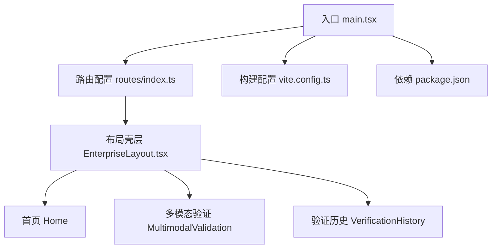
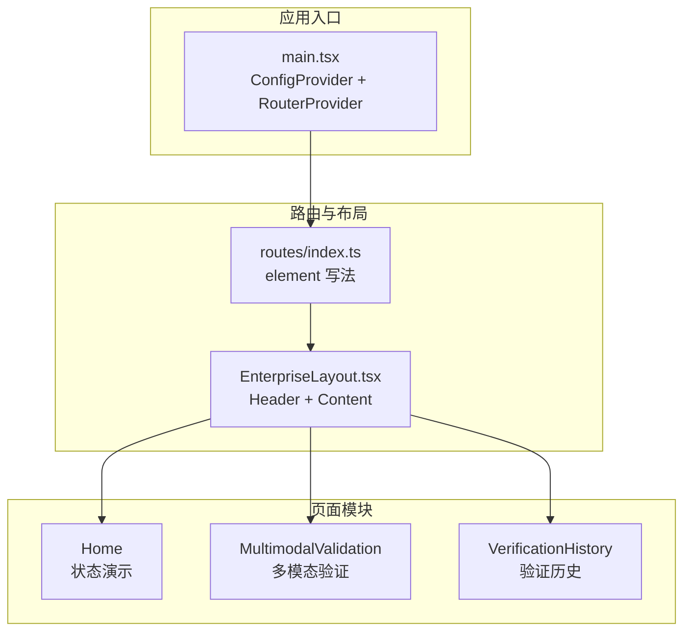
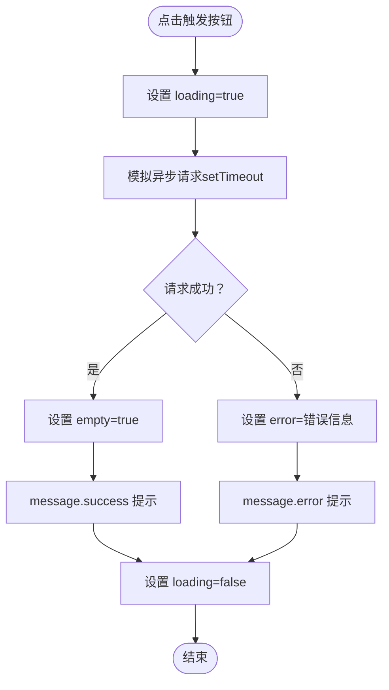
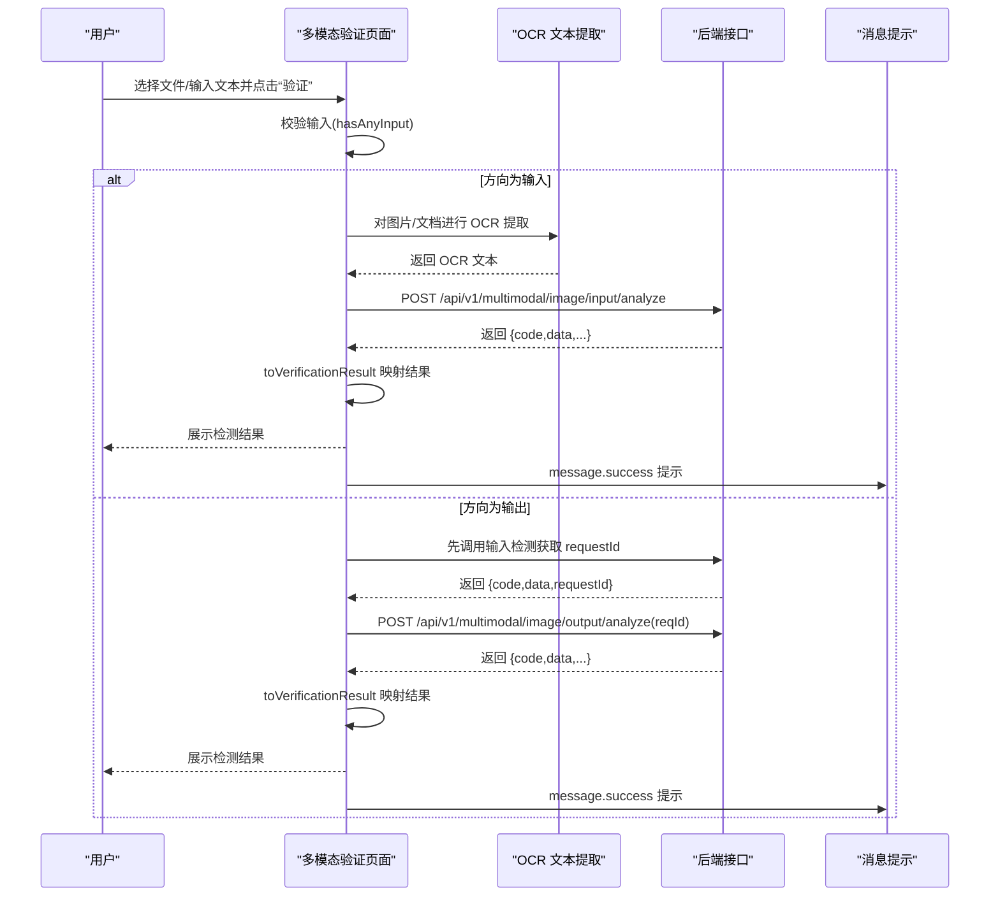
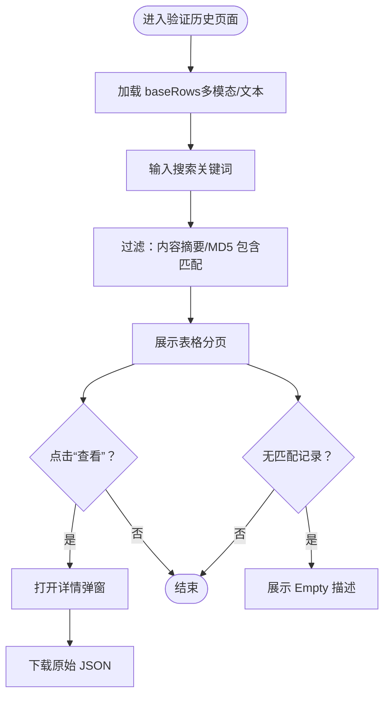
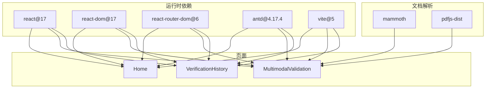

# 核心功能模块

<cite>
**本文引用的文件**
- [src/main.tsx](file://src/main.tsx)
- [src/config/routes/index.ts](file://src/config/routes/index.ts)
- [src/layouts/EnterpriseLayout.tsx](file://src/layouts/EnterpriseLayout.tsx)
- [src/views/Home/index.tsx](file://src/views/Home/index.tsx)
- [src/views/MultimodalValidation/index.tsx](file://src/views/MultimodalValidation/index.tsx)
- [src/views/VerificationHistory/index.tsx](file://src/views/VerificationHistory/index.tsx)
- [package.json](file://package.json)
- [vite.config.ts](file://vite.config.ts)
- [project_description.md](file://project_description.md)
- [docs/context/architecture.md](file://docs/context/architecture.md)
</cite>

## 目录
1. [简介](#简介)
2. [项目结构](#项目结构)
3. [核心组件](#核心组件)
4. [架构总览](#架构总览)
5. [详细组件分析](#详细组件分析)
6. [依赖关系分析](#依赖关系分析)
7. [性能考量](#性能考量)
8. [故障排查指南](#故障排查指南)
9. [结论](#结论)
10. [附录](#附录)

## 简介
本项目是一个基于 React 17 + antd 4.17 的多模态内容安全审核平台的前端示例工程，包含三个核心页面模块：
- 首页状态演示模块：用于演示 Loading/Empty/Error/Feedback 等状态与反馈交互。
- 多模态验证模块：支持图片内容检测、文档 OCR 解析、API 接口调用，以及输入/输出检测链路。
- 验证历史模块：提供历史记录管理、搜索过滤、详情查看与数据导出。

本文档将深入解析各模块的功能概述、使用场景、实现原理、模块间协作关系、数据传递机制与状态管理策略，并给出扩展建议与最佳实践。

## 项目结构
项目采用基于页面的组织方式，路由集中注册，布局壳层统一承载页面内容。核心文件如下：
- 入口与全局配置：src/main.tsx
- 路由注册：src/config/routes/index.ts
- 布局壳层：src/layouts/EnterpriseLayout.tsx
- 页面模块：src/views/Home、src/views/MultimodalValidation、src/views/VerificationHistory
- 构建与别名：vite.config.ts
- 依赖与脚本：package.json
- 项目说明与架构基线：project_description.md、docs/context/architecture.md

图表来源
- [src/main.tsx:1-26](file://src/main.tsx#L1-L26)
- [src/config/routes/index.ts:1-26](file://src/config/routes/index.ts#L1-L26)
- [src/layouts/EnterpriseLayout.tsx:1-20](file://src/layouts/EnterpriseLayout.tsx#L1-L20)
- [src/views/Home/index.tsx:1-49](file://src/views/Home/index.tsx#L1-L49)
- [src/views/MultimodalValidation/index.tsx:1-546](file://src/views/MultimodalValidation/index.tsx#L1-L546)
- [src/views/VerificationHistory/index.tsx:1-603](file://src/views/VerificationHistory/index.tsx#L1-L603)
- [vite.config.ts:1-16](file://vite.config.ts#L1-L16)
- [package.json:1-28](file://package.json#L1-L28)

章节来源
- [src/main.tsx:1-26](file://src/main.tsx#L1-L26)
- [src/config/routes/index.ts:1-26](file://src/config/routes/index.ts#L1-L26)
- [src/layouts/EnterpriseLayout.tsx:1-20](file://src/layouts/EnterpriseLayout.tsx#L1-L20)
- [project_description.md:13-27](file://project_description.md#L13-L27)
- [docs/context/architecture.md:3-46](file://docs/context/architecture.md#L3-L46)

## 核心组件
本节对三个核心页面模块进行概览性介绍，涵盖功能目标、典型使用场景与关键实现要点。

- 首页状态演示模块（Loading/Empty/Feedback）
  - 功能概述：演示常见的 UI 状态与用户反馈，包括加载中、空态、错误态与成功反馈。
  - 使用场景：用于快速验证 UI 组件在不同状态下的表现，作为开发与设计对齐的基础。
  - 实现要点：通过本地状态控制 Loading/Empty/Error 的切换，并结合消息提示组件展示反馈。

- 多模态验证模块（图片内容检测、文档 OCR 解析、API 接口调用）
  - 功能概述：支持图片与文档上传，自动进行 OCR 文本提取，构造消息体调用输入/输出检测接口，并展示检测结果。
  - 使用场景：在内网隔离环境下演练多模态内容安全审核流程，验证前端链路与后端接口契约。
  - 实现要点：文件类型识别、Base64 编码、OCR 文本提取、请求封装与回退 Mock、结果解析与展示、原始 JSON 下载。

- 验证历史模块（历史记录管理、搜索过滤、数据导出）
  - 功能概述：以表格形式展示历史验证记录，支持按内容摘要与 MD5 搜索，查看详情并导出原始 JSON。
  - 使用场景：审计与追溯验证历史，辅助合规与风控工作。
  - 实现要点：Tab 切换、本地数据源、搜索过滤、分页、详情弹窗、原始 JSON 下载。

章节来源
- [src/views/Home/index.tsx:1-49](file://src/views/Home/index.tsx#L1-L49)
- [src/views/MultimodalValidation/index.tsx:1-546](file://src/views/MultimodalValidation/index.tsx#L1-L546)
- [src/views/VerificationHistory/index.tsx:1-603](file://src/views/VerificationHistory/index.tsx#L1-L603)
- [project_description.md:15-27](file://project_description.md#L15-L27)
- [docs/context/architecture.md:18-29](file://docs/context/architecture.md#L18-L29)

## 架构总览
整体架构围绕“入口 -> 路由 -> 布局 -> 页面”的层次展开，页面内部通过本地状态与消息提示组件实现状态演示与交互反馈。多模态验证模块在现有基础上预留了真实 API 调用逻辑，失败时回退到 Mock 数据，保证 UI 流程可跑通。

图表来源
- [src/main.tsx:11-25](file://src/main.tsx#L11-L25)
- [src/config/routes/index.ts:12-25](file://src/config/routes/index.ts#L12-L25)
- [src/layouts/EnterpriseLayout.tsx:8-18](file://src/layouts/EnterpriseLayout.tsx#L8-L18)
- [src/views/Home/index.tsx:4-47](file://src/views/Home/index.tsx#L4-L47)
- [src/views/MultimodalValidation/index.tsx:183-544](file://src/views/MultimodalValidation/index.tsx#L183-L544)
- [src/views/VerificationHistory/index.tsx:94-601](file://src/views/VerificationHistory/index.tsx#L94-L601)

章节来源
- [src/main.tsx:1-26](file://src/main.tsx#L1-L26)
- [src/config/routes/index.ts:1-26](file://src/config/routes/index.ts#L1-L26)
- [src/layouts/EnterpriseLayout.tsx:1-20](file://src/layouts/EnterpriseLayout.tsx#L1-L20)
- [docs/context/architecture.md:3-17](file://docs/context/architecture.md#L3-L17)

## 详细组件分析

### 首页状态演示模块（Loading/Empty/Feedback）
- 功能概述
  - 通过按钮触发加载流程，模拟请求成功后进入空态，失败时显示错误提示。
  - 展示 Loading、Empty、Error 与 Feedback 的组合使用，便于 UI 对齐与交互验证。
- 关键实现
  - 状态管理：loading、error、empty 三态切换。
  - 交互流程：点击按钮 -> 设置 loading -> 模拟请求 -> 成功设置 empty 并提示成功；失败设置 error 并提示失败。
  - 组件使用：Spin、Empty、Alert、Button、message。
- 使用场景
  - 快速验证 antd4 组件在不同状态下的视觉表现。
  - 作为新页面开发的“状态基线”，确保一致的用户体验。

图表来源
- [src/views/Home/index.tsx:9-22](file://src/views/Home/index.tsx#L9-L22)
- [src/views/Home/index.tsx:24-47](file://src/views/Home/index.tsx#L24-L47)

章节来源
- [src/views/Home/index.tsx:1-49](file://src/views/Home/index.tsx#L1-L49)
- [docs/context/architecture.md:18-19](file://docs/context/architecture.md#L18-L19)

### 多模态验证模块（图片内容检测、文档 OCR 解析、API 接口调用）
- 功能概述
  - 支持图片（PNG/JPG/GIF）与文档（DOCX/DOC/PDF）上传。
  - 图片转为 Base64 dataURL，文档通过 OCR 提取文本，构造消息体调用输入/输出检测接口。
  - 结果解析与展示，支持原始 JSON 下载。
- 关键实现
  - 文件类型识别与上传：acceptExt 控制可接受的扩展名；beforeUpload 将文件加入 fileList。
  - 图片处理：fileToDataUrl 将文件读取为 dataURL。
  - 文档 OCR：extractTextFromPdf 使用 pdfjs-dist 提取文本；extractTextFromDocx 使用 mammoth 提取文本；兼容 .doc 的 fallback。
  - 请求封装：postJson 封装 fetch，解析 JSON 并校验响应。
  - 结果映射：toVerificationResult 将后端响应映射为 VerificationResult。
  - 输入/输出检测链路：verifyInputByApi 与 verifyOutputByApi，输出检测依赖输入检测返回的 requestId。
  - 错误回退：真实请求失败时回退到 Mock 数据，保证 UI 流程可跑通。
- 使用场景
  - 在内网隔离环境中演练多模态内容安全审核流程。
  - 验证前端链路与后端接口契约，便于后续接入真实服务。
- 数据与状态管理
  - 状态：direction（input/output）、textValue、fileList、verifying、error、result。
  - 数据：messages（上传文件与文本的聚合）、requestId（链路传递）、raw（原始响应）。
- 扩展建议
  - 将 Mock 数据替换为真实 API 调用，完善错误处理与重试策略。
  - 增加上传进度与并发控制，优化大文件处理体验。
  - 将 OCR 文本提取与 API 调用抽象为可复用 Hook，提升可维护性。

图表来源
- [src/views/MultimodalValidation/index.tsx:199-298](file://src/views/MultimodalValidation/index.tsx#L199-L298)
- [src/views/MultimodalValidation/index.tsx:300-343](file://src/views/MultimodalValidation/index.tsx#L300-L343)
- [src/views/MultimodalValidation/index.tsx:42-58](file://src/views/MultimodalValidation/index.tsx#L42-L58)
- [src/views/MultimodalValidation/index.tsx:60-85](file://src/views/MultimodalValidation/index.tsx#L60-L85)
- [src/views/MultimodalValidation/index.tsx:106-139](file://src/views/MultimodalValidation/index.tsx#L106-L139)
- [src/views/MultimodalValidation/index.tsx:141-164](file://src/views/MultimodalValidation/index.tsx#L141-L164)
- [src/views/MultimodalValidation/index.tsx:166-181](file://src/views/MultimodalValidation/index.tsx#L166-L181)

章节来源
- [src/views/MultimodalValidation/index.tsx:1-546](file://src/views/MultimodalValidation/index.tsx#L1-L546)
- [project_description.md:23-26](file://project_description.md#L23-L26)
- [docs/context/architecture.md:20-24](file://docs/context/architecture.md#L20-L24)

### 验证历史模块（历史记录管理、搜索过滤、数据导出）
- 功能概述
  - 以 Tab 切换多模态验证与文本检测两类记录。
  - 表格展示验证时间、完成时间、检测内容、方向、合规状态、MD5、违规类型、任务状态。
  - 支持搜索（按内容摘要与 MD5）、查看详情弹窗、原始 JSON 下载。
- 关键实现
  - 数据源：baseRows（多模态与文本两类示例数据）。
  - 搜索过滤：search 输入框与 useMemo 过滤逻辑，区分大小写并支持空查询。
  - 表格列：columns 定义各列渲染逻辑，含标签、Tooltip、复制 MD5 等交互。
  - 详情弹窗：Modal 展示完整检测结果与原始 JSON 下载。
  - 加载与错误：loading 与 error 状态，配合 message 提示与重试按钮。
- 使用场景
  - 审计与追溯验证历史，辅助合规与风控工作。
  - 通过搜索快速定位特定记录，提升运营效率。
- 数据与状态管理
  - 状态：mode（multimodal/text）、search、loading、error、detailVisible、detailRow。
  - 数据：HistoryRow 类型定义，包含合规状态、违规类型、原始响应等字段。
- 扩展建议
  - 将 baseRows 替换为真实 API 数据源，增加分页与排序。
  - 增加批量导出与筛选器，支持更复杂的检索需求。
  - 将详情弹窗内容抽象为可复用组件，提升一致性与可维护性。

图表来源
- [src/views/VerificationHistory/index.tsx:132-372](file://src/views/VerificationHistory/index.tsx#L132-L372)
- [src/views/VerificationHistory/index.tsx:374-378](file://src/views/VerificationHistory/index.tsx#L374-L378)
- [src/views/VerificationHistory/index.tsx:380-453](file://src/views/VerificationHistory/index.tsx#L380-L453)
- [src/views/VerificationHistory/index.tsx:543-599](file://src/views/VerificationHistory/index.tsx#L543-L599)

章节来源
- [src/views/VerificationHistory/index.tsx:1-603](file://src/views/VerificationHistory/index.tsx#L1-L603)
- [docs/context/architecture.md:25-29](file://docs/context/architecture.md#L25-L29)

## 依赖关系分析
- 技术栈与运行时
  - React 17、react-router-dom 6、antd 4.17.4、vite 5。
  - DOCX 文档解析依赖 mammoth，PDF 文档解析依赖 pdfjs-dist。
- 路由与布局
  - 路由集中注册，使用 element 写法；布局壳层通过 Outlet 承载页面。
- 页面间协作
  - 三个页面独立存在，通过路由与布局壳层协同工作；页面内部通过本地状态与消息提示组件实现状态演示与交互反馈。
- 外部依赖与集成点
  - 多模态验证模块预留真实 API 调用逻辑，失败时回退到 Mock 数据。
  - 验证历史模块当前使用本地示例数据，后续可替换为真实 API。

图表来源
- [package.json:11-26](file://package.json#L11-L26)
- [src/views/MultimodalValidation/index.tsx:106-139](file://src/views/MultimodalValidation/index.tsx#L106-L139)
- [src/views/MultimodalValidation/index.tsx:141-164](file://src/views/MultimodalValidation/index.tsx#L141-L164)

章节来源
- [package.json:1-28](file://package.json#L1-L28)
- [docs/context/architecture.md:31-39](file://docs/context/architecture.md#L31-L39)

## 性能考量
- 文档 OCR 性能
  - PDF 提取默认限制前 3 页，减少计算开销；OCR 文本提取后进行 trim 与必要 fallback，避免空文本导致的无效请求。
- 上传与渲染
  - 图片转 Base64 适合小图，大图可能导致内存压力；建议对大文件进行压缩或分块处理。
  - 表格分页与虚拟滚动可进一步优化大数据量展示性能。
- 网络与回退
  - 真实请求失败时回退到 Mock，保证 UI 流程可跑通；建议增加指数退避与重试次数上限，避免频繁重试影响用户体验。
- 构建与别名
  - 路径别名 @ 指向 src，简化导入路径；开发服务器端口 5173，便于本地调试。

章节来源
- [src/views/MultimodalValidation/index.tsx:155-163](file://src/views/MultimodalValidation/index.tsx#L155-L163)
- [src/views/MultimodalValidation/index.tsx:292-297](file://src/views/MultimodalValidation/index.tsx#L292-L297)
- [vite.config.ts:7-11](file://vite.config.ts#L7-L11)

## 故障排查指南
- 多模态验证模块常见问题
  - 文档解析失败：message.warning 提示并回退空文本；检查文件格式与 OCR 库版本。
  - 接口调用失败：回退 Mock 并提示“真实请求失败，已回退 mock”；检查网络连通性与后端接口契约。
  - 输出检测缺少 requestId：先调用输入检测获取 requestId 再进行输出检测。
- 验证历史模块常见问题
  - 搜索无结果：确认关键词大小写与匹配逻辑；清空搜索框重试。
  - 详情弹窗空白：确认 detailRow 已正确赋值；检查原始 JSON 结构。
- 首页状态演示模块常见问题
  - 点击按钮无反应：检查按钮事件绑定与状态切换逻辑；确认 message 组件可用。
- 通用排查
  - 确认 antd 与 react 版本兼容性；检查路径别名与构建配置；核对路由注册与布局壳层。

章节来源
- [src/views/MultimodalValidation/index.tsx:230-235](file://src/views/MultimodalValidation/index.tsx#L230-L235)
- [src/views/MultimodalValidation/index.tsx:289-297](file://src/views/MultimodalValidation/index.tsx#L289-L297)
- [src/views/MultimodalValidation/index.tsx:304-306](file://src/views/MultimodalValidation/index.tsx#L304-L306)
- [src/views/VerificationHistory/index.tsx:455-467](file://src/views/VerificationHistory/index.tsx#L455-L467)
- [src/views/VerificationHistory/index.tsx:442-449](file://src/views/VerificationHistory/index.tsx#L442-L449)
- [src/views/Home/index.tsx:35-44](file://src/views/Home/index.tsx#L35-L44)

## 结论
本项目通过三个核心页面模块清晰展示了内容安全审核平台的前端能力边界：状态演示、多模态验证与历史记录管理。模块间通过路由与布局壳层协同工作，页面内部通过本地状态与消息提示组件实现一致的用户体验。多模态验证模块已预留真实 API 调用逻辑并在失败时回退到 Mock，验证历史模块当前使用本地示例数据，后续可无缝替换为真实数据源。建议在后续迭代中完善真实 API 接入、增强性能与稳定性，并持续对齐设计系统规范。

## 附录
- 项目启动与常用命令
  - 安装依赖：npm install
  - 启动开发：npm run dev（端口 5173）
  - 构建生产：npm run build
  - 预览构建：npm run preview
- 路由与页面
  - 首页：/
  - 多模态验证：/multimodal-validation
  - 验证历史：/verification-history
- 设计与约束
  - antd4 无 v5 Design Token 机制，主题定制需通过变量或 CSS 覆盖。
  - 多模态检测涉及敏感内容，需注意数据隐私与合规。

章节来源
- [project_description.md:28-36](file://project_description.md#L28-L36)
- [src/config/routes/index.ts:12-25](file://src/config/routes/index.ts#L12-L25)
- [docs/context/architecture.md:50-56](file://docs/context/architecture.md#L50-L56)