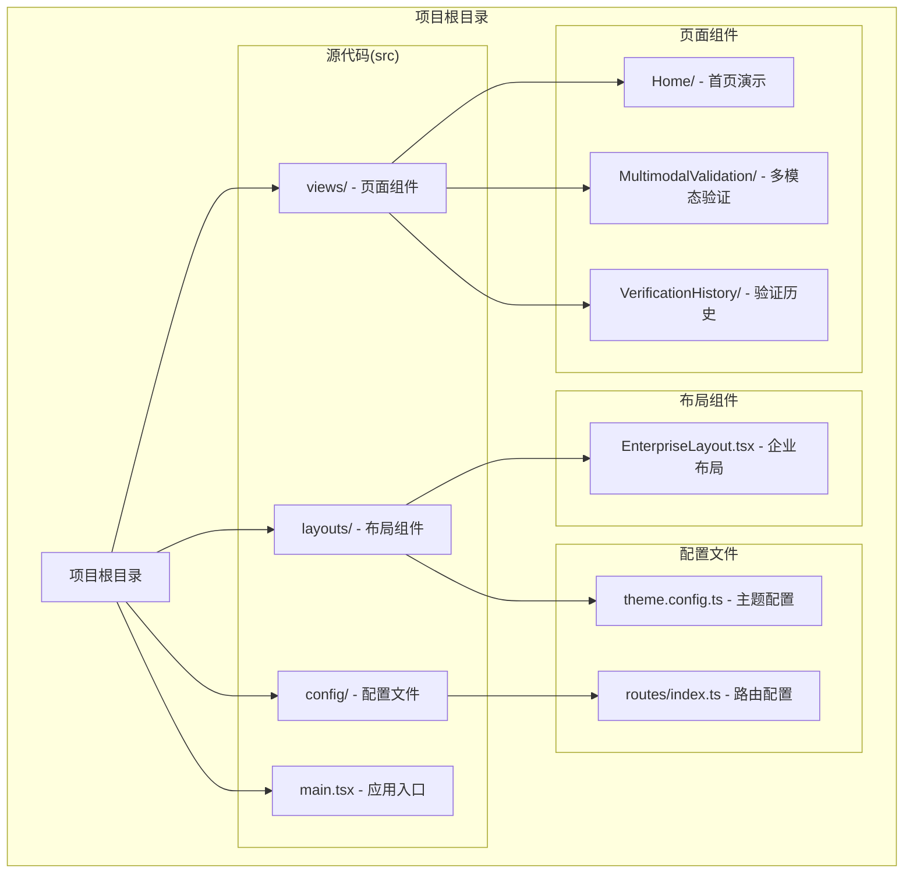
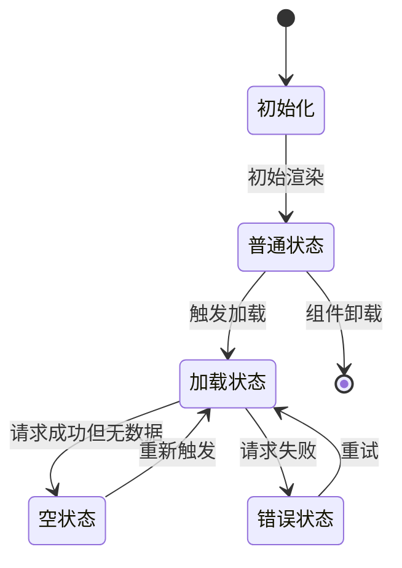
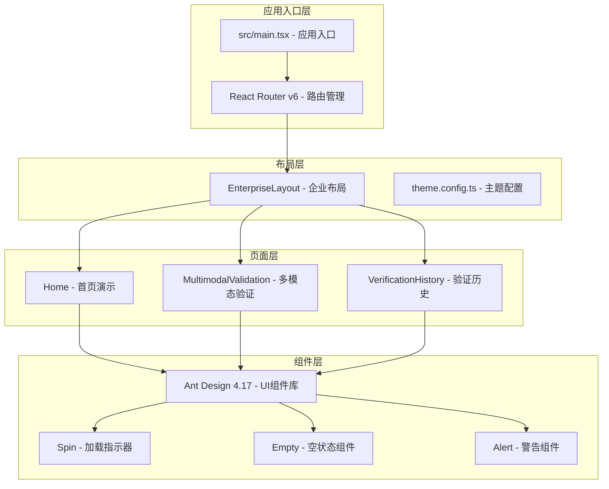
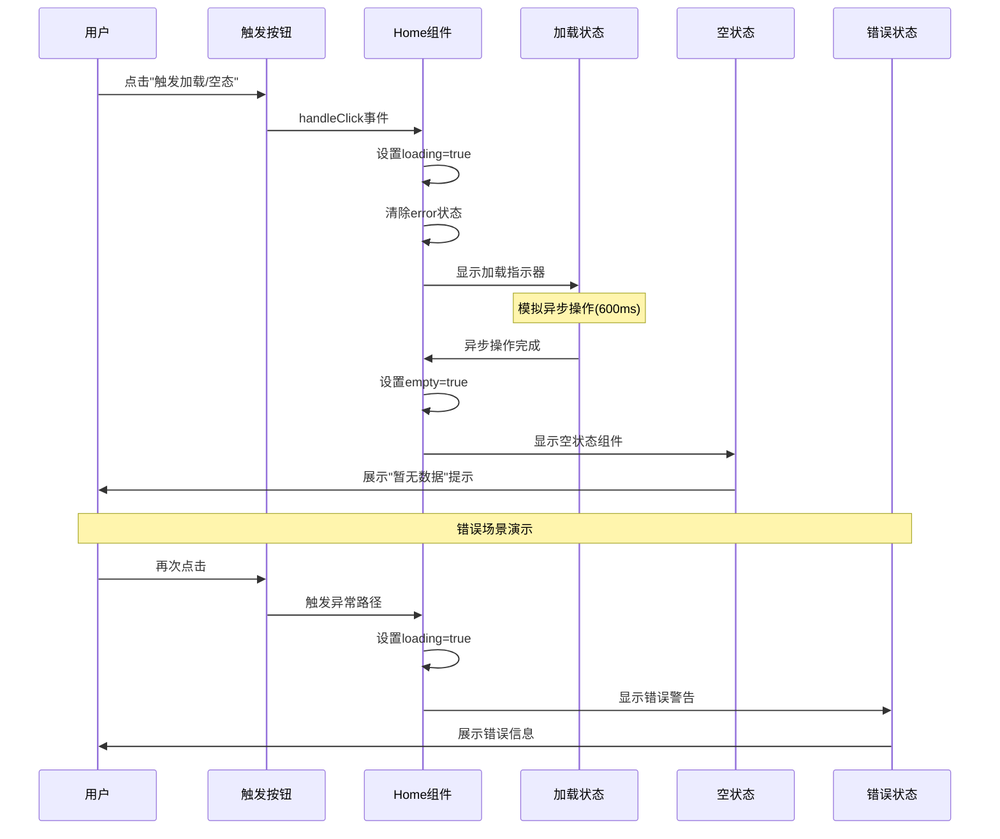
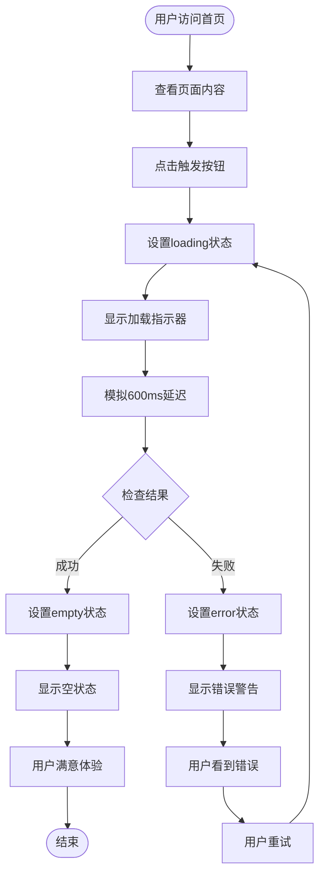
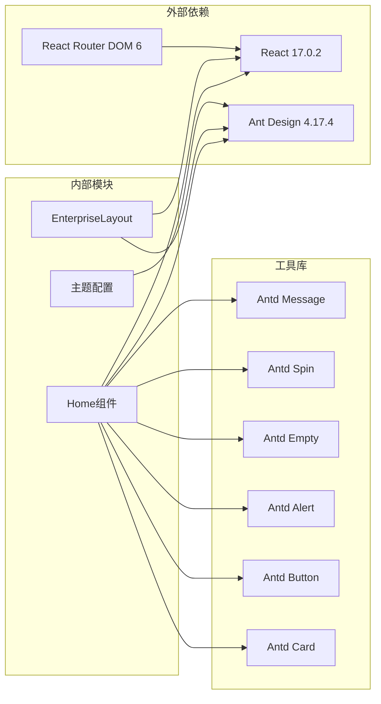

# 首页演示模块

<cite>
**本文档引用的文件**
- [src/views/Home/index.tsx](file://src/views/Home/index.tsx)
- [src/main.tsx](file://src/main.tsx)
- [src/config/routes/index.ts](file://src/config/routes/index.ts)
- [src/layouts/EnterpriseLayout.tsx](file://src/layouts/EnterpriseLayout.tsx)
- [src/layouts/theme.config.ts](file://src/layouts/theme.config.ts)
- [src/views/MultimodalValidation/index.tsx](file://src/views/MultimodalValidation/index.tsx)
- [src/views/VerificationHistory/index.tsx](file://src/views/VerificationHistory/index.tsx)
- [vite.config.ts](file://vite.config.ts)
- [tsconfig.json](file://tsconfig.json)
- [package.json](file://package.json)
- [project_description.md](file://project_description.md)
</cite>

## 目录
1. [简介](#简介)
2. [项目结构](#项目结构)
3. [核心组件](#核心组件)
4. [架构概览](#架构概览)
5. [详细组件分析](#详细组件分析)
6. [依赖关系分析](#依赖关系分析)
7. [性能考虑](#性能考虑)
8. [故障排除指南](#故障排除指南)
9. [结论](#结论)

## 简介

首页演示模块是 APIG 项目的核心入口，采用 React 17 + Ant Design 4.17 技术栈构建。该模块专注于展示 Loading/Empty/Error 三种状态的优雅切换机制，为整个系统的用户体验奠定基础。通过精心设计的状态管理策略和 Ant Design 组件的巧妙运用，实现了从加载状态到空状态再到错误反馈的完整用户体验闭环。

该项目采用内网隔离环境下的多模态内容安全审核平台架构，支持输入/输出检测、验证历史追溯等功能，为演练设计系统和技能契约提供了理想的演示环境。

## 项目结构

APIG 项目采用清晰的分层架构设计，主要包含以下核心目录结构：

**图表来源**
- [src/views/Home/index.tsx:1-49](file://src/views/Home/index.tsx#L1-L49)
- [src/config/routes/index.ts:1-26](file://src/config/routes/index.ts#L1-L26)
- [src/layouts/EnterpriseLayout.tsx:1-20](file://src/layouts/EnterpriseLayout.tsx#L1-L20)

**章节来源**
- [src/views/Home/index.tsx:1-49](file://src/views/Home/index.tsx#L1-L49)
- [src/config/routes/index.ts:1-26](file://src/config/routes/index.ts#L1-L26)
- [src/layouts/EnterpriseLayout.tsx:1-20](file://src/layouts/EnterpriseLayout.tsx#L1-L20)

## 核心组件

首页演示模块的核心组件是一个简洁而功能完整的 React 函数组件，采用了现代的 React Hooks 模式。该组件通过三个核心状态变量实现了完整的状态管理：

### 状态管理架构

**图表来源**
- [src/views/Home/index.tsx:5-7](file://src/views/Home/index.tsx#L5-L7)

### 核心状态变量

组件使用三个独立的状态变量来管理不同的显示状态：

- **loading**: 控制加载指示器的显示
- **error**: 存储错误信息并控制错误反馈的显示  
- **empty**: 标识空状态的存在

### 组件结构分析

该组件采用卡片容器设计，配合 Ant Design 的 Card 组件提供了专业的界面外观。按钮触发器位于卡片右上角，确保用户能够直观地体验各种状态切换。

**章节来源**
- [src/views/Home/index.tsx:4-48](file://src/views/Home/index.tsx#L4-L48)

## 架构概览

首页演示模块在整个应用架构中扮演着至关重要的角色，它不仅是用户接触的第一个界面，更是统一用户体验设计语言的关键节点。

**图表来源**
- [src/main.tsx:11-16](file://src/main.tsx#L11-L16)
- [src/layouts/EnterpriseLayout.tsx:8-19](file://src/layouts/EnterpriseLayout.tsx#L8-L19)
- [src/views/Home/index.tsx:2](file://src/views/Home/index.tsx#L2)

### 路由集成

首页演示模块通过集中式的路由配置文件进行管理，采用 React Router v6 的 element 写法，确保了路由定义的一致性和可维护性。

**章节来源**
- [src/main.tsx:11-25](file://src/main.tsx#L11-L25)
- [src/config/routes/index.ts:12-25](file://src/config/routes/index.ts#L12-L25)

## 详细组件分析

### 首页组件实现详解

首页演示组件是整个系统状态管理的最佳实践案例，展示了如何通过最小的代码实现最大的用户体验价值。

#### 状态切换机制

**图表来源**
- [src/views/Home/index.tsx:9-22](file://src/views/Home/index.tsx#L9-L22)
- [src/views/Home/index.tsx:36-44](file://src/views/Home/index.tsx#L36-L44)

#### Ant Design 组件集成

组件巧妙地集成了多种 Ant Design 组件来实现不同的状态反馈：

- **Spin**: 提供旋转加载指示器，表示异步操作正在进行
- **Alert**: 展示错误信息，包含错误类型和图标
- **Empty**: 显示空状态，提供友好的数据缺失提示
- **Card**: 作为容器组件，提供统一的视觉外观和布局

#### 用户交互流程

**图表来源**
- [src/views/Home/index.tsx:9-22](file://src/views/Home/index.tsx#L9-L22)
- [src/views/Home/index.tsx:36-44](file://src/views/Home/index.tsx#L36-L44)

### 状态管理策略分析

首页演示模块采用了简单而有效的状态管理策略，通过三个布尔状态变量实现了清晰的状态分离：

#### 状态优先级设计

组件内部的状态渲染遵循严格的优先级顺序：

1. **加载状态** (loading) - 优先级最高，显示加载指示器
2. **错误状态** (error) - 优先级中等，显示错误信息
3. **空状态** (empty) - 优先级中等，显示空状态提示
4. **普通状态** - 优先级最低，显示默认内容

这种设计确保了用户能够清楚地理解当前的应用状态，避免了状态冲突的可能性。

#### 异步加载模拟

组件使用 `setTimeout` 实现了精确的异步加载模拟，延迟时间为 600 毫秒，这个时间点经过精心选择，既能让用户感知到加载过程，又不会造成等待疲劳。

**章节来源**
- [src/views/Home/index.tsx:9-22](file://src/views/Home/index.tsx#L9-L22)
- [src/views/Home/index.tsx:36-44](file://src/views/Home/index.tsx#L36-L44)

## 依赖关系分析

首页演示模块的依赖关系相对简单，主要依赖于 React 和 Ant Design 组件库。

**图表来源**
- [package.json:11-17](file://package.json#L11-L17)
- [src/views/Home/index.tsx:2](file://src/views/Home/index.tsx#L2)

### 依赖版本管理

项目使用了特定版本的依赖库，确保了稳定性和一致性：

- **React**: ^17.0.2 - 提供核心框架支持
- **Ant Design**: 4.17.4 - UI 组件库，提供丰富的组件生态
- **React Router DOM**: ^6.22.3 - 路由管理，支持现代路由特性
- **Vite**: ^5.4.14 - 构建工具，提供快速开发体验

### 路径别名配置

项目使用了 TypeScript 的路径别名配置，简化了导入路径：

- **@/**: 指向 src/ 目录
- **vite.config.ts**: 配置了路径解析规则
- **tsconfig.json**: 定义了路径映射关系

**章节来源**
- [package.json:11-26](file://package.json#L11-L26)
- [vite.config.ts:7-11](file://vite.config.ts#L7-L11)
- [tsconfig.json:19-21](file://tsconfig.json#L19-L21)

## 性能考虑

首页演示模块在设计时充分考虑了性能优化，采用了多种策略来确保良好的用户体验。

### 渲染优化策略

1. **条件渲染**: 仅在必要时渲染特定状态的组件，避免不必要的 DOM 操作
2. **状态分离**: 将不同状态分离到独立的状态变量中，减少重渲染
3. **内存管理**: 在 finally 块中确保 loading 状态被正确清理

### 加载性能优化

- **延迟控制**: 600ms 的模拟延迟平衡了用户体验和性能
- **异步处理**: 使用 Promise 和 async/await 确保异步操作的正确性
- **错误恢复**: 提供错误处理机制，防止应用崩溃

## 故障排除指南

### 常见问题诊断

#### 状态不更新问题

如果发现状态切换不生效，检查以下几点：

1. **状态设置顺序**: 确保按照正确的顺序设置状态变量
2. **异步操作**: 验证异步操作是否正确执行
3. **finally 块**: 确保 finally 块中的状态清理逻辑正常执行

#### 组件渲染问题

如果组件渲染出现问题：

1. **依赖导入**: 检查 Ant Design 组件的导入是否正确
2. **样式加载**: 确认 Ant Design 样式文件已正确加载
3. **版本兼容性**: 验证 React 和 Ant Design 版本的兼容性

### 调试技巧

1. **控制台日志**: 在关键状态变化点添加 console.log 输出
2. **React DevTools**: 使用开发者工具检查组件状态
3. **网络监控**: 监控异步请求的执行情况

**章节来源**
- [src/views/Home/index.tsx:9-22](file://src/views/Home/index.tsx#L9-L22)

## 结论

首页演示模块作为 APIG 项目的核心入口，成功地展示了 Loading/Empty/Error 三种状态的优雅切换机制。通过精心设计的状态管理策略和 Ant Design 组件的巧妙运用，该模块为整个系统的用户体验奠定了坚实的基础。

该模块的主要优势包括：

1. **简洁高效**: 使用最少的代码实现了完整的状态管理
2. **用户体验优秀**: 通过渐进式反馈提升了用户满意度
3. **易于扩展**: 清晰的架构设计便于后续功能扩展
4. **性能优化**: 采用了多种性能优化策略

在未来的发展中，该模块可以作为其他页面状态管理的参考模板，帮助团队保持一致的用户体验设计语言。同时，随着项目功能的不断完善，该模块也将承担起更多的演示和教育职责，为新成员提供直观的学习材料。