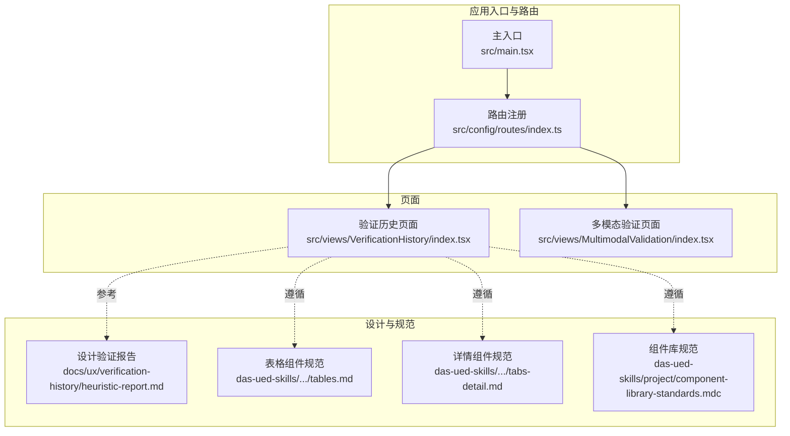
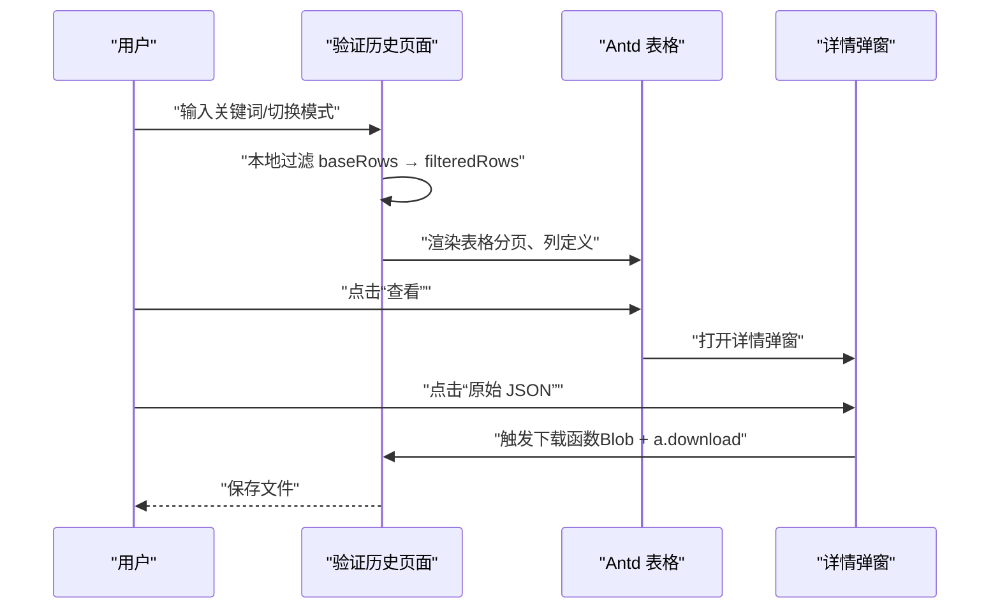
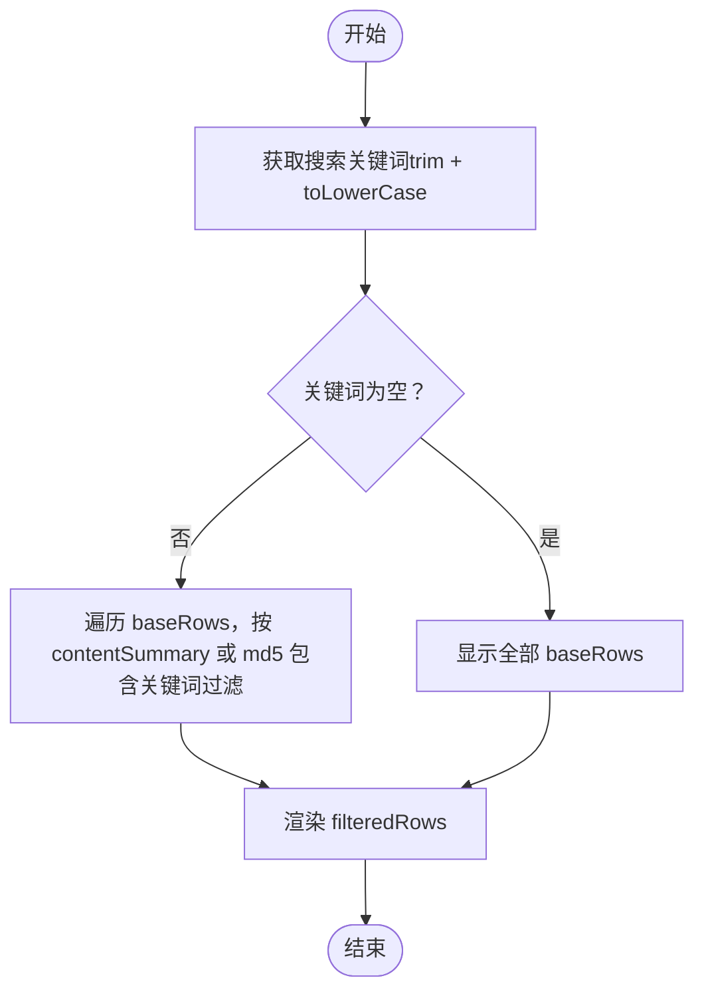
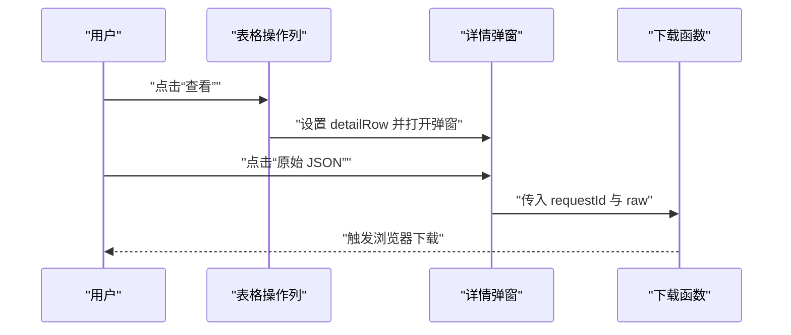
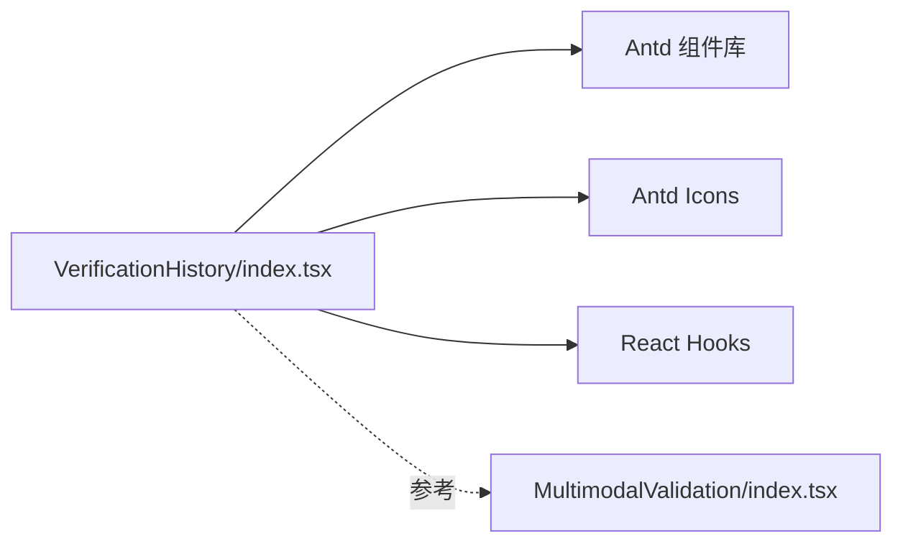

# 验证历史模块

<cite>
**本文引用的文件**
- [VerificationHistory/index.tsx](file://src/views/VerificationHistory/index.tsx)
- [routes/index.ts](file://src/config/routes/index.ts)
- [project_description.md](file://project_description.md)
- [heuristic-report.md](file://docs/ux/verification-history/heuristic-report.md)
- [tables.md](file://das-ued-skills/opt/b-admin-pencil-design/core/components/tables.md)
- [tabs-detail.md](file://das-ued-skills/opt/b-admin-pencil-design/core/components/tabs-detail.md)
- [component-library-standards.mdc](file://das-ued-skills/project/component-library-standards.mdc)
- [MultimodalValidation/index.tsx](file://src/views/MultimodalValidation/index.tsx)
</cite>

## 目录
1. [简介](#简介)
2. [项目结构](#项目结构)
3. [核心组件](#核心组件)
4. [架构总览](#架构总览)
5. [详细组件分析](#详细组件分析)
6. [依赖分析](#依赖分析)
7. [性能考虑](#性能考虑)
8. [故障排查指南](#故障排查指南)
9. [结论](#结论)
10. [附录](#附录)

## 简介
本文件面向APIG项目的“验证历史模块”，系统性阐述历史记录管理系统的功能设计与实现架构，重点覆盖：
- 历史数据的存储、检索与展示机制
- 搜索过滤功能的实现原理（关键词、MD5、时间范围、违规类型）
- 详情查看功能的数据结构设计、MD5文件指纹识别与原始JSON导出流程
- 与后端API的数据交互协议及前端状态管理最佳实践
- 面向开发者的数据管理与查询体验优化建议

本模块当前处于演示阶段，使用本地内存数据与模拟请求，后续将接入真实后端API。

## 项目结构
验证历史模块位于页面级视图目录，配合路由注册与整体项目上下文组织：
- 页面入口：VerificationHistory/index.tsx
- 路由注册：src/config/routes/index.ts
- 项目背景与接口契约：project_description.md
- 设计规范与组件约束：das-ued-skills 下的组件与规范文档
- 与输入/输出检测页面的关联：MultimodalValidation/index.tsx

图表来源
- [routes/index.ts:12-25](file://src/config/routes/index.ts#L12-L25)
- [VerificationHistory/index.tsx:469-601](file://src/views/VerificationHistory/index.tsx#L469-L601)
- [MultimodalValidation/index.tsx:1-94](file://src/views/MultimodalValidation/index.tsx#L1-L94)

章节来源
- [routes/index.ts:12-25](file://src/config/routes/index.ts#L12-L25)
- [project_description.md:13-27](file://project_description.md#L13-L27)

## 核心组件
验证历史模块的核心由以下部分构成：
- 页面容器与状态管理：模式切换（多模态/文本）、搜索关键词、加载/错误状态、详情弹窗状态
- 数据模型：HistoryRow（历史记录行），包含时间、方向、合规状态、MD5、违规类型、任务状态、原始JSON等
- 表格列定义与渲染：时间、内容摘要、方向、合规、MD5、违规类型、任务状态、操作列
- 搜索过滤：基于关键词（内容摘要/MD5）的本地过滤
- 详情弹窗：展示合规状态、命中类型、二级类型、检测方向、内容描述、违规类型列表、原始JSON导出
- 导出功能：将原始JSON以Blob下载为文件

章节来源
- [VerificationHistory/index.tsx:22-40](file://src/views/VerificationHistory/index.tsx#L22-L40)
- [VerificationHistory/index.tsx:380-453](file://src/views/VerificationHistory/index.tsx#L380-L453)
- [VerificationHistory/index.tsx:374-378](file://src/views/VerificationHistory/index.tsx#L374-L378)
- [VerificationHistory/index.tsx:543-598](file://src/views/VerificationHistory/index.tsx#L543-L598)
- [VerificationHistory/index.tsx:82-92](file://src/views/VerificationHistory/index.tsx#L82-L92)

## 架构总览
验证历史模块采用“页面组件 + 本地状态 + 本地数据”的演示架构，后续将替换为真实API调用与服务端数据持久化。

图表来源
- [VerificationHistory/index.tsx:374-378](file://src/views/VerificationHistory/index.tsx#L374-L378)
- [VerificationHistory/index.tsx:380-453](file://src/views/VerificationHistory/index.tsx#L380-L453)
- [VerificationHistory/index.tsx:543-598](file://src/views/VerificationHistory/index.tsx#L543-L598)
- [VerificationHistory/index.tsx:82-92](file://src/views/VerificationHistory/index.tsx#L82-L92)

## 详细组件分析

### 数据模型与表格列
- 数据模型：HistoryRow
  - 时间字段：verifyAt、completionAt（格式化字符串）
  - 内容摘要：contentSummary
  - 方向：入/出（'入'|'出'）
  - 合规状态：isSafe（0/1）
  - MD5：文件指纹
  - 违规类型：violations（字符串数组，展示前两项，其余用Tooltip聚合）
  - 任务状态：已完成/进行中/已取消
  - 详情字段：requestId、action、hitType、hitSubType、contentDescription、raw（原始JSON）

- 表格列定义与渲染
  - 验证时间、完成时间、检测内容、方向、是否合规、文件MD5、违规类型、任务状态、操作列
  - 操作列提供“查看”按钮，打开详情弹窗

章节来源
- [VerificationHistory/index.tsx:22-40](file://src/views/VerificationHistory/index.tsx#L22-L40)
- [VerificationHistory/index.tsx:380-453](file://src/views/VerificationHistory/index.tsx#L380-L453)

### 搜索过滤与分页
- 搜索关键词：支持在输入框中输入关键词，按“内容摘要”或“MD5”进行本地模糊匹配
- 过滤逻辑：将关键词统一转小写，分别在 contentSummary 和 md5 中查找
- 分页：每页显示5条，底部居中分页控件

图表来源
- [VerificationHistory/index.tsx:374-378](file://src/views/VerificationHistory/index.tsx#L374-L378)

章节来源
- [VerificationHistory/index.tsx:374-378](file://src/views/VerificationHistory/index.tsx#L374-L378)
- [VerificationHistory/index.tsx:526-535](file://src/views/VerificationHistory/index.tsx#L526-L535)

### 详情查看与原始JSON导出
- 详情弹窗：展示合规状态、命中类型、二级类型、检测方向、内容描述、违规类型列表
- 原始JSON导出：downloadJson函数将raw字段序列化为JSON，创建Blob并通过a.download保存

图表来源
- [VerificationHistory/index.tsx:438-449](file://src/views/VerificationHistory/index.tsx#L438-L449)
- [VerificationHistory/index.tsx:543-598](file://src/views/VerificationHistory/index.tsx#L543-L598)
- [VerificationHistory/index.tsx:82-92](file://src/views/VerificationHistory/index.tsx#L82-L92)

章节来源
- [VerificationHistory/index.tsx:543-598](file://src/views/VerificationHistory/index.tsx#L543-L598)
- [VerificationHistory/index.tsx:82-92](file://src/views/VerificationHistory/index.tsx#L82-L92)

### MD5文件指纹识别与复制
- MD5展示：在表格列中展示MD5，支持复制到剪贴板
- 复制逻辑：使用navigator.clipboard.writeText，异常时提示浏览器权限限制

章节来源
- [VerificationHistory/index.tsx:60-80](file://src/views/VerificationHistory/index.tsx#L60-L80)

### 与后端API的数据交互协议
- 项目背景与接口契约：根据项目描述，已预留真实API调用逻辑与接口契约
- 接口契约（待接入）：
  - 输入检测：POST /api/v1/multimodal/image/input/analyze
  - 输出检测：POST /api/v1/multimodal/image/output/analyze
- 建议的交互流程：
  - 发起请求：doSearch → setLoading(true) → 调用API → 成功后设置数据 → 设置loading(false)
  - 错误处理：捕获异常 → setError(message) → 显示错误状态与重试按钮
  - 数据映射：将后端响应映射为HistoryRow结构（与MultimodalValidation的toVerificationResult思路一致）

章节来源
- [project_description.md:23-26](file://project_description.md#L23-L26)
- [MultimodalValidation/index.tsx:42-85](file://src/views/MultimodalValidation/index.tsx#L42-L85)

### 前端状态管理最佳实践
- 状态拆分：mode、search、loading、error、detailVisible、detailRow
- 渲染优化：useMemo缓存baseRows与columns，避免重复计算
- 交互反馈：加载态、空态、错误态、成功消息
- 设计规范遵循：颜色使用CSS Token、表格与详情组件遵循组件库规范

章节来源
- [VerificationHistory/index.tsx:94-102](file://src/views/VerificationHistory/index.tsx#L94-L102)
- [VerificationHistory/index.tsx:372-372](file://src/views/VerificationHistory/index.tsx#L372-L372)
- [VerificationHistory/index.tsx:380-453](file://src/views/VerificationHistory/index.tsx#L380-L453)
- [component-library-standards.mdc:134-167](file://das-ued-skills/project/component-library-standards.mdc#L134-L167)

## 依赖分析
- 组件依赖
  - Ant Design 4：Card、Tabs、Input、Table、Tag、Empty、Spin、Result、Button、Tooltip、Modal、Message
  - Antd Icons：CopyOutlined、ReloadOutlined
  - React：useState、useMemo
- 与MultimodalValidation的关系
  - 两者共享相似的原始JSON导出与数据映射思路
  - 验证历史页面负责历史检索与详情展示，输入/输出页面负责实时检测与结果导出

图表来源
- [VerificationHistory/index.tsx:1-18](file://src/views/VerificationHistory/index.tsx#L1-L18)
- [MultimodalValidation/index.tsx:1-14](file://src/views/MultimodalValidation/index.tsx#L1-L14)

章节来源
- [VerificationHistory/index.tsx:1-18](file://src/views/VerificationHistory/index.tsx#L1-L18)
- [MultimodalValidation/index.tsx:1-14](file://src/views/MultimodalValidation/index.tsx#L1-L14)

## 性能考虑
- 本地过滤的复杂度：O(n)遍历与字符串包含判断，适合中小规模数据
- 渲染优化：useMemo缓存columns与baseRows，减少重复渲染
- 分页：每页5条，降低单次渲染压力
- 建议
  - 大数据量时引入服务端分页与过滤
  - 对MD5与内容摘要建立索引，提升搜索性能
  - 将详情弹窗内容懒加载，避免一次性渲染过多DOM

## 故障排查指南
- 搜索无结果
  - 检查关键词大小写与空格（已自动trim与toLowerCase）
  - 确认contentSummary与md5字段是否包含目标值
- 详情弹窗空白
  - 确认detailRow已正确设置
  - 检查raw字段是否存在
- 导出失败
  - 确认浏览器允许下载与未被拦截
  - 检查文件名与Blob构造参数
- 错误状态
  - 使用错误状态与重试按钮恢复
  - 检查网络请求与后端返回格式

章节来源
- [VerificationHistory/index.tsx:501-518](file://src/views/VerificationHistory/index.tsx#L501-L518)
- [VerificationHistory/index.tsx:82-92](file://src/views/VerificationHistory/index.tsx#L82-L92)

## 结论
验证历史模块以清晰的数据模型与直观的UI实现了历史记录的检索、展示与详情导出。当前演示版本通过本地状态与内存数据快速验证了核心交互，后续应接入真实后端API，完善搜索过滤（时间范围、违规类型分类）与服务端分页，同时优化大体量数据的性能表现与用户体验。

## 附录

### 数据查询接口与表格展示组件
- 数据查询接口（待接入）
  - POST /api/v1/multimodal/image/input/analyze
  - POST /api/v1/multimodal/image/output/analyze
- 表格展示组件
  - Antd Table + 自定义列渲染（方向、合规、MD5、违规类型、任务状态）
  - 分页：pageSize=5，底部居中

章节来源
- [project_description.md:23-26](file://project_description.md#L23-L26)
- [VerificationHistory/index.tsx:380-453](file://src/views/VerificationHistory/index.tsx#L380-L453)
- [VerificationHistory/index.tsx:526-535](file://src/views/VerificationHistory/index.tsx#L526-L535)

### 原始JSON数据导出流程
- 触发点：详情弹窗中的“原始 JSON”按钮
- 实现：downloadJson函数将raw序列化为JSON，创建Blob并通过a.download保存

章节来源
- [VerificationHistory/index.tsx:584-591](file://src/views/VerificationHistory/index.tsx#L584-L591)
- [VerificationHistory/index.tsx:82-92](file://src/views/VerificationHistory/index.tsx#L82-L92)

### 设计与规范遵循
- 表格组件规范：固定行高、容器边框与圆角
- 详情组件规范：左侧标签列 + 右侧内容列
- 组件库规范：颜色使用CSS Token、加载态/空态/操作反馈三类交互

章节来源
- [tables.md:7-57](file://das-ued-skills/opt/b-admin-pencil-design/core/components/tables.md#L7-L57)
- [tabs-detail.md:62-112](file://das-ued-skills/opt/b-admin-pencil-design/core/components/tabs-detail.md#L62-L112)
- [component-library-standards.mdc:134-167](file://das-ued-skills/project/component-library-standards.mdc#L134-L167)