# Skills工作流程

<cite>
**本文档引用的文件**
- [README.md](file://das-ued-skills/README.md)
- [SKILL.md](file://das-ued-skills/opt/prd-ux-code/SKILL.md)
- [install.sh](file://das-ued-skills/cli/install.sh)
- [install.ps1](file://das-ued-skills/cli/install.ps1)
- [sync-project-assets.sh](file://das-ued-skills/cli/sync-project-assets.sh)
- [SKILL.md](file://das-ued-skills/opt/opt-pro-ux-code-init/SKILL.md)
- [SKILL.md](file://das-ued-skills/opt/discovery/SKILL.md)
- [SKILL.md](file://das-ued-skills/opt/design-validation/SKILL.md)
- [SKILL.md](file://das-ued-skills/opt/b-admin-pencil-design/SKILL.md)
- [SKILL.md](file://das-ued-skills/opt/pencil-to-code/SKILL.md)
- [SKILL.md](file://das-ued-skills/opt/frontend-design/SKILL.md)
- [SKILL.md](file://das-ued-skills/opt/harden/SKILL.md)
- [component-library-standards.mdc](file://das-ued-skills/project/component-library-standards.mdc)
</cite>

## 目录
1. [简介](#简介)
2. [项目结构](#项目结构)
3. [核心组件](#核心组件)
4. [架构概览](#架构概览)
5. [详细组件分析](#详细组件分析)
6. [依赖关系分析](#依赖关系分析)
7. [性能考虑](#性能考虑)
8. [故障排除指南](#故障排除指南)
9. [结论](#结论)
10. [附录](#附录)

## 简介

das-ued-skills是一套面向B端后台的端到端设计开发工作流程系统，专为AI助手（Cursor、Claude等）设计。该系统将"用户研究 → 需求文档 → Pencil设计稿 → 设计验证 → Vue 3前端代码"串联成可控、可追溯的工作流。

### 适用场景

| 场景 | 推荐入口 |
|------|----------|
| 首次使用，建立项目设计规范 | `opt-pro-ux-code-init` 或 `/opt-pro-ux-code-init` |
| 新产品从0到1做功能 | `opt-prd-ux-code`（全流程） |
| 已有PRD，需要设计稿 | `opt-prd-ux-code`（从Stage 3起） |
| 已有Pencil设计，要转代码 | `opt-pencil-to-code` |
| 没有设计稿，直接产出前端 | `opt-frontend-design` |
| 设计稿完成后做可用性/合规检查 | `opt-design-validation` |
| 代码需要错误处理、i18n、边界加固 | `opt-harden` |

### 设计原则

- **文件优先**：每阶段写入`docs/ux/{模块名}/`下对应文件，可版本管理、可追溯
- **门控确认**：每Stage结束后输出Handoff，用户明确回复"确认/继续"才进入下一Stage
- **不凭空推断**：设计类Skill依赖`project_description.md`或`opt-pro-ux-code-init`建立上下文

## 项目结构

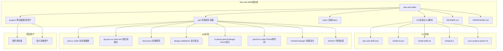

**图表来源**
- [README.md:253-286](file://das-ued-skills/README.md#L253-L286)
- [install.sh:1-189](file://das-ued-skills/cli/install.sh#L1-L189)

**章节来源**
- [README.md:253-286](file://das-ued-skills/README.md#L253-L286)

## 核心组件

### 全流程编排系统

`opt-prd-ux-code`是整个工作流程的核心编排系统，将六个阶段串联起来：

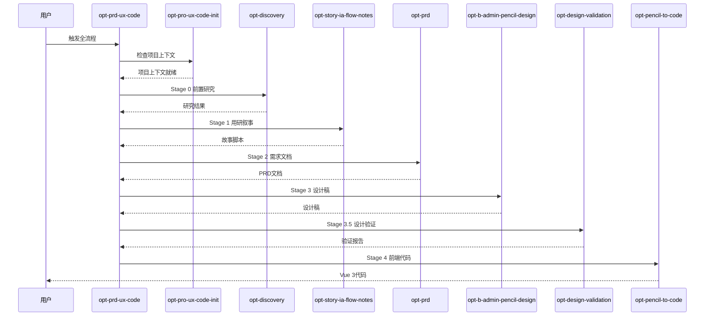

**图表来源**
- [SKILL.md:50-71](file://das-ued-skills/opt/prd-ux-code/SKILL.md#L50-L71)

### 项目初始化系统

`opt-pro-ux-code-init`是项目上下文初始化的唯一入口，负责建立可审计的项目记忆：

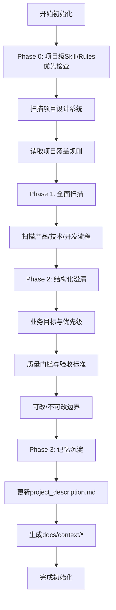

**图表来源**
- [SKILL.md:23-250](file://das-ued-skills/opt/opt-pro-ux-code-init/SKILL.md#L23-L250)

**章节来源**
- [SKILL.md:1-250](file://das-ued-skills/opt/opt-pro-ux-code-init/SKILL.md#L1-L250)

## 架构概览

### 系统架构

```mermaid
graph TB
subgraph "AI助手层"
A[Cursor]
B[Claude]
C[其他AI助手]
end
subgraph "Skills层"
D[opt-prd-ux-code]
E[opt-pro-ux-code-init]
F[opt-discovery]
G[opt-design-validation]
H[opt-b-admin-pencil-design]
I[opt-pencil-to-code]
J[opt-frontend-design]
K[opt-harden]
end
subgraph "项目层"
L[project_description.md]
M[设计系统]
N[组件库]
O[规则文件]
end
subgraph "输出层"
P[docs/ux/{模块名}/]
Q[src/views/{模块名}/]
R[设计稿(.pen)]
end
A --> D
B --> D
C --> D
D --> E
D --> F
D --> G
D --> H
D --> I
D --> J
D --> K
E --> L
H --> M
I --> N
I --> O
G --> O
D --> P
D --> Q
D --> R
```

**图表来源**
- [README.md:160-200](file://das-ued-skills/README.md#L160-L200)

### 数据流架构

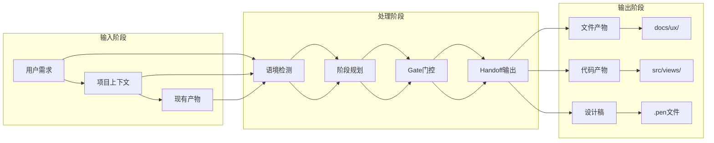

**图表来源**
- [SKILL.md:192-208](file://das-ued-skills/opt/prd-ux-code/SKILL.md#L192-L208)

## 详细组件分析

### Stage 0 - 前置研究

前置研究（Stage 0）是可选阶段，适用于全新产品或需要补充背景认知的情况。

#### 执行流程

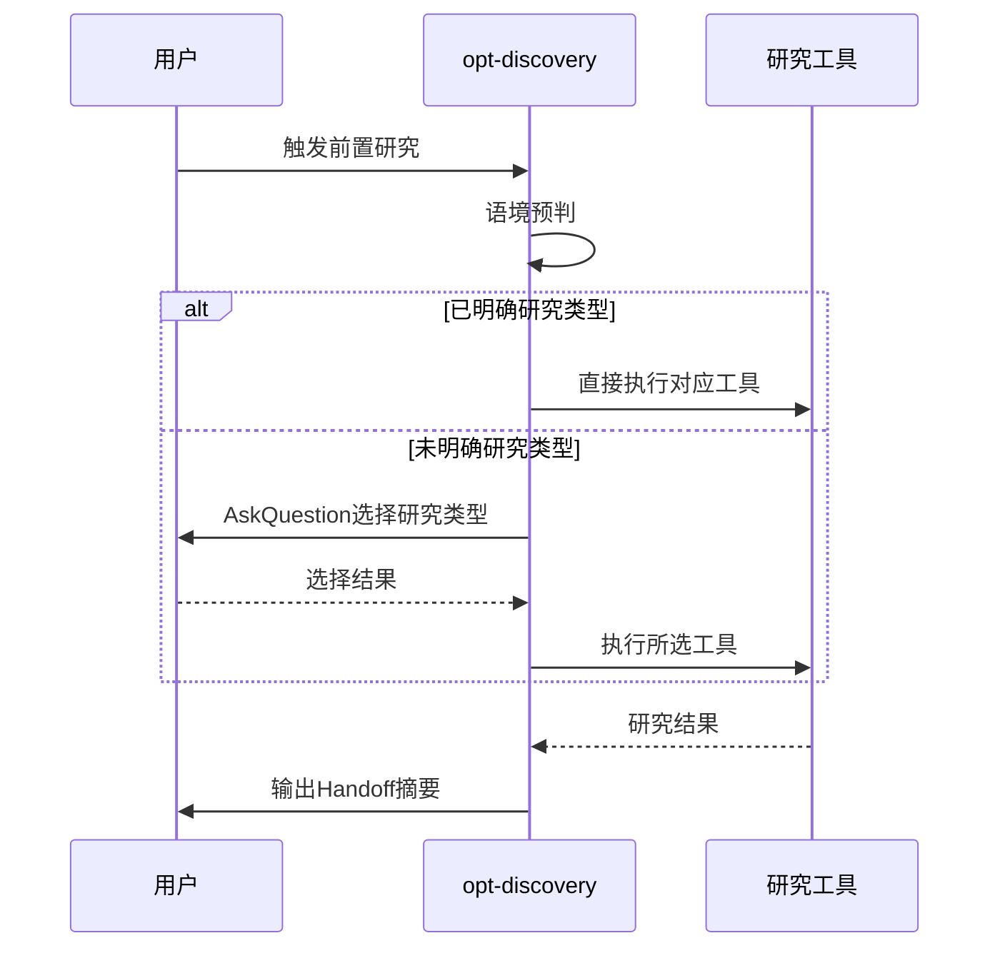

**图表来源**
- [SKILL.md:67-94](file://das-ued-skills/opt/discovery/SKILL.md#L67-L94)

#### 研究类型分类

| 研究类型 | 子工具 | 触发前提 | 输出文件 |
|----------|--------|----------|----------|
| A类竞品分析 | 竞品分析/趋势分析 | 用户提供竞品名称 | competitive-analysis.md |
| B类文档解析 | 投标参数分析/合规要求分析 | 用户提供文档 | tender-analysis.md, compliance-gap-analysis.md |
| C类洞察研究 | 亲和图/用户画像/旅程图 | 用户提供数据或明确场景 | affinity-diagram.md, personas.md, customer-journey-map.md |

**章节来源**
- [SKILL.md:21-64](file://das-ued-skills/opt/discovery/SKILL.md#L21-L64)

### Stage 1 - 用研叙事

用研叙事（Stage 1）默认跳过，仅在用户明确需要叙事材料时执行。

#### 质量保证机制

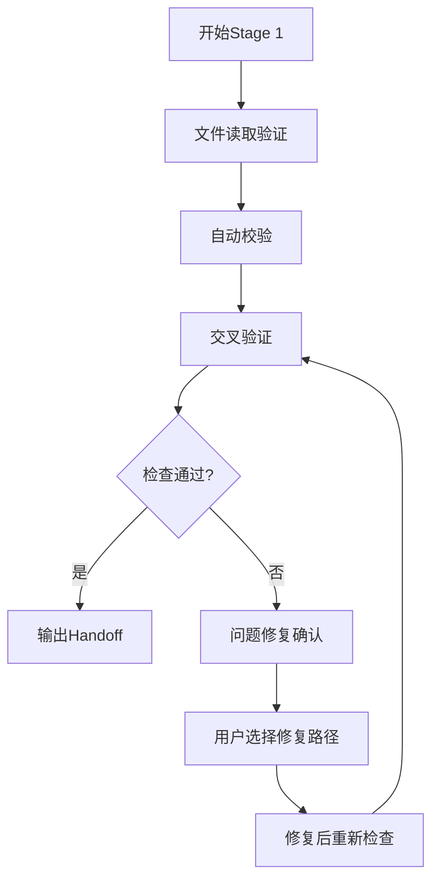

**图表来源**
- [SKILL.md:353-383](file://das-ued-skills/opt/prd-ux-code/SKILL.md#L353-L383)

**章节来源**
- [SKILL.md:342-386](file://das-ued-skills/opt/prd-ux-code/SKILL.md#L342-L386)

### Stage 2 - 需求文档

需求文档（Stage 2）生成完整的PRD文档。

#### Gate检查机制

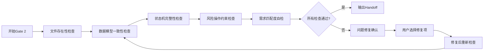

**图表来源**
- [SKILL.md:400-431](file://das-ued-skills/opt/prd-ux-code/SKILL.md#L400-L431)

**章节来源**
- [SKILL.md:389-434](file://das-ued-skills/opt/prd-ux-code/SKILL.md#L389-L434)

### Stage 3 - 设计稿

设计稿（Stage 3）是工作流中最复杂的阶段，涉及Pencil设计系统的使用。

#### 设计系统集成

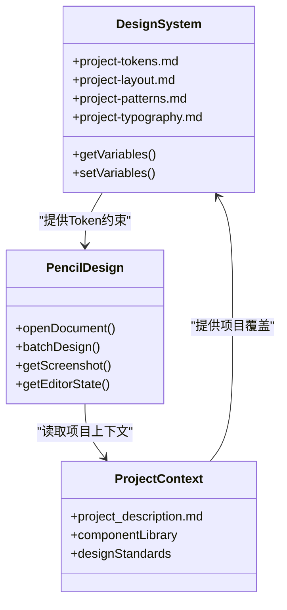

**图表来源**
- [SKILL.md:101-125](file://das-ued-skills/opt/b-admin-pencil-design/SKILL.md#L101-L125)

#### 设计流程

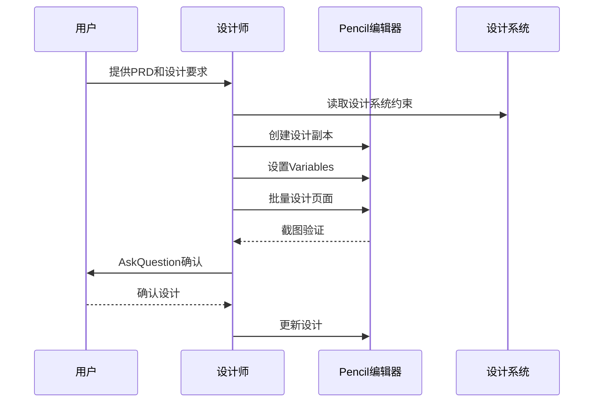

**图表来源**
- [SKILL.md:486-537](file://das-ued-skills/opt/prd-ux-code/SKILL.md#L486-L537)

**章节来源**
- [SKILL.md:437-611](file://das-ued-skills/opt/prd-ux-code/SKILL.md#L437-L611)

### Stage 3.5 - 设计验证

设计验证（Stage 3.5）在设计稿完成后执行，确保设计质量。

#### 验证流程

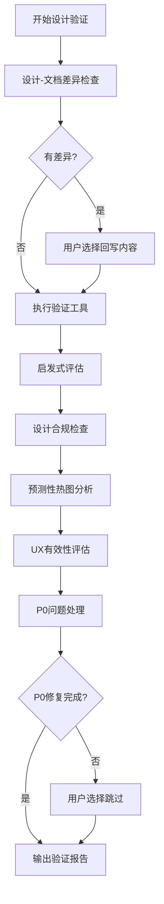

**图表来源**
- [SKILL.md:623-762](file://das-ued-skills/opt/prd-ux-code/SKILL.md#L623-L762)

**章节来源**
- [SKILL.md:614-766](file://das-ued-skills/opt/prd-ux-code/SKILL.md#L614-L766)

### Stage 4 - 前端代码

前端代码（Stage 4）将设计稿转换为Vue 3代码。

#### 代码生成模式

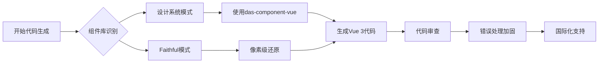

**图表来源**
- [SKILL.md:40-90](file://das-ued-skills/opt/pencil-to-code/SKILL.md#L40-L90)

**章节来源**
- [SKILL.md:768-800](file://das-ued-skills/opt/prd-ux-code/SKILL.md#L768-L800)

## 依赖关系分析

### 技能依赖图

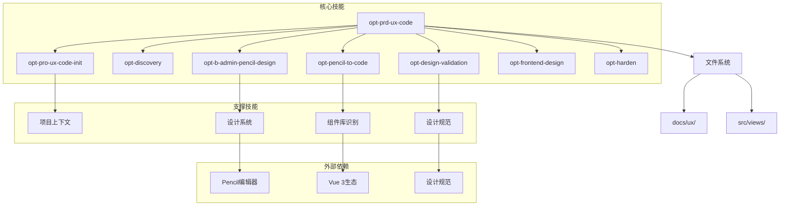

**图表来源**
- [README.md:203-251](file://das-ued-skills/README.md#L203-L251)

### 数据依赖关系

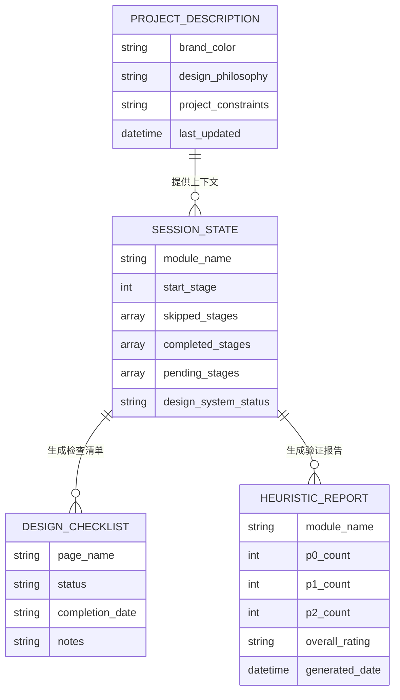

**图表来源**
- [SKILL.md:234-261](file://das-ued-skills/opt/prd-ux-code/SKILL.md#L234-L261)

**章节来源**
- [README.md:203-251](file://das-ued-skills/README.md#L203-L251)

## 性能考虑

### 执行效率优化

1. **并行处理**：Stage 0的研究工具可以并行执行，提高整体效率
2. **增量更新**：Gate检查失败时只修复特定问题，避免重新执行整个阶段
3. **缓存机制**：项目上下文和设计系统规则会缓存，减少重复读取
4. **智能跳过**：根据项目状态智能跳过不必要的阶段

### 资源管理

- **内存优化**：大型.pencil文件只读取必要的画板，避免内存溢出
- **网络优化**：竞品分析工具在网络受限时自动降级为AI知识路径
- **存储优化**：定期清理临时文件和中间产物

## 故障排除指南

### 常见问题及解决方案

#### 安装问题

| 问题 | 症状 | 解决方案 |
|------|------|----------|
| 技能找不到 | 在AI助手中搜索不到技能 | 检查安装目录与助手配置一致 |
| 权限错误 | 安装脚本执行失败 | 确保有足够权限访问目标目录 |
| 网络问题 | 下载依赖失败 | 检查网络连接，使用代理或离线安装 |

#### 执行问题

| 问题 | 症状 | 解决方案 |
|------|------|----------|
| Gate检查失败 | Gate显示未通过 | 修复相关问题后重新执行检查 |
| 设计系统不匹配 | 生成的代码不符合规范 | 检查project_description.md中的设计系统配置 |
| Pencil集成问题 | 无法读取.pencil文件 | 确保Pencil编辑器正常运行，检查文件权限 |

#### 数据问题

| 问题 | 症状 | 解决方案 |
|------|------|----------|
| 项目上下文缺失 | 设计类技能报错 | 运行`opt-pro-ux-code-init`建立项目上下文 |
| 文件路径错误 | 读取文件失败 | 检查文件路径是否正确，确认文件存在 |
| 版本冲突 | 生成代码与现有代码冲突 | 使用版本快照功能对比差异，选择合适版本 |

**章节来源**
- [README.md:322-344](file://das-ued-skills/README.md#L322-L344)

## 结论

das-ued-skills提供了一套完整、可追溯的设计开发工作流程，通过严格的Gate门控和文件优先原则，确保每个阶段的质量和可追溯性。该系统特别适合团队协作，能够：

1. **标准化流程**：通过明确的阶段划分和Gate检查，确保流程的一致性
2. **提高效率**：通过智能跳过和并行处理，减少不必要的工作
3. **保证质量**：通过多层次的验证和检查，确保输出质量
4. **便于协作**：通过文件系统和版本管理，便于团队协作和知识传承

建议团队在实施时：
- 先运行`opt-pro-ux-code-init`建立项目上下文
- 根据项目特点选择合适的阶段组合
- 严格执行Gate门控，确保质量
- 定期回顾和优化工作流程

## 附录

### 安装配置指南

#### 一键安装

```bash
# macOS/Linux
./cli/install-skills.sh --ai cursor

# Windows（Git Bash）
bash cli/install-skills.sh --ai cursor

# 自定义安装目录
./cli/install-skills.sh --ai cursor --target-dir "/custom/path/to/skills"
```

#### 全局Rules同步

```bash
# 同步全局Rules到各助手目录
./cli/install-skills.sh --ai cursor
```

#### 项目资产同步

```bash
# 复制项目资产到目标项目根目录
./cli/sync-project-assets.sh --project-root "/path/to/your-project" --force
```

### 使用示例

#### 新产品从0到1

1. 运行`opt-pro-ux-code-init`建立设计上下文
2. 运行`opt-prd-ux-code`，按提示确认从Stage 0或1开始
3. 每个Gate后回复"确认"

#### 已有PRD，需要设计稿

1. 将PRD放在`docs/ux/{模块名}/prd.md`
2. 运行`opt-prd-ux-code`，说明"已有PRD"，从Stage 3开始
3. 确认目标.pencil文件路径

#### 设计改了，要同步回文档

在对话中说"同步设计到文档"，会触发设计-文档差异检查流程，无需走完整Stage。

### 最佳实践

1. **建立项目上下文**：首次使用必须运行`opt-pro-ux-code-init`
2. **严格执行Gate**：每个阶段完成后必须获得用户确认
3. **文件优先**：所有产出都写入docs/ux/{模块名}/目录
4. **版本管理**：定期创建版本快照，便于追溯
5. **团队协作**：确保所有成员使用相同的技能和规范