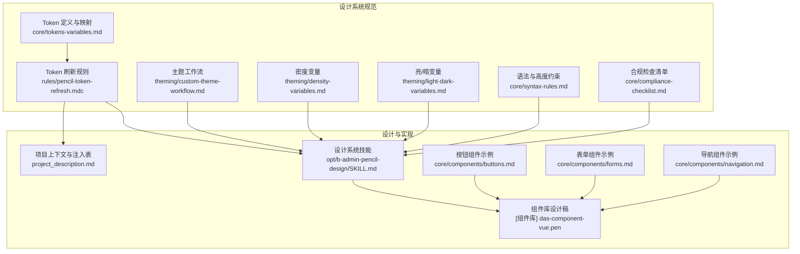
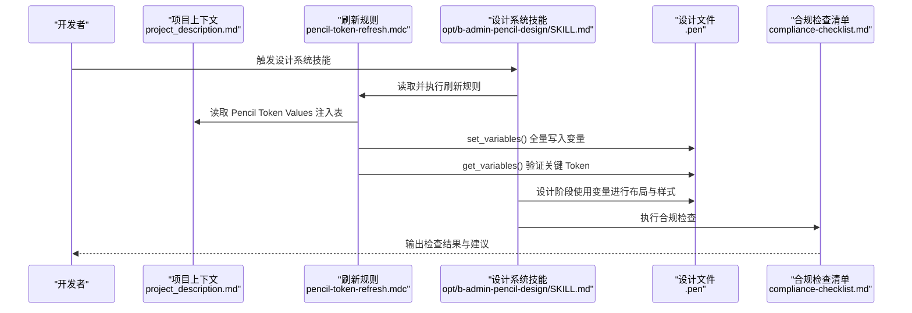
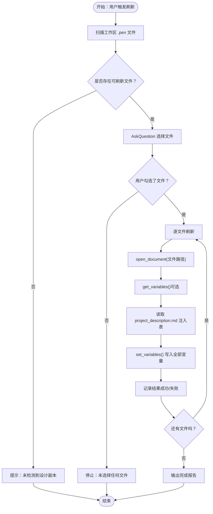
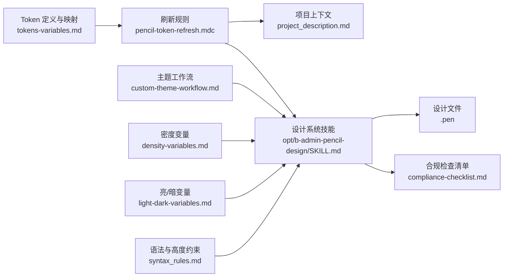

# Token机制与对齐

<cite>
**本文引用的文件**   
- [tokens-variables.md](file://das-ued-skills/opt/b-admin-pencil-design/core/tokens-variables.md)
- [pencil-token-refresh.mdc](file://das-ued-skills/rules/pencil-token-refresh.mdc)
- [custom-theme-workflow.md](file://das-ued-skills/opt/b-admin-pencil-design/theming/custom-theme-workflow.md)
- [density-variables.md](file://das-ued-skills/opt/b-admin-pencil-design/theming/density-variables.md)
- [light-dark-variables.md](file://das-ued-skills/opt/b-admin-pencil-design/theming/light-dark-variables.md)
- [buttons.md](file://das-ued-skills/opt/b-admin-pencil-design/core/components/buttons.md)
- [forms.md](file://das-ued-skills/opt/b-admin-pencil-design/core/components/forms.md)
- [navigation.md](file://das-ued-skills/opt/b-admin-pencil-design/core/components/navigation.md)
- [compliance-checklist.md](file://das-ued-skills/opt/b-admin-pencil-design/core/compliance-checklist.md)
- [syntax-rules.md](file://das-ued-skills/opt/b-admin-pencil-design/core/syntax-rules.md)
- [SKILL.md](file://das-ued-skills/opt/b-admin-pencil-design/SKILL.md)
- [project_description.md](file://project_description.md)
- [das-component-vue.pen](file://[组件库] das-component-vue.pen)
</cite>

## 目录
1. [引言](#引言)
2. [项目结构](#项目结构)
3. [核心组件](#核心组件)
4. [架构总览](#架构总览)
5. [详细组件分析](#详细组件分析)
6. [依赖分析](#依赖分析)
7. [性能考虑](#性能考虑)
8. [故障排查指南](#故障排查指南)
9. [结论](#结论)
10. [附录](#附录)

## 引言
本文件系统化阐述 Pencil 设计系统中的 Token 机制与对齐方法，围绕“设计规范与代码一致性”的目标，解释 Token 的概念、作用与工作机制，梳理 Token 刷新流程、变量定义与布局 Token 的使用方法，并给出对齐步骤、最佳实践与常见问题解决方案。通过对规则文件、主题工作流、组件规范与合规检查清单的综合解读，帮助开发者正确理解并使用 Token 系统，确保设计与实现的统一。

## 项目结构
围绕 Token 的设计与实施，本仓库的关键文件分布在如下位置：
- 核心 Token 定义与映射：core/tokens-variables.md
- Token 刷新规则：rules/pencil-token-refresh.mdc
- 主题与密度配置：theming/custom-theme-workflow.md、theming/density-variables.md、theming/light-dark-variables.md
- 组件与语法规范：core/components/*.md、core/syntax-rules.md
- 设计系统技能编排：opt/b-admin-pencil-design/SKILL.md
- 项目上下文与注入表：project_description.md
- 组件库设计稿：[组件库] das-component-vue.pen

**图表来源**
- [tokens-variables.md](file://das-ued-skills/opt/b-admin-pencil-design/core/tokens-variables.md)
- [pencil-token-refresh.mdc](file://das-ued-skills/rules/pencil-token-refresh.mdc)
- [custom-theme-workflow.md](file://das-ued-skills/opt/b-admin-pencil-design/theming/custom-theme-workflow.md)
- [density-variables.md](file://das-ued-skills/opt/b-admin-pencil-design/theming/density-variables.md)
- [light-dark-variables.md](file://das-ued-skills/opt/b-admin-pencil-design/theming/light-dark-variables.md)
- [syntax-rules.md](file://das-ued-skills/opt/b-admin-pencil-design/core/syntax-rules.md)
- [compliance-checklist.md](file://das-ued-skills/opt/b-admin-pencil-design/core/compliance-checklist.md)
- [SKILL.md](file://das-ued-skills/opt/b-admin-pencil-design/SKILL.md)
- [project_description.md](file://project_description.md)
- [das-component-vue.pen](file://[组件库] das-component-vue.pen)

**章节来源**
- [SKILL.md](file://das-ued-skills/opt/b-admin-pencil-design/SKILL.md)
- [project_description.md](file://project_description.md)

## 核心组件
- Token 定义与映射：提供变量命名规则、双模式格式说明、变量初始化示例、字体规范、Pencil 变量与 CSS 变量映射表，以及在 batch_design 中的引用方式。
- 刷新规则：定义“Q2 注入锚点”和“选择性批量刷新”的触发条件、执行步骤与验证流程，确保设计系统值与项目上下文一致。
- 主题与密度：提供定制主题工作流、亮/暗模式变量配置、信息密度三档变量与密度调整建议。
- 组件与语法：提供按钮、表单、导航等组件的 Token 使用示例，以及高度约束、阴影展开、文字换行等语法规则。
- 合规检查：提供颜色引用、字号排版、圆角、间距、阴影、Shell 完整性等检查清单，确保设计稿符合规范。

**章节来源**
- [tokens-variables.md](file://das-ued-skills/opt/b-admin-pencil-design/core/tokens-variables.md)
- [pencil-token-refresh.mdc](file://das-ued-skills/rules/pencil-token-refresh.mdc)
- [custom-theme-workflow.md](file://das-ued-skills/opt/b-admin-pencil-design/theming/custom-theme-workflow.md)
- [density-variables.md](file://das-ued-skills/opt/b-admin-pencil-design/theming/density-variables.md)
- [light-dark-variables.md](file://das-ued-skills/opt/b-admin-pencil-design/theming/light-dark-variables.md)
- [buttons.md](file://das-ued-skills/opt/b-admin-pencil-design/core/components/buttons.md)
- [forms.md](file://das-ued-skills/opt/b-admin-pencil-design/core/components/forms.md)
- [navigation.md](file://das-ued-skills/opt/b-admin-pencil-design/core/components/navigation.md)
- [compliance-checklist.md](file://das-ued-skills/opt/b-admin-pencil-design/core/compliance-checklist.md)
- [syntax-rules.md](file://das-ued-skills/opt/b-admin-pencil-design/core/syntax-rules.md)

## 架构总览
Token 机制的总体架构由“三层合并注入 + 项目覆盖 + 批量刷新 + 合规校验”构成，贯穿设计阶段与后续对齐流程。

**图表来源**
- [pencil-token-refresh.mdc](file://das-ued-skills/rules/pencil-token-refresh.mdc)
- [SKILL.md](file://das-ued-skills/opt/b-admin-pencil-design/SKILL.md)
- [compliance-checklist.md](file://das-ued-skills/opt/b-admin-pencil-design/core/compliance-checklist.md)
- [project_description.md](file://project_description.md)

## 详细组件分析

### Token 概念与作用
- Token 是设计系统中的“单一数据源”，用于统一颜色、间距、圆角、字号、密度、布局等设计参数。
- 作用包括：保证设计一致性、提升跨团队协作效率、降低视觉与交互偏差、便于主题切换与密度调整。
- 在 Pencil 中，Token 通过“变量名引用”在节点属性中生效，避免硬编码带来的维护成本。

**章节来源**
- [tokens-variables.md](file://das-ued-skills/opt/b-admin-pencil-design/core/tokens-variables.md)

### 变量命名与双模式格式
- 命名采用斜杠分组：category/subcategory/name（如 color/bg/page、spacing/md、radius/lg）。
- 颜色变量支持双模式（Light/Dark），非颜色 Token 使用单值格式。
- 新旧格式兼容：新项目使用 themes 对象，旧项目可继续使用 value 单值格式。

**章节来源**
- [tokens-variables.md](file://das-ued-skills/opt/b-admin-pencil-design/core/tokens-variables.md)

### 初始化与全量注入
- 新文件时调用 set_variables() 一次性写入全部变量，filePath 指向目标 .pen 文件。
- 注入表来源于 project_description.md 的 “Pencil Token Values” 节，包含品牌色、状态色、风险色、圆角、字体等。
- 若注入表缺失或格式不正确，规则会提示并回退到默认注入或引导用户补充。

**章节来源**
- [tokens-variables.md](file://das-ued-skills/opt/b-admin-pencil-design/core/tokens-variables.md)
- [pencil-token-refresh.mdc](file://das-ued-skills/rules/pencil-token-refresh.mdc)
- [project_description.md](file://project_description.md)

### 刷新流程与批量对齐
- 触发词：刷新设计系统、同步 Token、应用项目色、refresh tokens、刷新所有设计文件。
- 执行流程：
  1) 扫描工作区 .pen 文件（排除组件库文件）
  2) 用户选择需要刷新的文件
  3) 逐文件打开、读取注入表、set_variables 写入、记录结果
  4) 输出完成报告（成功/失败明细）

**图表来源**
- [pencil-token-refresh.mdc](file://das-ued-skills/rules/pencil-token-refresh.mdc)

**章节来源**
- [pencil-token-refresh.mdc](file://das-ued-skills/rules/pencil-token-refresh.mdc)

### 主题与密度配置
- 定制主题工作流：根据品牌色、色温和圆角风格、信息密度、字体基准、布局类型等维度推导变量值，支持亮/暗双模式。
- 亮/暗模式：通过主题切换变量集合实现，颜色变量在 light/dark 主题下分别赋值。
- 信息密度：提供 high/medium/low 三档密度变量，建议与间距缩放组合使用。

**章节来源**
- [custom-theme-workflow.md](file://das-ued-skills/opt/b-admin-pencil-design/theming/custom-theme-workflow.md)
- [light-dark-variables.md](file://das-ued-skills/opt/b-admin-pencil-design/theming/light-dark-variables.md)
- [density-variables.md](file://das-ued-skills/opt/b-admin-pencil-design/theming/density-variables.md)

### 组件中的 Token 使用
- 按钮、表单、导航等组件广泛使用 Token，如颜色、圆角、密度、字体、布局等。
- 通过在节点属性中使用 $variable 引用，确保组件风格与设计系统一致。

**章节来源**
- [buttons.md](file://das-ued-skills/opt/b-admin-pencil-design/core/components/buttons.md)
- [forms.md](file://das-ued-skills/opt/b-admin-pencil-design/core/components/forms.md)
- [navigation.md](file://das-ued-skills/opt/b-admin-pencil-design/core/components/navigation.md)

### 合规检查与对齐验证
- 合规检查清单覆盖颜色引用、字号排版、圆角、间距、阴影、Shell 完整性、表格、状态字段可见性、操作区一致性、文字溢出等。
- 设计完成后执行变量绑定审计，将裸 hex 统一替换为变量引用，确保视觉一致性与 Token 生效。

**章节来源**
- [compliance-checklist.md](file://das-ued-skills/opt/b-admin-pencil-design/core/compliance-checklist.md)
- [SKILL.md](file://das-ued-skills/opt/b-admin-pencil-design/SKILL.md)

## 依赖分析
Token 机制的依赖关系体现在“规则 → 上下文 → 设计文件 → 合规检查”的闭环中：

**图表来源**
- [pencil-token-refresh.mdc](file://das-ued-skills/rules/pencil-token-refresh.mdc)
- [SKILL.md](file://das-ued-skills/opt/b-admin-pencil-design/SKILL.md)
- [project_description.md](file://project_description.md)
- [custom-theme-workflow.md](file://das-ued-skills/opt/b-admin-pencil-design/theming/custom-theme-workflow.md)
- [density-variables.md](file://das-ued-skills/opt/b-admin-pencil-design/theming/density-variables.md)
- [light-dark-variables.md](file://das-ued-skills/opt/b-admin-pencil-design/theming/light-dark-variables.md)
- [syntax-rules.md](file://das-ued-skills/opt/b-admin-pencil-design/core/syntax-rules.md)
- [tokens-variables.md](file://das-ued-skills/opt/b-admin-pencil-design/core/tokens-variables.md)

**章节来源**
- [SKILL.md](file://das-ued-skills/opt/b-admin-pencil-design/SKILL.md)
- [pencil-token-refresh.mdc](file://das-ued-skills/rules/pencil-token-refresh.mdc)

## 性能考虑
- 变量注入的性能影响主要体现在 .pen 文件体量与 set_variables 的写入次数。建议：
  - 使用“全量注入”减少多次写入的开销。
  - 在批量刷新时按用户选择顺序逐文件处理，避免并发写入导致的冲突。
  - 合规检查与变量绑定审计尽量在设计完成后集中执行，减少重复扫描。

[本节为通用建议，无需特定文件引用]

## 故障排查指南
- 注入表格式不符：检查 project_description.md 的 “Pencil Token Values” 节是否包含“Pencil Variable | 值 |”列头，否则规则会提示修正。
- 注入后关键 Token 缺失：注入后调用 get_variables() 验证 radius/3xs、radius/xs、radius/lg 是否存在，缺失则重新执行注入。
- 项目覆盖值未生效：若注入表中“来源”列为“项目覆盖”，需核对 project-design-system.md 与 project-tokens.md 的一致性。
- 设计稿中仍出现裸 hex：执行变量绑定审计，将裸 hex 替换为变量引用，保留导航渐变色与阴影 color 字段例外。
- 圆角与密度不一致：确认已按主题工作流与密度变量配置完成注入，并在合规检查中重点核查圆角与间距。

**章节来源**
- [pencil-token-refresh.mdc](file://das-ued-skills/rules/pencil-token-refresh.mdc)
- [SKILL.md](file://das-ued-skills/opt/b-admin-pencil-design/SKILL.md)
- [compliance-checklist.md](file://das-ued-skills/opt/b-admin-pencil-design/core/compliance-checklist.md)

## 结论
通过“三层合并注入 + 项目覆盖 + 批量刷新 + 合规校验”的 Token 机制，Pencil 设计系统实现了设计规范与代码实现的高度一致性。开发者应严格遵循变量命名与双模式格式、按规则执行注入与刷新、在组件中统一使用 Token、并在设计完成后进行合规检查与变量绑定审计，从而确保设计与实现的统一与可维护性。

[本节为总结性内容，无需特定文件引用]

## 附录

### Token 刷新流程（步骤摘要）
- 触发词：刷新设计系统、同步 Token、应用项目色、refresh tokens、刷新所有设计文件
- 执行步骤：
  1) 扫描工作区 .pen 文件（排除组件库）
  2) 用户选择文件
  3) 逐文件 open_document → get_variables（可选）→ 读取注入表 → set_variables → 记录结果
  4) 输出完成报告

**章节来源**
- [pencil-token-refresh.mdc](file://das-ued-skills/rules/pencil-token-refresh.mdc)

### 变量定义与使用示例（路径指引）
- 变量初始化与映射：参见 [tokens-variables.md](file://das-ued-skills/opt/b-admin-pencil-design/core/tokens-variables.md)
- 按钮组件使用 Token：参见 [buttons.md](file://das-ued-skills/opt/b-admin-pencil-design/core/components/buttons.md)
- 表单组件使用 Token：参见 [forms.md](file://das-ued-skills/opt/b-admin-pencil-design/core/components/forms.md)
- 导航组件使用 Token：参见 [navigation.md](file://das-ued-skills/opt/b-admin-pencil-design/core/components/navigation.md)

**章节来源**
- [tokens-variables.md](file://das-ued-skills/opt/b-admin-pencil-design/core/tokens-variables.md)
- [buttons.md](file://das-ued-skills/opt/b-admin-pencil-design/core/components/buttons.md)
- [forms.md](file://das-ued-skills/opt/b-admin-pencil-design/core/components/forms.md)
- [navigation.md](file://das-ued-skills/opt/b-admin-pencil-design/core/components/navigation.md)

### 布局 Token 与组件库引用
- 布局 Token（如 header-height、sidebar-width、drawer-width、page-padding、section-gap、component-gap、content-padding、grid-gutter 等）在组件库设计稿中广泛使用，确保页面结构与间距一致。
- 组件库设计稿路径：[das-component-vue.pen](file://[组件库] das-component-vue.pen)

**章节来源**
- [das-component-vue.pen](file://[组件库] das-component-vue.pen)
- [tokens-variables.md](file://das-ued-skills/opt/b-admin-pencil-design/core/tokens-variables.md)