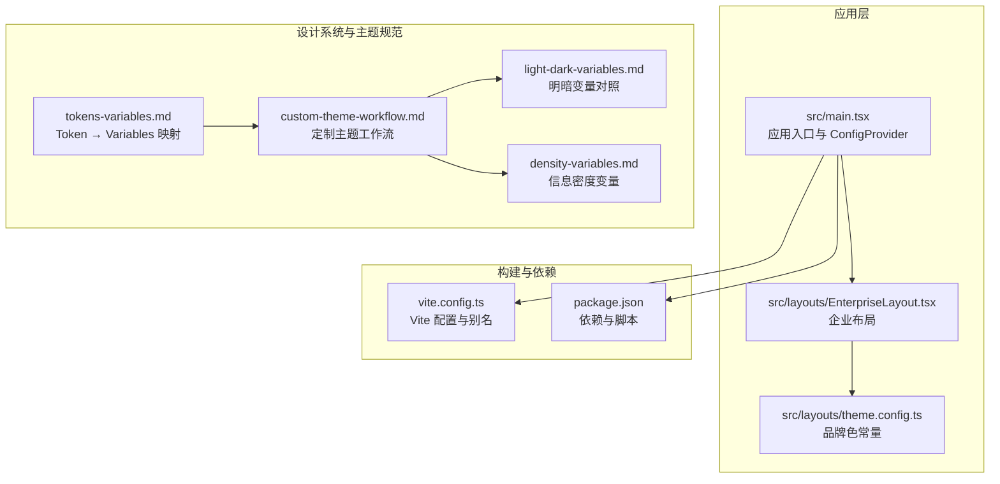
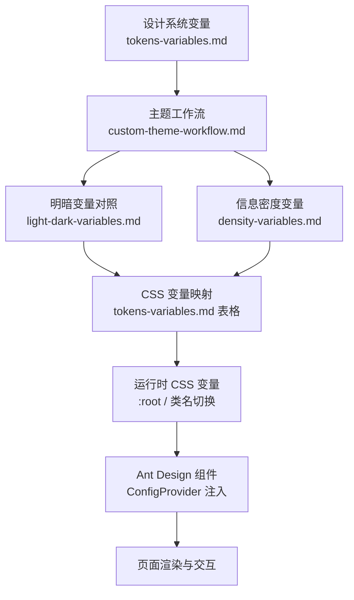
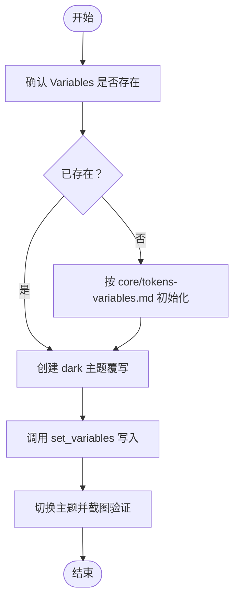
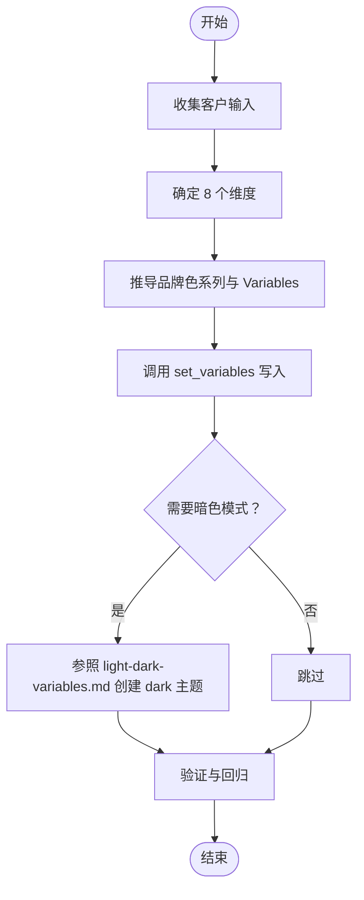
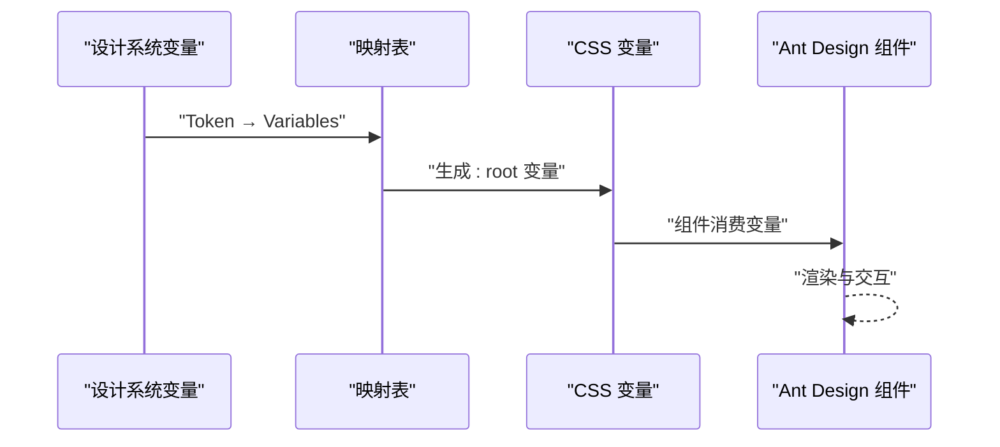
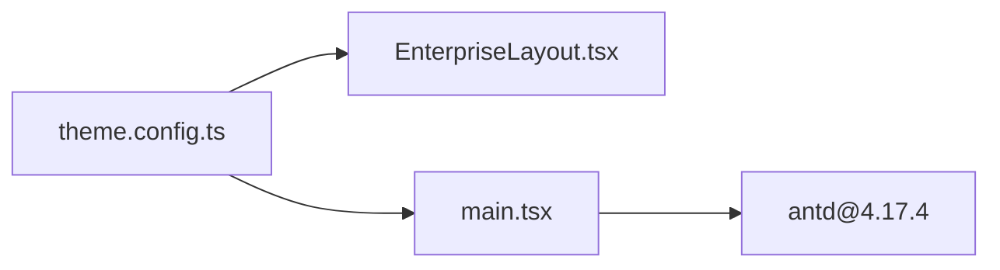

# 主题配置与定制

<cite>
**本文引用的文件**   
- [src/layouts/theme.config.ts](file://src/layouts/theme.config.ts)
- [das-ued-skills/opt/b-admin-pencil-design/theming/custom-theme-workflow.md](file://das-ued-skills/opt/b-admin-pencil-design/theming/custom-theme-workflow.md)
- [das-ued-skills/opt/b-admin-pencil-design/theming/light-dark-variables.md](file://das-ued-skills/opt/b-admin-pencil-design/theming/light-dark-variables.md)
- [das-ued-skills/opt/b-admin-pencil-design/theming/density-variables.md](file://das-ued-skills/opt/b-admin-pencil-design/theming/density-variables.md)
- [das-ued-skills/opt/b-admin-pencil-design/core/tokens-variables.md](file://das-ued-skills/opt/b-admin-pencil-design/core/tokens-variables.md)
- [src/main.tsx](file://src/main.tsx)
- [src/layouts/EnterpriseLayout.tsx](file://src/layouts/EnterpriseLayout.tsx)
- [vite.config.ts](file://vite.config.ts)
- [package.json](file://package.json)
</cite>

## 目录
1. [引言](#引言)
2. [项目结构](#项目结构)
3. [核心组件](#核心组件)
4. [架构总览](#架构总览)
5. [详细组件分析](#详细组件分析)
6. [依赖分析](#依赖分析)
7. [性能考虑](#性能考虑)
8. [故障排查指南](#故障排查指南)
9. [结论](#结论)
10. [附录](#附录)

## 引言
本指南面向在 APIG 项目中进行 Ant Design 主题配置与定制的工程师与设计师，目标是帮助团队建立一套可复用、可验证、可扩展的主题体系，覆盖品牌色设定、明暗主题变量、信息密度与字号体系、以及主题工作流程与最佳实践。文档同时结合项目现有实现与 UED 技能库中的主题规范，给出落地建议与排障思路。

## 项目结构
APIG 项目采用 React 17 + Vite + Ant Design 4 的前端技术栈，主题相关的关键位置如下：
- 主题常量与品牌色：src/layouts/theme.config.ts
- 应用入口与全局配置：src/main.tsx
- 企业布局与页面容器：src/layouts/EnterpriseLayout.tsx
- 构建与别名：vite.config.ts
- 依赖与版本：package.json
- 设计系统与主题规范（UED 技能库）：das-ued-skills 下的 tokens-variables、theming 等文档

图表来源
- [src/main.tsx:1-26](file://src/main.tsx#L1-L26)
- [src/layouts/EnterpriseLayout.tsx:1-20](file://src/layouts/EnterpriseLayout.tsx#L1-L20)
- [src/layouts/theme.config.ts:1-8](file://src/layouts/theme.config.ts#L1-L8)
- [vite.config.ts:1-16](file://vite.config.ts#L1-L16)
- [package.json:1-28](file://package.json#L1-L28)
- [das-ued-skills/opt/b-admin-pencil-design/core/tokens-variables.md:1-246](file://das-ued-skills/opt/b-admin-pencil-design/core/tokens-variables.md#L1-L246)
- [das-ued-skills/opt/b-admin-pencil-design/theming/custom-theme-workflow.md:1-114](file://das-ued-skills/opt/b-admin-pencil-design/theming/custom-theme-workflow.md#L1-L114)
- [das-ued-skills/opt/b-admin-pencil-design/theming/light-dark-variables.md:1-82](file://das-ued-skills/opt/b-admin-pencil-design/theming/light-dark-variables.md#L1-L82)
- [das-ued-skills/opt/b-admin-pencil-design/theming/density-variables.md:1-63](file://das-ued-skills/opt/b-admin-pencil-design/theming/density-variables.md#L1-L63)

章节来源
- [src/main.tsx:1-26](file://src/main.tsx#L1-L26)
- [src/layouts/EnterpriseLayout.tsx:1-20](file://src/layouts/EnterpriseLayout.tsx#L1-L20)
- [src/layouts/theme.config.ts:1-8](file://src/layouts/theme.config.ts#L1-L8)
- [vite.config.ts:1-16](file://vite.config.ts#L1-L16)
- [package.json:1-28](file://package.json#L1-L28)
- [das-ued-skills/opt/b-admin-pencil-design/core/tokens-variables.md:1-246](file://das-ued-skills/opt/b-admin-pencil-design/core/tokens-variables.md#L1-L246)
- [das-ued-skills/opt/b-admin-pencil-design/theming/custom-theme-workflow.md:1-114](file://das-ued-skills/opt/b-admin-pencil-design/theming/custom-theme-workflow.md#L1-L114)
- [das-ued-skills/opt/b-admin-pencil-design/theming/light-dark-variables.md:1-82](file://das-ued-skills/opt/b-admin-pencil-design/theming/light-dark-variables.md#L1-L82)
- [das-ued-skills/opt/b-admin-pencil-design/theming/density-variables.md:1-63](file://das-ued-skills/opt/b-admin-pencil-design/theming/density-variables.md#L1-L63)

## 核心组件
- 品牌色常量与主题种子
  - 当前项目在 theme.config.ts 中沉淀了企业品牌色常量，用于布局与页面引用。该文件为轻量常量层，便于集中管理与复用。
  - 参考路径：[src/layouts/theme.config.ts:5-7](file://src/layouts/theme.config.ts#L5-L7)

- 全局主题注入与语言包
  - 应用入口 main.tsx 通过 ConfigProvider 注入全局语言包与基础配置，为后续主题切换与组件本地化提供上下文。
  - 参考路径：[src/main.tsx:4-6](file://src/main.tsx#L4-L6)

- 企业布局与背景色
  - EnterpriseLayout.tsx 定义了头部与内容区域的背景色，体现明暗模式下的视觉基底。这些颜色应与主题变量体系保持一致。
  - 参考路径：[src/layouts/EnterpriseLayout.tsx:11-14](file://src/layouts/EnterpriseLayout.tsx#L11-L14)

- 构建与别名
  - vite.config.ts 提供 @ 别名与开发端口配置，便于模块导入与开发体验。
  - 参考路径：[vite.config.ts:7-11](file://vite.config.ts#L7-L11)

- 依赖与版本
  - package.json 指定 antd@4.17.4 与 react、react-router-dom 等依赖，确保主题变量与组件样式的一致性。
  - 参考路径：[package.json:11-17](file://package.json#L11-L17)

章节来源
- [src/layouts/theme.config.ts:1-8](file://src/layouts/theme.config.ts#L1-L8)
- [src/main.tsx:1-26](file://src/main.tsx#L1-L26)
- [src/layouts/EnterpriseLayout.tsx:1-20](file://src/layouts/EnterpriseLayout.tsx#L1-L20)
- [vite.config.ts:1-16](file://vite.config.ts#L1-L16)
- [package.json:1-28](file://package.json#L1-L28)

## 架构总览
下图展示了主题配置在应用中的流转：从设计系统变量到运行时 CSS 变量，再到 Ant Design 组件渲染与明暗模式切换。

图表来源
- [das-ued-skills/opt/b-admin-pencil-design/core/tokens-variables.md:191-228](file://das-ued-skills/opt/b-admin-pencil-design/core/tokens-variables.md#L191-L228)
- [das-ued-skills/opt/b-admin-pencil-design/theming/custom-theme-workflow.md:21-101](file://das-ued-skills/opt/b-admin-pencil-design/theming/custom-theme-workflow.md#L21-L101)
- [das-ued-skills/opt/b-admin-pencil-design/theming/light-dark-variables.md:10-51](file://das-ued-skills/opt/b-admin-pencil-design/theming/light-dark-variables.md#L10-L51)
- [das-ued-skills/opt/b-admin-pencil-design/theming/density-variables.md:3-50](file://das-ued-skills/opt/b-admin-pencil-design/theming/density-variables.md#L3-L50)
- [src/main.tsx:4-6](file://src/main.tsx#L4-L6)

## 详细组件分析

### 品牌色与主题种子
- 现状
  - 项目在 theme.config.ts 中导出品牌色常量，供布局与页面引用，避免硬编码。
  - 参考路径：[src/layouts/theme.config.ts:5-7](file://src/layouts/theme.config.ts#L5-L7)

- 最佳实践
  - 将品牌色作为“种子”，通过设计系统变量推导主色系列（normal/hover/active/disabled/light），并在明暗模式下分别维护。
  - 参考工作流：[das-ued-skills/opt/b-admin-pencil-design/theming/custom-theme-workflow.md:49-77](file://das-ued-skills/opt/b-admin-pencil-design/theming/custom-theme-workflow.md#L49-L77)

- 明暗变量对照
  - 在 light-dark-variables.md 中列出明/暗两套变量对照，便于一键切换。
  - 参考路径：[das-ued-skills/opt/b-admin-pencil-design/theming/light-dark-variables.md:55-72](file://das-ued-skills/opt/b-admin-pencil-design/theming/light-dark-variables.md#L55-L72)

- 信息密度与字号
  - 使用 density-variables.md 的三档密度（high/medium/low）与字号体系，配合 spacing 调整，形成统一的信息密度策略。
  - 参考路径：[das-ued-skills/opt/b-admin-pencil-design/theming/density-variables.md:3-50](file://das-ued-skills/opt/b-admin-pencil-design/theming/density-variables.md#L3-L50)

章节来源
- [src/layouts/theme.config.ts:1-8](file://src/layouts/theme.config.ts#L1-L8)
- [das-ued-skills/opt/b-admin-pencil-design/theming/custom-theme-workflow.md:49-77](file://das-ued-skills/opt/b-admin-pencil-design/theming/custom-theme-workflow.md#L49-L77)
- [das-ued-skills/opt/b-admin-pencil-design/theming/light-dark-variables.md:55-72](file://das-ued-skills/opt/b-admin-pencil-design/theming/light-dark-variables.md#L55-L72)
- [das-ued-skills/opt/b-admin-pencil-design/theming/density-variables.md:3-50](file://das-ued-skills/opt/b-admin-pencil-design/theming/density-variables.md#L3-L50)

### 明/暗主题变量配置
- 变量结构
  - 颜色变量使用 themes 对象支持亮/暗双模式，非颜色变量（如 spacing/radius/font）使用 value 单值格式。
  - 参考路径：[das-ued-skills/opt/b-admin-pencil-design/core/tokens-variables.md:10-18](file://das-ued-skills/opt/b-admin-pencil-design/core/tokens-variables.md#L10-L18)

- 操作步骤
  - 确认当前 Variables，创建 dark 主题覆写，调用 set_variables 写入。
  - 参考路径：[das-ued-skills/opt/b-admin-pencil-design/theming/light-dark-variables.md:12-49](file://das-ued-skills/opt/b-admin-pencil-design/theming/light-dark-variables.md#L12-L49)

- 验证清单
  - 切换主题后检查文字对比度、品牌色突出度、分割线与边框可见性。
  - 参考路径：[das-ued-skills/opt/b-admin-pencil-design/theming/light-dark-variables.md:76-82](file://das-ued-skills/opt/b-admin-pencil-design/theming/light-dark-variables.md#L76-L82)

图表来源
- [das-ued-skills/opt/b-admin-pencil-design/theming/light-dark-variables.md:12-49](file://das-ued-skills/opt/b-admin-pencil-design/theming/light-dark-variables.md#L12-L49)
- [das-ued-skills/opt/b-admin-pencil-design/core/tokens-variables.md:22-137](file://das-ued-skills/opt/b-admin-pencil-design/core/tokens-variables.md#L22-L137)

章节来源
- [das-ued-skills/opt/b-admin-pencil-design/core/tokens-variables.md:10-18](file://das-ued-skills/opt/b-admin-pencil-design/core/tokens-variables.md#L10-L18)
- [das-ued-skills/opt/b-admin-pencil-design/theming/light-dark-variables.md:12-49](file://das-ued-skills/opt/b-admin-pencil-design/theming/light-dark-variables.md#L12-L49)
- [das-ued-skills/opt/b-admin-pencil-design/theming/light-dark-variables.md:76-82](file://das-ued-skills/opt/b-admin-pencil-design/theming/light-dark-variables.md#L76-L82)

### 主题工作流程与定制
- 工作流概览
  - 收集客户输入（品牌色、是否需要暗色模式、行业类别等）
  - 确定 8 个维度（color-mode、brand-color、bg-tone、spacing-scale、info-density、font-base、radius-style、layout-type）
  - 推导品牌色系列与 Variables 配置
  - 写入 Variables 并按需创建 dark 主题
  - 验证与回归
  - 参考路径：[das-ued-skills/opt/b-admin-pencil-design/theming/custom-theme-workflow.md:21-114](file://das-ued-skills/opt/b-admin-pencil-design/theming/custom-theme-workflow.md#L21-L114)

- 品牌色来源优先级
  - 用户/客户明确提供的品牌色 hex > 主线产品未指定（使用默认值）> 定制项目且未提供（需征询用户）
  - 参考路径：[das-ued-skills/opt/b-admin-pencil-design/theming/custom-theme-workflow.md:7-17](file://das-ued-skills/opt/b-admin-pencil-design/theming/custom-theme-workflow.md#L7-L17)

图表来源
- [das-ued-skills/opt/b-admin-pencil-design/theming/custom-theme-workflow.md:21-114](file://das-ued-skills/opt/b-admin-pencil-design/theming/custom-theme-workflow.md#L21-L114)
- [das-ued-skills/opt/b-admin-pencil-design/theming/light-dark-variables.md:10-51](file://das-ued-skills/opt/b-admin-pencil-design/theming/light-dark-variables.md#L10-L51)

章节来源
- [das-ued-skills/opt/b-admin-pencil-design/theming/custom-theme-workflow.md:21-114](file://das-ued-skills/opt/b-admin-pencil-design/theming/custom-theme-workflow.md#L21-L114)
- [das-ued-skills/opt/b-admin-pencil-design/theming/custom-theme-workflow.md:7-17](file://das-ued-skills/opt/b-admin-pencil-design/theming/custom-theme-workflow.md#L7-L17)

### 从设计系统到运行时的映射
- Token → Variables → CSS 变量
  - 设计系统变量通过映射表转换为 CSS 变量，再由组件消费。
  - 参考路径：[das-ued-skills/opt/b-admin-pencil-design/core/tokens-variables.md:191-228](file://das-ued-skills/opt/b-admin-pencil-design/core/tokens-variables.md#L191-L228)

- 字体与字号
  - 使用 font/size 系列变量，并在 CSS 层通过 JS 动态设置基准字号。
  - 参考路径：[das-ued-skills/opt/b-admin-pencil-design/core/tokens-variables.md:172-187](file://das-ued-skills/opt/b-admin-pencil-design/core/tokens-variables.md#L172-L187)

图表来源
- [das-ued-skills/opt/b-admin-pencil-design/core/tokens-variables.md:191-228](file://das-ued-skills/opt/b-admin-pencil-design/core/tokens-variables.md#L191-L228)

章节来源
- [das-ued-skills/opt/b-admin-pencil-design/core/tokens-variables.md:191-228](file://das-ued-skills/opt/b-admin-pencil-design/core/tokens-variables.md#L191-L228)
- [das-ued-skills/opt/b-admin-pencil-design/core/tokens-variables.md:172-187](file://das-ued-skills/opt/b-admin-pencil-design/core/tokens-variables.md#L172-L187)

### 在项目中的落地建议
- 品牌色与布局
  - 将 theme.config.ts 的品牌色常量与布局背景色对齐，确保一致性。
  - 参考路径：[src/layouts/theme.config.ts:5-7](file://src/layouts/theme.config.ts#L5-L7)，[src/layouts/EnterpriseLayout.tsx:11-14](file://src/layouts/EnterpriseLayout.tsx#L11-L14)

- 全局注入与语言包
  - 在 main.tsx 中通过 ConfigProvider 注入语言包，保证组件文案与主题一致。
  - 参考路径：[src/main.tsx:4-6](file://src/main.tsx#L4-L6)

- 构建与别名
  - 使用 vite.config.ts 的 @ 别名简化导入，提升开发效率。
  - 参考路径：[vite.config.ts:7-11](file://vite.config.ts#L7-L11)

章节来源
- [src/layouts/theme.config.ts:1-8](file://src/layouts/theme.config.ts#L1-L8)
- [src/layouts/EnterpriseLayout.tsx:1-20](file://src/layouts/EnterpriseLayout.tsx#L1-L20)
- [src/main.tsx:1-26](file://src/main.tsx#L1-L26)
- [vite.config.ts:1-16](file://vite.config.ts#L1-L16)

## 依赖分析
- 组件耦合
  - theme.config.ts 与布局组件存在弱耦合，便于集中管理品牌色。
  - main.tsx 与 ConfigProvider 形成全局注入点，影响全站主题表现。
  - 参考路径：[src/layouts/theme.config.ts:5-7](file://src/layouts/theme.config.ts#L5-L7)，[src/main.tsx:4-6](file://src/main.tsx#L4-L6)

- 外部依赖
  - 项目依赖 antd@4.17.4，主题变量与组件样式需与之匹配。
  - 参考路径：[package.json:11-17](file://package.json#L11-L17)

图表来源
- [src/layouts/theme.config.ts:1-8](file://src/layouts/theme.config.ts#L1-L8)
- [src/layouts/EnterpriseLayout.tsx:1-20](file://src/layouts/EnterpriseLayout.tsx#L1-L20)
- [src/main.tsx:1-26](file://src/main.tsx#L1-L26)
- [package.json:11-17](file://package.json#L11-L17)

章节来源
- [src/layouts/theme.config.ts:1-8](file://src/layouts/theme.config.ts#L1-L8)
- [src/layouts/EnterpriseLayout.tsx:1-20](file://src/layouts/EnterpriseLayout.tsx#L1-L20)
- [src/main.tsx:1-26](file://src/main.tsx#L1-L26)
- [package.json:1-28](file://package.json#L1-L28)

## 性能考虑
- 变量切换成本
  - 明/暗主题切换通过 CSS 变量或根类名切换实现，尽量避免频繁重排与重绘。
- 打包体积
  - 仅引入必要的 Ant Design 样式与组件，减少打包体积。
- 渲染性能
  - 将品牌色常量集中管理，避免在组件内部重复计算或硬编码，降低渲染开销。

## 故障排查指南
- 明/暗模式切换后文字对比度不足
  - 检查 light-dark-variables.md 中的对照值是否正确，确保文本与背景满足对比度要求。
  - 参考路径：[das-ued-skills/opt/b-admin-pencil-design/theming/light-dark-variables.md:76-82](file://das-ued-skills/opt/b-admin-pencil-design/theming/light-dark-variables.md#L76-L82)

- 品牌色按钮文字颜色异常
  - 确认品牌色系列（normal/hover/active/disabled/light）与 Variables 写入一致。
  - 参考路径：[das-ued-skills/opt/b-admin-pencil-design/theming/custom-theme-workflow.md:49-77](file://das-ued-skills/opt/b-admin-pencil-design/theming/custom-theme-workflow.md#L49-L77)

- 圆角风格不一致
  - 检查 radius 系列变量与组件圆角映射，确保 Pencil 与 CSS 层命名差异被正确处理。
  - 参考路径：[das-ued-skills/opt/b-admin-pencil-design/core/tokens-variables.md:226-227](file://das-ued-skills/opt/b-admin-pencil-design/core/tokens-variables.md#L226-L227)

- 字号与密度不一致
  - 校验 density-variables.md 的三档密度与 spacing 调整是否同步更新。
  - 参考路径：[das-ued-skills/opt/b-admin-pencil-design/theming/density-variables.md:54-62](file://das-ued-skills/opt/b-admin-pencil-design/theming/density-variables.md#L54-L62)

章节来源
- [das-ued-skills/opt/b-admin-pencil-design/theming/light-dark-variables.md:76-82](file://das-ued-skills/opt/b-admin-pencil-design/theming/light-dark-variables.md#L76-L82)
- [das-ued-skills/opt/b-admin-pencil-design/theming/custom-theme-workflow.md:49-77](file://das-ued-skills/opt/b-admin-pencil-design/theming/custom-theme-workflow.md#L49-L77)
- [das-ued-skills/opt/b-admin-pencil-design/core/tokens-variables.md:226-227](file://das-ued-skills/opt/b-admin-pencil-design/core/tokens-variables.md#L226-L227)
- [das-ued-skills/opt/b-admin-pencil-design/theming/density-variables.md:54-62](file://das-ued-skills/opt/b-admin-pencil-design/theming/density-variables.md#L54-L62)

## 结论
通过将品牌色常量集中管理、遵循定制主题工作流、严格维护明/暗变量对照与信息密度体系，并在应用入口统一注入全局配置，APIG 项目可以建立起稳定、可扩展的主题体系。建议在后续迭代中逐步完善动态切换与个性化定制能力，持续优化对比度与可访问性，并结合设计系统变量与 CSS 变量映射，确保设计与实现的一致性。

## 附录
- 关键文件索引
  - 品牌色常量：[src/layouts/theme.config.ts:5-7](file://src/layouts/theme.config.ts#L5-L7)
  - 全局注入：[src/main.tsx:4-6](file://src/main.tsx#L4-L6)
  - 企业布局：[src/layouts/EnterpriseLayout.tsx:11-14](file://src/layouts/EnterpriseLayout.tsx#L11-L14)
  - 构建别名：[vite.config.ts:7-11](file://vite.config.ts#L7-L11)
  - 依赖版本：[package.json:11-17](file://package.json#L11-L17)
  - 设计系统映射：[das-ued-skills/opt/b-admin-pencil-design/core/tokens-variables.md:191-228](file://das-ued-skills/opt/b-admin-pencil-design/core/tokens-variables.md#L191-L228)
  - 主题工作流：[das-ued-skills/opt/b-admin-pencil-design/theming/custom-theme-workflow.md:21-114](file://das-ued-skills/opt/b-admin-pencil-design/theming/custom-theme-workflow.md#L21-L114)
  - 明暗变量对照：[das-ued-skills/opt/b-admin-pencil-design/theming/light-dark-variables.md:55-72](file://das-ued-skills/opt/b-admin-pencil-design/theming/light-dark-variables.md#L55-L72)
  - 密度变量：[das-ued-skills/opt/b-admin-pencil-design/theming/density-variables.md:3-50](file://das-ued-skills/opt/b-admin-pencil-design/theming/density-variables.md#L3-L50)