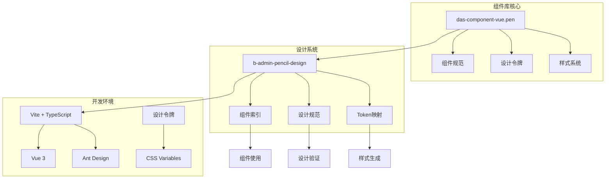
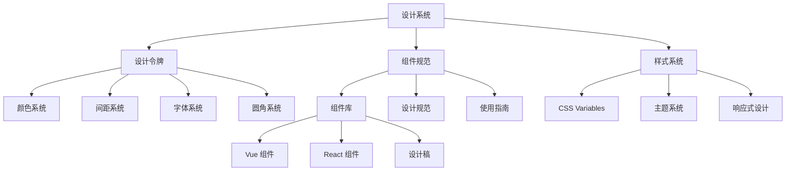
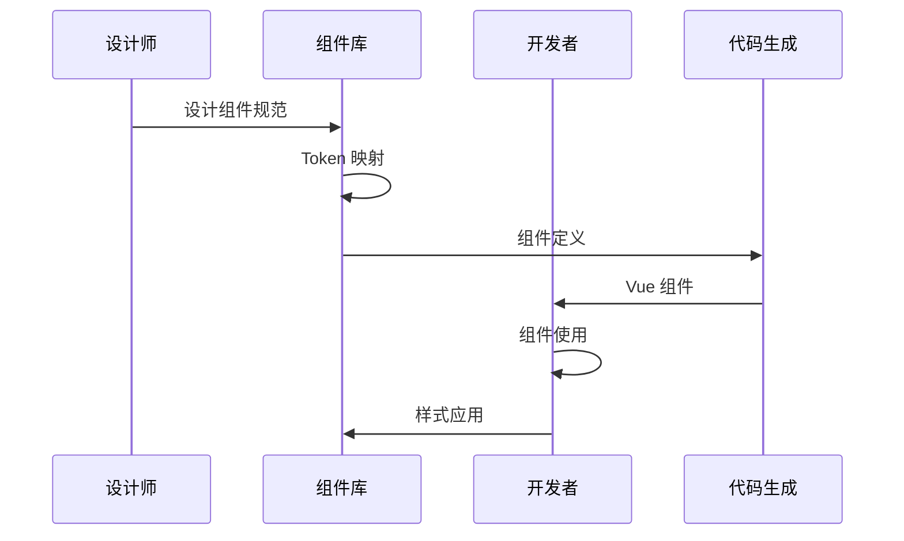
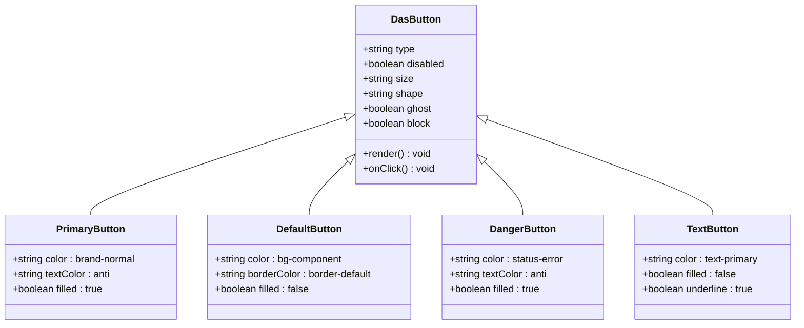
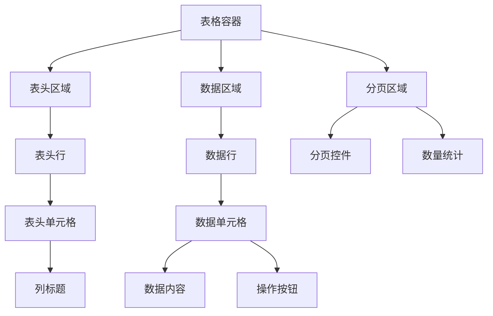
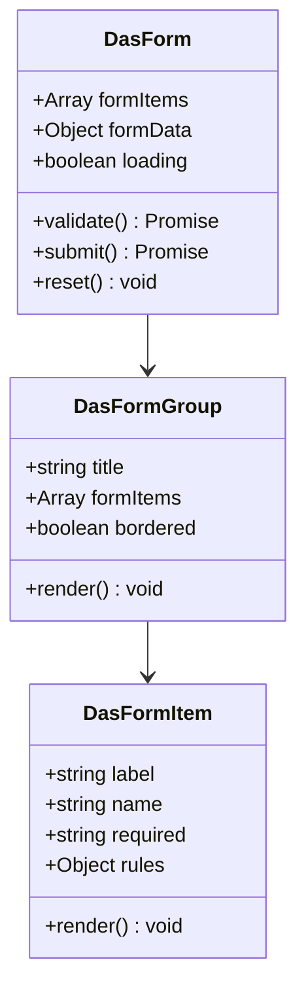
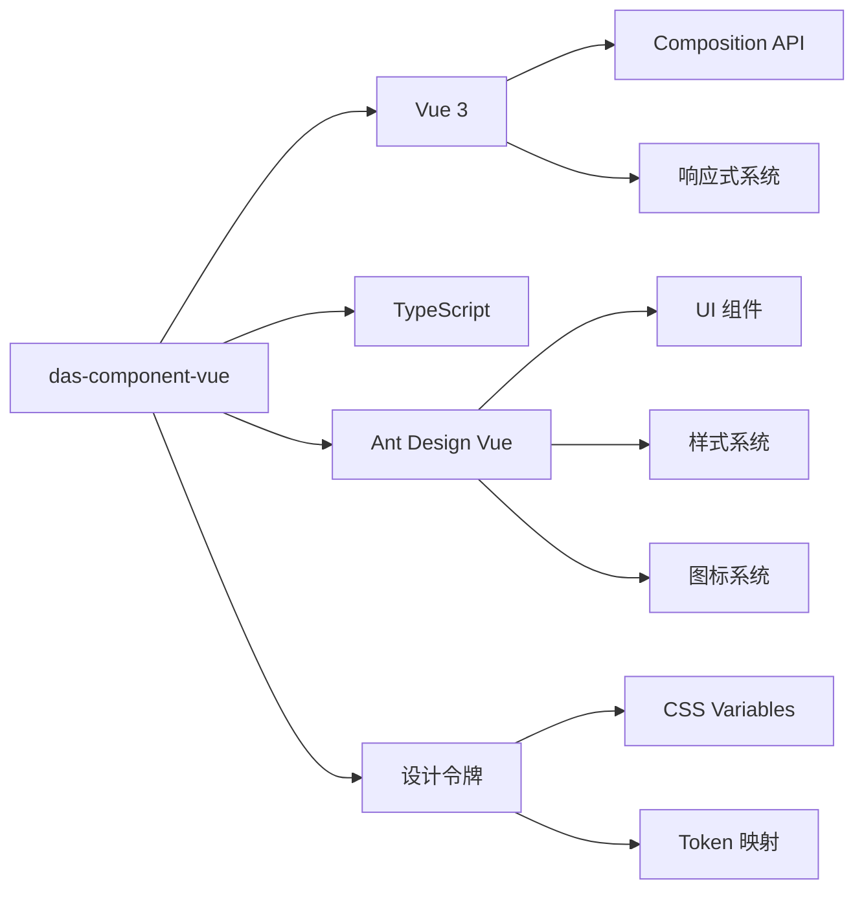

# 组件库使用指南

<cite>
**本文档引用的文件**
- [package.json](file://package.json)
- [component-library-standards.mdc](file://component-library-standards.mdc)
- [das-ued-skills/README.md](file://das-ued-skills/README.md)
- [das-ued-skills/VERSIONING.md](file://das-ued-skills/VERSIONING.md)
- [das-ued-skills/opt/b-admin-pencil-design/SKILL.md](file://das-ued-skills/opt/b-admin-pencil-design/SKILL.md)
- [das-ued-skills/opt/b-admin-pencil-design/core/tokens-variables.md](file://das-ued-skills/opt/b-admin-pencil-design/core/tokens-variables.md)
- [das-ued-skills/opt/b-admin-pencil-design/core/component-index.md](file://das-ued-skills/opt/b-admin-pencil-design/core/component-index.md)
- [das-ued-skills/opt/b-admin-pencil-design/core/components/buttons.md](file://das-ued-skills/opt/b-admin-pencil-design/core/components/buttons.md)
- [das-ued-skills/opt/b-admin-pencil-design/core/components/tables.md](file://das-ued-skills/opt/b-admin-pencil-design/core/components/tables.md)
- [das-ued-skills/opt/b-admin-pencil-design/core/components/forms.md](file://das-ued-skills/opt/b-admin-pencil-design/core/components/forms.md)
- [das-ued-skills/opt/b-admin-pencil-design/core/patterns/shell-standard.md](file://das-ued-skills/opt/b-admin-pencil-design/core/patterns/shell-standard.md)
</cite>

## 目录
1. [简介](#简介)
2. [项目结构](#项目结构)
3. [核心组件](#核心组件)
4. [架构概览](#架构概览)
5. [详细组件分析](#详细组件分析)
6. [依赖分析](#依赖分析)
7. [性能考虑](#性能考虑)
8. [故障排除指南](#故障排除指南)
9. [结论](#结论)
10. [附录](#附录)

## 简介

das-component-vue 是一套专为 B端后台设计的 Vue 3 组件库，采用设计系统驱动的组件优先级策略。该组件库通过统一的设计语言和组件规范，确保产品在视觉一致性、交互体验和开发效率方面的全面提升。

### 核心特性

- **设计系统优先**：组件库采用 `das-*` 优先级，确保设计一致性
- **Ant Design 集成**：与 Ant Design Vue 深度集成，提供丰富的 UI 组件
- **Token 驱动**：基于 CSS Variables 的设计令牌系统
- **完整生态**：涵盖从设计到开发的完整工作流

## 项目结构



**图表来源**
- [das-ued-skills/README.md:253-286](file://das-ued-skills/README.md#L253-L286)
- [das-ued-skills/opt/b-admin-pencil-design/SKILL.md:275-384](file://das-ued-skills/opt/b-admin-pencil-design/SKILL.md#L275-L384)

### 组件分类体系

组件库采用三层优先级体系：

1. **第一优先级 (das-*)**：核心业务组件
   - 搜索工具栏 `<DasSearchBar>`
   - 数据表格 `<DasTable>`
   - 指标卡片 `<DasMetricCard>`
   - 详情面板 `<DasDetail>`

2. **第二优先级 (a-*)**：通用 UI 组件
   - 按钮 `<a-button>`
   - 表单 `<a-form>`
   - 输入框 `<a-input>`
   - 选择器 `<a-select>`

3. **第三优先级 (禁止)**：裸 HTML 元素
   - 禁止直接使用 `<div>`、`<table>` 等

**章节来源**
- [component-library-standards.mdc:19-76](file://component-library-standards.mdc#L19-L76)
- [das-ued-skills/opt/b-admin-pencil-design/SKILL.md:281-294](file://das-ued-skills/opt/b-admin-pencil-design/SKILL.md#L281-L294)

## 核心组件

### 组件优先级矩阵

| 使用场景 | 必用组件 | 禁止替代 | 说明 |
|---------|---------|---------|------|
| 搜索 + 筛选工具栏 | `<DasSearchBar>` | `<a-form>` + `<a-input>` 手拼 | 统一搜索体验 |
| 数据表格 | `<DasTable>` | `<a-table>` | 业务表格专用 |
| 指标数字卡 | `<DasMetricCard>` | 自定义 div | KPI 展示 |
| 详情键值对面板 | `<DasDetail>` | 自定义 `<dl>` | 结构化信息展示 |
| 表单分块 | `<DasFormGroup>` | `<a-form>` 直接铺 | 表单分组管理 |
| Tab 导航 | `<DasTabs>` | `<a-tabs>` | 标签页导航 |
| 空状态 | `<DasEmpty>` | 空白区域或纯文字提示 | 用户引导 |
| 信息提示条 | `<DasAlert>` | `<a-alert>` | 状态提示 |
| 状态徽章 | `<DasBadge>` | 自定义 span | 状态标识 |
| 风险/状态标签 | `<DasTag>` | `<a-tag>` 或纯文字 | 风险等级标识 |
| 侧滑详情面板 | `<DasDrawer>` | `<a-drawer>` | 详情展示 |
| 树形控件 | `<DasTree>` | `<a-tree>` | 树形数据展示 |
| 穿梭框 | `<DasTransfer>` | `<a-transfer>` | 数据转移 |
| 侧边导航 | `<DasMenu>` | `<a-menu>` | 导航菜单 |

**章节来源**
- [component-library-standards.mdc:23-40](file://component-library-standards.mdc#L23-L40)
- [das-ued-skills/opt/b-admin-pencil-design/core/component-index.md:3-19](file://das-ued-skills/opt/b-admin-pencil-design/core/component-index.md#L3-L19)

### 导入规范

```vue
<script setup lang="ts">
import {
  DasSearchBar,
  DasTable,
  DasMetricCard,
  DasDetail,
  DasTabs,
  DasFormGroup,
  DasEmpty,
  DasAlert,
  DasBadge,
  DasTag,
  DasDrawer,
} from 'das-component-vue'
import { message } from 'ant-design-vue'
</script>
```

**章节来源**
- [component-library-standards.mdc:80-99](file://component-library-standards.mdc#L80-L99)

## 架构概览

### 设计系统架构



**图表来源**
- [das-ued-skills/opt/b-admin-pencil-design/core/tokens-variables.md:1-246](file://das-ued-skills/opt/b-admin-pencil-design/core/tokens-variables.md#L1-L246)
- [das-ued-skills/opt/b-admin-pencil-design/SKILL.md:275-384](file://das-ued-skills/opt/b-admin-pencil-design/SKILL.md#L275-L384)

### 组件使用流程



**图表来源**
- [das-ued-skills/opt/b-admin-pencil-design/SKILL.md:386-425](file://das-ued-skills/opt/b-admin-pencil-design/SKILL.md#L386-L425)

## 详细组件分析

### 按钮组件分析

按钮组件采用统一的设计语言，支持多种状态和样式变体：



**图表来源**
- [das-ued-skills/opt/b-admin-pencil-design/core/components/buttons.md:7-65](file://das-ued-skills/opt/b-admin-pencil-design/core/components/buttons.md#L7-L65)

#### 按钮使用场景

| 场景 | 组件 | 配置 | 说明 |
|------|------|------|------|
| 主要操作 | `<DasButton type="primary">` | 品牌色填充 | 重要操作 |
| 次要操作 | `<DasButton type="default">` | 描边样式 | 普通操作 |
| 危险操作 | `<DasButton type="danger">` | 危险色填充 | 删除、解雇等 |
| 文字链接 | `<DasButton type="text">` | 无填充 | 轻量操作 |

**章节来源**
- [das-ued-skills/opt/b-admin-pencil-design/core/components/buttons.md:9-62](file://das-ued-skills/opt/b-admin-pencil-design/core/components/buttons.md#L9-L62)

### 表格组件分析

表格组件提供完整的数据展示和交互能力：



**图表来源**
- [das-ued-skills/opt/b-admin-pencil-design/core/components/tables.md:5-75](file://das-ued-skills/opt/b-admin-pencil-design/core/components/tables.md#L5-L75)

#### 表格核心特性

- **固定行高**：表头和数据行统一使用固定高度
- **状态标签**：内置状态标签组件支持
- **操作列**：支持批量操作和单行操作
- **响应式设计**：适配不同屏幕尺寸

**章节来源**
- [das-ued-skills/opt/b-admin-pencil-design/core/components/tables.md:7-57](file://das-ued-skills/opt/b-admin-pencil-design/core/components/tables.md#L7-L57)

### 表单组件分析

表单组件提供完整的表单构建能力：



**图表来源**
- [das-ued-skills/opt/b-admin-pencil-design/core/components/forms.md:5-150](file://das-ued-skills/opt/b-admin-pencil-design/core/components/forms.md#L5-L150)

#### 表单使用模式

| 模式 | 组件 | 特点 | 适用场景 |
|------|------|------|----------|
| 基础表单 | `<DasForm>` | 完整表单框架 | 新建、编辑 |
| 分组表单 | `<DasFormGroup>` | 带边框分组 | 复杂表单 |
| 表单项 | `<DasFormItem>` | 单个字段 | 灵活组合 |

**章节来源**
- [das-ued-skills/opt/b-admin-pencil-design/core/components/forms.md:58-147](file://das-ued-skills/opt/b-admin-pencil-design/core/components/forms.md#L58-L147)

## 依赖分析

### 技术栈依赖



**图表来源**
- [package.json:11-26](file://package.json#L11-L26)
- [das-ued-skills/README.md:51-61](file://das-ued-skills/README.md#L51-L61)

### 组件依赖关系

| 组件 | 依赖组件 | 功能说明 |
|------|---------|---------|
| `<DasTable>` | `<DasTag>`, `<DasBadge>` | 数据表格展示 |
| `<DasSearchBar>` | `<DasSelect>`, `<DasInput>` | 搜索筛选 |
| `<DasMetricCard>` | `<DasTag>` | 指标展示 |
| `<DasDetail>` | `<DasTag>` | 详情展示 |
| `<DasFormGroup>` | `<DasFormItem>` | 表单分组 |
| `<DasDrawer>` | `<DasButton>` | 侧滑面板 |

**章节来源**
- [das-ued-skills/opt/b-admin-pencil-design/core/component-index.md:3-19](file://das-ued-skills/opt/b-admin-pencil-design/core/component-index.md#L3-L19)

## 性能考虑

### 组件性能优化

1. **懒加载策略**
   - 大型组件按需加载
   - 路由级别的代码分割
   - 图片和资源的延迟加载

2. **渲染优化**
   - 使用 `key` 属性优化列表渲染
   - 避免不必要的重新渲染
   - 合理使用 `v-memo`

3. **内存管理**
   - 及时清理事件监听器
   - 合理使用 `onUnmounted`
   - 避免内存泄漏

### 样式性能

- **CSS 变量缓存**：减少样式计算开销
- **组件样式隔离**：避免样式冲突
- **响应式设计**：优化移动端性能

## 故障排除指南

### 常见问题诊断

#### 组件样式异常

**问题症状**：
- 组件样式不生效
- 颜色显示异常
- 字体大小不正确

**解决方案**：
1. 检查 Token 是否正确注入
2. 验证 CSS 变量是否正确映射
3. 确认主题配置是否正确

#### 组件功能异常

**问题症状**：
- 组件无法交互
- 事件处理失败
- 数据绑定异常

**解决方案**：
1. 检查组件 props 配置
2. 验证事件监听器
3. 确认数据流正确性

#### 性能问题

**问题症状**：
- 页面加载缓慢
- 组件渲染卡顿
- 内存占用过高

**解决方案**：
1. 实施组件懒加载
2. 优化数据处理逻辑
3. 使用虚拟滚动

**章节来源**
- [das-ued-skills/opt/b-admin-pencil-design/SKILL.md:588-656](file://das-ued-skills/opt/b-admin-pencil-design/SKILL.md#L588-L656)

## 结论

das-component-vue 组件库通过设计系统驱动的方式，为 B端后台应用提供了统一的组件解决方案。其核心优势包括：

1. **设计一致性**：通过 Token 系统确保视觉统一
2. **开发效率**：标准化组件提高开发速度
3. **维护便利**：清晰的组件分类便于维护
4. **扩展性强**：灵活的配置支持业务扩展

建议团队在使用过程中严格遵循组件优先级规则，充分利用设计系统的规范优势，确保产品的高质量交付。

## 附录

### 版本管理策略

组件库采用语义化版本管理：

- **MAJOR**：不兼容的 API 变更
- **MINOR**：向后兼容的新功能
- **PATCH**：向后兼容的问题修复

### 最佳实践

1. **组件选择**：优先使用 `das-*` 组件
2. **样式规范**：使用 CSS Variables 替代硬编码
3. **交互设计**：遵循设计系统交互规范
4. **性能优化**：合理使用组件懒加载
5. **代码审查**：定期检查组件使用规范