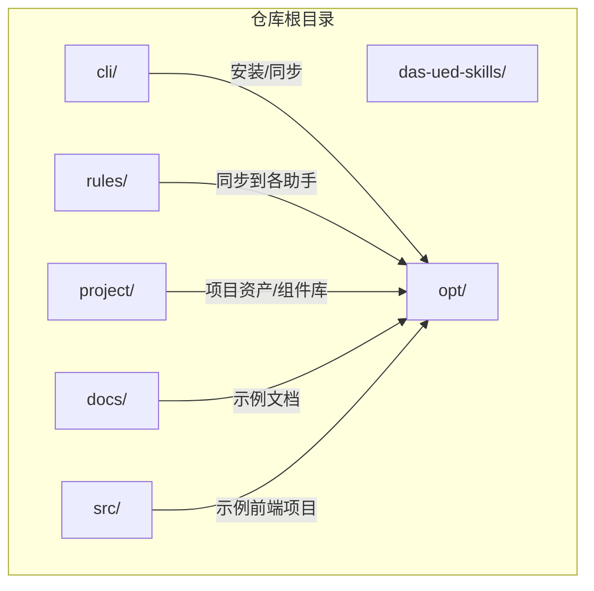
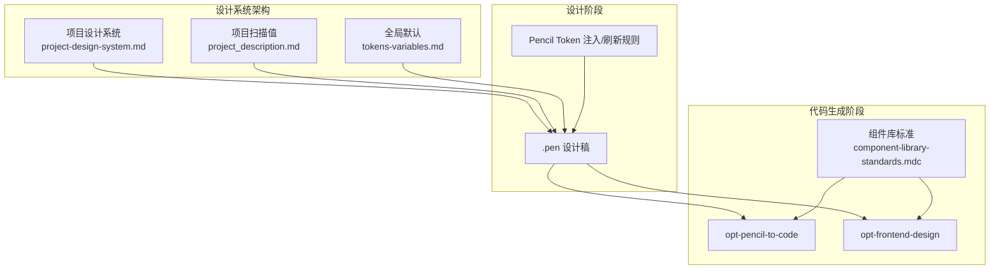
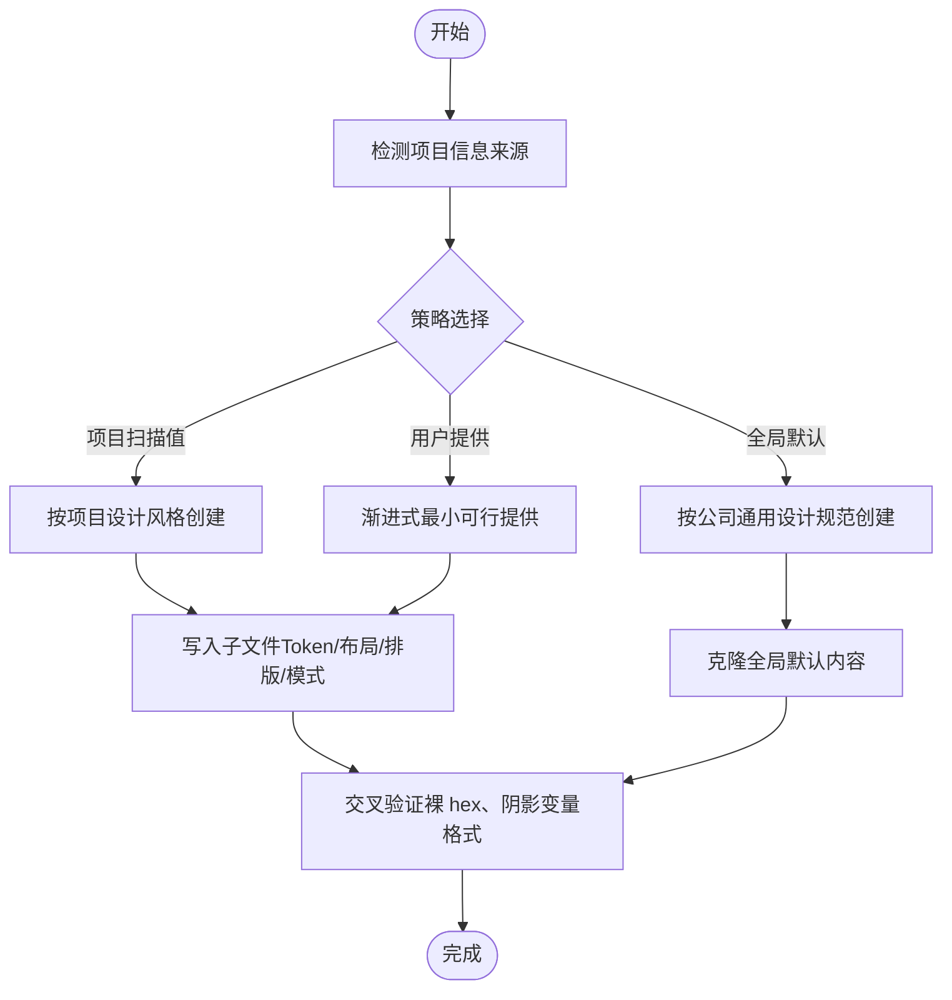
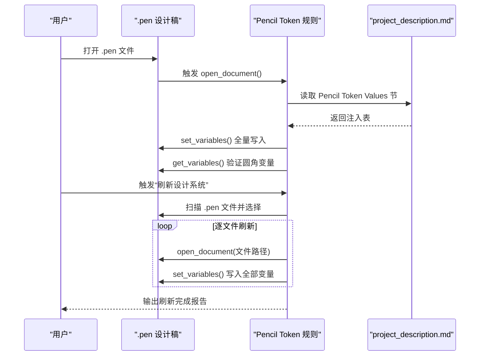
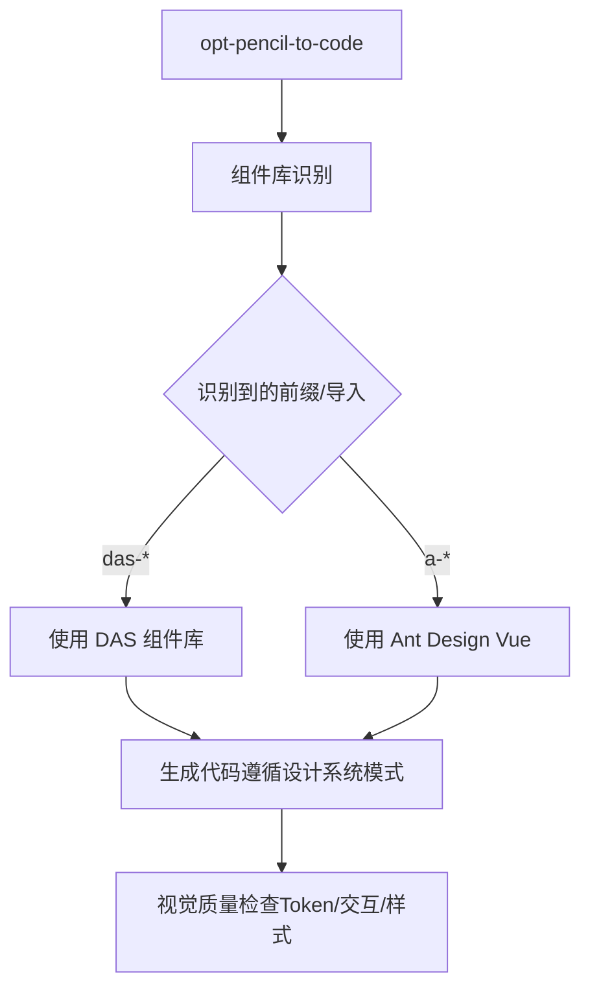
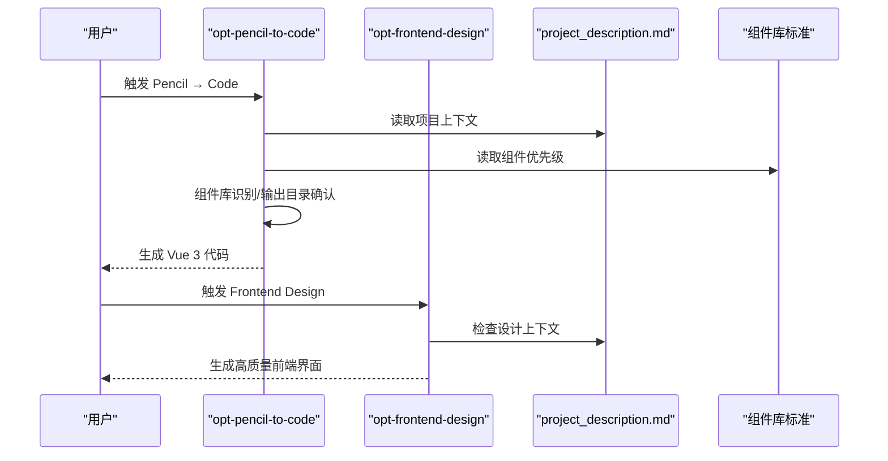
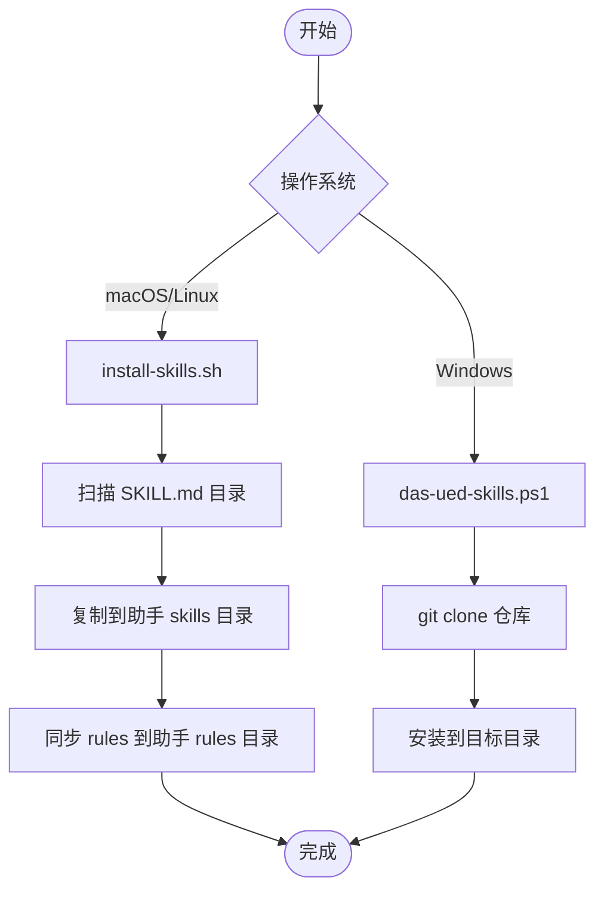
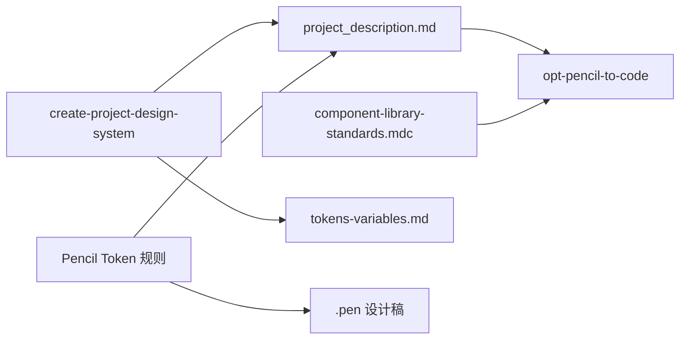

# 设计系统概述

<cite>
**本文档引用的文件**
- [README.md](file://das-ued-skills/README.md)
- [VERSIONING.md](file://das-ued-skills/VERSIONING.md)
- [component-library-standards.mdc](file://das-ued-skills/project/component-library-standards.mdc)
- [pencil-token-refresh.mdc](file://das-ued-skills/rules/pencil-token-refresh.mdc)
- [create-project-design-system/SKILL.md](file://das-ued-skills/opt/create-project-design-system/SKILL.md)
- [tokens-variables.md](file://das-ued-skills/opt/b-admin-pencil-design/core/tokens-variables.md)
- [opt-pencil-to-code/SKILL.md](file://das-ued-skills/opt/pencil-to-code/SKILL.md)
- [opt-frontend-design/SKILL.md](file://das-ued-skills/opt/frontend-design/SKILL.md)
- [install-skills.sh](file://das-ued-skills/cli/install-skills.sh)
- [das-ued-skills.ps1](file://das-ued-skills/cli/das-ued-skills.ps1)
- [project/[组件库] das-component-vue.pen](file://das-ued-skills/project/[组件库] das-component-vue.pen)
</cite>

## 目录
1. [简介](#简介)
2. [项目结构](#项目结构)
3. [核心组件](#核心组件)
4. [架构总览](#架构总览)
5. [详细组件分析](#详细组件分析)
6. [依赖分析](#依赖分析)
7. [性能考虑](#性能考虑)
8. [故障排查指南](#故障排查指南)
9. [结论](#结论)
10. [附录](#附录)

## 简介
das-ued-skills 是一套面向 B 端后台的「用研 → PRD → 设计稿 → 设计验证 → Vue 3 代码」端到端 Skills 文档集合，适配 Cursor、Claude 等 AI 助手。其核心理念是以“文件优先”“门控确认”“不凭空推断”的设计原则，串联设计与开发流程，确保每个阶段的产出可版本化、可追溯、可验证。

- 适用场景：从 0 到 1 的产品设计、已有 PRD 的设计稿产出、已有设计稿的代码生成、无设计稿的前端直出、设计验证与代码加固等。
- 设计原则：文件优先、门控确认、不凭空推断。
- 版本与发布：采用语义化版本与发版检查清单，保证变更透明与可审计。

**章节来源**
- [README.md: 22-48:22-48](file://das-ued-skills/README.md#L22-L48)
- [README.md: 26-37:26-37](file://das-ued-skills/README.md#L26-L37)
- [VERSIONING.md: 5-11:5-11](file://das-ued-skills/VERSIONING.md#L5-L11)

## 项目结构
仓库采用“技能 + 规则 + 项目资产”的组织方式，便于在不同 AI 助手间复用与同步。

- cli：安装与 CLI 脚本，支持 macOS/Linux 与 Windows。
- opt：流程相关技能（opt- 前缀），覆盖从用研到代码生成的完整链路。
- rules：全局 Rules（.mdc），安装时同步到各助手的 rules 目录。
- project：项目级规则/资产（如组件库标准、Pencil 组件库稿）。
- docs、src：示例项目结构（用于演示与验证）。

**图表来源**
- [README.md: 253-286:253-286](file://das-ued-skills/README.md#L253-L286)

**章节来源**
- [README.md: 253-286:253-286](file://das-ued-skills/README.md#L253-L286)

## 核心组件
围绕设计系统的关键能力，本仓库提供以下核心组件：

- 项目设计系统创建与健康检查：通过 create-project-design-system 技能建立三层 Token 优先级架构，并提供健康检查模式，持续监测 Token 一致性与漂移。
- Pencil Token 注入与批量刷新：通过全局 Rules 实现从 project_description.md 注入 Token，并支持“刷新设计系统”等触发词进行批量刷新。
- 组件库标准与视觉质量底线：在项目级规则中声明设计系统模式与组件优先级，确保代码生成遵循统一规范。
- Pencil → Code 与 Frontend Design：分别支持“有稿转代码”和“无稿直出”，并内置设计系统模式与 faithful 模式两种生成策略。
- CLI 安装与同步：提供跨平台安装脚本，支持将技能与全局 Rules 同步到 Cursor、Claude 等助手目录。

**章节来源**
- [create-project-design-system/SKILL.md: 6-317:6-317](file://das-ued-skills/opt/create-project-design-system/SKILL.md#L6-L317)
- [pencil-token-refresh.mdc: 8-84:8-84](file://das-ued-skills/rules/pencil-token-refresh.mdc#L8-L84)
- [component-library-standards.mdc: 1-168:1-168](file://das-ued-skills/project/component-library-standards.mdc#L1-L168)
- [opt-pencil-to-code/SKILL.md: 1-289:1-289](file://das-ued-skills/opt/pencil-to-code/SKILL.md#L1-L289)
- [opt-frontend-design/SKILL.md: 1-148:1-148](file://das-ued-skills/opt/frontend-design/SKILL.md#L1-L148)
- [install-skills.sh: 1-185:1-185](file://das-ued-skills/cli/install-skills.sh#L1-L185)
- [das-ued-skills.ps1: 1-203:1-203](file://das-ued-skills/cli/das-ued-skills.ps1#L1-L203)

## 架构总览
设计系统以“三层优先级”为核心：项目设计系统（最高优先）→ 项目扫描值（中层）→ 全局默认（基线）。Pencil Token 注入与刷新规则贯穿设计阶段，确保设计稿与 Token 一致；opt-pencil-to-code 与 opt-frontend-design 在代码生成阶段遵循项目组件库标准与视觉质量底线。

**图表来源**
- [create-project-design-system/SKILL.md: 305-316:305-316](file://das-ued-skills/opt/create-project-design-system/SKILL.md#L305-L316)
- [pencil-token-refresh.mdc: 10-28:10-28](file://das-ued-skills/rules/pencil-token-refresh.mdc#L10-L28)
- [tokens-variables.md: 1-246:1-246](file://das-ued-skills/opt/b-admin-pencil-design/core/tokens-variables.md#L1-L246)
- [opt-pencil-to-code/SKILL.md: 40-52:40-52](file://das-ued-skills/opt/pencil-to-code/SKILL.md#L40-L52)
- [component-library-standards.mdc: 11-16:11-16](file://das-ued-skills/project/component-library-standards.mdc#L11-L16)

## 详细组件分析

### 项目设计系统创建与健康检查
- 三层优先级：项目设计系统（最高）→ 项目扫描值（中层）→ 全局默认（基线），冲突时静默胜出，避免不必要的交互。
- 渐进式最小可行：从影响最大的 Token 层开始，逐步推进布局、排版、模式层，支持“提供信息/按项目风格/按全局默认”三种策略。
- 健康检查模式：定期扫描文件完整性、TODO 覆盖率、裸 hex drift、Token 与代码一致性，输出健康评分与修复建议。

**图表来源**
- [create-project-design-system/SKILL.md: 32-278:32-278](file://das-ued-skills/opt/create-project-design-system/SKILL.md#L32-L278)

**章节来源**
- [create-project-design-system/SKILL.md: 6-317:6-317](file://das-ued-skills/opt/create-project-design-system/SKILL.md#L6-L317)

### Pencil Token 注入与批量刷新
- 注入锚点：每次打开 .pen 文件后，读取 project_description.md 的 Pencil Token Values 节，进行格式预检与全量写入。
- 批量刷新：支持“刷新设计系统/同步 Token/应用项目色”等触发词，按用户选择逐文件刷新并输出完成报告。
- 优先级：规则优先于技能文件中的 Q2 注入描述，技能文件被替换后仍有效。

**图表来源**
- [pencil-token-refresh.mdc: 10-69:10-69](file://das-ued-skills/rules/pencil-token-refresh.mdc#L10-L69)

**章节来源**
- [pencil-token-refresh.mdc: 8-84:8-84](file://das-ued-skills/rules/pencil-token-refresh.mdc#L8-L84)

### 组件库标准与视觉质量底线
- 模式声明：项目恒为 design-system 模式，无需用户确认，直接执行 design-system 模式。
- 组件优先级：das-component-vue（das-*）优先于 Ant Design Vue（a-*），禁止裸 HTML。
- 视觉质量底线：交互状态、颜色使用 Token、页面根元素样式、三类交互（加载态/空态/操作反馈）等。

**图表来源**
- [opt-pencil-to-code/SKILL.md: 174-211:174-211](file://das-ued-skills/opt/pencil-to-code/SKILL.md#L174-L211)
- [component-library-standards.mdc: 11-168:11-168](file://das-ued-skills/project/component-library-standards.mdc#L11-L168)

**章节来源**
- [component-library-standards.mdc: 1-168:1-168](file://das-ued-skills/project/component-library-standards.mdc#L1-L168)

### Pencil → Code 与 Frontend Design
- Pencil → Code：支持 design-system 模式与 faithful 模式，组件库识别与输出目录确认为前置步骤，生成代码需包含交互逻辑与页面根元素样式。
- Frontend Design：强调“不凭空推断”，必须先建立项目设计上下文（opt-pro-ux-code-init），再进行前端直出，避免通用化 AI 症状。

**图表来源**
- [opt-pencil-to-code/SKILL.md: 13-91:13-91](file://das-ued-skills/opt/pencil-to-code/SKILL.md#L13-L91)
- [opt-frontend-design/SKILL.md: 10-27:10-27](file://das-ued-skills/opt/frontend-design/SKILL.md#L10-L27)

**章节来源**
- [opt-pencil-to-code/SKILL.md: 1-289:1-289](file://das-ued-skills/opt/pencil-to-code/SKILL.md#L1-L289)
- [opt-frontend-design/SKILL.md: 1-148:1-148](file://das-ued-skills/opt/frontend-design/SKILL.md#L1-L148)

### CLI 安装与同步
- macOS/Linux：install-skills.sh 支持 --ai 与 --target-dir，扫描仓库内 SKILL.md 目录并复制到对应助手 skills 目录，同时同步 rules。
- Windows：das-ued-skills.ps1 提供 init 命令，支持 --ai、--target-dir、--repo-url、--ref 参数，克隆仓库后安装到目标目录。

**图表来源**
- [install-skills.sh: 60-127:60-127](file://das-ued-skills/cli/install-skills.sh#L60-L127)
- [das-ued-skills.ps1: 126-180:126-180](file://das-ued-skills/cli/das-ued-skills.ps1#L126-L180)

**章节来源**
- [install-skills.sh: 1-185:1-185](file://das-ued-skills/cli/install-skills.sh#L1-L185)
- [das-ued-skills.ps1: 1-203:1-203](file://das-ued-skills/cli/das-ued-skills.ps1#L1-L203)

## 依赖分析
- 组件耦合与内聚：opt-pencil-to-code 依赖 project_description.md 与组件库标准，耦合度适中；create-project-design-system 与 Pencil Token 规则形成强依赖，确保设计一致性。
- 外部依赖：AI 助手（Cursor/Claude 等）的 Skills/Rules 机制；ripgrep（macOS/Linux）用于扫描技能目录；git（Windows）用于克隆仓库。
- 潜在循环依赖：项目设计系统与全局默认之间通过优先级规则避免循环；Pencil Token 规则与技能文件通过“规则优先”避免循环注入。

**图表来源**
- [opt-pencil-to-code/SKILL.md: 174-211:174-211](file://das-ued-skills/opt/pencil-to-code/SKILL.md#L174-L211)
- [create-project-design-system/SKILL.md: 305-316:305-316](file://das-ued-skills/opt/create-project-design-system/SKILL.md#L305-L316)
- [pencil-token-refresh.mdc: 10-28:10-28](file://das-ued-skills/rules/pencil-token-refresh.mdc#L10-L28)

**章节来源**
- [opt-pencil-to-code/SKILL.md: 174-211:174-211](file://das-ued-skills/opt/pencil-to-code/SKILL.md#L174-L211)
- [create-project-design-system/SKILL.md: 305-316:305-316](file://das-ued-skills/opt/create-project-design-system/SKILL.md#L305-L316)
- [pencil-token-refresh.mdc: 8-84:8-84](file://das-ued-skills/rules/pencil-token-refresh.mdc#L8-L84)

## 性能考虑
- 扫描与复制：install-skills.sh 使用 ripgrep 或 find 扫描 SKILL.md，建议在大型仓库中确保 ripgrep 可用以提升性能。
- 批量刷新：pencil-token-refresh.mdc 的批量刷新按用户选择逐文件执行，避免一次性处理过多文件导致卡顿。
- 代码生成：opt-pencil-to-code 在生成前进行组件库识别与输出目录确认，减少无效生成与返工。

[本节为通用指导，无需“章节来源”]

## 故障排查指南
- 安装后找不到技能：确认安装目录与助手配置一致（Cursor 使用 ~/.cursor/skills，Claude 使用 ~/.claude/skills），部分助手需开启“自定义 Skills”或指定 skills 目录。
- 设计类技能提示先建 project_description：设计类技能不允许凭空推断品牌色和审美，需先运行 opt-pro-ux-code-init 或手动创建该文件。
- 全流程会自动推进到下一 Stage：不会。每个 Stage 结束后必须输出 Handoff 并等待用户回复“确认/继续”等才会进入下一 Stage。
- 可以只运行某一个 Stage：可以。直接调用对应技能（如 opt-prd、opt-design-validation），或在 opt-prd-ux-code 中说明起始 Stage 与已有产物路径。
- pencil-heatmap 不可用：预测性热图分析依赖独立技能，若未单独安装该技能，该子步骤可能不可用，但不影响设计验证其他部分。

**章节来源**
- [README.md: 322-343:322-343](file://das-ued-skills/README.md#L322-L343)

## 结论
das-ued-skills 通过“三层优先级设计系统 + 全局 Rules + 端到端技能编排”，实现了从用户研究到前端代码生成的可控、可追溯工作流。其设计原则与版本策略保障了可维护性与可审计性；CLI 安装与同步机制降低了使用门槛；组件库标准与视觉质量底线确保了生成代码的一致性与质量。对于需要在 AI 辅助环境下构建 B 端后台产品的团队，该设计系统提供了清晰的实施路径与最佳实践。

[本节为总结，无需“章节来源”]

## 附录
- 适用场景与前置要求：见 README 的“适用场景”“前置要求”“一键安装”“快速上手”等章节。
- 版本与发布：见 VERSIONING.md 的版本号规范、Breaking Change 定义、发版检查清单与版本号来源。

**章节来源**
- [README.md: 26-61:26-61](file://das-ued-skills/README.md#L26-L61)
- [VERSIONING.md: 50-72:50-72](file://das-ued-skills/VERSIONING.md#L50-L72)