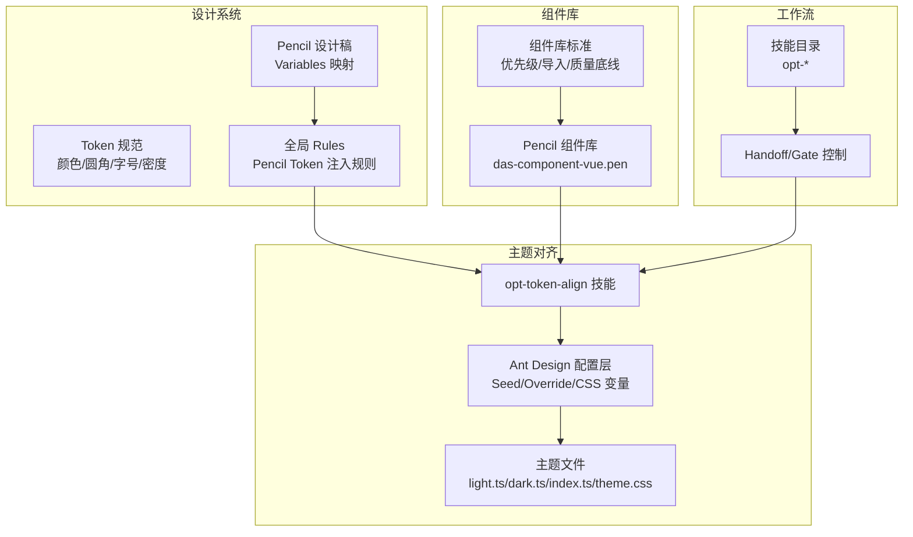
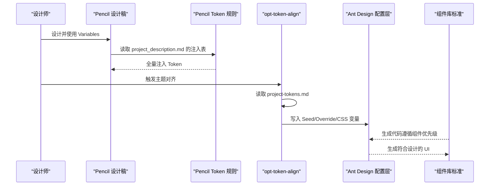
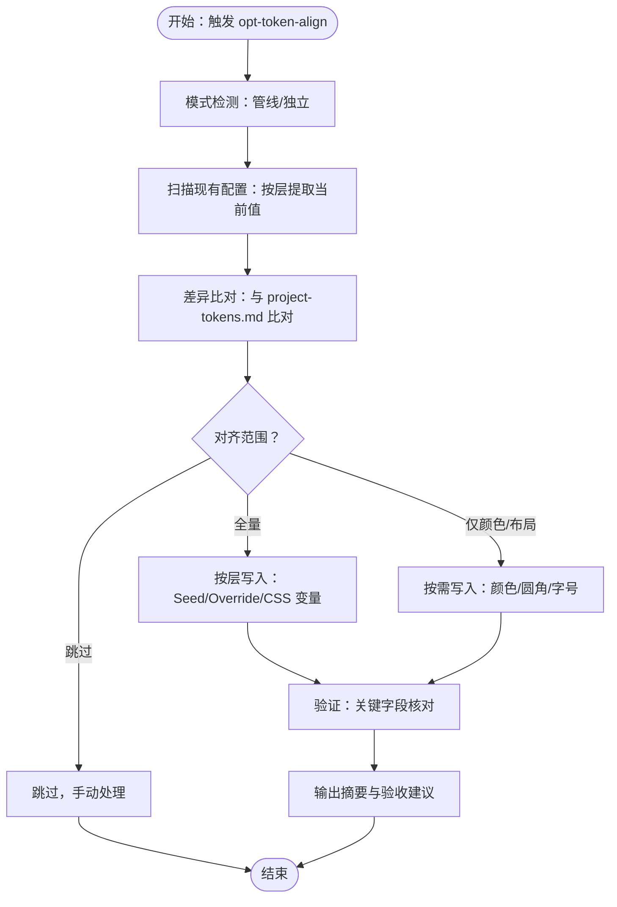
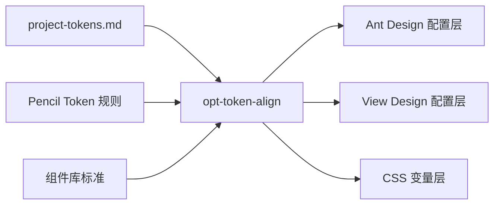

# 设计系统集成

<cite>
**本文引用的文件**
- [README.md](file://das-ued-skills/README.md)
- [VERSIONING.md](file://das-ued-skills/VERSIONING.md)
- [component-library-standards.mdc](file://das-ued-skills/project/component-library-standards.mdc)
- [pencil-token-refresh.mdc](file://das-ued-skills/rules/pencil-token-refresh.mdc)
- [custom-theme-workflow.md](file://das-ued-skills/opt/b-admin-pencil-design/theming/custom-theme-workflow.md)
- [light-dark-variables.md](file://das-ued-skills/opt/b-admin-pencil-design/theming/light-dark-variables.md)
- [density-variables.md](file://das-ued-skills/opt/b-admin-pencil-design/theming/density-variables.md)
- [tokens-variables.md](file://das-ued-skills/opt/b-admin-pencil-design/core/tokens-variables.md)
- [opt-token-align SKILL.md](file://das-ued-skills/opt/opt-token-align/SKILL.md)
- [install-skills.sh](file://das-ued-skills/cli/install-skills.sh)
- [das-component-vue.pen](file://das-ued-skills/project/[组件库] das-component-vue.pen)
</cite>

## 目录
1. [引言](#引言)
2. [项目结构](#项目结构)
3. [核心组件](#核心组件)
4. [架构总览](#架构总览)
5. [详细组件分析](#详细组件分析)
6. [依赖分析](#依赖分析)
7. [性能考虑](#性能考虑)
8. [故障排查指南](#故障排查指南)
9. [结论](#结论)
10. [附录](#附录)

## 引言
本文件面向 APIG 项目，系统化阐述 das-ued-skills 设计系统与 Ant Design 4.17 的集成方案，围绕 Pencil Token 机制、主题配置方法、品牌色彩规范与组件库使用指南展开。文档提供 Token 对齐流程、主题定制实践与设计规范遵循方法，辅以配置示例与最佳实践，帮助开发者在设计到代码的自动化流程中实现一致的用户体验。

## 项目结构
das-ued-skills 采用“技能 + 规则 + 项目资产”的组织方式，核心模块包括：
- CLI 安装与同步：一键安装技能与全局 Rules，支持多 AI 助手目录
- 设计系统：Pencil Token 与 Variables 映射、亮/暗双模式、密度变量、字体规范
- 主题对齐：跨技术栈（Ant Design、View Design 等）的 Token 对齐与写入
- 组件库标准：优先级与导入规范、视觉质量底线、代码审查要点
- 工作流：从用研到代码的端到端编排与 Gate 控制

图表来源
- [README.md](file://das-ued-skills/README.md)
- [pencil-token-refresh.mdc](file://das-ued-skills/rules/pencil-token-refresh.mdc)
- [opt-token-align SKILL.md](file://das-ued-skills/opt/opt-token-align/SKILL.md)
- [tokens-variables.md](file://das-ued-skills/opt/b-admin-pencil-design/core/tokens-variables.md)

章节来源
- [README.md](file://das-ued-skills/README.md)
- [install-skills.sh](file://das-ued-skills/cli/install-skills.sh)

## 核心组件
- Pencil Token 与 Variables：定义颜色、圆角、字号、密度、布局等语义变量，支持亮/暗双模式与命名映射
- 主题对齐（opt-token-align）：将 project-tokens.md 的权威值分发到各技术栈配置文件，确保组件库、LESS 变量与 CSS 自定义属性一致
- 组件库标准：优先使用 das-component-vue，其次 antd，禁止裸 HTML 与硬编码 hex
- 设计验证与工作流：通过 Gate 控制阶段推进，确保设计稿与代码的一致性

章节来源
- [tokens-variables.md](file://das-ued-skills/opt/b-admin-pencil-design/core/tokens-variables.md)
- [opt-token-align SKILL.md](file://das-ued-skills/opt/opt-token-align/SKILL.md)
- [component-library-standards.mdc](file://das-ued-skills/project/component-library-standards.mdc)

## 架构总览
下图展示从设计到代码的关键流转：设计阶段通过 Pencil Variables 与 Rules 管控 Token；主题对齐阶段将 Token 分发到 Ant Design 的多层配置；组件库标准确保代码生成与设计稿一致。

图表来源
- [pencil-token-refresh.mdc](file://das-ued-skills/rules/pencil-token-refresh.mdc)
- [opt-token-align SKILL.md](file://das-ued-skills/opt/opt-token-align/SKILL.md)
- [tokens-variables.md](file://das-ued-skills/opt/b-admin-pencil-design/core/tokens-variables.md)

## 详细组件分析

### Pencil Token 机制与品牌色彩规范
- Token 来源与注入
  - 通过 Rules 在打开 .pen 文件时从 project_description.md 的“Pencil Token Values”节读取注入表，全量写入 Variables
  - 若注入表格式不正确或缺失，将提示用户补充或回退到 Skill 文件中的默认注入
- 变量命名与双模式
  - 颜色变量使用 themes 对象支持亮/暗双模式；非颜色变量保持单值格式
  - 提供 Pencil Variable → CSS Variable 的权威映射表，确保设计与代码一致
- 品牌色彩与状态色
  - 主品牌色、悬停/激活/禁用、浅色背景、状态色（成功/警告/错误）与明暗模式值均在 Variables 中定义
  - 字体家族与字号在 Pencil 中使用变量，在代码生成时替换为完整字体栈

章节来源
- [pencil-token-refresh.mdc](file://das-ued-skills/rules/pencil-token-refresh.mdc)
- [tokens-variables.md](file://das-ued-skills/opt/b-admin-pencil-design/core/tokens-variables.md)
- [light-dark-variables.md](file://das-ued-skills/opt/b-admin-pencil-design/theming/light-dark-variables.md)

### 主题配置方法与 Ant Design 4.17 集成
- 适配器 A（Ant Design）
  - 四层配置：Seed Token（light.ts/dark.ts）、组件级 override（index.ts）、CSS 覆盖（themeAntdReset.css）、CSS 自定义属性（theme.css）
  - 写入策略：根据 project-tokens.md 字段映射到对应层，确保颜色、圆角、字号、阴影等一致
- 对齐流程
  - 模式检测：区分管线模式与独立模式
  - 扫描现有配置：按层提取当前值
  - 差异比对：与权威 Token 比对，生成对齐范围
  - 写入与验证：按层写入并验证，输出摘要与验收建议
- 最佳实践
  - 若启用动态主色（getPrimaryColors），需写入 defaultConfig.ts 的 primaryColor 种子
  - Pinia 持久化可能导致缓存残留，需清理 localStorage 或重启 dev server
  - 任何 token 文件修改后，建议清理 Vite/Webpack 预构建缓存

图表来源
- [opt-token-align SKILL.md](file://das-ued-skills/opt/opt-token-align/SKILL.md)

章节来源
- [opt-token-align SKILL.md](file://das-ued-skills/opt/opt-token-align/SKILL.md)

### 品牌色彩与明暗模式配置
- 品牌色来源优先级：客户明确品牌色 > 主线产品默认 > 探索性候选（需用户确认）
- 亮/暗双模式 Variables：通过主题切换 Variables 集合，确保文字对比度与整体调性
- 变量覆写：在暗色模式下替换品牌色相关变量，保持品牌突出与可读性

章节来源
- [custom-theme-workflow.md](file://das-ued-skills/opt/b-admin-pencil-design/theming/custom-theme-workflow.md)
- [light-dark-variables.md](file://das-ued-skills/opt/b-admin-pencil-design/theming/light-dark-variables.md)

### 信息密度与圆角风格
- 三档密度：high（紧凑）、medium（标准）、low（宽松），配套调整行高、按钮高度、卡片内边距与表单间距
- 圆角风格：sharp（锐利）、standard（标准）、rounded（圆润），影响按钮、输入框、卡片等组件圆角
- 字号基线：font-base 可选 12/13/14px，影响 CSS 动态设置的字号

章节来源
- [density-variables.md](file://das-ued-skills/opt/b-admin-pencil-design/theming/density-variables.md)
- [tokens-variables.md](file://das-ued-skills/opt/b-admin-pencil-design/core/tokens-variables.md)

### 组件库使用指南与代码生成约束
- 优先级：das-component-vue（`das-*`） > antd（`a-*`） > 禁止裸 HTML
- 视觉质量底线：交互状态、颜色使用 CSS Token、页面必备三类交互（加载态/空态/操作反馈）、页面根元素样式
- 代码审查检查项：组件替换、Token 使用、交互完整性、按钮类型、操作收纳与状态标签

章节来源
- [component-library-standards.mdc](file://das-ued-skills/project/component-library-standards.mdc)

### 设计到代码的自动化流程
- 工作流编排：用研 → PRD → 设计稿 → 设计验证 → 前端代码，每个阶段输出 Handoff 并经 Gate 确认
- 技能触发：通过 AI 助手输入 opt-* 技能名称或关键词，自动推进到相应阶段
- 项目资产同步：将仓库根目录 project/ 资产复制到目标项目根目录，便于后续设计与代码生成

章节来源
- [README.md](file://das-ued-skills/README.md)
- [install-skills.sh](file://das-ued-skills/cli/install-skills.sh)

## 依赖分析
- 技术栈适配
  - Ant Design Vue：通过 Seed Token、组件 override、CSS 覆盖与 CSS 变量四层对齐
  - View Design / Soul UI：通过 LESS 变量、组件级 CSS 覆盖与 CSS 变量三层对齐
  - 通用 CSS：扫描含 :root 块的 CSS 文件，按命名约定写入
- 关键依赖关系
  - project-tokens.md 为权威数据源，opt-token-align 作为分发器
  - Pencil Token 规则确保设计阶段的 Token 一致性
  - 组件库标准约束代码生成与审查

图表来源
- [opt-token-align SKILL.md](file://das-ued-skills/opt/opt-token-align/SKILL.md)
- [pencil-token-refresh.mdc](file://das-ued-skills/rules/pencil-token-refresh.mdc)
- [component-library-standards.mdc](file://das-ued-skills/project/component-library-standards.mdc)

章节来源
- [opt-token-align SKILL.md](file://das-ued-skills/opt/opt-token-align/SKILL.md)

## 性能考虑
- 主题缓存与持久化：Pinia 持久化可能导致主题变更不立即生效，需清理缓存或重启 dev server
- 构建缓存：修改 token 文件后清理 Vite/Webpack 预构建缓存，避免旧缓存影响
- 体积与层级：合理使用 CSS 变量与组件 override，避免过度嵌套与重复覆盖

## 故障排查指南
- Token 注入失败
  - 检查 project_description.md 的“Pencil Token Values”节格式是否正确
  - 确认 Rules 是否同步到对应助手目录
- 主题对齐后 UI 无变化
  - 清理主题缓存（localStorage 移除对应 key）并刷新
  - 重启 dev server 或清理构建缓存
- View Design 项目变量不生效
  - 确认入口文件已正确 import 修改后的 LESS/CSS
  - 检查 less-loader modifyVars 或 additionalData 配置

章节来源
- [opt-token-align SKILL.md](file://das-ued-skills/opt/opt-token-align/SKILL.md)
- [pencil-token-refresh.mdc](file://das-ued-skills/rules/pencil-token-refresh.mdc)

## 结论
通过 Pencil Token 机制、opt-token-align 主题对齐与组件库标准，APIG 项目可在 Ant Design 4.17 环境中实现设计与代码的高度一致。遵循本文档的流程与最佳实践，可显著提升团队协作效率与产品一致性。

## 附录
- 安装与同步
  - 使用 install-skills.sh 将技能与全局 Rules 同步到各 AI 助手目录
- 项目资产
  - 将 project/ 资产复制到目标项目根目录，确保设计与代码生成所需资源齐全

章节来源
- [install-skills.sh](file://das-ued-skills/cli/install-skills.sh)
- [README.md](file://das-ued-skills/README.md)