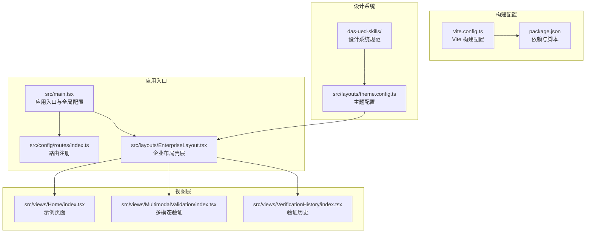
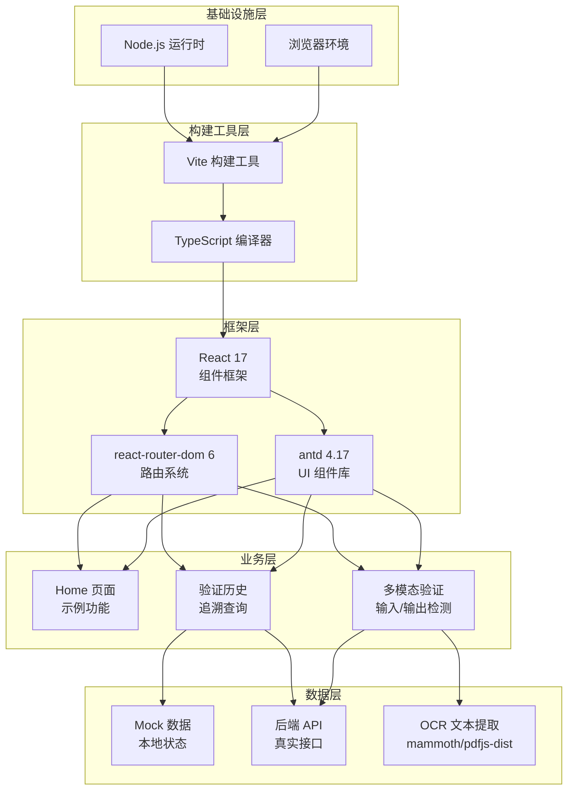
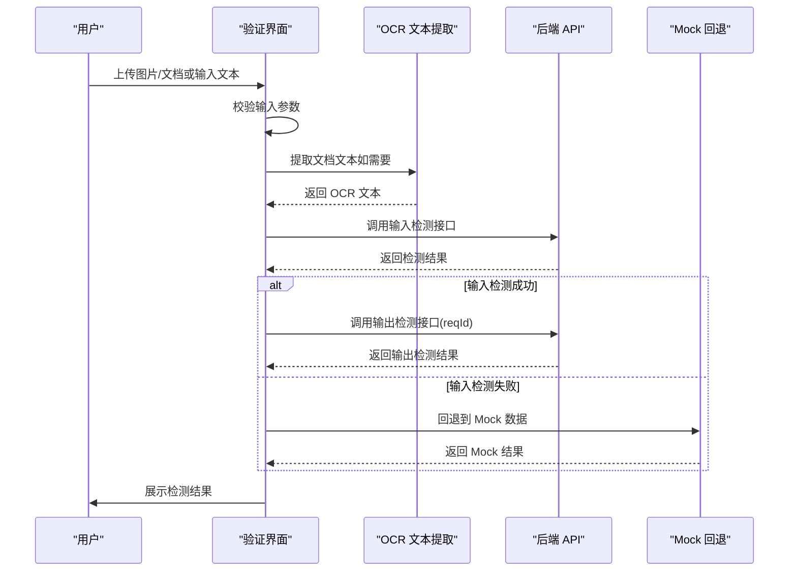
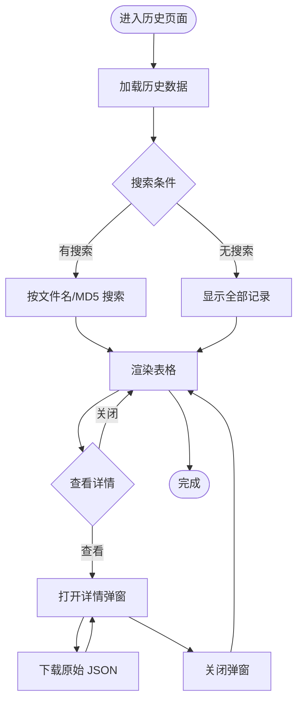
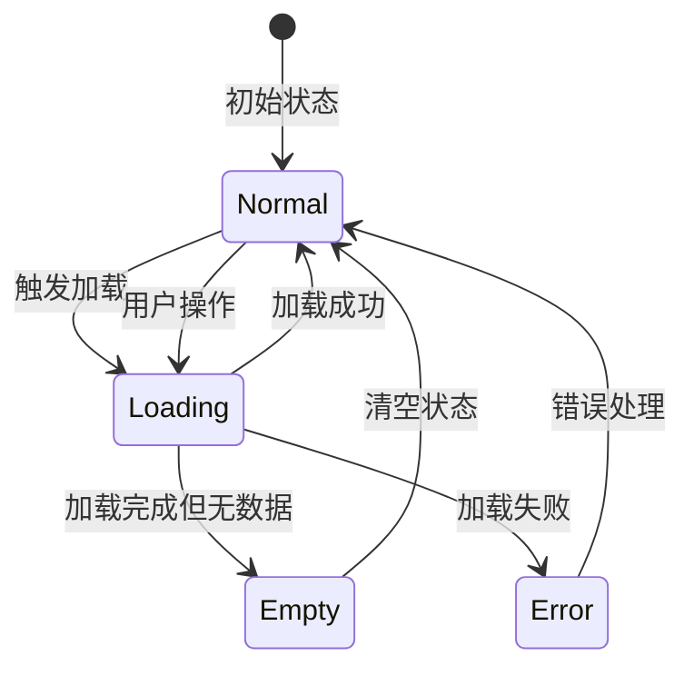
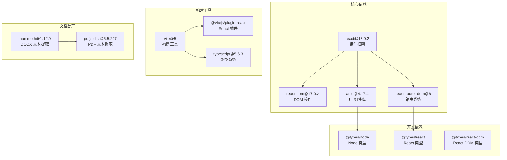

# 项目概述

<cite>
**本文档引用的文件**
- [package.json](file://package.json)
- [src/main.tsx](file://src/main.tsx)
- [src/config/routes/index.ts](file://src/config/routes/index.ts)
- [src/layouts/EnterpriseLayout.tsx](file://src/layouts/EnterpriseLayout.tsx)
- [src/layouts/theme.config.ts](file://src/layouts/theme.config.ts)
- [src/views/Home/index.tsx](file://src/views/Home/index.tsx)
- [src/views/MultimodalValidation/index.tsx](file://src/views/MultimodalValidation/index.tsx)
- [src/views/VerificationHistory/index.tsx](file://src/views/VerificationHistory/index.tsx)
- [vite.config.ts](file://vite.config.ts)
- [project_description.md](file://project_description.md)
- [docs/context/architecture.md](file://docs/context/architecture.md)
- [docs/context/constraints.md](file://docs/context/constraints.md)
- [das-ued-skills/README.md](file://das-ued-skills/README.md)
</cite>

## 目录
1. [引言](#引言)
2. [项目结构](#项目结构)
3. [核心组件](#核心组件)
4. [架构总览](#架构总览)
5. [详细组件分析](#详细组件分析)
6. [依赖关系分析](#依赖关系分析)
7. [性能考量](#性能考量)
8. [故障排查指南](#故障排查指南)
9. [结论](#结论)
10. [附录](#附录)

## 引言
APIG 项目是一个专为内网隔离环境打造的 React 17 + antd 4.17 多模态内容安全审核平台。该项目旨在支撑技能契约演练，逐步演化为真实业务系统，具备输入/输出检测、验证历史追溯、多模态内容审核等核心能力。项目当前处于脚手架生成阶段，已具备基础路由与三个示例页面（Home、MultimodalValidation、VerificationHistory），并预留了真实后端 API 接入点与设计系统对齐路径。

项目定位与价值：
- 内网隔离下的安全审核平台：满足内网环境的合规与安全需求
- 技能契约演练载体：通过真实业务场景验证前端技能与设计系统
- 渐进式演进路线：从 Mock 数据到真实接口，从简单页面到完整业务系统
- 多模态内容处理：支持图片与文档的 OCR 文本提取与安全检测

## 项目结构
项目采用典型的前端单页应用（SPA）架构，基于 Vite 构建工具，React 17 作为核心框架，antd 4.17 提供企业级 UI 组件库。整体结构清晰，职责分离明确。

**图表来源**
- [src/main.tsx:1-26](file://src/main.tsx#L1-L26)
- [src/config/routes/index.ts:1-26](file://src/config/routes/index.ts#L1-L26)
- [src/layouts/EnterpriseLayout.tsx:1-20](file://src/layouts/EnterpriseLayout.tsx#L1-L20)
- [vite.config.ts:1-16](file://vite.config.ts#L1-L16)
- [package.json:1-28](file://package.json#L1-L28)

项目采用模块化组织方式：
- **入口层**：统一的应用初始化与全局配置
- **路由层**：集中式的路由注册与页面映射
- **布局层**：企业级布局壳层与主题配置
- **视图层**：功能页面的独立模块化实现
- **构建层**：Vite 配置与依赖管理
- **设计层**：主题配置与设计系统规范

**章节来源**
- [src/main.tsx:1-26](file://src/main.tsx#L1-L26)
- [src/config/routes/index.ts:1-26](file://src/config/routes/index.ts#L1-L26)
- [vite.config.ts:1-16](file://vite.config.ts#L1-L16)
- [project_description.md:13-27](file://project_description.md#L13-L27)

## 核心组件
项目的核心组件围绕应用入口、路由系统、布局壳层和三大功能页面展开，形成了完整的前端架构。

### 应用入口组件
应用入口负责初始化 React 应用、配置国际化与主题、挂载路由系统。

关键特性：
- 使用 React 17 的 StrictMode 包裹确保开发时的严格模式
- 配置 antd 的中文本地化
- 集成 React Router v6 的 BrowserRouter
- 通过 ConfigProvider 提供全局主题配置

### 路由系统组件
路由系统采用 React Router v6 的最新语法，实现了集中式路由注册。

路由配置特点：
- 使用 element 字段而非 component 字段，符合 React Router v6 的最佳实践
- 集中式管理所有页面路由
- 支持嵌套路由与布局壳层

### 布局壳层组件
企业布局壳层提供了统一的企业级界面风格，包含头部导航和内容区域。

布局特色：
- Header 使用深蓝色主题，体现企业级应用风格
- Content 区域提供统一的背景色和内边距
- 通过 Outlet 实现页面内容的动态渲染

**章节来源**
- [src/main.tsx:1-26](file://src/main.tsx#L1-L26)
- [src/config/routes/index.ts:8-25](file://src/config/routes/index.ts#L8-L25)
- [src/layouts/EnterpriseLayout.tsx:7-19](file://src/layouts/EnterpriseLayout.tsx#L7-L19)

## 架构总览
项目采用分层架构设计，从底层基础设施到上层业务功能形成清晰的层次结构。

**图表来源**
- [package.json:11-26](file://package.json#L11-L26)
- [src/views/MultimodalValidation/index.tsx:106-181](file://src/views/MultimodalValidation/index.tsx#L106-L181)
- [src/views/VerificationHistory/index.tsx:132-372](file://src/views/VerificationHistory/index.tsx#L132-L372)

架构优势：
- **分层清晰**：各层职责明确，便于维护和扩展
- **技术栈稳定**：React 17 + antd 4.17 组合成熟可靠
- **可扩展性强**：预留了真实 API 接入点和设计系统对齐路径
- **内网友好**：针对内网环境进行了特殊配置优化

## 详细组件分析

### 多模态验证组件分析
多模态验证组件是项目的核心功能模块，实现了输入/输出检测的完整流程。

**图表来源**
- [src/views/MultimodalValidation/index.tsx:199-343](file://src/views/MultimodalValidation/index.tsx#L199-L343)
- [src/views/MultimodalValidation/index.tsx:42-58](file://src/views/MultimodalValidation/index.tsx#L42-L58)

核心功能特性：
- **多模态输入支持**：支持 PNG/JPG/GIF 图片和 DOCX/DOC/PDF 文档
- **OCR 文本提取**：使用 mammoth 和 pdfjs-dist 进行文档文本提取
- **双阶段检测**：先输入检测获取 requestId，再进行输出检测
- **智能回退机制**：网络异常时自动回退到 Mock 数据
- **结果可视化**：提供详细的检测结果展示和原始 JSON 下载

**章节来源**
- [src/views/MultimodalValidation/index.tsx:183-546](file://src/views/MultimodalValidation/index.tsx#L183-L546)

### 验证历史组件分析
验证历史组件提供了历史记录的查询、筛选和详情查看功能。

**图表来源**
- [src/views/VerificationHistory/index.tsx:94-603](file://src/views/VerificationHistory/index.tsx#L94-L603)

功能特点：
- **双模式切换**：支持多模态验证和文本检测两种模式
- **智能搜索**：支持按文件名和 MD5 进行精确搜索
- **状态标签**：使用颜色编码展示合规状态和任务状态
- **详情展示**：提供完整的检测结果详情和原始数据下载
- **响应式设计**：适配不同屏幕尺寸的显示效果

**章节来源**
- [src/views/VerificationHistory/index.tsx:94-603](file://src/views/VerificationHistory/index.tsx#L94-L603)

### 示例页面组件分析
示例页面展示了 Loading/Empty/Error/Feedback 等常见交互状态的处理方式。

**图表来源**
- [src/views/Home/index.tsx:4-49](file://src/views/Home/index.tsx#L4-L49)

设计要点：
- **状态管理**：通过 useState 管理不同的 UI 状态
- **用户体验**：提供 Loading、Empty、Error 等完整的状态反馈
- **交互设计**：使用 antd 的 Spin、Empty、Alert 等组件
- **消息提示**：集成 message 组件提供操作反馈

**章节来源**
- [src/views/Home/index.tsx:4-49](file://src/views/Home/index.tsx#L4-L49)

## 依赖关系分析
项目的技术栈选择体现了对稳定性、性能和内网环境的综合考虑。

**图表来源**
- [package.json:11-26](file://package.json#L11-L26)

依赖关系特点：
- **稳定版本组合**：React 17 + antd 4.17 的经典组合，确保稳定性
- **现代化构建**：Vite 提供快速的开发体验和构建性能
- **类型安全保障**：完整的 TypeScript 类型定义
- **文档处理能力**：专门的库处理多模态文档内容

**章节来源**
- [package.json:11-26](file://package.json#L11-L26)
- [docs/context/architecture.md:31-46](file://docs/context/architecture.md#L31-L46)

## 性能考量
项目在性能方面采取了多项优化措施，特别是在内网环境下的特殊考虑。

### 内网环境优化
- **端口配置**：开发服务器默认使用 5173 端口，便于内网访问
- **PDF Worker 本地化**：针对内网环境优化 pdfjs-dist 的 worker 配置
- **依赖本地化**：支持离线包和私有 npm 源的使用

### 前端性能优化
- **懒加载策略**：OCR 相关库按需加载，减少初始包体积
- **状态管理**：合理使用 React hooks 管理组件状态，避免不必要的重渲染
- **资源压缩**：Vite 构建时自动进行代码压缩和资源优化

### 多模态处理优化
- **文件大小控制**：限制文档处理的最大页数（PDF 最多 3 页）
- **缓存机制**：对 OCR 提取的文本进行缓存，避免重复处理
- **错误降级**：网络异常时自动回退到 Mock 数据，保证用户体验

## 故障排查指南
项目在设计时充分考虑了内网环境的特殊性和可能出现的问题。

### 常见问题与解决方案
1. **内网无法访问公网**
   - 使用私有 npm 源或离线包替代
   - 预先下载所需依赖到本地

2. **PDF 文档处理失败**
   - 检查 pdfjs-dist 的 worker 配置
   - 确认文档格式的兼容性

3. **OCR 文本提取不准确**
   - DOCX 文档可能需要转换为 PDF 再处理
   - 检查文档的扫描质量

4. **Mock 数据与真实数据差异**
   - 确保后端接口返回的数据结构符合预期
   - 检查 Mock 数据的字段映射

### 调试技巧
- 利用浏览器开发者工具监控网络请求
- 检查控制台错误信息
- 使用 antd 的 message 组件获取操作反馈
- 通过原始 JSON 下载功能进行数据验证

**章节来源**
- [docs/context/constraints.md:3-41](file://docs/context/constraints.md#L3-L41)
- [src/views/MultimodalValidation/index.tsx:278-298](file://src/views/MultimodalValidation/index.tsx#L278-L298)

## 结论
APIG 项目作为一个内网隔离环境下的多模态内容安全审核平台，展现了良好的技术架构和设计理念。项目通过合理的分层设计、稳定的依赖组合和完善的错误处理机制，为后续的功能扩展和业务演进奠定了坚实的基础。

项目的核心价值体现在：
- **技术成熟度**：基于 React 17 + antd 4.17 的稳定技术栈
- **内网适应性**：针对内网环境的特殊配置和优化
- **可扩展性**：预留了真实 API 接入和设计系统对齐的路径
- **演练价值**：作为技能契约演练的重要载体

随着项目的逐步完善，预计将在内容安全审核领域发挥重要作用，并为类似的企业级应用开发提供有价值的参考。

## 附录

### 设计系统与主题配置
项目采用了统一的设计系统规范，通过主题配置文件管理品牌色彩和视觉元素。

主题配置要点：
- 品牌主色：`#3B71EE`
- Header 背景色：`#0F1E4A`
- Content 背景色：`#F7FAFD`
- 卡片圆角：`9px`/`12px`
- 按钮圆角：`2px`（antd4 默认）

### 技能契约与项目发展
项目与 das-ued-skills 设计系统紧密集成，支持从需求到代码的完整技能契约流程。

技能契约流程：
1. **opt-pro-ux-code-init**：项目初始化与设计上下文建立
2. **opt-prd-ux-code**：全流程编排与技能契约执行
3. **设计验证**：启发式评估与合规检查
4. **前端代码**：Pencil 设计稿到代码的转换

**章节来源**
- [src/layouts/theme.config.ts:5-7](file://src/layouts/theme.config.ts#L5-L7)
- [das-ued-skills/README.md:160-201](file://das-ued-skills/README.md#L160-L201)