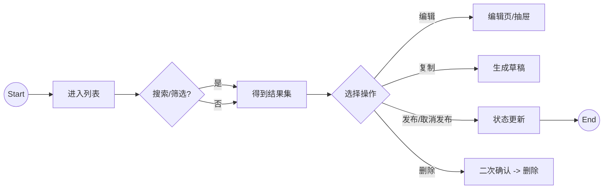
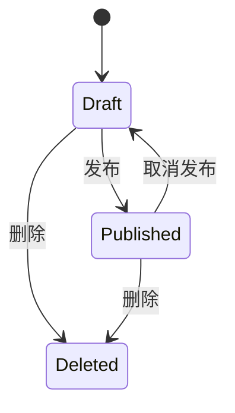

# Story + IA + User Flow + Design Notes

为 **B 端后台**把"交互行为"转成一套可评审、可传达的叙事与视觉表达文档：
- **故事脚本**（连贯叙事 + 镜头表）
- **信息架构图（IA）**（Mermaid）
- **用户流程图（User Flow）**（Mermaid）
- **状态机（可选，但推荐）**（Mermaid）
- **设计说明文档（Design Notes）**（规则/约束/文案/异常）

默认输出：**完整稿写入文件**（`docs/ux/{模块名}/story-ia-flow.md`），Markdown + Mermaid。对话中只呈现摘要和 Handoff。

---

## Q0：是否有项目层需求规范覆盖？（开始前先检查）

- 检查项目 rules 目录下的 `requirements/`（即当前项目根目录 `./.cursor/rules/requirements/`）是否存在
  - 若项目存在 → 使用项目要求
  - 若项目不存在 → 再检查全局 rules 目录下的 `requirements/`（Cursor：`~/.cursor/rules/requirements/`，Claude：`~/.claude/rules/requirements/`）。存在 → 使用全局要求；不存在 → 直接执行最短澄清流程
  - **存在** → 读取以下文件作为叙事输入（文件不存在则跳过）：
    - `overrides/domain-terms.md` → 用正确的项目术语写故事脚本
    - `additions/scenarios.md` → 作为典型场景参考，减少澄清问题
    - `additions/entities.md` → 实体名称与字段参考
  - **不存在** → 直接执行最短澄清流程

---

## 1) 最短澄清（最多 6 个问题）

若用户未给足信息，优先问这些（按顺序，缺哪个问哪个）：
1. **角色**：谁在用？（运营 / SOC / 管理员）
2. **目标**：用户要完成的 1~2 个关键任务是什么？
3. **对象**：管理的核心实体是什么？关键字段有哪些？
4. **状态**：实体有哪些状态？哪些动作会改变状态？
5. **风险**：删除/发布等风险动作的策略（确认、权限、审计）
6. **边界**：长文本/空态/失败/权限不足/导入失败是否需要覆盖？

> 原则：不替用户编业务。遇到分歧写"决策点 + 推荐默认 + 影响"。

---

## 2) 输出模板（写入文件，不在对话展开）

生成以下模板内容后，用 Write 工具写入 `docs/ux/{模块名}/story-ia-flow.md`。

```markdown
# <功能/模块名>：叙事与视觉表达（评审稿）

## 0. TL;DR（一句话）
<谁> 在 <什么场景/压力> 下，为了 <完成什么任务>，通过 <关键路径> 达到 <成功标准>。

---

## 1) 故事脚本（Story Script）

### 1.1 场景设定
- 角色：
- 背景/压力：
- 触发事件：
- 成功标准：
- 失败代价（可选）：

### 1.2 故事主线（四幕）
- 第一幕（进入/发现）：用户如何进入该模块？系统展示什么"最重要信息"？
- 第二幕（定位/缩小范围）：用户如何搜索/筛选/浏览？系统如何反馈状态？
- 第三幕（决策/行动）：用户做哪些关键动作？（创建/编辑/发布/删除…）
- 第四幕（反馈/收尾）：系统如何确认成功？如何处理失败与回滚？

### 1.3 镜头表（把交互写成连贯动作）
| 镜头 | 用户意图 | 用户动作 | 系统反馈 | 兜底/异常 |
|---|---|---|---|---|
| 1 | 进入并理解现状 | 打开列表 | 展示默认筛选/总数/最新更新时间 | 首屏加载失败→重试 |

---

## 2) 信息架构图（IA）
```mermaid
flowchart TD
  Entry[入口/导航] --> List[列表页]
  List --> Create[新建/编辑]
  List --> Import[导入]
  List --> Detail[详情/预览(可选)]
```

---

## 3) 用户流程图（User Flow）


---

## 4) 状态机（State Machine）
> 若实体存在明确生命周期，必须提供状态机。



---

## 5) 设计说明文档（Design Notes）

### 5.1 页面目的与主行动
- 主目标：
- Primary CTA：
- Secondary Actions：
- 危险操作（Danger）：

### 5.2 核心组件与字段（可交付研发）
- 列表/卡片字段：
- 筛选维度：
- 排序规则：
- 操作区规则（例如：高频操作在右、溢出收纳到"…"）：

### 5.3 权限与审计（最小集）
- 权限点：
- 哪些操作需要二次确认：
- 是否记录审计日志：

### 5.4 异常/空态/边界（必须覆盖）
- 空态（无数据）：
- 无结果（搜索/筛选后）：
- 加载态（首屏/操作中）：
- 错误态（403/5xx/导入失败/校验失败）：
- 长文本/多标签/大量数据/并发点击：

### 5.5 文案与术语表（统一口径）
| 概念 | 推荐用词 | 禁用/替代 | 备注 |
|---|---|---|---|
```

---

## 3) 文件输出步骤

1. 检查 `docs/ux/{模块名}/` 目录是否存在；不存在则用 Shell 创建：
   ```
   mkdir -p docs/ux/{模块名}
   ```
2. 用 Write 工具将完整 Markdown 写入 `docs/ux/{模块名}/story-ia-flow.md`
3. 在对话中只输出以下格式的摘要（不展开完整内容）：

```
## Stage 1 完成 — 用研叙事

文件已写入：docs/ux/{模块名}/story-ia-flow.md

### 摘要
- 主角色：{角色名} — {核心目标一句话}
- 核心场景：{最重要的 1 个场景描述}
- 关键路径：{主路径步骤数} 步
- 异常路径：{覆盖数量} 条

### Handoff → Stage 2
- 功能点：{3-5 个核心功能点}
- 主实体：{实体名称}，字段线索：{关键字段}
- 状态线索：{已识别的状态枚举}
- 决策点：{需要 Stage 2 拍板的 1-2 个关键决策}
```

---

## 4) 质量门控（输出前自检）

- [ ] 叙事里能清楚读出：角色、目标、关键路径、成功标准
- [ ] IA 与 User Flow 的节点命名与 PRD 术语一致
- [ ] 状态机覆盖所有"会改变状态"的动作，并列出失败分支/兜底
- [ ] Design Notes 含：字段/筛选/操作规则、权限、异常与边界
- [ ] 文案口径一致（发布/取消发布/删除等不混用）
- [ ] 完整内容写入文件，对话只呈现摘要

---

## 5) 使用示例（触发词）

- "把这个交互写成故事，并给 IA/流程图"
- "需要一份设计说明文档，包含异常与边界"
- "输出 storyboard + user flow + state machine"
