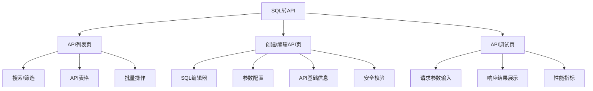
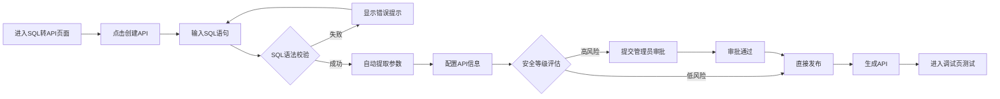

# SQL转API 需求文档(PRD)

## §1 背景与目标

### 1.1 业务背景
在API网关平台中,开发者需要频繁将数据库查询逻辑封装为RESTful API。传统方式需要手动编写Controller/Service层代码、配置路由、定义请求/响应参数,耗时且容易出错。SQL转API功能旨在通过可视化界面,让用户输入SQL语句后自动生成可调试、可调用的API接口,提升开发效率。

### 1.2 产品目标
- **效率提升**: 将SQL→API的开发时间从30分钟缩短至3分钟
- **降低门槛**: 非后端开发人员(前端/测试/产品)也能快速创建数据查询API
- **规范管理**: 统一API参数命名、响应格式、错误处理
- **安全可控**: 内置SQL注入检测、危险操作拦截、权限校验

### 1.3 成功指标
- 用户从输入SQL到生成可用API的平均时间 < 5分钟
- 生成API的首次调用成功率 > 90%
- SQL语法错误提示准确率 > 95%

---

## §2 用户角色与权限

| 角色 | 权限 | 说明 |
|---|---|---|
| 开发者 | 创建/编辑/测试/删除API | 默认角色,可管理自己创建的API |
| 管理员 | 查看所有API/审批高风险SQL | 可审核包含DELETE/UPDATE等危险操作的API |
| 访客 | 查看/测试API(只读) | 不可创建或修改API |

---

## §3 数据模型

### 3.1 API定义(ApiDefinition)

| 字段名 | 类型 | 必填 | 说明 | 示例 |
|---|---|---|---|---|
| id | string | 是 | API唯一标识 | `api_sql_001` |
| name | string | 是 | API名称 | `查询用户列表` |
| description | string | 否 | API描述 | `根据条件查询用户信息` |
| sqlStatement | string | 是 | SQL语句 | `SELECT * FROM users WHERE status = ${status}` |
| databaseType | enum | 是 | 数据库类型 | `MySQL` |
| httpMethod | enum | 是 | HTTP请求方法 | `GET` / `POST` |
| apiUrl | string | 是 | API路径 | `/api/v1/users/query` |
| parameters | Parameter[] | 否 | 请求参数列表 | 见3.2 |
| responseSchema | object | 否 | 响应体结构定义 | 见3.3 |
| securityLevel | enum | 是 | 安全等级 | `low` / `medium` / `high` |
| status | enum | 是 | API状态 | `draft` / `active` / `deprecated` |
| creator | string | 是 | 创建人 | `zhangsan` |
| createdAt | datetime | 是 | 创建时间 | `2026-05-22 10:30:00` |
| updatedAt | datetime | 是 | 更新时间 | `2026-05-22 14:20:00` |

### 3.2 参数定义(Parameter)

| 字段名 | 类型 | 必填 | 说明 | 示例 |
|---|---|---|---|---|
| name | string | 是 | 参数名 | `status` |
| type | enum | 是 | 参数类型 | `string` / `number` / `boolean` / `array` |
| required | boolean | 是 | 是否必填 | `true` |
| defaultValue | any | 否 | 默认值 | `"active"` |
| description | string | 否 | 参数说明 | `用户状态: active/inactive` |
| location | enum | 是 | 参数位置 | `query` / `body` |

### 3.3 响应体结构(ResponseSchema)

| 字段名 | 类型 | 说明 | 示例 |
|---|---|---|---|
| success | boolean | 是否成功 | `true` |
| data | object[] | 查询结果数据 | `[{id: 1, name: "张三"}]` |
| total | number | 数据总数(分页时) | `100` |
| message | string | 错误信息(失败时) | `"SQL语法错误"` |

---

## §4 功能需求

### 4.0 IA信息架构图



### 4.1 用户流程图



### 4.2 页面清单

| 页面名称 | 路由 | 类型 | 说明 |
|---|---|---|---|
| API列表页 | `/sql-to-api` | 列表页 | 展示所有已创建的SQL转API,支持搜索/筛选/批量操作 |
| 创建/编辑API抽屉 | `/sql-to-api` (抽屉) | 抽屉 | 右侧抽屉,包含SQL编辑器、参数配置、API信息表单 |
| API调试页 | `/sql-to-api/debug/:id` | 详情页 | 独立页面,用于测试已生成的API |

### 4.3 核心功能详细说明

#### 4.3.1 SQL编辑器
- **语法高亮**: 支持MySQL语法高亮显示
- **实时校验**: 输入时实时检测SQL语法错误
- **智能提示**: 输入表名/字段名时自动补全
- **参数识别**: 自动识别`${paramName}`格式的参数占位符
- **危险操作拦截**: 检测DROP/DELETE/TRUNCATE等危险操作并警告
- **格式化**: 支持SQL格式化和压缩

#### 4.3.2 自动参数提取
- 从SQL语句中自动提取`${paramName}`占位符
- 根据上下文推断参数类型(如`WHERE id = ${id}` → number类型)
- 生成参数列表供用户编辑(名称/类型/必填/默认值/说明)
- 支持手动添加/删除参数

#### 4.3.3 API基础信息配置
- **API名称**: 必填,最多50字符
- **API路径**: 必填,支持自定义路径,自动校验路径唯一性
- **请求方法**: GET(查询) / POST(新增)
- **请求参数位置**: query(GET) / body(POST)
- **API描述**: 可选,最多200字符

#### 4.3.4 安全校验
- **SQL注入检测**: 识别常见SQL注入模式
- **危险操作拦截**: DELETE/UPDATE需二次确认,管理员审批
- **敏感数据脱敏**: 自动检测身份证号/手机号等敏感字段
- **访问频率限制**: 默认100次/分钟,可配置
- **权限校验**: 继承API网关的权限体系

#### 4.3.5 API列表管理
- **搜索**: 按API名称/路径/创建人搜索
- **筛选**: 按状态(draft/active/deprecated)/安全等级/创建时间筛选
- **排序**: 按创建时间/更新时间/名称排序
- **批量操作**: 批量启用/停用/删除
- **快捷调试**: 列表页直接跳转调试页

#### 4.3.6 API调试控制台
- **参数输入**: 动态生成表单,根据参数类型显示不同输入控件
- **发送请求**: 显示请求URL/Headers/Body
- **响应展示**: 格式化JSON响应,支持展开/折叠
- **性能指标**: 显示响应时间/状态码/数据量
- **历史记录**: 保存最近10次调试记录

---

## §5 状态机

### 5.1 API状态流转

| 状态 | 说明 | 可执行操作 | 流转条件 | 下一状态 |
|---|---|---|---|---|
| draft | 草稿 | 编辑/测试/删除/发布 | 用户点击"发布" | active |
| draft | 草稿 | 编辑/测试/删除/发布 | SQL校验失败 | draft(保持) |
| active | 已发布 | 测试/停用/编辑(需重新审批) | 用户点击"停用" | deprecated |
| active | 已发布 | 测试/停用/编辑 | 修改SQL(高风险) | draft(需重新审批) |
| deprecated | 已停用 | 测试/启用/删除 | 用户点击"启用" | active |
| pending_approval | 审批中 | 无 | 管理员审批通过 | active |
| pending_approval | 审批中 | 无 | 管理员审批拒绝 | draft |

### 5.2 安全等级评估规则

| SQL特征 | 安全等级 | 审批要求 |
|---|---|---|
| 纯SELECT查询,无子查询 | low | 无需审批,直接发布 |
| SELECT含JOIN/子查询/聚合函数 | medium | 需主管审批 |
| INSERT/UPDATE操作 | high | 需管理员审批 |
| DELETE操作 | high | 需管理员+DBA双审批 |
| 包含存储过程/函数调用 | high | 需管理员+DBA双审批 |

---

## §6 异常边界

### 6.1 SQL相关异常
- **语法错误**: 显示错误位置和原因,如`第3行第15列: 缺少FROM关键字`
- **表不存在**: 提示`表'xxx'不存在,请检查数据库连接`
- **字段不存在**: 提示`字段'xxx'在表'yyy'中不存在`
- **权限不足**: 提示`当前用户无权限访问表'xxx'`
- **SQL注入风险**: 阻断并提示`检测到潜在SQL注入风险,请修改SQL语句`

### 6.2 API相关异常
- **路径冲突**: 提示`API路径'/api/v1/xxx'已被其他API使用`
- **参数校验失败**: 提示`参数'xxx'类型错误,期望number,收到string`
- **数据库连接失败**: 提示`数据库连接超时,请检查网络或联系管理员`
- **生成失败**: 提示`API生成失败,错误码:xxx,请联系技术支持`

### 6.3 调试相关异常
- **请求超时**: 30秒无响应提示`请求超时,请检查API配置或数据库状态`
- **响应过大**: 超过1000条数据提示`数据量过大,建议添加分页参数`
- **网络错误**: 提示`网络请求失败,请检查网络连接`

---

## §7 权限约束

### 7.1 操作权限矩阵

| 操作 | 开发者 | 管理员 | 访客 |
|---|---|---|---|
| 创建API | ✅ | ✅ | ❌ |
| 编辑自己的API | ✅ | ✅ | ❌ |
| 编辑他人的API | ❌ | ✅ | ❌ |
| 删除自己的API | ✅ | ✅ | ❌ |
| 删除他人的API | ❌ | ✅ | ❌ |
| 测试API | ✅ | ✅ | ✅ |
| 审批高风险API | ❌ | ✅ | ❌ |
| 查看所有API | ❌(仅自己) | ✅ | ❌(仅公开) |

### 7.2 数据权限
- 开发者只能查看和操作自己创建的API
- 管理员可查看所有API
- 访客只能查看标记为"公开"的API

---

## §8 验收用例

### 8.1 核心场景验收

| 用例ID | 场景 | 前置条件 | 操作步骤 | 预期结果 | 优先级 |
|---|---|---|---|---|---|
| AC-01 | 创建查询API | 已登录 | 1. 输入`SELECT * FROM users WHERE status = ${status}`<br>2. 配置API路径`/api/v1/users`<br>3. 点击发布 | 1. 自动识别参数`status`<br>2. 生成GET API<br>3. 状态变为active | P0 |
| AC-02 | 参数提取 | SQL含参数 | 输入含`${param}`的SQL | 参数列表自动填充,类型推断正确 | P0 |
| AC-03 | SQL语法校验 | 输入错误SQL | 输入`SELEC * FROM` | 实时显示错误提示,发布按钮禁用 | P0 |
| AC-04 | 安全拦截 | 输入危险SQL | 输入`DROP TABLE users` | 拦截并警告,需管理员审批 | P0 |
| AC-05 | API调试 | 已创建API | 1. 进入调试页<br>2. 输入参数值<br>3. 发送请求 | 返回正确数据,显示响应时间 | P0 |
| AC-06 | API列表搜索 | 有多个API | 输入关键词搜索 | 实时过滤,高亮匹配项 | P1 |
| AC-07 | 批量停用 | 选中多个API | 点击批量停用 | 选中API状态变为deprecated | P1 |
| AC-08 | 审批流程 | 高风险API | 1. 提交审批<br>2. 管理员审批 | 审批通过后状态变为active | P1 |

### 8.2 异常场景验收

| 用例ID | 场景 | 操作步骤 | 预期结果 | 优先级 |
|---|---|---|---|---|
| AC-E01 | SQL语法错误 | 输入错误SQL并尝试发布 | 显示错误详情,发布失败 | P0 |
| AC-E02 | 路径冲突 | 使用已存在的API路径 | 提示路径冲突,无法保存 | P0 |
| AC-E03 | 数据库连接失败 | 数据库不可用时调试API | 提示连接失败,给出重试选项 | P1 |
| AC-E04 | 请求超时 | 调试复杂SQL | 30秒后提示超时 | P1 |

---

## §9 技术约束

### 9.1 前端技术栈
- React 17 + TypeScript
- Ant Design 4.17.4
- 代码编辑器: Monaco Editor (SQL语法高亮)
- 路由: React Router v6

### 9.2 接口契约(待后端确认)

| 接口 | 方法 | 路径 | 说明 |
|---|---|---|---|
| 创建API | POST | `/api/v1/sql-to-api` | 创建SQL转API定义 |
| 更新API | PUT | `/api/v1/sql-to-api/:id` | 更新API定义 |
| 删除API | DELETE | `/api/v1/sql-to-api/:id` | 删除API |
| API列表 | GET | `/api/v1/sql-to-api` | 分页查询API列表 |
| API详情 | GET | `/api/v1/sql-to-api/:id` | 获取API详情 |
| SQL校验 | POST | `/api/v1/sql-to-api/validate` | 校验SQL语法和安全性 |
| 参数提取 | POST | `/api/v1/sql-to-api/extract-params` | 从SQL提取参数 |
| 安全评估 | POST | `/api/v1/sql-to-api/assess-security` | 评估SQL安全等级 |
| 调试API | POST | `/api/v1/sql-to-api/:id/debug` | 执行SQL并返回结果 |
| 审批提交 | POST | `/api/v1/sql-to-api/:id/approve` | 提交审批 |

### 9.3 性能要求
- SQL编辑器输入延迟 < 50ms
- 参数提取响应时间 < 1秒
- API列表首屏加载 < 2秒
- 调试请求超时时间 30秒

---

## §10 待确认事项

- [ ] 后端接口是否支持SQL实时校验?还是仅前端校验?
- [ ] 数据库连接配置由谁管理?(用户自选还是管理员统一配置?)
- [ ] 是否需要支持SQL版本历史?
- [ ] 审批流程是否需要对接现有审批系统?
- [ ] API调试结果是否需要支持导出(Excel/CSV)?
- [ ] 是否需要支持SQL模板库(常用SQL预设)?

---

## §11 决策点

### 11.1 SQL解析方案
- **方案A**: 前端使用SQL解析库(如`node-sql-parser`)做基础校验,后端深度校验
- **方案B**: 全部交给后端校验,前端仅做基础语法检查
- **推荐**: 方案A(前端快速反馈 + 后端权威校验)

### 11.2 代码编辑器选型
- **方案A**: Monaco Editor(功能强大,但体积大~3MB)
- **方案B**: CodeMirror 6(轻量级,~500KB)
- **推荐**: 方案A(项目已有Monaco使用经验,且SQL高亮效果更好)

### 11.3 参数提取策略
- **方案A**: 正则匹配`\$\{(\w+)\}`
- **方案B**: AST语法树分析(更准确,能识别上下文)
- **推荐**: 方案A(覆盖90%场景,实现简单) + 方案B(未来优化)

---

## §12 附录

### 12.1 SQL参数命名规范
- 使用`${paramName}`格式,如`${userId}`、`${status}`
- 参数名使用驼峰命名,如`createTime`、`userName`
- 禁止使用SQL关键字作为参数名

### 12.2 API路径命名规范
- 使用kebab-case,如`/api/v1/user-list`
- 以资源名复数形式结尾,如`/users`、`/orders`
- 避免动词,如使用`/users`而非`/getUsers`

### 12.3 响应格式标准
```json
{
  "success": true,
  "data": [],
  "total": 0,
  "message": "",
  "timestamp": "2026-05-22T10:30:00Z"
}
```
